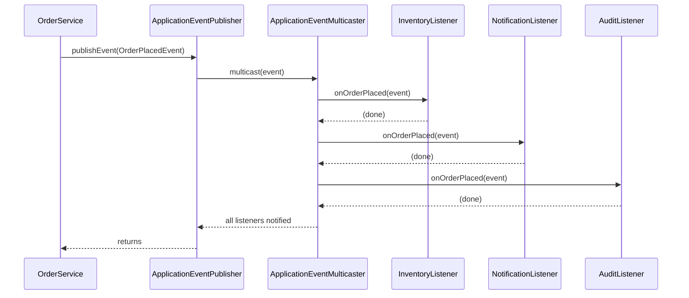
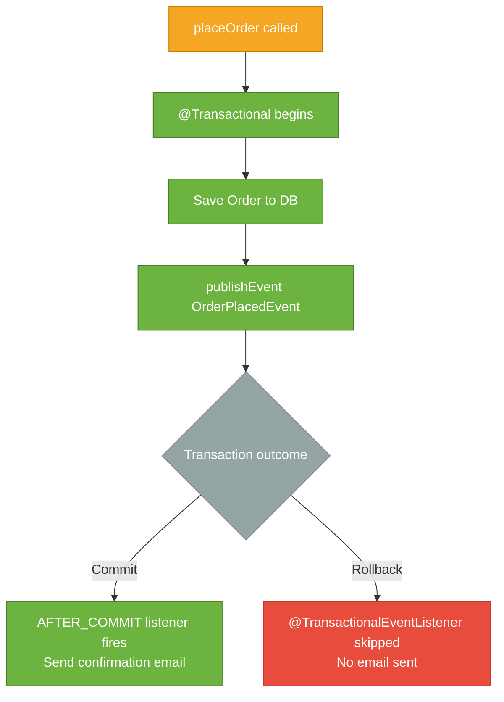

# Spring Events

> Spring's event system lets beans communicate with each other by publishing and listening to in-process application events — without the publisher knowing anything about its listeners.

## What Problem Does It Solve?

When one service needs to kick off side-effects after completing an action, the obvious solution is a direct method call:

```java
@Service
public class OrderService {

    private final InventoryService inventory;
    private final NotificationService notifications;
    private final AuditService audit;

    public void placeOrder(Order order) {
        order = repo.save(order);
        inventory.reserve(order);          // ← side effect 1
        notifications.sendConfirmation(order); // ← side effect 2
        audit.record(order);               // ← side effect 3
    }
}
```

This works, but `OrderService` now knows about three collaborators that are not its core concern. Every new side-effect requires changing `OrderService`. And if `notifications.sendConfirmation()` throws, the order transaction rolls back even though the order was saved successfully.

Spring Events decouples the publisher from the side effects. `OrderService` publishes a single `OrderPlacedEvent`; any number of listeners react to it independently. Adding a new side effect means adding a new listener — `OrderService` doesn't change.

## What Is the Spring Event System?

Spring events implement the **Observer pattern** inside the JVM. The key participants are:

| Participant | Role |
|------------|------|
| `ApplicationEventPublisher` | Interface for publishing events; every `ApplicationContext` implements it |
| `ApplicationEvent` (optional) | Base class for custom events in older Spring; plain POJOs work in Spring 4.2+ |
| `@EventListener` | Marks a method as an event handler; the method parameter type is the event type |
| `ApplicationEventMulticaster` | Internal Spring component that routes each published event to all matching listeners |

The event type is the contract between publisher and listener. A listener is triggered when an event of the matching type (including subtypes) is published.

## How It Works



*By default, event dispatch is synchronous and happens on the publisher's thread. All listeners run before `publishEvent()` returns.*

### Defining an Event

```java
// Plain POJO — no base class required since Spring 4.2
public record OrderPlacedEvent(Order order, Instant occurredAt) {}
```

### Publishing an Event

```java
@Service
@RequiredArgsConstructor
public class OrderService {

    private final OrderRepository repo;
    private final ApplicationEventPublisher publisher;  // ← injected by Spring

    @Transactional
    public Order placeOrder(OrderRequest request) {
        Order order = Order.from(request);
        order = repo.save(order);
        publisher.publishEvent(new OrderPlacedEvent(order, Instant.now())); // ← fire and move on
        return order;
    }
}
```

### Listening to an Event

```java
@Component
@Slf4j
public class NotificationListener {

    private final EmailService emailService;

    public NotificationListener(EmailService emailService) {
        this.emailService = emailService;
    }

    @EventListener                                    // ← method param type = event type
    public void onOrderPlaced(OrderPlacedEvent event) {
        emailService.sendConfirmation(event.order());
        log.info("Confirmation sent for order {}", event.order().getId());
    }
}
```

Multiple listeners for the same event type are all invoked. Order can be controlled with `@Order(n)`.

## Ordering Listeners

```java
@EventListener
@Order(1)                                 // ← lower number runs first
public void reserveInventory(OrderPlacedEvent event) { ... }

@EventListener
@Order(2)
public void sendConfirmation(OrderPlacedEvent event) { ... }
```

## Asynchronous Events

By default, event listeners run on the publisher's thread — blocking the publisher until all listeners complete. For slow side effects (sending email, calling an external API), you'll want async execution.

### Enable `@Async`

```java
@Configuration
@EnableAsync                               // ← activate Spring's async executor
public class AsyncConfig {

    @Bean
    public TaskExecutor taskExecutor() {
        ThreadPoolTaskExecutor executor = new ThreadPoolTaskExecutor();
        executor.setCorePoolSize(4);
        executor.setMaxPoolSize(10);
        executor.setQueueCapacity(50);
        executor.setThreadNamePrefix("event-");
        executor.initialize();
        return executor;
    }
}
```

```java
@Component
public class AsyncNotificationListener {

    @Async                                // ← run on the task executor thread pool
    @EventListener
    public void onOrderPlaced(OrderPlacedEvent event) {
        emailService.sendConfirmation(event.order()); // ← non-blocking for publisher
    }
}
```

:::warning
With `@Async` listeners, exceptions thrown in the listener **do not propagate back** to the publisher. Handle exceptions inside the listener or configure an `AsyncUncaughtExceptionHandler`.
:::

## `@TransactionalEventListener` — The Most Important Variant

The most common use case for events in Spring is triggering side effects *after* a database transaction commits. Consider:

```java
publisher.publishEvent(new OrderPlacedEvent(order, Instant.now()));
// What if the transaction rolls back after this line?
// The notification was already sent — but the order doesn't exist in the DB!
```

`@TransactionalEventListener` solves this by binding listener execution to a transaction phase:

```java
@Component
public class TransactionalNotificationListener {

    @TransactionalEventListener(phase = TransactionPhase.AFTER_COMMIT)  // ← default phase
    public void onOrderPlaced(OrderPlacedEvent event) {
        emailService.sendConfirmation(event.order()); // ← only runs if tx committed
    }
}
```

| Phase | When listener runs |
|-------|--------------------|
| `AFTER_COMMIT` (default) | Transaction committed successfully |
| `AFTER_ROLLBACK` | Transaction rolled back (use for compensating actions) |
| `AFTER_COMPLETION` | After commit or rollback — like `finally` |
| `BEFORE_COMMIT` | Just before commit — still inside the transaction |



*`@TransactionalEventListener` guarantees the side effect only runs when the data is durably committed.*

:::tip
`@TransactionalEventListener` with `AFTER_COMMIT` is the right pattern for any side effect (email, push notification, Kafka message publish) that must only happen when the database write is permanent. It replaces the fragile pattern of calling side-effect services directly inside a `@Transactional` method.
:::

## Publishing Spring's Built-In Events

Spring itself publishes several lifecycle events you can listen to:

| Event | When fired |
|-------|-----------|
| `ContextRefreshedEvent` | After `ApplicationContext` is fully initialized |
| `ContextStartedEvent` | When `context.start()` is called |
| `ContextStoppedEvent` | When `context.stop()` is called |
| `ContextClosedEvent` | When `context.close()` is called |
| `ApplicationReadyEvent` | (Spring Boot) After the application is ready to handle requests |

```java
@Component
public class StartupListener {

    @EventListener(ApplicationReadyEvent.class)       // ← fires after full boot in Spring Boot
    public void onReady() {
        System.out.println("Application is up and ready");
    }
}
```

## Code Examples

### Conditional Filter — Listen Only for Specific Events

```java
@EventListener(condition = "#event.order.totalAmount > 1000")  // ← SpEL expression
public void onHighValueOrder(OrderPlacedEvent event) {
    fraudDetection.review(event.order());
}
```

### Return a New Event from a Listener (Chaining)

A listener method can return a new event object, which Spring will automatically publish:

```java
@EventListener
public InventoryReservedEvent onOrderPlaced(OrderPlacedEvent event) {
    inventoryService.reserve(event.order());
    return new InventoryReservedEvent(event.order()); // ← Spring publishes this automatically
}
```

### Async `@TransactionalEventListener`

Combine both for the ideal side-effect pattern: execute after commit, and off the database transaction thread:

```java
@Async
@TransactionalEventListener(phase = TransactionPhase.AFTER_COMMIT)
public void onOrderCommitted(OrderPlacedEvent event) {
    emailService.sendConfirmation(event.order());
    kafkaTemplate.send("orders", event.order().getId().toString(), event.order());
}
```

## Best Practices

- **Prefer events for side effects that don't need a return value** — if the publisher needs a result from the action, a direct method call is clearer than an event
- **Use `@TransactionalEventListener(AFTER_COMMIT)` for any I/O side effect** — email, push notification, or Kafka publish that depends on committed data
- **Combine `@Async` + `@TransactionalEventListener`** for non-blocking side effects that must happen after commit
- **Keep event classes simple POJOs (records)** — include only what listeners need to react; do not pass live JPA entities (they may be detached by the time the listener runs after `AFTER_COMMIT`)
- **Name events after what happened, not what to do** — `OrderPlacedEvent`, not `SendOrderEmailEvent`; the listener decides the action

## Common Pitfalls

- **`@TransactionalEventListener` doesn't fire** — this happens when `publishEvent()` is called outside a transaction; by default the listener is skipped if there is no active transaction. Set `fallbackExecution = true` on the annotation if you want it to fire in non-transactional contexts too
- **JPA entity is detached in `AFTER_COMMIT` listener** — the Hibernate session is closed after commit; accessing lazy associations on the entity in the listener throws `LazyInitializationException`. Eagerly load necessary data before publishing, or publish a DTO/value object instead of a live entity
- **Async listener exceptions are silently swallowed** — configure `AsyncUncaughtExceptionHandler` to at least log them
- **Circular event publishing** — listener A publishes an event that triggers listener B which publishes the original event; causes a stack overflow. Use a flag or check event state to break cycles
- **Relying on listener order without `@Order`** — listener invocation order is undefined without explicit ordering; never code logic that depends on one listener having already run unless `@Order` is used

## Interview Questions

### Beginner

**Q:** What is the purpose of Spring's ApplicationEventPublisher?
**A:** It provides a decoupled publish/subscribe mechanism inside the JVM. A bean publishes an event object; any number of listener beans react to it by type, without the publisher knowing who is listening. This implements the Observer pattern using the IoC container.

**Q:** How do you register an event listener in Spring?
**A:** Annotate a public method in a Spring-managed bean with `@EventListener`. The parameter type determines which event type the method handles. Spring invokes all matching listeners when an event of that type (or a subtype) is published.

### Intermediate

**Q:** What is the difference between `@EventListener` and `@TransactionalEventListener`?
**A:** `@EventListener` fires synchronously as soon as `publishEvent()` is called, regardless of transaction state. `@TransactionalEventListener` waits for the current transaction to reach a specific phase (default: `AFTER_COMMIT`) before firing. Use `@TransactionalEventListener` for any side effect (email, external API call) that must only happen after the data is durably written to the database.

**Q:** A `@TransactionalEventListener` is not firing in a test. Why?
**A:** By default, it only fires when there is an active transaction in the `AFTER_COMMIT` phase. In a test, if the test is rolled back (the default with `@Transactional` on the test class), the commit phase never executes. Solutions: add `@Commit` to the test, use `@TestTransaction`, or set `fallbackExecution = true` on the listener.

### Advanced

**Q:** How would you guarantee at-least-once delivery of an important side effect if the application crashes between the database commit and the listener execution?
**A:** The Spring event system is an in-process, in-memory mechanism — it provides no durability across crashes. For at-least-once delivery, use the **transactional outbox pattern**: write the event to an `outbox` table in the same transaction as the business data, then have a separate poller or a CDC (Change Data Capture) tool like Debezium read the outbox and publish to a message broker (Kafka, RabbitMQ). The broker provides durable delivery guarantees.

**Q:** Why should you publish a DTO/value object in an `AFTER_COMMIT` event rather than a live JPA entity?
**A:** After a transaction commits, the Hibernate session is closed and all entities become detached. Accessing any uninitialized lazy association in the listener will throw `LazyInitializationException`. Publishing an immutable value object (a record or DTO) captures the data while the session is still open, making the listener safe to run in any phase or thread.

## Further Reading

- [Spring Events Reference](https://docs.spring.io/spring-framework/reference/core/beans/context-introduction.html#context-functionality-events) — official documentation for built-in events, custom events, and annotation-driven listeners
- [Better Application Events with Spring (Baeldung)](https://www.baeldung.com/spring-events) — complete guide with examples of async, ordered, and conditional listeners
- [Transactional Events in Spring (Baeldung)](https://www.baeldung.com/spring-transaction-events) — deep dive into `@TransactionalEventListener` with common pitfalls

## Related Notes

- [IoC Container](./ioc-container.md) — the `ApplicationContext` is also an `ApplicationEventPublisher`; understanding the container explains how listeners are discovered and invoked
- [Spring AOP](./spring-aop.md) — events and AOP are complementary approaches to cross-cutting concerns; events are better when the publisher and listener should be fully decoupled; AOP is better for transparent interception without the publisher's awareness
- [Bean Lifecycle](./bean-lifecycle.md) — `ContextRefreshedEvent` and `ApplicationReadyEvent` are lifecycle events that complement `@PostConstruct` for post-startup work
