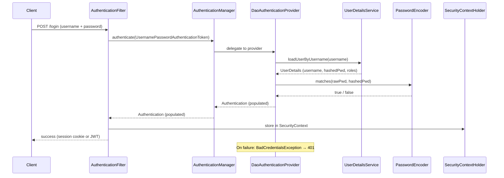

# Spring Security Authentication

> Authentication is the process of verifying *who* is making a request — Spring Security provides a pluggable architecture centred on `AuthenticationManager`, `UserDetailsService`, and `PasswordEncoder` that handles credentials verification before any access-control decisions are made.

## What Problem Does It Solve?

Every secured application needs to answer "is this person who they claim to be?" before deciding what they can do. Without a framework, you write custom session management, password hashing, credential lookup, and error handling in every project. Spring Security's authentication architecture provides these as composable, replaceable pieces so you get secure defaults (bcrypt hashing, brute-force protection, proper error responses) with minimal code.

## Core Authentication Components

Four objects collaborate in every authentication attempt:

| Component | Role |
|-----------|------|
| `AuthenticationManager` | Entry point. Delegates to one or more `AuthenticationProvider`s. |
| `AuthenticationProvider` | Does the actual credential check; returns a fully populated `Authentication` on success. |
| `UserDetailsService` | Loads a user record from the data store by username. |
| `PasswordEncoder` | Verifies the submitted password against the stored (hashed) password. |

And the result is stored in:

| Component | Role |
|-----------|------|
| `Authentication` | Holds the principal (user identity), credentials, and granted authorities after a successful check. |
| `SecurityContext` | Request-scoped container for the `Authentication` object. |
| `SecurityContextHolder` | `ThreadLocal` accessor for the current `SecurityContext`. |

## How It Works

### Authentication Flow



*The filter triggers the authentication chain; the provider validates credentials; the result is stored in `SecurityContextHolder`.*

### `UserDetailsService` — Loading the User

You implement `UserDetailsService` to tell Spring Security how to look up a user from your database. Spring Security calls `loadUserByUsername(username)` on every authentication attempt:

```java
@Service
public class AppUserDetailsService implements UserDetailsService {

    private final UserRepository userRepository;

    public AppUserDetailsService(UserRepository userRepository) {
        this.userRepository = userRepository;
    }

    @Override
    public UserDetails loadUserByUsername(String username) throws UsernameNotFoundException {
        User user = userRepository.findByEmail(username)  // ← look up by email (which is our "username")
                .orElseThrow(() -> new UsernameNotFoundException("User not found: " + username));

        return org.springframework.security.core.userdetails.User.builder()
                .username(user.getEmail())
                .password(user.getPasswordHash())          // ← must be pre-hashed (bcrypt)
                .roles(user.getRoles().toArray(new String[0])) // ← e.g., "ADMIN", "USER"
                .build();
    }
}
```

:::warning
**Never store plaintext passwords.** Always store the bcrypt hash in the database and use `PasswordEncoder` to compare at login time. Spring Security checks `PasswordEncoder.matches(raw, encoded)` — it never decodes the stored hash.
:::

### `PasswordEncoder` — Bcrypt is the Right Default

```java
@Bean
public PasswordEncoder passwordEncoder() {
    return new BCryptPasswordEncoder();  // ← cost factor 10 by default (2^10 = 1024 iterations)
}
```

Use `BCryptPasswordEncoder` for new applications. The cost factor makes brute-force attacks computationally expensive:

```java
// During user registration — hash before storing:
String raw = "mySecretPassword";
String hash = passwordEncoder.encode(raw);   // ← $2a$10$... — a new random salt + hash each time
userRepository.save(new User(email, hash));

// During login — Spring Security calls this internally, but you can also call it directly:
boolean match = passwordEncoder.matches("mySecretPassword", hash);  // ← true
boolean mismatch = passwordEncoder.matches("wrongPassword", hash);  // ← false
```

Spring also provides `DelegatingPasswordEncoder` (the default when you call `PasswordEncoderFactories.createDelegatingPasswordEncoder()`), which stores the algorithm prefix in the hash: `{bcrypt}$2a$10$...`. This lets you migrate hashing algorithms over time without re-hashing all existing passwords.

### `AuthenticationManager` — Wiring It All Together

```java
@Configuration
@EnableWebSecurity
public class SecurityConfig {

    private final AppUserDetailsService userDetailsService;
    private final PasswordEncoder passwordEncoder;

    // Constructor injection ...

    @Bean
    public AuthenticationManager authenticationManager(AuthenticationConfiguration config)
            throws Exception {
        return config.getAuthenticationManager(); // ← Spring Boot auto-wires UserDetailsService + PasswordEncoder
    }

    @Bean
    public SecurityFilterChain securityFilterChain(HttpSecurity http) throws Exception {
        http
            .authorizeHttpRequests(auth -> auth
                .requestMatchers("/api/auth/**").permitAll()
                .anyRequest().authenticated()
            )
            .sessionManagement(s -> s
                .sessionCreationPolicy(SessionCreationPolicy.STATELESS)
            )
            .csrf(AbstractHttpConfigurer::disable);
        return http.build();
    }

    @Bean
    public DaoAuthenticationProvider authenticationProvider() {
        DaoAuthenticationProvider provider = new DaoAuthenticationProvider();
        provider.setUserDetailsService(userDetailsService);  // ← where to load users
        provider.setPasswordEncoder(passwordEncoder);        // ← how to check passwords
        return provider;
    }
}
```

## Code Examples

### Programmatic Login (Manual Authentication)

Useful when implementing a `/login` REST endpoint that returns a JWT instead of using Spring's form login:

```java
@RestController
@RequestMapping("/api/auth")
public class AuthController {

    private final AuthenticationManager authenticationManager;
    private final JwtService jwtService;

    @PostMapping("/login")
    public ResponseEntity<TokenResponse> login(@RequestBody @Valid LoginRequest request) {
        // Throws AuthenticationException (→ 401) if invalid
        Authentication authentication = authenticationManager.authenticate(
            new UsernamePasswordAuthenticationToken(
                request.email(),      // ← principal
                request.password()    // ← credentials
            )
        );
        // Store in context (optional for stateless APIs, but some filters need it)
        SecurityContextHolder.getContext().setAuthentication(authentication);

        UserDetails user = (UserDetails) authentication.getPrincipal();
        String token = jwtService.generateToken(user);    // ← generate JWT (see JWT note)

        return ResponseEntity.ok(new TokenResponse(token));
    }
}
```

### Custom `UserDetails` with Extra Fields

The default `User` builder only carries username, password, and roles. Extend it to carry domain-specific identity data:

```java
public class AppUserDetails implements UserDetails {

    private final Long id;
    private final String email;
    private final String passwordHash;
    private final Collection<GrantedAuthority> authorities;

    public AppUserDetails(User user) {
        this.id = user.getId();
        this.email = user.getEmail();
        this.passwordHash = user.getPasswordHash();
        this.authorities = user.getRoles().stream()
                .map(role -> new SimpleGrantedAuthority("ROLE_" + role))
                .collect(Collectors.toList());
    }

    @Override public String getUsername()  { return email; }
    @Override public String getPassword()  { return passwordHash; }
    @Override public Collection<? extends GrantedAuthority> getAuthorities() { return authorities; }
    @Override public boolean isAccountNonExpired()   { return true; }
    @Override public boolean isAccountNonLocked()    { return true; }
    @Override public boolean isCredentialsNonExpired() { return true; }
    @Override public boolean isEnabled()             { return true; }

    // Custom accessor — available after casting from Authentication.getPrincipal()
    public Long getId() { return id; }
}
```

### Getting the Logged-In User in a Controller

```java
// Option 1: inject via @AuthenticationPrincipal (clean, type-safe)
@GetMapping("/api/me")
public ResponseEntity<UserDto> getMe(@AuthenticationPrincipal AppUserDetails user) {
    return ResponseEntity.ok(userService.findById(user.getId()));
}

// Option 2: pull from SecurityContextHolder (works anywhere, not just controllers)
public Long getCurrentUserId() {
    Authentication auth = SecurityContextHolder.getContext().getAuthentication();
    AppUserDetails user = (AppUserDetails) auth.getPrincipal();
    return user.getId();
}
```

## Best Practices

- **Always hash passwords with bcrypt** — use `BCryptPasswordEncoder` with its default cost factor of 10 or higher. MD5, SHA-1, and SHA-256 without salt are insufficient.
- **Use `DelegatingPasswordEncoder` for greenfield apps** — the `{bcrypt}` prefix in stored hashes makes algorithm migration easier when you need to increase cost in the future.
- **Throw `UsernameNotFoundException` from `loadUserByUsername`** — Spring Security handles this and converts it to `BadCredentialsException` (so you don't leak whether the username exists vs. the password is wrong, by default).
- **Never expose `UserDetails.getPassword()` over the API** — mark the password field with `@JsonIgnore` in any DTO or entity that could be serialized to JSON.
- **Implement `isEnabled()`, `isAccountNonLocked()` etc. properly** — returning `true` always is fine during development, but connect these to your database flags (e.g., email-verified, account-suspended) in production.
- **Inject `AuthenticationManager` via `AuthenticationConfiguration`** (not `@Autowired AuthenticationManager`) — the `@Autowired` approach causes circular dependency issues in Spring Boot 3.

## Common Pitfalls

**`PasswordEncoder` not defined → `IllegalArgumentException: There is no PasswordEncoder mapped`**
Spring Security 5+ requires a `PasswordEncoder` bean. Without one, it cannot validate any password. Always declare `@Bean PasswordEncoder` returning `new BCryptPasswordEncoder()`.

**Circular dependency when injecting `AuthenticationManager`**
Injecting `AuthenticationManager` into a `@Service` that is itself used by `UserDetailsService` causes a circular bean dependency. Inject `AuthenticationManager` via `AuthenticationConfiguration.getAuthenticationManager()` in the `@Controller` or use `@Lazy` on the injection site.

**Storing roles without the `ROLE_` prefix**
Spring Security's `hasRole("ADMIN")` checks for `ROLE_ADMIN` in the authorities list. If you store `"ADMIN"` without the prefix, the check always fails. Use `new SimpleGrantedAuthority("ROLE_ADMIN")` or the `roles()` builder method (which adds the prefix automatically).

**Using `UserDetailsService` for JWT auth**
When using stateless JWT authentication, `UserDetailsService` is used only during the initial `/login` call. After that, every request carries a self-contained JWT. You do not (and should not) call `loadUserByUsername` on every request — extract the identity from the token.

## Interview Questions

### Beginner

**Q:** What is `UserDetailsService` and why do you implement it?
**A:** `UserDetailsService` is a Spring Security interface with one method: `loadUserByUsername(String username)`. You implement it to tell Spring Security how to load a user's credentials and authorities from your data source (database, LDAP, etc.). Spring Security calls this method when authenticating a `UsernamePasswordAuthenticationToken` and uses the returned `UserDetails` to verify the submitted password.

**Q:** What does `PasswordEncoder` do?
**A:** `PasswordEncoder` encodes a plaintext password into a hash for storage, and verifies a plaintext submission against a stored hash. Spring Security never stores or compares plaintext passwords. `BCryptPasswordEncoder` is the standard choice because bcrypt is slow by design (making brute-force attacks infeasible) and adds a random salt per password (so identical passwords produce different hashes).

### Intermediate

**Q:** What is `AuthenticationManager` and what is `DaoAuthenticationProvider`?
**A:** `AuthenticationManager` is the main entry point for authentication — it accepts an `Authentication` token and delegates to one or more `AuthenticationProvider` implementations. `DaoAuthenticationProvider` is the default provider for username/password authentication. It calls `UserDetailsService.loadUserByUsername()` to get the stored user, then calls `PasswordEncoder.matches()` to verify the password. On success, it returns a fully populated `Authentication` with granted authorities.

**Q:** What is stored in `SecurityContextHolder` after authentication?
**A:** An `Authentication` object is stored in the `SecurityContext`. The `Authentication` holds: (1) the `principal` — usually a `UserDetails` object with username and roles; (2) the `credentials` — the password, which Spring Security erases after authentication for security; and (3) the `authorities` — a `Collection<GrantedAuthority>` representing the user's roles and permissions.

### Advanced

**Q:** How would you implement a multi-factor authentication (MFA) flow in Spring Security?
**A:** Implement a two-step authentication process. After the first factor (password) succeeds, set a partially-authenticated `Authentication` in the `SecurityContext` with a custom authority like `ROLE_PRE_AUTH` and redirect to an MFA code entry page. Protect the MFA endpoint with `hasRole("PRE_AUTH")`. After the second factor (OTP) succeeds, replace the `SecurityContext` authentication with the full `Authentication` containing actual roles. This requires a custom `AuthenticationProvider` for each factor and a custom filter to intercept the OTP submission.

**Q:** Why does Spring Security erase credentials after authentication and when is this a problem?
**A:** By default, `ProviderManager` erases credentials (the password) from the `Authentication` object after a successful authentication call, to avoid holding plaintext passwords in memory. This becomes a problem if you use the `Authentication` object downstream (e.g., to re-authenticate or call another system). Fix: call `providerManager.setEraseCredentialsAfterAuthentication(false)` or copy the principal data into a custom `Authentication` before the credentials are erased.

## Further Reading

- [Spring Security Docs — Authentication Architecture](https://docs.spring.io/spring-security/reference/servlet/authentication/index.html) — complete authentication flow with all contracts explained
- [Spring Security Docs — Password Storage](https://docs.spring.io/spring-security/reference/servlet/authentication/passwords/index.html) — `PasswordEncoder` types, `DelegatingPasswordEncoder`, and migration
- [Baeldung — Spring Security with Database Authentication](https://www.baeldung.com/spring-security-authentication-with-a-database) — end-to-end `UserDetailsService` + JPA example

## Related Notes

- [Security Filter Chain](./security-filter-chain.md) — authentication filters are specific nodes in the filter chain; understanding the chain explains when and how authentication is triggered
- [Authorization](./authorization.md) — after authentication puts the user in `SecurityContextHolder`, authorization decides what they can access
- [JWT](./jwt.md) — JWT-based authentication replaces session-based auth; the token carries the `Authentication` data directly
