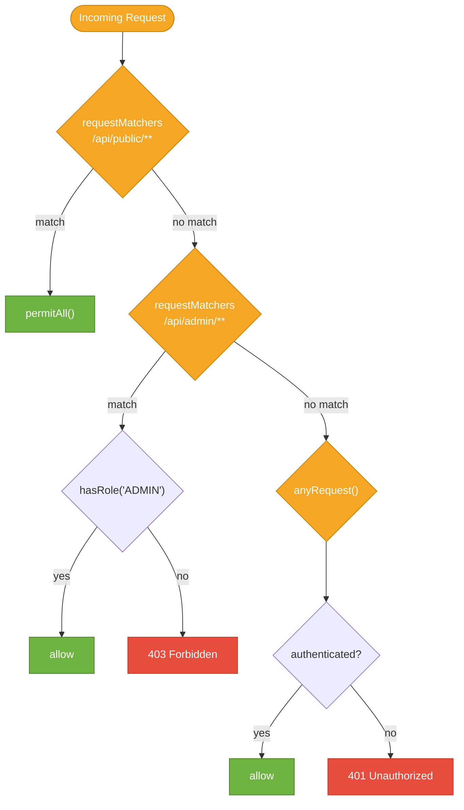

# Spring Security Authorization

> Authorization is the decision of *what* an authenticated user is allowed to do — Spring Security provides two complementary layers: URL-based rules for HTTP endpoints and method-level annotations for fine-grained, code-level access control.

## What Problem Does It Solve?

Authentication proves identity; authorization enforces limits. Without a framework, every controller method needs manual permission checks — `if (!user.hasRole("ADMIN")) throw new ForbiddenException()` — scattered everywhere, easy to forget, and hard to audit.

Spring Security's authorization layer centralises these decisions. You declare rules once (in config or as annotations) and the framework enforces them consistently, regardless of how a method is reached.

## Roles vs. Authorities — The Key Distinction

Spring Security uses the term **authority** as the generic concept. A **role** is an authority with the `ROLE_` prefix by convention.

| | Authority | Role |
|--|-----------|------|
| Storage | `GrantedAuthority` string | `GrantedAuthority` string prefixed with `ROLE_` |
| Example | `"read:orders"`, `"write:products"` | `"ROLE_ADMIN"`, `"ROLE_USER"` |
| API check | `hasAuthority("read:orders")` | `hasRole("ADMIN")` (prefix added automatically) |

Both are just strings stored in `Authentication.getAuthorities()`. The distinction is purely a naming convention Spring Security uses in its SpEL expressions.

## How It Works

### Layer 1 — URL-Based Authorization (`AuthorizationFilter`)

The `AuthorizationFilter` is the last filter in the security chain. It checks every incoming request against the rules defined in `authorizeHttpRequests(...)`. Rules are evaluated **top to bottom; first match wins**.



*Rules are matched top-to-bottom; the first matching rule decides the outcome.*

```java
@Bean
public SecurityFilterChain securityFilterChain(HttpSecurity http) throws Exception {
    http.authorizeHttpRequests(auth -> auth
        // Most specific rules first
        .requestMatchers("/api/public/**").permitAll()              // ← no auth required
        .requestMatchers(HttpMethod.GET, "/api/products/**").permitAll()
        .requestMatchers("/api/admin/**").hasRole("ADMIN")         // ← ROLE_ADMIN required
        .requestMatchers("/api/orders/**").hasAnyRole("USER", "ADMIN")
        .requestMatchers("/api/reports/**").hasAuthority("read:reports") // ← fine-grained permission
        .anyRequest().authenticated()                              // ← catch-all: must be logged in
    );
    return http.build();
}
```

### Layer 2 — Method-Level Security (`@PreAuthorize`)

Enable method security once in your config:

```java
@Configuration
@EnableMethodSecurity  // ← replaced @EnableGlobalMethodSecurity in Spring Security 6
public class SecurityConfig { ... }
```

Then annotate service methods directly:

```java
@Service
public class OrderService {

    @PreAuthorize("hasRole('ADMIN') or #userId == authentication.principal.id")
    public Order getOrder(Long orderId, Long userId) {  // ← ← ← userId is a method param
        // Only admins OR the owner of the order can call this
    }

    @PreAuthorize("hasAuthority('write:orders')")
    public Order createOrder(CreateOrderRequest request) { ... }

    @PostAuthorize("returnObject.ownerId == authentication.principal.id")
    public Order findOrder(Long id) {
        // Method runs; Spring checks the RETURNED object's ownerId after the call
        return orderRepository.findById(id).orElseThrow();
    }

    @PreFilter("filterObject.ownerId == authentication.principal.id")
    public List<Order> bulkUpdate(List<Order> orders) {
        // Spring filters the input list BEFORE the method runs — only caller's own orders pass through
    }
}
```

### SpEL Expressions in `@PreAuthorize`

`@PreAuthorize` uses Spring Expression Language (SpEL). Key built-in variables and functions:

| Expression | Meaning |
|-----------|---------|
| `authentication` | The current `Authentication` object |
| `authentication.name` | The logged-in username |
| `authentication.principal` | The `UserDetails` / principal object |
| `authentication.authorities` | Collection of `GrantedAuthority` |
| `#paramName` | Method parameter by name (e.g., `#userId`) |
| `returnObject` | The return value (only in `@PostAuthorize`) |
| `hasRole('X')` | True if user has `ROLE_X` |
| `hasAuthority('X')` | True if user has authority `X` (exact match) |
| `hasAnyRole('X','Y')` | True if user has any of the listed roles |
| `isAuthenticated()` | True if not anonymous |
| `isAnonymous()` | True if not authenticated |
| `permitAll()` | Always true |

### `@Secured` vs `@PreAuthorize`

| | `@Secured` | `@PreAuthorize` |
|--|-----------|-----------------|
| SpEL support | No | Yes |
| Multiple roles | `@Secured({"ROLE_ADMIN","ROLE_OPS"})` | `hasAnyRole('ADMIN','OPS')` |
| Parameter access | No | Yes (`#paramName`) |
| Return value check | No | Via `@PostAuthorize` |
| Recommendation | Legacy — use only for simple role checks | Preferred for all new code |

## Code Examples

### Ownership Check (Common Pattern)

Checking that a user can only access their own resource:

```java
@PreAuthorize("hasRole('ADMIN') or #id == authentication.principal.id")
@GetMapping("/api/users/{id}")
public ResponseEntity<UserDto> getUser(@PathVariable Long id) {
    // Accessible by ADMIN for any id, or by the user for their own id
    return ResponseEntity.ok(userService.findById(id));
}
```

### Custom `PermissionEvaluator` for Complex Rules

When the rule cannot be expressed in a one-liner SpEL expression:

```java
@Component
public class OrderPermissionEvaluator implements PermissionEvaluator {

    private final OrderRepository orderRepository;

    @Override
    public boolean hasPermission(Authentication auth, Object targetDomainObject, Object permission) {
        Order order = (Order) targetDomainObject;
        Long userId = ((AppUserDetails) auth.getPrincipal()).getId();
        return order.getOwnerId().equals(userId);
    }

    @Override
    public boolean hasPermission(Authentication auth, Serializable targetId,
                                  String targetType, Object permission) {
        // Load from DB by id and check
        if ("Order".equals(targetType)) {
            Order order = orderRepository.findById((Long) targetId).orElseThrow();
            Long userId = ((AppUserDetails) auth.getPrincipal()).getId();
            return order.getOwnerId().equals(userId);
        }
        return false;
    }
}
```

```java
// Register in config
@Bean
public MethodSecurityExpressionHandler methodSecurityExpressionHandler(
        OrderPermissionEvaluator evaluator) {
    DefaultMethodSecurityExpressionHandler handler = new DefaultMethodSecurityExpressionHandler();
    handler.setPermissionEvaluator(evaluator);
    return handler;
}

// Use in annotations
@PreAuthorize("hasPermission(#id, 'Order', 'read')")
public Order getOrder(Long id) { ... }
```

### Testing Authorization Rules

```java
@SpringBootTest
@AutoConfigureMockMvc
class OrderControllerTest {

    @Autowired MockMvc mockMvc;

    @Test
    @WithMockUser(roles = "USER")   // ← simulates a logged-in USER
    void userCanReadOwnOrders() throws Exception {
        mockMvc.perform(get("/api/orders/1"))
               .andExpect(status().isOk());
    }

    @Test
    @WithMockUser(roles = "USER")
    void userCannotAccessAdmin() throws Exception {
        mockMvc.perform(get("/api/admin/stats"))
               .andExpect(status().isForbidden());  // ← 403
    }

    @Test
    void unauthenticatedUserGets401() throws Exception {
        mockMvc.perform(get("/api/orders/1"))
               .andExpect(status().isUnauthorized());  // ← 401
    }
}
```

## Best Practices

- **Prefer `@PreAuthorize` over URL rules for business logic authorization** — method annotations live next to the code they protect, making it easier to review and audit. URL rules are better for coarse-grained gatekeeping (public vs. authenticated).
- **Use authorities (fine-grained permissions) in production, not just roles** — `"ROLE_ADMIN"` is coarse; `"read:orders"`, `"write:products"` map to specific operations and are easier to manage in OAuth2 scopes.
- **Enable `@EnableMethodSecurity` at the application level** — don't scatter it across multiple config classes. One `@EnableMethodSecurity` on the main `SecurityConfig` is enough.
- **Test authorization explicitly** — use `@WithMockUser` and `@WithUserDetails` in tests; don't rely on integration tests alone to catch missing authorization.
- **Deny by default** — always end `authorizeHttpRequests` with `.anyRequest().authenticated()` or `.anyRequest().denyAll()`. Never rely on "forgetting to add a rule means it's open".
- **Use `@PostAuthorize` sparingly** — it loads data before checking access, which may waste a DB query if the check fails. Prefer `@PreAuthorize` with upfront checks where possible.

## Common Pitfalls

**`@PreAuthorize` annotations on `private` methods are silently ignored**
Spring Security method security works via AOP proxies. Annotations on `private` methods (which cannot be proxied) are silently ignored — the method executes without any security check. Always annotate `public` methods.

**Self-invocation bypasses method security**
Calling a `@PreAuthorize`-annotated method from within the same class (`this.method()`) bypasses the proxy and skips the security check. Move the annotated method to a separate `@Service` bean if you need internal calls to also be guarded.

**Mixing `hasRole` and `hasAuthority` for the same check**
`hasRole('ADMIN')` and `hasAuthority('ADMIN')` are different: `hasRole('ADMIN')` checks for `ROLE_ADMIN`; `hasAuthority('ADMIN')` checks for the exact string `ADMIN`. If your `GrantedAuthority` stores `"ROLE_ADMIN"`, use `hasRole('ADMIN')`. Mixing them is a common source of mysterious 403 errors.

**Not putting `anyRequest()` last**
URL authorization rules are first-match. If you accidentally write `anyRequest().authenticated()` before a `permitAll()` rule, the permitAll rule is unreachable. Always place `anyRequest()` as the final rule.

## Interview Questions

### Beginner

**Q:** What is the difference between authentication and authorization in Spring Security?
**A:** Authentication verifies *who* the user is (valid credentials → identity confirmed). Authorization decides *what* the authenticated user can do (does their identity grant access to this resource?). In the filter chain, authentication filters run first; the `AuthorizationFilter` runs last, after identity has already been established.

**Q:** What is the difference between `hasRole('ADMIN')` and `hasAuthority('ROLE_ADMIN')`?
**A:** They are equivalent. `hasRole('ADMIN')` automatically prefixes with `ROLE_` and checks for `ROLE_ADMIN` in the user's authorities. `hasAuthority('ROLE_ADMIN')` checks for the exact string. It's a matter of convention — use `hasRole` for roles (social contract: prefixed with `ROLE_`) and `hasAuthority` for fine-grained permissions that don't follow the role convention.

### Intermediate

**Q:** What does `@EnableMethodSecurity` do and how does it differ from `@EnableGlobalMethodSecurity`?
**A:** `@EnableMethodSecurity` (Spring Security 5.6+, required in Spring Boot 3) activates method-level security by registering an AOP advisor that intercepts calls to `@PreAuthorize`, `@PostAuthorize`, `@PreFilter`, and `@PostFilter` annotated methods. `@EnableGlobalMethodSecurity` was the older equivalent (deprecated in Spring Security 6) that used a different internal model. The new annotation enables pre/post annotations by default, whereas the old one required `prePostEnabled = true`.

**Q:** When would you use `@PostAuthorize` instead of `@PreAuthorize`?
**A:** Use `@PostAuthorize` when the access decision depends on data that can only be known after the method runs — typically the *returned object's* content. For example, ensuring a user can only see orders they own: `@PostAuthorize("returnObject.ownerId == authentication.principal.id")`. The trade-off is that the method body executes (and may perform a DB query) before the check is applied — if the check fails, the data is loaded and then discarded, wasting the query. Prefer `@PreAuthorize` with a lookup when possible.

### Advanced

**Q:** How does Spring Security's AOP-based method security interact with Spring's transaction management?
**A:** Both method security and `@Transactional` use AOP proxies, and their relative order matters. By default, the security interceptor runs before `@Transactional`. This is correct: the security check should happen before any database work begins. If you have `@PreAuthorize` and `@Transactional` on the same method, the security check runs first (no transaction yet), and the transaction starts only if the check passes. You can control the order via `@EnableMethodSecurity(order = ...)` and `@EnableTransactionManagement(order = ...)`.

**Q:** How do you implement dynamic permissions where rules are stored in the database?
**A:** Implement a custom `PermissionEvaluator` that queries the database to resolve permissions at call time, and register it with `MethodSecurityExpressionHandler`. Use `@PreAuthorize("hasPermission(#resourceId, 'ResourceType', 'action')")`. Cache the permission lookups (e.g., with Spring `@Cacheable`) to avoid a DB query on every secured method call. This pattern supports flexible, data-driven ACLs without recompiling security rules.

## Further Reading

- [Spring Security Docs — Authorization Architecture](https://docs.spring.io/spring-security/reference/servlet/authorization/index.html) — `AuthorizationManager`, `AuthorizationFilter`, and the decision model
- [Spring Security Docs — Method Security](https://docs.spring.io/spring-security/reference/servlet/authorization/method-security.html) — `@PreAuthorize`, `@PostAuthorize`, custom `PermissionEvaluator`
- [Baeldung — Spring Security Method Security](https://www.baeldung.com/spring-security-expressions) — SpEL expression reference with examples

## Related Notes

- [Security Filter Chain](./security-filter-chain.md) — `AuthorizationFilter` is the last filter in the chain; the chain architecture determines when authorization is checked relative to other filters
- [Authentication](./authentication.md) — authorization relies on the `Authentication` object that authentication puts in `SecurityContextHolder`
- [JWT](./jwt.md) — JWT-based APIs commonly use fine-grained authorities extracted from token claims, feeding directly into `hasAuthority()` checks
