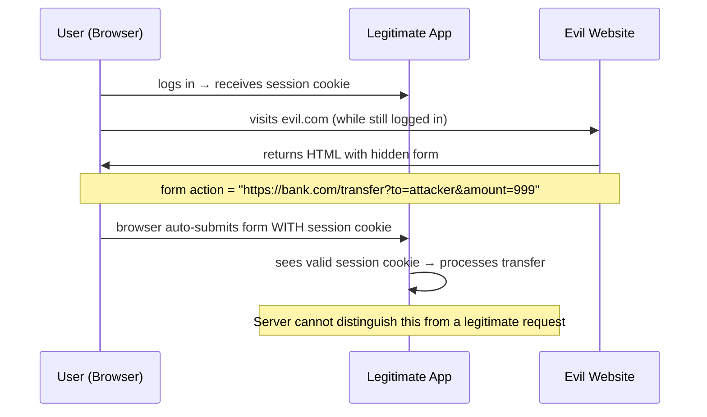
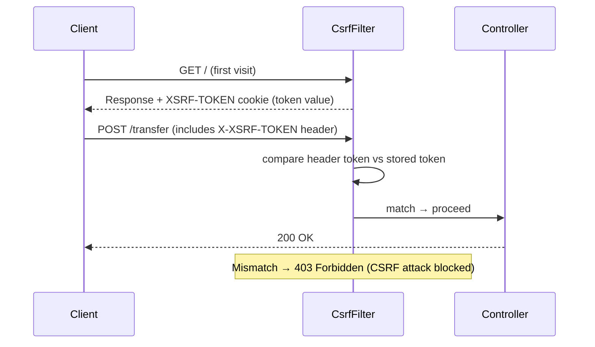
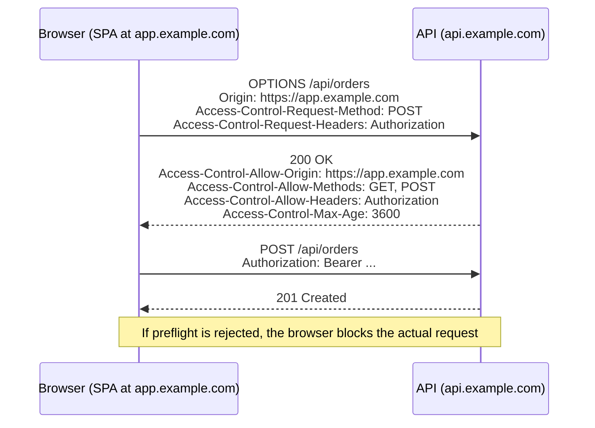

# CSRF and CORS in Spring Security

> CSRF (Cross-Site Request Forgery) and CORS (Cross-Origin Resource Sharing) are two distinct browser-security mechanisms — Spring Security handles both, and getting their configuration wrong is one of the most common sources of mysterious `403 Forbidden` and `401 Unauthorized` errors in Spring Boot APIs.

## What Problem Does Each Solve?

**CSRF** protects your server from malicious websites tricking authenticated users into sending unwanted requests. An evil site could embed a form that POSTs to your bank's `/transfer` endpoint — if the user is logged in, the browser automatically sends the session cookie, and the bank's server has no way to tell the request was forged.

**CORS** is a browser security policy that *blocks* cross-origin requests by default. A frontend SPA running on `http://localhost:3000` is a different origin than your API on `http://localhost:8080`. The browser will block all API calls unless the server explicitly says "I allow requests from `localhost:3000`".

These are **opposite problems**: CSRF stops unwanted cross-origin requests; CORS enables wanted ones.

## CSRF — Cross-Site Request Forgery

### How CSRF Attacks Work



*The session cookie is sent automatically by the browser — the server has no way to know the request was forged.*

### How CSRF Protection Works

Spring Security's `CsrfFilter` generates a unique, secret **CSRF token** for each session. The server sends this token in a cookie or HTML response. Every state-changing request (POST, PUT, DELETE, PATCH) must include the token in a header or form field. A cross-origin attacker cannot read this token (same-origin policy blocks cookie reads), so they cannot forge a valid request.



### CSRF and REST APIs — When to Disable

**Disable CSRF for stateless REST APIs** (the most common case for Spring Boot backends):

- REST APIs use **tokens** (JWT in `Authorization` header) instead of cookies.
- A cookie-based CSRF attack requires the browser to automatically send credentials — but `Authorization: Bearer <token>` headers are never sent automatically.
- Token-based auth is inherently CSRF-safe because the attacker's JavaScript code on a different origin cannot *read* the token from `localStorage` due to same-origin policy.

```java
@Bean
public SecurityFilterChain securityFilterChain(HttpSecurity http) throws Exception {
    http
        .csrf(AbstractHttpConfigurer::disable)  // ← correct for JWT/token-based stateless APIs
        // ...
    ;
    return http.build();
}
```

:::warning
**Do NOT disable CSRF if your app uses session cookies for authentication.** If users log in via a browser and the session is stored in a cookie, CSRF protection is essential. Only disable it for purely stateless, token-based APIs.
:::

### CSRF with Cookie-Based Apps (Enabling It Correctly)

For server-rendered apps or SPAs that use cookie-based sessions:

```java
http.csrf(csrf -> csrf
    .csrfTokenRepository(CookieCsrfTokenRepository.withHttpOnlyFalse())
    // ← stores the CSRF token in a readable cookie "XSRF-TOKEN"
    // ← withHttpOnlyFalse() allows JavaScript to read it (needed for SPA to include it in headers)
);
```

In your frontend (e.g., Angular/React), read the `XSRF-TOKEN` cookie and include its value in every mutating request as the `X-XSRF-TOKEN` header:

```javascript
// Angular handles this automatically (HttpClientXsrfModule)
// For raw fetch:
const csrfToken = document.cookie.match(/XSRF-TOKEN=([^;]+)/)?.[1];
fetch('/api/transfer', {
  method: 'POST',
  headers: { 'X-XSRF-TOKEN': csrfToken, 'Content-Type': 'application/json' },
  body: JSON.stringify({ amount: 100 })
});
```

## CORS — Cross-Origin Resource Sharing

### How CORS Works

The browser enforces the same-origin policy: a script from `https://app.example.com` cannot call `https://api.example.com` by default. CORS is the mechanism that allows servers to selectively open themselves to cross-origin requests.

For "simple" requests (GET with standard headers), the browser adds an `Origin` header. The server responds with `Access-Control-Allow-Origin` if it permits the origin.

For "complex" requests (POST with JSON, custom headers), the browser first sends a **preflight** OPTIONS request:



*The browser sends a preflight OPTIONS request to ask permission before the real request.*

### Configuring CORS in Spring Security

Always configure CORS **through Spring Security** (not just `@CrossOrigin` or `WebMvcConfigurer`) to ensure preflight OPTIONS requests are handled before the security filters check for authentication:

```java
@Bean
public SecurityFilterChain securityFilterChain(HttpSecurity http) throws Exception {
    http
        .cors(cors -> cors.configurationSource(corsConfigurationSource()))  // ← wire CORS config
        .csrf(AbstractHttpConfigurer::disable)
        // ...
    ;
    return http.build();
}

@Bean
public CorsConfigurationSource corsConfigurationSource() {
    CorsConfiguration config = new CorsConfiguration();
    config.setAllowedOrigins(List.of(
        "https://app.example.com",    // ← production frontend
        "http://localhost:3000"        // ← local dev
    ));
    config.setAllowedMethods(List.of("GET", "POST", "PUT", "DELETE", "PATCH", "OPTIONS"));
    config.setAllowedHeaders(List.of("Authorization", "Content-Type", "X-Requested-With"));
    config.setExposedHeaders(List.of("X-Total-Count"));  // ← headers the JS can read from the response
    config.setAllowCredentials(true);   // ← required if frontend sends cookies or Authorization header
    config.setMaxAge(3600L);            // ← cache preflight result for 1 hour

    UrlBasedCorsConfigurationSource source = new UrlBasedCorsConfigurationSource();
    source.registerCorsConfiguration("/**", config);  // ← apply to all paths
    return source;
}
```

### `@CrossOrigin` on Controllers (Simple Cases)

For quick per-endpoint CORS, use `@CrossOrigin`. But be aware it runs after Spring Security, so preflight OPTIONS requests may be blocked by auth filters first:

```java
@CrossOrigin(origins = "https://app.example.com", maxAge = 3600)
@RestController
@RequestMapping("/api/products")
public class ProductController { ... }
```

### Why Preflight Requests Fail with 401

The most common CORS issue in Spring Boot: a preflight OPTIONS request hits a protected endpoint, Spring Security sees no `Authorization` header, and returns `401 Unauthorized`. The browser then blocks the actual request.

Fix: Spring Security should handle CORS before authentication — configure it via `http.cors()`, which auto-permits OPTIONS requests:

```java
http
    .cors(cors -> cors.configurationSource(corsConfigurationSource()))
    // ← .cors() is processed BEFORE authentication filters for preflight OPTIONS requests
    .oauth2ResourceServer(oauth2 -> oauth2.jwt(Customizer.withDefaults()));
```

Alternatively, explicitly permit OPTIONS:

```java
.authorizeHttpRequests(auth -> auth
    .requestMatchers(HttpMethod.OPTIONS, "/**").permitAll()  // ← allow all preflight
    .anyRequest().authenticated()
)
```

## Code Examples

### Full Production Config — Stateless REST API

The complete typical setup for a SPA + Spring Boot REST API:

```java
@Configuration
@EnableWebSecurity
public class SecurityConfig {

    @Bean
    public SecurityFilterChain securityFilterChain(HttpSecurity http) throws Exception {
        http
            .cors(cors -> cors.configurationSource(corsConfigurationSource()))
            .csrf(AbstractHttpConfigurer::disable)            // ← JWT auth, no session cookies
            .sessionManagement(s -> s
                .sessionCreationPolicy(SessionCreationPolicy.STATELESS))
            .authorizeHttpRequests(auth -> auth
                .requestMatchers(HttpMethod.OPTIONS, "/**").permitAll()
                .requestMatchers("/api/auth/**").permitAll()
                .anyRequest().authenticated()
            )
            .oauth2ResourceServer(oauth2 -> oauth2
                .jwt(Customizer.withDefaults()));
        return http.build();
    }

    @Bean
    public CorsConfigurationSource corsConfigurationSource() {
        CorsConfiguration config = new CorsConfiguration();
        config.setAllowedOrigins(List.of(
            "https://app.mycompany.com",
            "http://localhost:3000"
        ));
        config.setAllowedMethods(List.of("GET", "POST", "PUT", "DELETE", "PATCH", "OPTIONS"));
        config.setAllowedHeaders(List.of("Authorization", "Content-Type"));
        config.setAllowCredentials(true);
        config.setMaxAge(3600L);

        UrlBasedCorsConfigurationSource source = new UrlBasedCorsConfigurationSource();
        source.registerCorsConfiguration("/**", config);
        return source;
    }
}
```

### Testing CORS Configuration

```java
@SpringBootTest
@AutoConfigureMockMvc
class CorsTest {

    @Autowired MockMvc mockMvc;

    @Test
    void allowedOriginReceivesCorsHeaders() throws Exception {
        mockMvc.perform(options("/api/products")
                .header("Origin", "https://app.mycompany.com")
                .header("Access-Control-Request-Method", "GET"))
            .andExpect(status().isOk())
            .andExpect(header().string("Access-Control-Allow-Origin", "https://app.mycompany.com"));
    }

    @Test
    void disallowedOriginIsRejected() throws Exception {
        mockMvc.perform(options("/api/products")
                .header("Origin", "https://evil.com")
                .header("Access-Control-Request-Method", "POST"))
            .andExpect(header().doesNotExist("Access-Control-Allow-Origin"));
    }
}
```

## Best Practices

- **Disable CSRF only for stateless JWT APIs** — if your app authenticates via session cookies (browser form login), never disable CSRF.
- **Never use `allowedOrigins("*")` with `allowCredentials(true)`** — the browser forbids wildcard origins when credentials are included. Use explicit allowed origins list.
- **Configure CORS through Spring Security (`http.cors()`), not only `WebMvcConfigurer`** — Spring MVC's `WebMvcConfigurer` CORS config does not apply to requests that are rejected by Spring Security first (e.g., preflight OPTIONS).
- **Set `maxAge` on CORS config** — preflight responses are cached by the browser for `maxAge` seconds, reducing OPTIONS round-trips. `3600` (1 hour) is a reasonable default.
- **Use `CookieCsrfTokenRepository.withHttpOnlyFalse()` for SPAs** — if you do use CSRF (session-based apps), the SPA needs to read the cookie from JavaScript, which requires `HttpOnly=false`. Only do this if the CSRF token value is not sensitive beyond being a CSRF defense.
- **Keep the allowed origins list in configuration, not hardcoded** — use `@Value("${app.cors.allowed-origins}")` to load from `application.yml`, so you can change origins per environment without code changes.

## Common Pitfalls

**CSRF `403` on health checks and public endpoints**
If `CsrfFilter` is enabled and a monitoring tool sends a POST without a CSRF token, it gets `403`. Fix: use `csrf.ignoringRequestMatchers("/actuator/**")` to selectively skip CSRF for specific paths.

**Preflight OPTIONS returns `401` / `403`**
The browser's preflight request has no `Authorization` header. If authentication is required for OPTIONS requests, the preflight fails and the browser blocks the actual request. Fix: use `http.cors(...)` (which auto-permits preflight) or explicitly add `.requestMatchers(HttpMethod.OPTIONS).permitAll()`.

**`@CrossOrigin` not working for protected endpoints**
`@CrossOrigin` is processed by Spring MVC, which runs *after* Spring Security. If the request is blocked by a security filter before reaching the controller, `@CrossOrigin` never runs. Always configure CORS at the security layer.

**Mixed CORS config (both `WebMvcConfigurer` and `http.cors()`)**
You can use either, but they must be consistent. If you configure `http.cors()` in Spring Security, it delegates to the `CorsConfigurationSource` bean. If you also have a `WebMvcConfigurer`, the two configs may conflict. Prefer the `CorsConfigurationSource` bean approach for clarity.

## Interview Questions

### Beginner

**Q:** What is the difference between CSRF and CORS?
**A:** CSRF (Cross-Site Request Forgery) is an *attack* where a malicious website tricks an authenticated user's browser into sending requests to your server using their session cookie. Spring Security defends against this with CSRF tokens. CORS (Cross-Origin Resource Sharing) is a *browser policy* that blocks cross-origin requests by default. Your server uses CORS headers to tell the browser which origins are allowed. CSRF protects against unwanted cross-origin requests; CORS permits wanted ones.

**Q:** When is it safe to disable CSRF protection in Spring Security?
**A:** It is safe to disable CSRF when your API uses stateless token-based authentication (e.g., JWT in `Authorization: Bearer` headers). The browser never sends Bearer tokens automatically the way it sends cookies, so a cross-origin form submission cannot forge a valid request. If your application uses session cookies and browser-based form login, CSRF protection must remain enabled.

### Intermediate

**Q:** Why do preflight OPTIONS requests get `401` in Spring Security and how do you fix it?
**A:** The browser sends a preflight OPTIONS request without any `Authorization` header to ask the server if the actual request is allowed. Spring Security's authentication filter runs first and rejects the unauthenticated OPTIONS request with `401`. Fix: configure CORS via `http.cors(cors -> cors.configurationSource(...))` — Spring Security processes CORS headers before authentication for preflight requests — or explicitly add `.requestMatchers(HttpMethod.OPTIONS, "/**").permitAll()` to the authorization rules.

**Q:** Why can't you use `allowedOrigins("*")` together with `allowCredentials(true)`?
**A:** When `allowCredentials(true)` is set, the `Access-Control-Allow-Credentials: true` response header tells the browser to include cookies and `Authorization` headers in cross-origin requests. Combining this with `Access-Control-Allow-Origin: *` (wildcard) would mean any website can make credentialed calls to your API — a massive security hole. The CORS spec explicitly forbids this combination. The browser will refuse to process the response if both headers are present. You must specify explicit allowed origins.

### Advanced

**Q:** How does Spring Security's CORS handling relate to Spring MVC's `WebMvcConfigurer` CORS support?
**A:** Both are supported but operate at different layers. Spring Security's `CorsFilter` runs before authentication filters — critical because preflight requests have no credentials. `WebMvcConfigurer.addCorsMappings()` runs in Spring MVC's `DispatcherServlet`, which is after all security filters. If you only configure CORS in `WebMvcConfigurer`, preflight requests may be rejected by Spring Security before reaching MVC. The recommended approach is to define a `CorsConfigurationSource` bean and wire it via `http.cors(...)` — Spring Security will also use it, and `WebMvcConfigurer` can delegate to the same bean.

## Further Reading

- [Spring Security Docs — CSRF](https://docs.spring.io/spring-security/reference/servlet/exploits/csrf.html) — CSRF attack mechanics, token repository, and when to disable
- [Spring Security Docs — CORS](https://docs.spring.io/spring-security/reference/servlet/integrations/cors.html) — `CorsConfigurationSource`, integration with Spring MVC
- [Baeldung — Spring Security CORS and Preflight](https://www.baeldung.com/spring-security-cors-preflight) — practical setup with MockMvc tests

## Related Notes

- [Security Filter Chain](./security-filter-chain.md) — `CsrfFilter` and `CorsFilter` are specific filters in the chain; their position relative to authentication filters determines how CORS preflight and CSRF checks interact with auth
- [Authentication](./authentication.md) — CORS issues most commonly surface when authentication filters `reject preflight OPTIONS requests; understanding auth filter order explains why
- [JWT](./jwt.md) — JWT-based stateless auth is why CSRF can be safely disabled in most modern REST APIs
