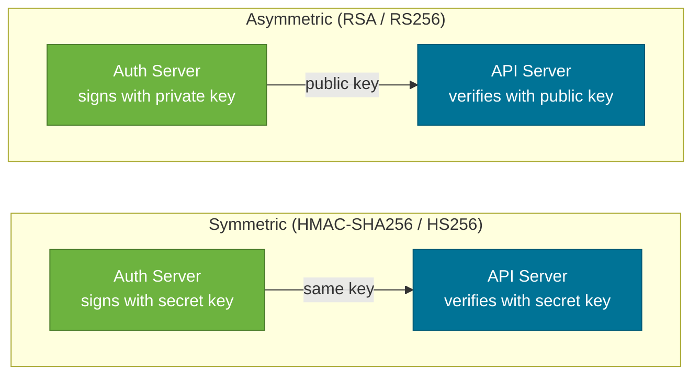
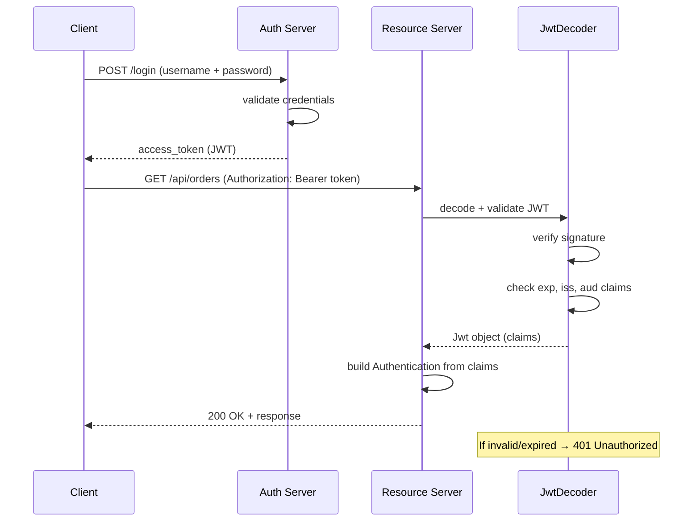

# JWT Authentication in Spring Security

> A JSON Web Token (JWT) is a compact, self-contained token that carries the user's identity and claims — Spring Security's OAuth2 Resource Server support validates JWTs on every request without a session or database lookup.

## What Problem Does It Solve?

Traditional session-based authentication stores user state in the server's memory (or a session store). Every request must look up the session to know who the caller is — this doesn't scale horizontally because all servers need access to the same session store.

JWTs solve this by encoding user identity *inside the token itself*, signed so the server can verify it without a round-trip to a database. The server is stateless: any instance can validate any token independently.

## JWT Structure

A JWT is three Base64URL-encoded JSON objects joined by dots:

```
eyJhbGciOiJIUzI1NiIsInR5cCI6IkpXVCJ9   ← Header
.eyJzdWIiOiJ1c2VyMTIzIiwicm9sZXMiOlsiVVNFUiJdLCJleHAiOjE3MDAwMDAwMDB9  ← Payload
.SflKxwRJSMeKKF2QT4fwpMeJf36POk6yJV_adQssw5c  ← Signature
```

### Header

```json
{
  "alg": "HS256",   ← signing algorithm (HS256 = HMAC-SHA256, RS256 = RSA-SHA256)
  "typ": "JWT"
}
```

### Payload (Claims)

```json
{
  "sub": "user123",              ← subject: who the token is about
  "iss": "https://auth.myapp.com", ← issuer
  "aud": "api.myapp.com",        ← audience: intended recipient
  "iat": 1700000000,             ← issued at (Unix timestamp)
  "exp": 1700003600,             ← expiry (Unix timestamp, 1 hour later)
  "roles": ["USER", "READER"],   ← custom claim: application-specific
  "email": "user@example.com"    ← custom claim
}
```

### Signature

The signature is computed over `Base64URL(header) + "." + Base64URL(payload)` using the signing key. It ensures neither the header nor the payload has been tampered with.

## Symmetric vs. Asymmetric Signing



*Symmetric: one shared secret — simple but the API server must know the secret. Asymmetric: auth server keeps the private key; API servers only need the public key (safer for multi-service architectures).*

| | Symmetric (HS256) | Asymmetric (RS256/ES256) |
|--|-------------------|--------------------------|
| Key type | Shared secret | Private key (sign) + Public key (verify) |
| Who can create tokens | Anyone with the secret | Only the private key holder |
| Suitable for | Single service, testing | Microservices, multi-tenant |
| Key distribution | Must be kept secret everywhere | Public key can be shared freely |
| Spring Boot config | `secret-key` in properties | JWKS endpoint or public-key file |

## How It Works

### JWT Authentication Flow



*The client gets a JWT at login; every subsequent request carries it in the `Authorization` header — no session needed.*

### Spring Security Resource Server Setup

Spring Boot's `spring-boot-starter-oauth2-resource-server` handles JWT validation automatically.

**Step 1: Add the dependency**

```xml
<dependency>
    <groupId>org.springframework.boot</groupId>
    <artifactId>spring-boot-starter-oauth2-resource-server</artifactId>
</dependency>
```

**Step 2: Configure signing key**

```yaml
# application.yml — symmetric secret key (for simple single-service setup)
spring:
  security:
    oauth2:
      resourceserver:
        jwt:
          secret-key: my-super-secret-key-that-is-at-least-32-chars-long

# OR — asymmetric: point to your auth server's JWKS endpoint
spring:
  security:
    oauth2:
      resourceserver:
        jwt:
          jwk-set-uri: https://auth.myapp.com/.well-known/jwks.json
```

**Step 3: Enable in SecurityFilterChain**

```java
@Bean
public SecurityFilterChain securityFilterChain(HttpSecurity http) throws Exception {
    http
        .csrf(AbstractHttpConfigurer::disable)
        .sessionManagement(s -> s.sessionCreationPolicy(SessionCreationPolicy.STATELESS))
        .authorizeHttpRequests(auth -> auth
            .requestMatchers("/api/auth/**").permitAll()
            .anyRequest().authenticated()
        )
        .oauth2ResourceServer(oauth2 -> oauth2
            .jwt(Customizer.withDefaults())  // ← validates Bearer JWTs on every request
        );
    return http.build();
}
```

With this configuration, Spring Security automatically:
1. Extracts the `Authorization: Bearer <token>` header.
2. Decodes the JWT using `JwtDecoder` (which verifies the signature and `exp` claim).
3. Converts JWT claims into a `JwtAuthenticationToken` and stores it in `SecurityContextHolder`.

## Code Examples

### Generating a JWT (Auth Server / Login Endpoint)

When building your own auth endpoint (rather than using an external OAuth2 server):

```java
@Component
public class JwtService {

    @Value("${app.jwt.secret}")
    private String secretKey;

    @Value("${app.jwt.expiry-seconds:3600}")
    private long expirySeconds;

    public String generateToken(UserDetails user) {
        Instant now = Instant.now();
        return Jwts.builder()
                .subject(user.getUsername())                           // ← "sub" claim
                .issuedAt(Date.from(now))                              // ← "iat" claim
                .expiration(Date.from(now.plusSeconds(expirySeconds))) // ← "exp" claim
                .claim("roles", extractRoles(user))                    // ← custom claim
                .signWith(getSigningKey())                             // ← sign with HMAC-SHA256
                .compact();
    }

    private SecretKey getSigningKey() {
        byte[] bytes = Decoders.BASE64.decode(secretKey);
        return Keys.hmacShaKeyFor(bytes);  // ← must be ≥ 32 bytes for HS256
    }

    private List<String> extractRoles(UserDetails user) {
        return user.getAuthorities().stream()
                .map(GrantedAuthority::getAuthority)
                .collect(Collectors.toList());
    }
}
```

### Custom JWT Converter — Mapping Claims to Spring Authorities

By default, Spring Security looks for claims named `scope` or `scp` to build authorities. If your JWT puts roles in a `roles` claim, you need a converter:

```java
@Bean
public JwtAuthenticationConverter jwtAuthenticationConverter() {
    JwtGrantedAuthoritiesConverter grantedAuthoritiesConverter = new JwtGrantedAuthoritiesConverter();
    grantedAuthoritiesConverter.setAuthoritiesClaimName("roles");     // ← claim to read roles from
    grantedAuthoritiesConverter.setAuthorityPrefix("ROLE_");          // ← add ROLE_ prefix

    JwtAuthenticationConverter converter = new JwtAuthenticationConverter();
    converter.setJwtGrantedAuthoritiesConverter(grantedAuthoritiesConverter);
    return converter;
}

// Wire into SecurityFilterChain:
.oauth2ResourceServer(oauth2 -> oauth2
    .jwt(jwt -> jwt.jwtAuthenticationConverter(jwtAuthenticationConverter()))
)
```

### Accessing JWT Claims in a Controller

```java
@GetMapping("/api/me")
public ResponseEntity<ProfileDto> getProfile(
        @AuthenticationPrincipal Jwt jwt) {    // ← Spring injects the decoded Jwt object

    String userId  = jwt.getSubject();                       // ← "sub" claim
    String email   = jwt.getClaimAsString("email");          // ← custom claim
    List<String> roles = jwt.getClaimAsStringList("roles");  // ← custom list claim
    Instant expiry = jwt.getExpiresAt();                     // ← "exp" as Instant

    return ResponseEntity.ok(profileService.get(userId));
}
```

### Refresh Token Pattern

Access tokens are short-lived (15–60 minutes); refresh tokens are long-lived (days/weeks) and used to issue new access tokens:

```java
@PostMapping("/api/auth/refresh")
public ResponseEntity<TokenResponse> refresh(
        @RequestBody @Valid RefreshRequest request) {

    String refreshToken = request.refreshToken();
    // 1. Validate refresh token (signature + expiry + not revoked)
    String userId = refreshTokenService.validate(refreshToken);

    // 2. Load user and generate new access token
    UserDetails user = userDetailsService.loadUserByUsername(userId);
    String newAccessToken = jwtService.generateToken(user);

    return ResponseEntity.ok(new TokenResponse(newAccessToken, refreshToken));
}
```

:::warning
**Refresh tokens must be stored server-side** (database, Redis) so you can revoke them on logout or compromise. Access JWTs are stateless and cannot be revoked before expiry — keep them short-lived.
:::

## Best Practices

- **Keep access tokens short-lived** (15–60 minutes). Since JWTs cannot be revoked, a stolen token is valid until expiry — shorter is safer.
- **Use asymmetric signing (RS256) in production with multiple services** — the auth server keeps the private key; resource servers only need the public key via a JWKS endpoint. No shared secret to leak.
- **Do not store sensitive data in the JWT payload** — the payload is Base64-encoded, not encrypted. Anyone with the token can decode the claims. Store only identifiers (user ID, roles) — not passwords, SSNs, or credit card numbers.
- **Validate `iss`, `aud`, and `exp` claims** — Spring Security's `JwtDecoder` validates `exp` automatically. Configure `iss` and `aud` validators to prevent token replay across environments.
- **Use HTTPS exclusively** — a JWT in transit over HTTP can be intercepted. HTTPS is non-negotiable.
- **Store JWTs in `HttpOnly` cookies, not in `localStorage`** for browser clients — `HttpOnly` cookies are inaccessible to JavaScript and resist XSS attacks, whereas `localStorage` is a common XSS target.

## Common Pitfalls

**`io.jsonwebtoken.ExpiredJwtException` leaks as a 500 instead of 401**
Spring Security's `BearerTokenAuthenticationFilter` catches `JwtException` and converts it to a `401`. But if JWT parsing happens outside the filter (e.g., in a `@Component`), the exception propagates as a 500. Always let the resource server handle JWT parsing — don't decode JWTs manually in business logic.

**JWT clock skew between issuer and verifier**
If the auth server and resource server clocks differ by a few seconds, freshly-issued JWTs may appear expired to the verifier. Configure a small clock skew tolerance: `NimbusJwtDecoder` accepts a `clockSkew(Duration)` in its builder.

**Encoding the secret as plain string (too short for HS256)**
HS256 requires a minimum 32-byte secret. A short string like `"mysecret"` will throw a `WeakKeyException`. Base64-encode a secure random 32+ byte key and store it in environment variables, not in `application.properties`.

**Not invalidating sessions on JWT logout**
Stateless JWTs cannot be invalidated on the server. If a user "logs out", the token is still valid until expiry. Solutions: use a short expiry, maintain a server-side token revocation list (Redis denylist), or rotate signing keys.

## Interview Questions

### Beginner

**Q:** What are the three parts of a JWT?
**A:** Header (Base64URL-encoded JSON with the algorithm and token type), Payload (Base64URL-encoded JSON with claims about the user), and Signature (cryptographic hash of header + payload using the signing key). The three parts are separated by dots. The signature allows the receiver to verify that neither the header nor the payload was tampered with.

**Q:** Why are JWTs used for stateless authentication?
**A:** Because the token carries all the identity information the server needs — user ID, roles, expiry — so the server doesn't need to look up a session in a database or memory store. Any server instance can validate the token independently by checking the signature and claims. This makes JWTs ideal for horizontally-scaled microservices where you can't guarantee all requests hit the same server instance.

### Intermediate

**Q:** What is the difference between symmetric (HS256) and asymmetric (RS256) JWT signing?
**A:** HS256 uses a single shared secret for both signing and verification. Any server that knows the secret can create tokens, which is a security risk if multiple services share the secret. RS256 uses an RSA key pair: the auth server signs with the private key; API servers verify with the public key. Only the auth server can create tokens (private key is not distributed). RS256 is preferred in microservice architectures where multiple services need to verify tokens but only one should issue them.

**Q:** How does Spring Security validate a JWT on each request?
**A:** Spring Security's `BearerTokenAuthenticationFilter` extracts the `Authorization: Bearer <token>` header, passes the token string to `JwtDecoder` (typically `NimbusJwtDecoder`), which verifies the signature against the configured key, validates the `exp` claim, and returns a `Jwt` object with all claims. The filter then calls `JwtAuthenticationConverter` to turn the `Jwt` into an `Authentication` object (with authorities from claims) and stores it in `SecurityContextHolder`.

### Advanced

**Q:** How would you implement JWT revocation in a stateless architecture?
**A:** Since JWTs are stateless, you can't revoke an individual token without server-side state. Common approaches: (1) **Short-lived tokens**: keep access tokens 15 minutes or less — the blast radius of a stolen token is limited. (2) **Refresh token revocation**: revoke refresh tokens in a database; stolen access tokens expire quickly. (3) **Denylist**: store revoked JWT `jti` (JWT ID) claims in a fast store (Redis) with TTL equal to the token's remaining lifetime. Check the denylist in a custom `JwtDecoder` or `OncePerRequestFilter`. (4) **Rotate signing keys**: invalidate all tokens by rotating the signing key, forcing re-authentication.

**Q:** How do you configure multiple JWT issuers (multi-tenant) in Spring Security?
**A:** Use a `JWTIssuerAuthenticationManagerResolver` that maps issuer URIs to `AuthenticationManager` instances. Register one `JwtDecoder` per trusted issuer. Spring Security routes each request to the appropriate `AuthenticationManager` based on the `iss` claim in the token. Configure with: `http.oauth2ResourceServer(o -> o.authenticationManagerResolver(resolver))`.

## Further Reading

- [Spring Security Docs — JWT Resource Server](https://docs.spring.io/spring-security/reference/servlet/oauth2/resource-server/jwt.html) — complete reference for `JwtDecoder`, converters, and multi-issuer config
- [RFC 7519 — JSON Web Token](https://datatracker.ietf.org/doc/html/rfc7519) — the specification defining JWT structure and claim names
- [Baeldung — Spring Security JWT](https://www.baeldung.com/spring-security-oauth-jwt) — step-by-step JWT setup with Spring Boot

## Related Notes

- [Security Filter Chain](./security-filter-chain.md) — `BearerTokenAuthenticationFilter` is the filter that extracts and validates JWT tokens; its position in the chain determines when validation happens
- [Authentication](./authentication.md) — JWT replaces session-based auth; both ultimately produce an `Authentication` object in `SecurityContextHolder`
- [OAuth2 & OIDC](./oauth2-oidc.md) — OAuth2 authorization servers issue JWTs as access tokens; the resource server pattern described here is part of the broader OAuth2 architecture
