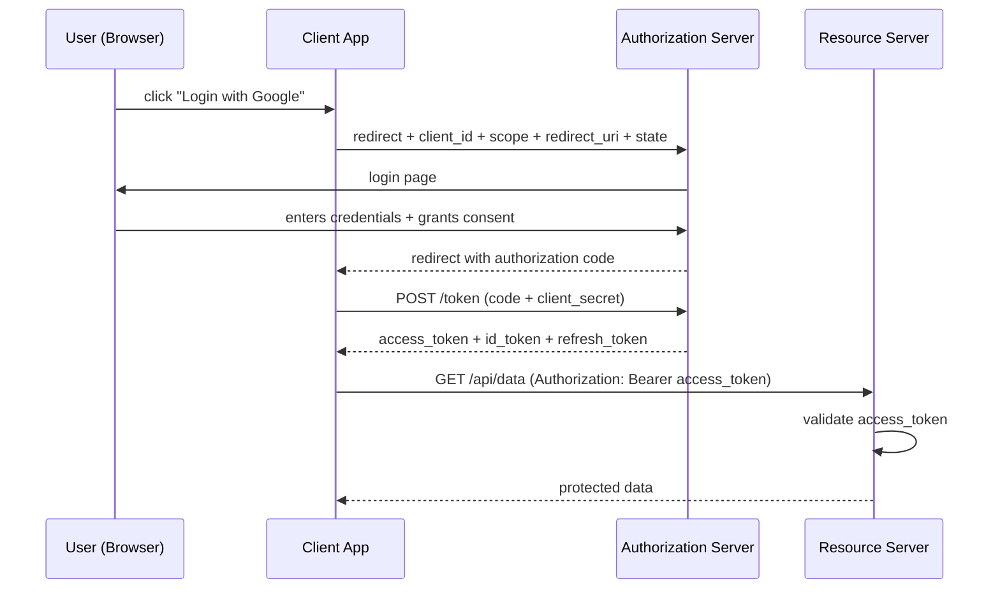
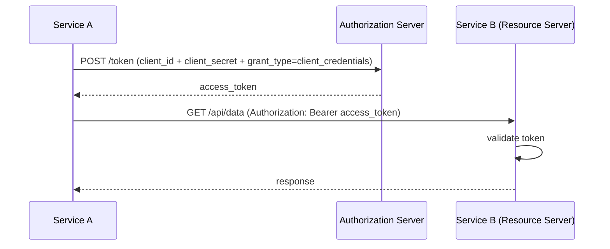

# OAuth2 and OpenID Connect in Spring Security

> OAuth2 is an authorization framework that lets a user grant a third-party application limited access to their resources without sharing passwords — OpenID Connect (OIDC) builds on top of OAuth2 to add a standardized identity layer with user profile information.

## What Problem Does It Solve?

Before OAuth2, granting a third-party app access to your data (e.g., "allow this app to read my Google contacts") required giving the app your password — a massive security risk. OAuth2 replaces this with a delegation model: the user grants consent, the authorization server issues a scoped access token, and the third-party app uses that token without ever seeing the password.

OIDC solves the complementary problem: OAuth2 says "this user authorized these scopes" but says nothing about *who they are*. OIDC adds an **ID Token** (a JWT containing the user's identity) to the OAuth2 flow.

## OAuth2 Roles

| Role | Responsibility |
|------|---------------|
| **Resource Owner** | The user who grants access to their data |
| **Client** | The application requesting access (your Spring Boot app, a mobile app, etc.) |
| **Authorization Server** | Issues access tokens after authenticating the user (Keycloak, Auth0, Google, Spring Authorization Server) |
| **Resource Server** | The API that holds the user's data; validates tokens on every request |

## OAuth2 Grant Types (Flows)

### Authorization Code Flow (the most important one)

Used by web apps with a backend. The safest flow — the access token never touches the browser.



*The authorization code is short-lived and single-use; only the backend exchanges it for a token — the token never passes through the browser URL.*

### Client Credentials Flow

Used for machine-to-machine (M2M) communication — no user involved. One microservice calling another.



*No user interaction — the service authenticates directly with the authorization server using its own credentials.*

### Other Grant Types

| Grant Type | Use Case | Status |
|------------|----------|--------|
| Authorization Code + PKCE | Single-page apps / mobile apps (no client secret) | Active — preferred for SPAs |
| Client Credentials | Service-to-service | Active |
| Device Code | Smart TVs, CLI tools (no browser) | Active |
| Implicit | SPAs (legacy, pre-PKCE) | **Deprecated** |
| Resource Owner Password Credentials | Direct username/password (legacy) | **Deprecated** |

## OpenID Connect (OIDC)

OIDC adds an **ID Token** to the authorization code flow. The ID Token is a JWT containing the user's identity (`sub`, `name`, `email`, `picture`) and is meant for the *client app* (not for API calls). The access token is for calling the resource server.

| Token | Who uses it | Contents |
|-------|------------|----------|
| **Access Token** | Client → Resource Server | Scopes, expiry, user ID |
| **ID Token** | Client app (to identify the user) | User identity: `sub`, `name`, `email` |
| **Refresh Token** | Client → Authorization Server | Opaque reference to get new access tokens |

### OIDC Standard Claims

```json
{
  "sub": "auth0|user123",       ← unique user identifier (stable across sessions)
  "name": "Jane Doe",
  "given_name": "Jane",
  "family_name": "Doe",
  "email": "jane@example.com",
  "email_verified": true,
  "picture": "https://example.com/jane.jpg",
  "iss": "https://accounts.google.com",
  "aud": "your-client-id",
  "iat": 1700000000,
  "exp": 1700003600
}
```

## How It Works in Spring Boot

### Scenario 1: Spring Boot as an OAuth2 Client (Social Login)

Your app is the **Client** — it redirects users to Google/GitHub to log in and receives an ID token.

```xml
<dependency>
    <groupId>org.springframework.boot</groupId>
    <artifactId>spring-boot-starter-oauth2-client</artifactId>
</dependency>
```

```yaml
spring:
  security:
    oauth2:
      client:
        registration:
          google:
            client-id: ${GOOGLE_CLIENT_ID}
            client-secret: ${GOOGLE_CLIENT_SECRET}
            scope: openid, profile, email       # ← "openid" triggers OIDC and issues an ID token
        provider:
          google:
            authorization-uri: https://accounts.google.com/o/oauth2/v2/auth
            token-uri: https://oauth2.googleapis.com/token
            user-info-uri: https://www.googleapis.com/oauth2/v3/userinfo
            jwk-set-uri: https://www.googleapis.com/oauth2/v3/certs
```

```java
@Bean
public SecurityFilterChain securityFilterChain(HttpSecurity http) throws Exception {
    http
        .authorizeHttpRequests(auth -> auth
            .requestMatchers("/", "/error").permitAll()
            .anyRequest().authenticated()
        )
        .oauth2Login(Customizer.withDefaults());  // ← enables social login redirect flow
    return http.build();
}
```

After the user logs in with Google, Spring Security stores their OIDC identity in `SecurityContextHolder` as an `OAuth2AuthenticationToken` with an `OidcUser` principal.

### Scenario 2: Spring Boot as a Resource Server (JWT-secured API)

Your API validates JWTs issued by an external authorization server:

```xml
<dependency>
    <groupId>org.springframework.boot</groupId>
    <artifactId>spring-boot-starter-oauth2-resource-server</artifactId>
</dependency>
```

```yaml
spring:
  security:
    oauth2:
      resourceserver:
        jwt:
          jwk-set-uri: https://auth.myapp.com/.well-known/jwks.json  # ← auth server public keys
          issuer-uri: https://auth.myapp.com                         # ← validates "iss" claim
```

```java
@Bean
public SecurityFilterChain securityFilterChain(HttpSecurity http) throws Exception {
    http
        .csrf(AbstractHttpConfigurer::disable)
        .sessionManagement(s -> s.sessionCreationPolicy(SessionCreationPolicy.STATELESS))
        .authorizeHttpRequests(auth -> auth
            .requestMatchers("/api/public/**").permitAll()
            .anyRequest().authenticated()
        )
        .oauth2ResourceServer(oauth2 -> oauth2
            .jwt(Customizer.withDefaults())   // ← validates Bearer JWTs on every request
        );
    return http.build();
}
```

### Scenario 3: Client Credentials (Service-to-Service)

A Spring Boot microservice calling another secured service:

```yaml
spring:
  security:
    oauth2:
      client:
        registration:
          order-service:
            authorization-grant-type: client_credentials
            client-id: ${ORDER_SERVICE_CLIENT_ID}
            client-secret: ${ORDER_SERVICE_CLIENT_SECRET}
            scope: read:inventory
        provider:
          order-service:
            token-uri: https://auth.myapp.com/oauth2/token
```

```java
// Use Spring's OAuth2-aware WebClient that auto-attaches tokens:
@Bean
public WebClient inventoryClient(OAuth2AuthorizedClientManager manager) {
    ServletOAuth2AuthorizedClientExchangeFilterFunction oauth2 =
        new ServletOAuth2AuthorizedClientExchangeFilterFunction(manager);
    oauth2.setDefaultClientRegistrationId("order-service");  // ← auto-fetch token for this client
    return WebClient.builder()
            .baseUrl("https://inventory-service/api")
            .apply(oauth2.oauth2Configuration())
            .build();
}
```

## Code Examples

### Accessing OIDC User Info After Social Login

```java
@GetMapping("/profile")
public ResponseEntity<UserProfileDto> profile(
        @AuthenticationPrincipal OidcUser oidcUser) {  // ← injected by Spring

    String sub   = oidcUser.getSubject();              // ← stable unique ID
    String email = oidcUser.getEmail();                // ← from OIDC ID token
    String name  = oidcUser.getFullName();             // ← "name" claim

    return ResponseEntity.ok(new UserProfileDto(sub, name, email));
}
```

### Customising the OIDC User After Login (Persist to Database)

```java
@Component
public class OidcUserService extends DefaultOidcUserService {

    private final UserRepository userRepository;

    @Override
    public OidcUser loadUser(OidcUserRequest userRequest) throws OAuth2AuthenticationException {
        OidcUser oidcUser = super.loadUser(userRequest);  // ← loads from OIDC provider

        // Upsert user record in our database
        userRepository.findByEmail(oidcUser.getEmail())
            .orElseGet(() -> userRepository.save(new User(
                oidcUser.getSubject(),
                oidcUser.getEmail(),
                oidcUser.getFullName()
            )));

        return oidcUser;
    }
}
```

### Requiring Specific Scopes

```java
http.authorizeHttpRequests(auth -> auth
    .requestMatchers("/api/orders/**").hasAuthority("SCOPE_read:orders")  // ← OAuth2 scopes become SCOPE_ authorities
    .anyRequest().authenticated()
);
```

Spring Security automatically maps OAuth2 `scope` claim values to authorities prefixed with `SCOPE_`.

## Best Practices

- **Use Authorization Code + PKCE for SPAs and mobile apps** — never use the Implicit flow; it embeds the token in the URL fragment where it can leak through browser history, referrer headers, and server logs.
- **Always validate `iss`, `aud`, and `exp` claims** — configure `issuer-uri` in your resource server config; Spring Security uses it to fetch the JWKS and validate the issuer automatically.
- **Use a dedicated authorization server in production** — don't implement your own OAuth2 server. Use Keycloak, Auth0, Okta, or Spring Authorization Server.
- **Scope access tokens minimally** — request only the scopes your application actually needs. A token with `scope=openid profile email` cannot access other users' data even if stolen, because the resource server enforces scope.
- **Implement token introspection for high-security endpoints** — stateless JWT validation cannot detect a revoked token. For sensitive operations (payments, account changes), call the auth server's introspection endpoint to verify the token is still valid.
- **Separate ID tokens from access tokens** — ID tokens prove identity and belong to the client; access tokens grant API access. Never send an ID token to a resource server as a Bearer token.

## Common Pitfalls

**Using `scope=openid` without the OIDC dependency**
`scope=openid` requests an ID Token. Without `spring-boot-starter-oauth2-client` properly configured, the ID token handshake will fail. Ensure the `openid` scope is in the registration config if you want OIDC.

**Confusing the access token audience with OIDC audience**
The access token's `aud` claim must match your resource server's identifier. The ID token's `aud` claim is the OAuth2 client ID. These are different. A resource server should not accept an ID token as an access token.

**Storing client secrets in source code**
Never put `client-secret` values in `application.yml` committed to source control. Use environment variables (`${OAUTH2_CLIENT_SECRET}`), Vault, or Spring Cloud Config Server for secrets.

**Not handling token expiry in the client**
The `OAuth2AuthorizedClientManager` will automatically refresh access tokens using the refresh token. But if you use a raw `RestTemplate` or old `WebClient` without the OAuth2 filter, you'll get `401` after token expiry and must handle the refresh yourself.

## Interview Questions

### Beginner

**Q:** What is the difference between OAuth2 and OpenID Connect?
**A:** OAuth2 is an *authorization* framework — it defines how a client can obtain permission (a token) to access a resource on behalf of a user. OpenID Connect (OIDC) is an *authentication* layer built on top of OAuth2. It adds an ID Token (a JWT with user identity claims like `sub`, `email`, `name`) so the client knows *who* the user is, not just what they're allowed to do. OAuth2 answers "can this app access this data?"; OIDC answers "who is the logged-in user?".

**Q:** What is the purpose of the authorization code in the authorization code flow?
**A:** The authorization code is a short-lived, single-use code that the authorization server sends to the client's redirect URI after the user grants consent. The *client backend* exchanges it for tokens directly with the authorization server (not via the browser), using its `client_secret` for authentication. This prevents the access token from ever appearing in the browser URL, browser history, or referrer headers — a critical security property.

### Intermediate

**Q:** What is the difference between the Authorization Code flow and Client Credentials flow?
**A:** Authorization Code flow involves a user: the user authenticates with the authorization server and grants consent, then the client gets a token scoped to that user's permissions. It is used by web apps and mobile apps. Client Credentials flow has no user: the *service itself* authenticates with `client_id` + `client_secret` and gets a token representing the service. It is used for machine-to-machine API calls (one microservice calling another).

**Q:** How does Spring Security validate the JWT issued by an external authorization server?
**A:** Configure `spring.security.oauth2.resourceserver.jwt.jwk-set-uri` pointing to the auth server's JWKS endpoint. On startup, Spring Security's `NimbusJwtDecoder` fetches the public keys from the JWKS endpoint. On every request, it verifies the JWT's signature using the fetched public key, checks the `exp` claim, and optionally validates `iss` and `aud`. The public keys are cached and refreshed when a new key ID (`kid`) appears in a token.

### Advanced

**Q:** What is PKCE and why is it required for public clients?
**A:** PKCE (Proof Key for Code Exchange, RFC 7636) protects the authorization code flow for clients that cannot securely store a `client_secret` — browser-based SPAs and mobile apps. The client generates a random `code_verifier`, hashes it to produce `code_challenge`, and sends the challenge in the authorization request. When exchanging the code for a token, it sends the original `code_verifier`. The auth server verifies the hash matches. This prevents an attacker who intercepts the authorization code from exchanging it for a token, because they don't have the `code_verifier`.

**Q:** If you are building a microservice that receives JWTs issued by Keycloak, what steps do you take to ensure the tokens are properly validated?
**A:** Configure `spring.security.oauth2.resourceserver.jwt.issuer-uri` pointing to your Keycloak realm URL. Spring Security auto-discovers the JWKS URI from the OpenID Connect discovery endpoint (`/.well-known/openid-configuration`), fetches public keys, and validates signature + `iss` + `exp` on every request. Add a `JwtAuthenticationConverter` to map Keycloak roles (typically under `realm_access.roles` claim) to Spring `GrantedAuthority` objects. Protect endpoints with `hasRole(...)` or `hasAuthority(...)` using the mapped authorities.

## Further Reading

- [Spring Security Docs — OAuth2](https://docs.spring.io/spring-security/reference/servlet/oauth2/index.html) — complete reference for client, resource server, and authorization server
- [RFC 6749 — The OAuth 2.0 Authorization Framework](https://datatracker.ietf.org/doc/html/rfc6749) — the specification defining all grant types
- [OpenID Connect Core 1.0](https://openid.net/specs/openid-connect-core-1_0.html) — the specification for the identity layer
- [Baeldung — OAuth2 Resource Server](https://www.baeldung.com/spring-security-oauth2-enable-resource-server) — practical Spring Boot resource server setup

## Related Notes

- [JWT](./jwt.md) — OAuth2 access tokens are typically JWTs; this note covers token structure and Spring Security's JWT validation in detail
- [Security Filter Chain](./security-filter-chain.md) — OAuth2 login and resource server support work by adding specific filters to the chain
- [Authentication](./authentication.md) — OAuth2 login ultimately creates an `Authentication` in `SecurityContextHolder`, following the same contract as form-based auth
