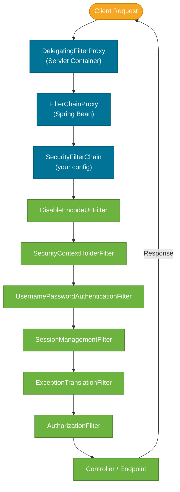
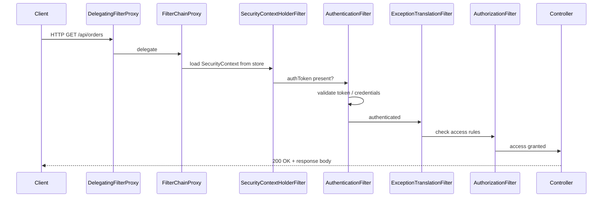

# Spring Security Filter Chain

> Every HTTP request that enters a Spring Boot application passes through an ordered chain of security filters before reaching your controller — this chain is the architectural core of Spring Security.

## What Problem Does It Solve?

Without a centralised security layer, every controller method would need to manually check whether the caller is authenticated, has the right role, and the request is valid (no CSRF attack, correct CORS origin, etc.). That leads to duplicated, fragile security code scattered across the codebase.

Spring Security solves this by placing security concerns in a single, configurable interceptor chain that runs *before* any application code. You declare security rules once; the framework enforces them universally.

## The Security Filter Chain

The security filter chain is a list of `javax.servlet.Filter` (or `jakarta.servlet.Filter`) implementations, ordered by priority. Each filter does one job — authenticate, check CSRF, manage sessions, delegate authorization — then passes the request to the next filter.

Spring Security installs this chain as a single entry point: a special filter called `DelegatingFilterProxy` registered in the Servlet container. It delegates to `FilterChainProxy`, which holds the actual `SecurityFilterChain` beans.

### Architecture Overview



*Every HTTP request flows through `DelegatingFilterProxy` → `FilterChainProxy` → your `SecurityFilterChain` before reaching the application.*

### Key Filters and What They Do

| Filter | Order | Responsibility |
|--------|-------|----------------|
| `DisableEncodeUrlFilter` | 1st | Prevents session IDs from being appended to URLs (security hygiene). |
| `SecurityContextHolderFilter` | Early | Loads the `SecurityContext` (current user) from the session or token into `SecurityContextHolder`. |
| `CsrfFilter` | Mid | Validates CSRF tokens for state-changing requests (POST, PUT, DELETE). |
| `UsernamePasswordAuthenticationFilter` | Mid | Handles form-login POST to `/login`; creates an `Authentication` object. |
| `BearerTokenAuthenticationFilter` | Mid | Validates JWT/Bearer tokens for stateless APIs (when OAuth2 resource server is configured). |
| `SessionManagementFilter` | Late | Enforces session fixation protection and concurrency limits. |
| `ExceptionTranslationFilter` | Late | Catches `AccessDeniedException` / `AuthenticationException` and sends `401`/`403` responses. |
| `AuthorizationFilter` | Last | Final access-control check; uses `AuthorizationManager` to evaluate rules defined in your config. |

### `SecurityContextHolder` — The Heart of Authentication State

After authentication, Spring Security stores the current user's `Authentication` object in `SecurityContextHolder`. It uses a `ThreadLocal` so that every piece of code in the same request thread can access the current user:

```java
// Anywhere in your application code during a request:
Authentication auth = SecurityContextHolder.getContext().getAuthentication();
String username = auth.getName();                        // ← who is logged in
Collection<?> authorities = auth.getAuthorities();       // ← their roles/permissions
```

## How It Works

### Request Flow — Step by Step



*Note: If authentication fails the response is 401; if access is denied the response is 403.*
```

*Authentication happens first; authorization is the last gate before the controller runs.*

### Configuring Your SecurityFilterChain

In Spring Security 6 (Spring Boot 3+), you configure the chain with a `@Bean` of type `SecurityFilterChain`:

```java
@Configuration
@EnableWebSecurity
public class SecurityConfig {

    @Bean
    public SecurityFilterChain securityFilterChain(HttpSecurity http) throws Exception {
        http
            .authorizeHttpRequests(auth -> auth
                .requestMatchers("/api/public/**").permitAll()         // ← no auth needed
                .requestMatchers("/api/admin/**").hasRole("ADMIN")     // ← ADMIN role only
                .anyRequest().authenticated()                          // ← everything else: must be logged in
            )
            .sessionManagement(session -> session
                .sessionCreationPolicy(SessionCreationPolicy.STATELESS) // ← no HTTP session (JWT mode)
            )
            .csrf(csrf -> csrf.disable())                               // ← disable for stateless REST APIs
            .oauth2ResourceServer(oauth2 -> oauth2
                .jwt(Customizer.withDefaults())                         // ← validate Bearer tokens as JWTs
            );

        return http.build();
    }
}
```

### Multiple Security Filter Chains

You can define multiple `SecurityFilterChain` beans, each matching a different URL pattern. Spring Security picks the first chain whose `requestMatcher` matches:

```java
@Bean
@Order(1)  // ← evaluated before the main chain
public SecurityFilterChain actuatorChain(HttpSecurity http) throws Exception {
    http
        .securityMatcher("/actuator/**")                   // ← only applies to /actuator/*
        .authorizeHttpRequests(auth -> auth
            .requestMatchers("/actuator/health").permitAll()
            .anyRequest().hasRole("OPS")
        );
    return http.build();
}

@Bean
@Order(2)
public SecurityFilterChain apiChain(HttpSecurity http) throws Exception {
    http
        .securityMatcher("/api/**")
        .authorizeHttpRequests(auth -> auth.anyRequest().authenticated())
        .oauth2ResourceServer(oauth2 -> oauth2.jwt(Customizer.withDefaults()));
    return http.build();
}
```

### Adding a Custom Filter

To add your own logic (e.g., API key validation), implement `OncePerRequestFilter` and insert it at the right position:

```java
public class ApiKeyFilter extends OncePerRequestFilter {

    @Override
    protected void doFilterInternal(HttpServletRequest request,
                                    HttpServletResponse response,
                                    FilterChain filterChain) throws ServletException, IOException {

        String apiKey = request.getHeader("X-API-Key");
        if (!isValidKey(apiKey)) {
            response.sendError(HttpServletResponse.SC_UNAUTHORIZED, "Invalid API key");
            return;  // ← short-circuit: stop the chain
        }
        filterChain.doFilter(request, response);  // ← continue chain if valid
    }
}

// Register in your SecurityFilterChain config:
http.addFilterBefore(new ApiKeyFilter(), UsernamePasswordAuthenticationFilter.class);
```

## Code Examples

### Minimal Stateless REST API Security (the most common pattern)

```java
@Bean
public SecurityFilterChain restApiSecurity(HttpSecurity http) throws Exception {
    http
        .csrf(AbstractHttpConfigurer::disable)            // ← stateless APIs don't need CSRF
        .sessionManagement(s -> s.sessionCreationPolicy(SessionCreationPolicy.STATELESS))
        .authorizeHttpRequests(auth -> auth
            .requestMatchers(HttpMethod.POST, "/api/auth/**").permitAll()  // ← login/register
            .requestMatchers(HttpMethod.GET, "/api/public/**").permitAll() // ← public reads
            .anyRequest().authenticated()                                  // ← everything else
        )
        .oauth2ResourceServer(oauth2 -> oauth2.jwt(Customizer.withDefaults()));
    return http.build();
}
```

### Accessing the Current User in a Controller

```java
@GetMapping("/api/profile")
public ResponseEntity<ProfileDto> getProfile(
        @AuthenticationPrincipal Jwt jwt) {       // ← Spring injects the current JWT principal
    String username = jwt.getSubject();            // ← standard "sub" claim
    String email = jwt.getClaimAsString("email"); // ← custom claim
    return ResponseEntity.ok(profileService.get(username));
}
```

### Inspecting the Filter Chain (Debug)

Enable logging during development to see which filters run on each request:

```yaml
# application.yml
logging:
  level:
    org.springframework.security: TRACE
```

## Best Practices

- **Always use `SessionCreationPolicy.STATELESS` for REST APIs** — it prevents Spring Security from creating an HTTP session, which would be a statefulness bug in horizontally-scaled services.
- **Use `requestMatchers` over `antMatchers`** — `antMatchers` was deprecated in Spring Security 5.8; `requestMatchers` is the correct API in Spring Boot 3+.
- **Order your rules from most specific to least specific** — `anyRequest()` must be last; specific matchers go first.
- **Never return 200 on auth failure** — `ExceptionTranslationFilter` handles 401/403 correctly by default; don't override it unless you have a specific error body format requirement.
- **Use `@EnableMethodSecurity` for method-level access control** — combining URL-level and method-level security gives defence in depth.
- **Keep your `SecurityFilterChain` config readable** — one bean per logical security zone (API, actuator, admin) rather than one mega-config.

## Common Pitfalls

**Forgetting to disable CSRF for stateless APIs**
CSRF protection is enabled by default. For JWT-secured REST APIs (no session, no browser cookies), CSRF is not needed and its default behaviour will reject your `POST`/`PUT`/`DELETE` calls with `403 Forbidden`. Add `csrf.disable()` in stateless configurations.

**Permitting too broadly with `permitAll()`**
`permitAll()` allows unauthenticated access but the security filters still run. It does *not* skip the filter chain (unlike `web.ignoring()`). Use `web.ignoring()` only for static resources where you want no security processing at all.

**Incorrect rule order in `authorizeHttpRequests`**
Rules are evaluated top to bottom; the first match wins. If you write `.anyRequest().authenticated()` before `.requestMatchers("/public/**").permitAll()`, the public rule is never reached. Always put `anyRequest()` last.

**Expecting `HttpSession`-based auth to work with `STATELESS` policy**
`SessionCreationPolicy.STATELESS` tells Spring Security not to create or use an HTTP session. If you also configure form-login, the session will not be used to remember the logged-in user between requests — every request must carry credentials (e.g., a JWT). Don't mix session-based auth with stateless policy.

## Interview Questions

### Beginner

**Q:** What is the Spring Security filter chain?
**A:** It is an ordered list of servlet filters that every HTTP request passes through before reaching the application's controllers. Each filter handles one security concern: loading the current user (`SecurityContextHolderFilter`), validating credentials (`UsernamePasswordAuthenticationFilter`), enforcing access rules (`AuthorizationFilter`), etc. The chain is configured through a `SecurityFilterChain` bean and is managed by `FilterChainProxy`.

**Q:** What is `SecurityContextHolder`?
**A:** `SecurityContextHolder` is a `ThreadLocal`-backed store that holds the `SecurityContext` for the current request thread. The `SecurityContext` contains the `Authentication` object — the currently logged-in user's identity and granted authorities. Any code in the same thread can call `SecurityContextHolder.getContext().getAuthentication()` to access the current user.

### Intermediate

**Q:** What is the difference between `DelegatingFilterProxy` and `FilterChainProxy`?
**A:** `DelegatingFilterProxy` is a standard servlet filter registered in the container's filter chain. Its only job is to bridge the Servlet world to the Spring context — it looks up the `FilterChainProxy` bean from the `ApplicationContext` and delegates to it. `FilterChainProxy` is the actual Spring Security component; it holds all the `SecurityFilterChain` beans and routes each request to the first matching chain.

**Q:** What is the role of `ExceptionTranslationFilter`?
**A:** `ExceptionTranslationFilter` sits near the end of the filter chain and catches two types of Spring Security exceptions: `AuthenticationException` (user not logged in → sends 401) and `AccessDeniedException` (logged in but lacks permission → sends 403). It acts as the global error handler for security failures, converting them into proper HTTP responses rather than propagating stack traces.

**Q:** How do you add a custom filter to the security chain?
**A:** Implement `OncePerRequestFilter`, override `doFilterInternal`, and register it in your `SecurityFilterChain` config using `http.addFilterBefore()`, `addFilterAfter()`, or `addFilterAt()` relative to an existing Spring Security filter class. `OncePerRequestFilter` guarantees the filter runs at most once per request (important in servlet forward/include scenarios).

### Advanced

**Q:** How does Spring Security support multiple `SecurityFilterChain` beans?
**A:** `FilterChainProxy` holds a list of `SecurityFilterChain` beans, ordered by `@Order`. For each request, it iterates the list and picks the first chain whose `requestMatcher` matches the request path. Unmatched chains are skipped entirely. This allows different security policies for different URL namespaces (e.g., `/api/**` uses JWT, `/admin/**` uses HTTP Basic, `/actuator/**` uses a custom check).

**Q:** Why is `web.ignoring()` different from `.requestMatchers(...).permitAll()`?
**A:** `web.ignoring()` bypasses the entire `FilterChainProxy` — the request never enters any security filter. This means no `SecurityContext` is populated, no CSRF check, no logging. It should be used only for truly static resources (e.g., `/static/**`). `permitAll()` still runs the full security filter chain but allows unauthenticated access through to the application. The difference matters: `permitAll()` paths still have a populated `SecurityContext` (anonymous user), whereas `web.ignoring()` paths have none.

## Further Reading

- [Spring Security Docs — Servlet Architecture](https://docs.spring.io/spring-security/reference/servlet/architecture.html) — official explanation of `DelegatingFilterProxy`, `FilterChainProxy`, and the filter order
- [Spring Security Docs — Java Configuration](https://docs.spring.io/spring-security/reference/servlet/configuration/java.html) — `SecurityFilterChain` bean setup and `HttpSecurity` API
- [Baeldung — Spring Security Filters](https://www.baeldung.com/spring-security-filters) — walkthrough of each built-in filter with examples

## Related Notes

- [Authentication](./authentication.md) — the authentication filters (`UsernamePasswordAuthenticationFilter`, `BearerTokenAuthenticationFilter`) are the key processing nodes in the chain
- [Authorization](./authorization.md) — `AuthorizationFilter` is the final gate; this note explains how access rules are defined and evaluated
- [JWT](./jwt.md) — JWT validation in Spring Security is wired through the filter chain's `BearerTokenAuthenticationFilter`
