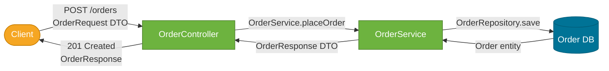
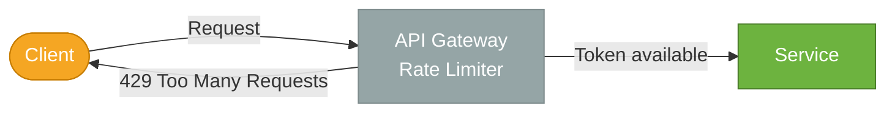

# API Design

> The set of decisions — resource modeling, HTTP verb semantics, versioning strategy, pagination, error contracts, and protocol selection — that determines how easy a service is to consume, evolve, and debug.

## What Problem Does It Solve?

A poorly designed API forces clients to work around its quirks. Inconsistent HTTP status codes make clients write defensive guard clauses. Lack of versioning means any breaking change ships as a silent bug in existing consumers. Missing pagination turns a "get all orders" endpoint into an OOM error in production with 10 million rows.

Good API design is a **contract** — an agreement between the service and its clients about what requests mean, what responses contain, and what errors look like. A well-designed contract lets you evolve the service internally without breaking clients, makes onboarding new consumers fast, and makes failures self-explanatory.

## REST API Design

REST (Representational State Transfer) is the dominant style for HTTP APIs in Java/Spring Boot services.

### Resource Modeling

Name endpoints by **nouns** (resources), not verbs (actions). HTTP verbs supply the action.

| ❌ Verb-based (wrong) | ✅ Resource-based (right) |
|----------------------|--------------------------|
| `POST /getUser` | `GET /users/{id}` |
| `POST /createOrder` | `POST /orders` |
| `POST /deleteProduct` | `DELETE /products/{id}` |
| `POST /updateInventory` | `PUT /inventory/{id}` or `PATCH /inventory/{id}` |

### HTTP Verb Semantics

| Verb | Semantics | Idempotent? | Safe? |
|------|-----------|-------------|-------|
| `GET` | Read a resource or collection | Yes | Yes |
| `POST` | Create a resource | No | No |
| `PUT` | Replace a resource entirely | Yes | No |
| `PATCH` | Partially update a resource | No (by spec) | No |
| `DELETE` | Remove a resource | Yes | No |

:::info
**Safe** means the request has no side effects (read-only). **Idempotent** means calling it multiple times has the same effect as calling it once. `PUT /orders/42` with the same body always results in the same order state — idempotent. `POST /orders` creates a new order each time — not idempotent.
:::

### HTTP Status Codes

Return the semantically correct status code — not `200 OK` for everything.

| Scenario | Status Code |
|----------|-------------|
| Resource created | `201 Created` |
| No content to return | `204 No Content` |
| Bad request (validation fail) | `400 Bad Request` |
| Unauthenticated | `401 Unauthorized` |
| Authenticated but forbidden | `403 Forbidden` |
| Resource not found | `404 Not Found` |
| Method not allowed | `405 Method Not Allowed` |
| Conflict (duplicate resource) | `409 Conflict` |
| Unprocessable entity | `422 Unprocessable Entity` |
| Server error | `500 Internal Server Error` |
| Service unavailable | `503 Service Unavailable` |

### Request/Response Design

- **Use DTOs, not entities**: never expose JPA entity classes as API responses. DTOs decouple the API contract from the database schema.
- **Use consistent field naming**: `camelCase` for JSON fields (Java convention) or `snake_case` (common in polyglot environments) — pick one and stick to it.
- **Avoid nulls** where possible — use `Optional` or omit the field in JSON rather than sending `"email": null`.
- **Include timestamps** in UTC ISO-8601: `"createdAt": "2026-03-08T10:30:00Z"`.



*Caption: Data flows as DTOs between boundary layers — the entity never leaves the service layer, protecting the API contract from schema changes.*

## API Versioning

Versioning allows the API to evolve without breaking existing consumers.

### Strategies

| Strategy | URL Example | Notes |
|----------|-------------|-------|
| **URI versioning** | `/api/v1/orders` | Most visible, easiest to route; recommended for public APIs |
| **Header versioning** | `Accept: application/vnd.api.v2+json` | Keeps URLs clean; harder to test in browser |
| **Query param** | `/orders?version=2` | Simple but pollutes query space |

URI versioning is the most common choice in Java/Spring Boot, because it's explicit, easy to route in API Gateways, and trivially testable with `curl`.

### In Spring Boot

```java
@RestController
@RequestMapping("/api/v1/orders")  // ← version in path
public class OrderControllerV1 {
    @GetMapping("/{id}")
    public OrderResponseV1 getOrder(@PathVariable Long id) { ... }
}

@RestController
@RequestMapping("/api/v2/orders")  // ← new version as a new class
public class OrderControllerV2 {
    @GetMapping("/{id}")
    public OrderResponseV2 getOrder(@PathVariable Long id) { ... }  // ← richer response
}
```

:::tip
Maintain at least one previous version. Deprecate old versions with a `Deprecation` or `Sunset` response header, and give clients a migration timeline.
:::

## Pagination

Never return unbounded collections. A `GET /orders` that scans the full table becomes a production outage at scale.

### Cursor vs Offset Pagination

| Type | How it works | Use when |
|------|-------------|----------|
| **Offset** (`?page=0&size=20`) | Skip N rows, return M | Simple, UI-friendly, known page count |
| **Cursor** (`?cursor=eyJpZCI...`) | Encode the last seen position | Large datasets, real-time feeds, consistent pagination with inserts |

### Spring Data Page Response

```java
@GetMapping
public Page<OrderSummary> listOrders(
        @RequestParam(defaultValue = "0") int page,
        @RequestParam(defaultValue = "20") int size) {

    Pageable pageable = PageRequest.of(page, size, Sort.by("createdAt").descending());
    return orderRepository.findAll(pageable)   // ← Spring Data returns Page<Order>
                          .map(OrderSummary::from); // ← map entity to DTO
}
```

Response JSON:
```json
{
  "content": [...],
  "totalElements": 1430,
  "totalPages": 72,
  "number": 0,
  "size": 20,
  "first": true,
  "last": false
}
```

## Rate Limiting

Rate limiting protects your service from abuse and ensures fair resource usage.



*Caption: Rate limiting at the API Gateway returns 429 Too Many Requests and preserves service capacity — the service itself never sees traffic that exceeds its quota.*

Include rate limit metadata in response headers so clients can self-regulate:

```
X-RateLimit-Limit: 1000
X-RateLimit-Remaining: 847
X-RateLimit-Reset: 1710000000
```

## Error Response Design

Consistent error responses make debugging easier and allow clients to handle errors programmatically.

### RFC 7807 Problem Details (Spring Boot 3 default)

Spring Boot 3 uses RFC 7807 `ProblemDetail` for structured error responses:

```json
{
  "type": "https://api.example.com/errors/validation-failed",
  "title": "Validation Failed",
  "status": 400,
  "detail": "Field 'email' must be a valid email address",
  "instance": "/api/v1/users",
  "violations": [
    { "field": "email", "message": "must be a well-formed email address" }
  ]
}
```

```java
// Spring Boot 3: declare a global exception handler
@RestControllerAdvice
public class GlobalExceptionHandler {

    @ExceptionHandler(MethodArgumentNotValidException.class)
    public ProblemDetail handleValidation(MethodArgumentNotValidException ex) {
        ProblemDetail pd = ProblemDetail.forStatusAndDetail(
            HttpStatus.BAD_REQUEST, "Validation failed");
        pd.setTitle("Validation Failed");
        pd.setProperty("violations",
            ex.getBindingResult().getFieldErrors().stream()
              .map(fe -> Map.of("field", fe.getField(), "message", fe.getDefaultMessage()))
              .toList()
        );
        return pd;
    }
}
```

## REST vs gRPC vs GraphQL

| Dimension | REST | gRPC | GraphQL |
|-----------|------|------|---------|
| **Protocol** | HTTP/1.1 or HTTP/2 | HTTP/2 (required) | HTTP/1.1 or HTTP/2 |
| **Payload** | JSON | Protocol Buffers (binary) | JSON |
| **Schema** | OpenAPI (optional) | `.proto` file (required) | GraphQL schema (required) |
| **Streaming** | Limited (SSE) | Native bi-directional streaming | Subscriptions |
| **Performance** | Moderate | High (binary, multiplexed) | Moderate |
| **Best for** | Public/external APIs | Internal service-to-service | Client-driven queries (BFF) |
| **Tooling** | Excellent | Good | Growing |

**Use gRPC** for high-throughput internal service-to-service calls where performance matters and schema contract enforcement is desirable.

**Use GraphQL** for a Backend-for-Frontend (BFF) layer where different clients (mobile vs. web) need different shapes of the same data.

**Use REST** for public-facing APIs, third-party integrations, and when simplicity and broad client support matter.

## Best Practices

- **Document with OpenAPI (Springdoc)**: add `springdoc-openapi-starter-webmvc-ui` and annotate with `@Operation`, `@ApiResponse` to generate Swagger UI automatically.
- **Validate inputs at the boundary**: use `@Valid` + Bean Validation on request DTOs. Never let invalid data reach the service layer.
- **Be consistent with field names and casing**: agree on a convention (`camelCase`) and enforce it project-wide with a `@JsonNaming` policy.
- **Return `Location` header on creation**: `POST /orders` returning `201 Created` should include `Location: /orders/42`.
- **Use HATEOAS sparingly**: HATEOAS links in every response add noise for most consumers; use only if clients are truly hypertext-driven.
- **Never leak stack traces**: `500` errors should return a correlation ID the client can share with support, not a Java stack trace.
- **Idempotency keys for POST**: for financial or critical operations, accept an `Idempotency-Key` header so clients can retry safely.

## Common Pitfalls

**Returning 200 for everything with a body-level error code** — `{ "code": 404, "message": "Not found" }` with HTTP 200 breaks HTTP semantics and makes load balancer health checks and monitoring useless.

**Too fine-grained or too coarse-grained resources** — `/orders/42/items/7/trackingNumber` is too deep. Model sub-resources only 1–2 levels deep. On the other extreme, one giant `/getData` endpoint forces clients to process a huge payload for a small piece.

**No versioning from day one** — the first breaking change becomes a production incident if you launch without a versioning strategy.

**Skipping input validation** — trusting that clients send valid data is a security vulnerability (injection attacks, unexpected types). Always validate at the HTTP boundary.

**Over-returning data** — returning the full entity when the list endpoint only needs `id`, `name`, and `status` wastes bandwidth and leaks internals. Use projection DTOs.

## Interview Questions

### Beginner

**Q:** What HTTP status code should a successful `POST /orders` return?
**A:** `201 Created`, along with a `Location` header pointing to the new resource (`Location: /orders/42`). Returning `200 OK` for a creation is technically incorrect per HTTP semantics.

**Q:** What is the difference between `PUT` and `PATCH`?
**A:** `PUT` replaces an entire resource — you send the full representation. `PATCH` applies a partial update — you send only the fields being changed. `PUT` is idempotent; `PATCH` is not by specification (though in practice many PATCH implementations are).

**Q:** What is REST?
**A:** REST (Representational State Transfer) is an architectural style for distributed hypermedia systems. In practice it means: resources identified by URLs, manipulated using standard HTTP verbs (`GET`, `POST`, `PUT`, `DELETE`), and communicated via a self-describing payload (usually JSON).

### Intermediate

**Q:** How would you version a REST API in Spring Boot?
**A:** The most common approach is URI versioning — `/api/v1/users` and `/api/v2/users` map to separate controller classes. On a breaking change a new controller class is created for v2, while v1 remains working. Deprecated versions get a `Sunset` header announcing when they'll stop being supported.

**Q:** Why should you never expose JPA entities directly as API responses?
**A:** Entities are coupled to the database schema — exposing them leaks internal details (e.g., lazy-loaded collections that serialize as empty or throw `LazyInitializationException`), creates circular reference issues with bidirectional relationships, and tightly couples the API contract to schema changes. Use DTOs to decouple the API surface from the persistence model.

**Q:** What is the difference between REST and gRPC?
**A:** REST uses JSON over HTTP/1.1 or HTTP/2 with optional schema definition (OpenAPI). gRPC uses Protocol Buffers (binary) over HTTP/2 with a mandatory `.proto` schema. gRPC is faster due to binary encoding and HTTP/2 multiplexing, supports streaming natively, and enforces contract-first API design. REST is simpler, better supported in browsers, and more appropriate for public APIs.

### Advanced

**Q:** How do you design a pagination API that is consistent when records are being inserted?
**A:** Use **cursor-based pagination** instead of offset pagination. An offset (`?page=2`) shifts when records are inserted, causing items to appear twice or be skipped. A cursor encodes the last seen position (e.g., the `id` or `createdAt` of the last returned item) as an opaque token. The next page query is `WHERE createdAt < :cursor ORDER BY createdAt DESC LIMIT 20`, which is stable regardless of concurrent inserts.

**Q:** How would you implement an idempotent POST endpoint in Spring Boot?
**A:** The client sends an `Idempotency-Key` UUID header with the request. The server stores the key and the response in Redis (or a database table with a unique constraint on the key). On receiving a request, check if the key already exists: if yes, return the stored response without re-executing; if no, execute and store both the key and response atomically. This allows clients to retry network failures safely without creating duplicate records.

## Further Reading

- [Spring MVC — Web Reference](https://docs.spring.io/spring-framework/reference/web/webmvc.html) — official Spring MVC request mapping and REST controller documentation
- [Baeldung — REST with Spring Series](https://www.baeldung.com/rest-with-spring-series) — comprehensive tutorials for Spring REST API design patterns
- [RFC 7807 — Problem Details for HTTP APIs](https://datatracker.ietf.org/doc/html/rfc7807) — the standard for structured error responses

## Related Notes

- [Microservices](./microservices.md) — API design decisions (versioning, pagination, error contracts) are amplified in microservices, where each service exposes its own API.
- [Reliability Patterns](./reliability-patterns.md) — rate limiting is a reliability pattern that protects service APIs from overload.
- [Spring Security](../spring-security/index.md) — authentication and authorization are inseparable from API design; every endpoint needs an access control decision.
