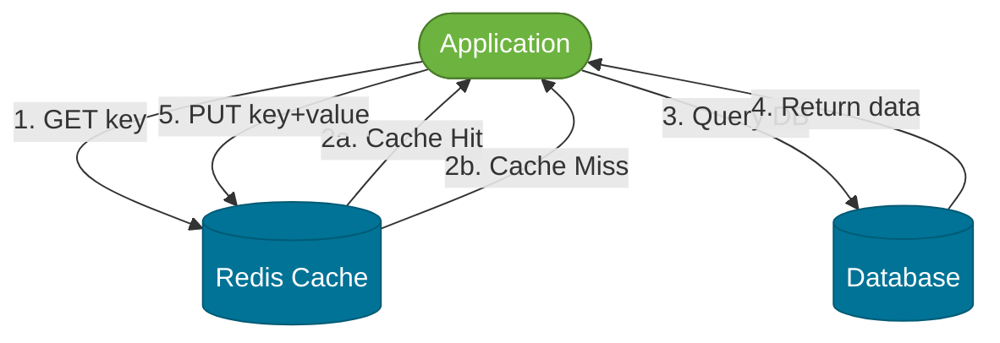
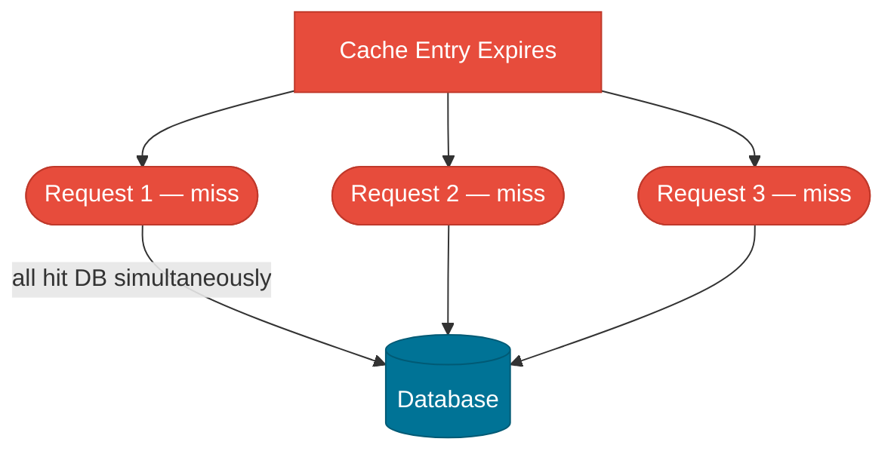

# Caching Strategies

> Caching is the practice of storing a copy of computed or fetched data closer to where it's needed, so the expensive underlying operation (database query, HTTP call, computation) is skipped on subsequent requests.

## What Problem Does It Solve?

A product catalog page reads from the database on every request. At 1,000 requests/second, that's 1,000 database queries per second for data that changes at most once per day. The database becomes a bottleneck, latency grows, and you scale the database just to serve read traffic.

Caching breaks this coupling between **read traffic** and **database load**. Frequently-read, rarely-changing data is served from memory (Redis, local cache) in microseconds instead of database milliseconds. This reduces latency, reduces database pressure, and allows you to handle higher read throughput without scaling the database.

## What Is Caching?

A **cache** is a fast, temporary data store that holds copies of results from a slower, authoritative source. You trade **freshness** (data might be slightly stale) for **speed** (data served instantly).

### Analogy

Think of a cache as a sticky note on your desk. Instead of walking to the filing cabinet (database) every time someone asks "What's the price of product #42?", you write the answer on a sticky note. Next request — check the sticky note first. If it's there and not expired, use it. If it's gone or expired, go to the filing cabinet, get the answer, and write a new sticky note.

The filing cabinet is always authoritative. The sticky note is fast but temporary.

## Cache Strategies

### Cache-Aside (Lazy Loading)

The application manages the cache explicitly. On a cache miss, the application fetches from the database and populates the cache.



*Caption: Cache-aside — the application checks the cache first; on a miss it queries the database and writes the result to the cache for future requests.*

**Pros**: Cache only contains data that was actually requested. Database failure doesn't prevent reads (stale cache can serve traffic).
**Cons**: First request after a cache miss is slow (cache cold start). Data can be stale until TTL expires or explicit invalidation.

### Write-Through

Every write to the database also synchronously updates the cache.


*Caption: Write-through — every write goes through the cache to the database synchronously, keeping the cache always fresh at the cost of write latency.*

**Pros**: Cache is always consistent with the database. Reads after writes never return stale data.
**Cons**: Every write pays the cache write penalty. Cache can fill with data that is written once but never read.

### Write-Behind (Write-Back)

Writes go to the cache first; the cache asynchronously flushes to the database later.

**Pros**: Writes are fast (only hits cache). Batch writes reduce database load.
**Cons**: Risk of data loss if the cache node fails before the async flush. Complexity of the async flush mechanism.

### Read-Through

The cache sits in front of the database and handles loads itself — the application only talks to the cache.

Often a property of the cache infrastructure (e.g., Hibernate 2nd-level cache) rather than something you implement in application code.

## Eviction Policies

When the cache is full, an eviction policy decides which entries to remove:

| Policy | Description | Best for |
|--------|-------------|---------|
| **LRU** (Least Recently Used) | Evict the entry untouched for the longest time | General-purpose; works well when recency predicts future access |
| **LFU** (Least Frequently Used) | Evict the entry accessed fewest times | When access frequency predicts future access |
| **TTL** (Time To Live) | Evict entries after a fixed duration | Data with natural staleness windows (session tokens, price data) |
| **FIFO** | Evict oldest-entered entry | Rarely used; ignores access patterns |

In practice, **TTL + LRU** together are the most common combination: set a max TTL to enforce staleness bounds, and LRU handles eviction under memory pressure.

## Cache Stampede (Thundering Herd)

When a high-traffic cache entry expires, all concurrent requests miss simultaneously, flood the database with the same query, and all try to populate the cache at once.



*Caption: Cache stampede — simultaneous expiry sends all concurrent requests to the database at once, potentially overloading it.*

### Prevention: Mutex / Lock

Only one thread recomputes the value; others wait or return a stale value.

```java
// Pseudo-pattern: single-flight recomputation
public Product getProduct(Long id) {
    String key = "product:" + id;
    Product cached = redis.get(key);
    if (cached != null) return cached;

    // acquire a distributed lock for this key
    boolean locked = redis.setIfAbsent("lock:" + key, "1", Duration.ofSeconds(5));
    if (locked) {
        try {
            Product product = productRepository.findById(id).orElseThrow();
            redis.set(key, product, Duration.ofMinutes(10));
            return product;
        } finally {
            redis.delete("lock:" + key); // ← always release the lock
        }
    } else {
        // Another thread is populating — return stale or wait briefly
        return redis.get(key); // optimistic: another thread will have populated it
    }
}
```

### Prevention: Probabilistic Early Expiration (PER)

Recompute the value slightly before it expires, using a random probability that increases as the expiry approaches. Requires no locks.

### Prevention: Jitter on TTL

Add random jitter to TTL values to spread expiry times:
```java
Duration ttl = Duration.ofMinutes(10).plus(Duration.ofSeconds(new Random().nextInt(60)));
```

## Spring Boot Caching

Spring's cache abstraction allows you to add caching with annotations, without tying code to a specific cache provider.

### Setup

```xml
<!-- pom.xml -->
<dependency>
    <groupId>org.springframework.boot</groupId>
    <artifactId>spring-boot-starter-data-redis</artifactId>
</dependency>
<dependency>
    <groupId>org.springframework.boot</groupId>
    <artifactId>spring-boot-starter-cache</artifactId>
</dependency>
```

```java
@SpringBootApplication
@EnableCaching  // ← activates Spring's cache infrastructure
public class Application { ... }
```

```yaml
# application.yml
spring:
  data:
    redis:
      host: localhost
      port: 6379
  cache:
    type: redis
    redis:
      time-to-live: 600000    # ← 10 minutes default TTL in milliseconds
      cache-null-values: false # ← don't cache null results
```

### Core Annotations

```java
@Service
public class ProductService {

    // ✅ @Cacheable: return cached value if present; populate cache on miss
    @Cacheable(value = "products", key = "#id")
    public Product getProduct(Long id) {
        return productRepository.findById(id)  // ← only called on cache miss
            .orElseThrow(() -> new ProductNotFoundException(id));
    }

    // ✅ @CachePut: always execute the method AND update the cache
    @CachePut(value = "products", key = "#product.id")
    public Product updateProduct(Product product) {
        return productRepository.save(product); // ← cache updated after every save
    }

    // ✅ @CacheEvict: remove an entry (or all entries) from the cache
    @CacheEvict(value = "products", key = "#id")
    public void deleteProduct(Long id) {
        productRepository.deleteById(id);  // ← cache entry removed after delete
    }

    // ✅ Evict all entries in the cache (e.g., after bulk import)
    @CacheEvict(value = "products", allEntries = true)
    public void refreshProductCatalog() {
        // trigger reload from external system
    }
}
```

### Custom TTL per Cache (Spring Boot 3)

```java
@Configuration
public class CacheConfig {

    @Bean
    public RedisCacheManagerBuilderCustomizer redisCacheManagerBuilderCustomizer() {
        return builder -> builder
            .withCacheConfiguration("products",
                RedisCacheConfiguration.defaultCacheConfig()
                    .entryTtl(Duration.ofMinutes(10)))   // ← 10 min for products
            .withCacheConfiguration("sessions",
                RedisCacheConfiguration.defaultCacheConfig()
                    .entryTtl(Duration.ofMinutes(30)));  // ← 30 min for sessions
    }
}
```

## Trade-offs & When To Use / Avoid

| | Pros | Cons |
|--|------|------|
| **Cache-aside** | Only caches what's read; simple to reason about | Stale reads possible; cold start on first request |
| **Write-through** | Always fresh; no stale reads | Write overhead; cache filled with unread data |
| **Write-behind** | Fast writes; batch DB updates | Data loss risk; complex async flush |
| **Redis (distributed)** | Shared cache across instances; rich data structures | Network hop; serialization overhead; ops complexity |
| **Local (Caffeine)** | Sub-microsecond reads; no network | Cache per JVM instance; inconsistent across instances |

**Use caching when**: data is read far more than written; computation/query is expensive; tolerance for slight staleness exists.

**Avoid caching when**: data changes every request; strong consistency is required; data is user-specific and large-scale (session state may be a better fit).

## Best Practices

- **Cache at the service layer, not the controller layer** — service methods are reusable; controller caching bypasses shared access.
- **Use structured cache keys**: `"products:42"` not `"42"` — avoid key collisions across different caches.
- **Set a TTL on every cache entry** — unbounded caches fill up and cause unexpected eviction behaviors.
- **Test cache behavior explicitly** — test that `@Cacheable` skips the database on the second call; mock the cache provider in unit tests.
- **Monitor cache hit rate** — a hit rate below 50% signals the cache is not providing value. Adjust TTL, key design, or cache size.
- **Don't cache mutable entities directly** — cache DTOs/projections, not JPA entities. Caching entities risks serializing Hibernate proxies or lazy collections.

## Common Pitfalls

**Caching `null` results** — if a key doesn't exist in the database, `@Cacheable` caches `null` by default, which prevents subsequent requests from ever reaching the database. Use `cache-null-values: false` or a sentinel value pattern.

**Self-invocation breaks `@Cacheable`** — Spring's cache proxy is bypassed when a method calls another method in the same class. `this.getProduct(id)` inside the same service doesn't go through the proxy. Use `@Autowired` self-injection or restructure.

**No cache key collision protection** — `@Cacheable(value = "users", key = "#id")` and `@Cacheable(value = "products", key = "#id")` are in different caches but if you use a flat key space they can collide. Use the `value`/`cacheNames` attribute properly — Spring uses it as a key prefix.

**Over-caching** — caching data that changes frequently (inventory count, stock levels) causes more problems than it solves. The invalidation overhead exceeds the read savings.

**Forgetting to serialize** — cached objects must be serializable. Spring's Redis cache serializes with Jackson by default. Non-serializable fields or mismatched Jackson configurations cause `SerializationException` at runtime.

## Interview Questions

### Beginner

**Q:** What is caching and why is it used?
**A:** Caching stores a copy of expensive-to-compute data in a faster store (memory, Redis) so that repeat requests skip the expensive operation. It's used to reduce latency, reduce database load, and improve throughput for read-heavy workloads.

**Q:** What is the difference between `@Cacheable` and `@CachePut`?
**A:** `@Cacheable` reads from the cache first and only calls the method on a cache miss. `@CachePut` always calls the method and always updates the cache — it's used for write-through caching around update operations.

**Q:** What is a cache TTL?
**A:** Time To Live — the duration after which a cache entry is considered expired and removed. Without a TTL, entries live forever and can serve stale data indefinitely. TTL bounds the maximum staleness of cached data.

### Intermediate

**Q:** What is cache-aside vs write-through caching?
**A:** In cache-aside, the application reads from the cache, and on a miss, queries the database and populates the cache manually. In write-through, writes update both the cache and the database synchronously — the cache is always consistent but writes are slower. Cache-aside is the most common pattern in Spring Boot because it's simpler and only caches data that's actually read.

**Q:** What is a cache stampede and how do you prevent it?
**A:** A cache stampede (thundering herd) occurs when a high-traffic cache entry expires and all concurrent requests miss simultaneously, flooding the database. Prevent it with: a distributed mutex lock (only one thread recomputes while others wait or return stale data), TTL jitter (randomize expiry times to stagger expirations), or probabilistic early expiration (start recomputing before the entry expires).

**Q:** Why should you not cache JPA entity objects directly?
**A:** JPA entities often have lazy-loaded relationships that are not initialized at the time of caching. Serializing them either causeS `LazyInitializationException` (if the session is closed) or accidentally serializes a large object graph. Cache DTOs instead — they're designed to contain exactly the data needed for a specific use case.

### Advanced

**Q:** How would you implement a multi-level cache (L1 local + L2 Redis) in Spring Boot?
**A:** Use Caffeine as the L1 local cache and Redis as the L2 distributed cache. Spring's `CompositeCacheManager` chains multiple cache managers — it checks L1 first (nanoseconds), falls back to L2 (Redis, milliseconds), and on an L2 hit, populates L1. On an L2 miss, it queries the database and populates both. Configure them as separate named caches or with a custom `CacheManager` that delegates L1→L2→DB. Key challenge: L1 caches per JVM instance become stale when another instance updates Redis. Use Redis pub/sub to broadcast invalidation events to all instances.

**Q:** How would you handle cache consistency in a microservices architecture?
**A:** Each service owns its cache — a `UserService` caches `User` objects independently of other services. Consistency issues arise when the source of truth changes in one service but other services have cached the old value. Approaches: event-driven invalidation (User Service emits a `UserUpdated` event; all services with a user cache subscribe and evict); short TTLs accepting bounded staleness; or a read-through cache that other services query through the User Service API (avoiding distributed cache consistency entirely). The choice depends on acceptable staleness and query volume.

## Further Reading

- [Spring Cache Abstraction Reference](https://docs.spring.io/spring-framework/reference/integration/cache.html) — official Spring documentation for `@Cacheable`, `@CachePut`, `@CacheEvict`
- [Spring Boot Caching Guide](https://docs.spring.io/spring-boot/docs/current/reference/html/io.html#io.caching) — Redis and Caffeine configuration in Spring Boot
- [Baeldung — Spring Cache Tutorial](https://www.baeldung.com/spring-cache-tutorial) — practical examples for each caching annotation

## Related Notes

- [Reliability Patterns](./reliability-patterns.md) — caching and circuit breakers are complementary reliability tools: caches reduce load, circuit breakers prevent cascading failures.
- [Microservices](./microservices.md) — multi-level caching and cache consistency are critical concerns when services communicate via APIs rather than shared databases.
- [Distributed Systems](./distributed-systems.md) — cache consistency models (eventual consistency, cache invalidation) directly relate to distributed consistency trade-offs.
