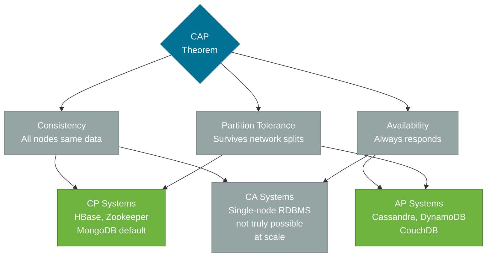
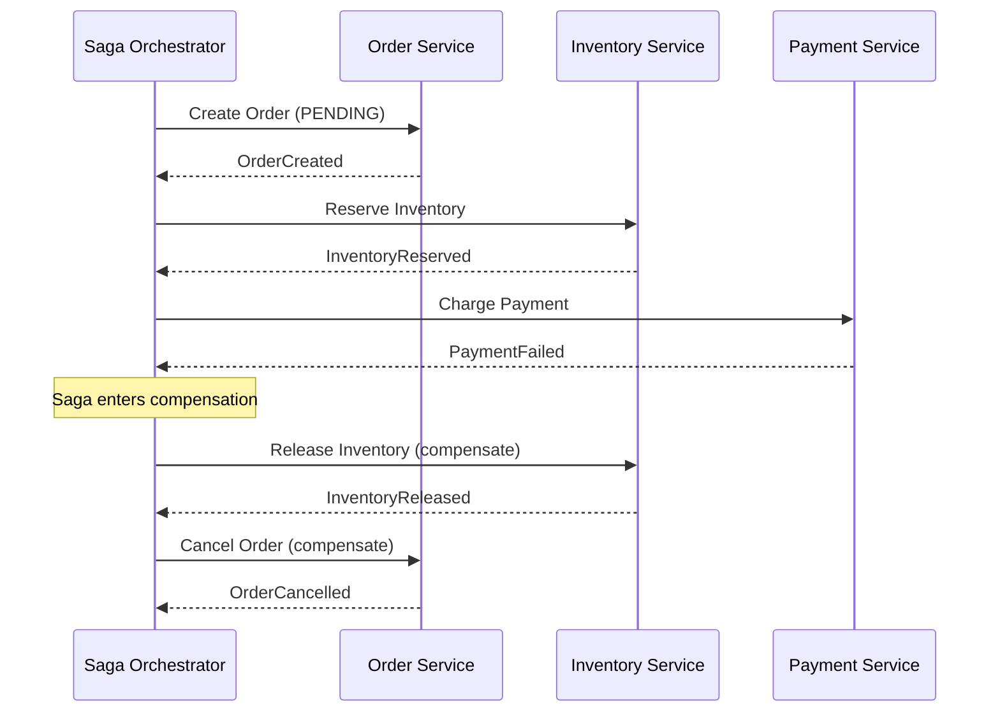

# Distributed Systems

> The theory and practice of building systems that operate across multiple networked nodes — covering CAP theorem, consistency models, idempotency, and distributed transactions using the Saga pattern.

## What Problem Does It Solve?

When a single application spans multiple processes, machines, or data centers, a new class of problems emerges that doesn't exist in a single-process application. Network partitions happen. Clocks drift. Nodes fail silently. A simple "read then write" operation that is trivially consistent on a single database becomes a multi-step distributed coordination problem.

Distributed systems theory gives engineers the vocabulary and frameworks to reason about these problems: to decide explicitly between consistency and availability, to design operations that survive failures without leaving data in an inconsistent state, and to build transaction-like guarantees across services that don't share a database.

## CAP Theorem

Eric Brewer's CAP theorem states that a distributed data store can guarantee only **two** of the following three properties simultaneously:

| Property | Meaning |
|----------|---------|
| **Consistency (C)** | Every read returns the most recent write or an error — all nodes see the same data at the same time |
| **Availability (A)** | Every request receives a response (not an error), though the response might not be the latest data |
| **Partition Tolerance (P)** | The system continues operating despite network partitions (communication failures between nodes) |



*Caption: CAP theorem trade-off triangle — in a real distributed system, network partitions are inevitable, so the real choice is CP (sacrifice availability) vs AP (sacrifice consistency).*

### The Real-World Implication

In practice, **network partitions always happen** — a switch fails, a network segment is congested, a cloud availability zone goes down. Therefore Partition Tolerance is not optional; the real choice is:

- **CP (Consistency over Availability)**: during a partition, refuse requests that can't be served with guaranteed consistent data. The system is unavailable rather than serving stale data. *Example: A bank balance query — better to return an error than a stale balance.*
- **AP (Availability over Consistency)**: during a partition, serve the best data available (possibly stale). The system stays up but consistency is eventual. *Example: A product catalog — better to show slightly stale prices than a 503 error.*

:::info
CAP is not a binary choice between two extremes. The PACELC model extends CAP to also describe the latency vs consistency trade-off when there is *no* partition. Real systems sit on a spectrum.
:::

## Consistency Models

Beyond CAP, distributed systems offer a spectrum of consistency models:

| Level | Definition | Example |
|-------|------------|---------|
| **Strict Consistency** | All reads see all previous writes instantly. Impossible across multiple nodes without unrealistic synchronization. | Single-node RDBMS |
| **Linearizability** | Operations appear to execute atomically at a single point in time. Strongest practical guarantee. | Zookeeper, etcd |
| **Sequential Consistency** | All nodes see operations in the same order, but not necessarily in real-time. | — |
| **Causal Consistency** | Operations related by cause-and-effect are seen in the correct order; unrelated operations may differ. | Cassandra (with sessions) |
| **Eventual Consistency** | If no new updates occur, all copies eventually converge to the same value. | DynamoDB default, Cassandra default |
| **Read-Your-Writes** | After a write, the same client always sees their write on subsequent reads. | Spring Session, sticky reads |

The most relevant for Spring Boot/microservices developers is **eventual consistency** — what emerges from database-per-service with async event-driven communication.

## Idempotency

An operation is **idempotent** if applying it multiple times has the same effect as applying it once.

```
f(f(x)) = f(x)
```

Idempotency is critical in distributed systems because:
- Retries are required to handle transient failures
- At-least-once delivery (Kafka's default guarantee) means messages may be delivered more than once
- Network failures after a successful operation may cause the caller to retry a request that already succeeded

### Making Operations Idempotent

```java
// ❌ Non-idempotent: calling twice creates two orders
@PostMapping("/orders")
public OrderResponse createOrder(@RequestBody PlaceOrderRequest req) {
    return orderService.placeOrder(req);
}

// ✅ Idempotent with Idempotency-Key header
@PostMapping("/orders")
public ResponseEntity<OrderResponse> createOrder(
        @RequestHeader("Idempotency-Key") String idempotencyKey,
        @RequestBody PlaceOrderRequest req) {

    // ← Check Redis/DB for a previously stored result for this key
    Optional<OrderResponse> existing = idempotencyStore.find(idempotencyKey);
    if (existing.isPresent()) {
        return ResponseEntity.ok(existing.get()); // ← return stored result, don't re-execute
    }

    OrderResponse response = orderService.placeOrder(req);
    idempotencyStore.save(idempotencyKey, response, Duration.ofHours(24)); // ← store atomically
    return ResponseEntity.status(HttpStatus.CREATED).body(response);
}
```

### Idempotent Kafka Consumer

```java
@KafkaListener(topics = "orders.placed")
public void onOrderPlaced(OrderPlacedEvent event) {
    // ← Check if we've already processed this event ID
    if (processedEventRepository.existsById(event.getEventId())) {
        log.info("Duplicate event {}, skipping", event.getEventId());
        return; // ← idempotency guard
    }

    inventoryService.decrementStock(event.getProductId(), event.getQuantity());

    processedEventRepository.save(new ProcessedEvent(event.getEventId()));
    // ← Mark as processed AFTER the operation (at-least-once semantics)
}
```

## Distributed Transactions: The Saga Pattern

In a microservices architecture with database-per-service, you cannot use a single ACID transaction across services. The Saga pattern provides an alternative: a sequence of local transactions, each pair with a **compensating transaction** that undoes the effect if a later step fails.



*Caption: Orchestration Saga — a central orchestrator drives each step forward; on failure it issues compensating commands in reverse order to roll back the earlier steps.*

### Choreography vs Orchestration

| | Choreography | Orchestration |
|-|-------------|---------------|
| **How** | Each service listens for events and reacts | A central orchestrator tells each service what to do |
| **Coupling** | Services know what events to emit and consume | Services only know their own operation; orchestrator knows the flow |
| **Observability** | Distributed across all services — hard to trace the overall saga state | Centralized in the orchestrator — easy to see saga state |
| **Failure handling** | Each service must emit compensation events | Orchestrator issues compensating commands |
| **Best for** | Simple sagas with 2–3 steps | Complex sagas with many steps or branching logic |

### Choreography Saga Example

```java
// Order Service (publishes event, doesn't know about Inventory)
@Service
class OrderService {
    public Order placeOrder(PlaceOrderRequest req) {
        Order order = orderRepository.save(Order.pending(req));
        eventPublisher.publish(new OrderPlacedEvent(order.getId(), order.getItems()));
        // ← publishes OrderPlaced event; Inventory Service will react
        return order;
    }
}

// Inventory Service (consumes OrderPlaced, publishes InventoryReserved or InventoryFailed)
@KafkaListener(topics = "orders.placed")
class InventoryEventHandler {
    public void onOrderPlaced(OrderPlacedEvent event) {
        try {
            inventoryService.reserve(event.getItems());
            publisher.publish(new InventoryReservedEvent(event.getOrderId()));
        } catch (InsufficientStockException e) {
            publisher.publish(new InventoryReservationFailedEvent(event.getOrderId()));
            // ← Order Service must listen for this and cancel the order
        }
    }
}
```

## Distributed Clocks and Ordering

Physical clocks across distributed nodes drift — you cannot rely on timestamps to determine the order of events. Two key tools:

**Logical Clocks (Lamport Timestamps)**: each message carries a monotonically increasing counter. On receive, take `max(local, received) + 1`. This captures happens-before relationships without wall clock agreement.

**Vector Clocks**: an array of counters, one per node. Allows detecting concurrent events and establishing causal relationships more precisely than Lamport timestamps.

In practice, for Spring Boot microservices: sort events by a **sequence number** from the message broker (Kafka offset, database sequence) rather than wall clock timestamps.

## Best Practices

- **Design for idempotency from the start**: every state-changing operation in a distributed system will eventually be retried. Retrofit is painful.
- **Use correlation IDs and event IDs**: every event should carry a unique `eventId` (UUID) and the `correlationId` of the originating request, to enable deduplication and distributed tracing.
- **Choose AP or CP explicitly**: don't stumble into eventual consistency by accident. Make the trade-off a conscious team decision for each domain.
- **Keep sagas short**: a saga spanning 7 services with complex compensation logic is a maintenance nightmare. If you need that many steps, consider whether the service boundaries are wrong.
- **Compensating transactions are not rollbacks**: a compensation undoes the business effect (cancel an order), but the ledger of past events is append-only. Never physically delete committed data as compensation.
- **Test failure scenarios**: use Testcontainers to start real Kafka + databases; write integration tests that force failures mid-saga and verify compensations execute correctly.

## Common Pitfalls

**Assuming timestamps are ordered across services** — Service A records `2026-03-08T10:00:00.000Z` and Service B records `2026-03-08T09:59:59.999Z`, but B's event actually happened after A's. Use message broker offsets, not wall clocks, for ordering.

**Ignoring idempotency in compensation transactions** — compensating transactions can also be retried. A "cancel order" that creates duplicate cancellations causes its own consistency problem. Compensations must also be idempotent.

**Long-running sagas without timeouts** — a saga waiting on an external payment provider that never responds blocks resources forever. Add a saga timeout that triggers compensation after a max wait duration.

**Using two-phase commit (2PC) across microservices** — 2PC is a synchronous protocol that creates tight coupling and becomes a bottleneck. Saga is the microservices-appropriate alternative, accepting eventual consistency in exchange for availability and autonomy.

## Interview Questions

### Beginner

**Q:** What does the CAP theorem state?
**A:** A distributed data store can guarantee only two of three properties simultaneously: Consistency (every read returns the latest write), Availability (every request gets a response), and Partition Tolerance (the system works despite network failures). Since network partitions are unavoidable, the real choice is CP (consistent but may be unavailable during partitions) vs AP (always available but may return stale data).

**Q:** What is eventual consistency?
**A:** Eventual consistency means that if no new updates are made, all copies of the data will eventually converge to the same state. There's no guarantee of when, but they will converge. It's the default consistency model in most distributed message-passing systems and is common in microservices with event-driven communication.

### Intermediate

**Q:** What is the Saga pattern and why is it needed?
**A:** The Saga pattern replaces distributed ACID transactions (which aren't possible across microservices with separate databases) with a sequence of local transactions. Each step has a compensating transaction that undoes its effect if a later step fails. This allows you to maintain data consistency across services without tight coupling or shared databases. Two variants exist: choreography (services react to events) and orchestration (a central saga orchestrator coordinates steps).

**Q:** What is idempotency and why is it critical in distributed systems?
**A:** An idempotent operation produces the same result regardless of how many times it's applied. In distributed systems, messages can be delivered more than once (at-least-once delivery), network failures cause retries, and systems restart in mid-operation. Without idempotency, retries create duplicates (double charges, duplicate orders). Implement it with an idempotency key: on first receipt, execute and store the result; on repeat receipt, return the stored result without re-executing.

**Q:** What is the difference between CP and AP systems? Give examples.
**A:** CP systems (like ZooKeeper, HBase) choose consistency over availability during partitions — they refuse requests that can't be served with current consensus. AP systems (like Cassandra, DynamoDB) choose availability — they serve requests even during partitions, potentially returning stale data. Use CP for financial data, user authentication, and inventory that can't have stale reads. Use AP for product catalogs, recommendation data, and metrics that tolerate slight staleness.

### Advanced

**Q:** How would you implement a choreography-based Saga for an e-commerce order placement across Order, Inventory, and Payment services?
**A:** 
1. **Order Service** receives `POST /orders`, creates an order in `PENDING` state, publishes `OrderPlaced` event to Kafka.
2. **Inventory Service** subscribes to `OrderPlaced`, attempts to reserve stock. On success, publishes `InventoryReserved`. On failure, publishes `InventoryFailed`.  
3. **Payment Service** subscribes to `InventoryReserved`, charges the customer. On success, publishes `PaymentCompleted`. On failure, publishes `PaymentFailed`.  
4. **Order Service** subscribes to `PaymentCompleted` → marks order `CONFIRMED`; subscribes to `InventoryFailed` or `PaymentFailed` → marks order `CANCELLED`.
5. **Inventory Service** subscribes to `PaymentFailed` → releases reserved stock.

Each handler is idempotent (checks event ID before processing). The saga state is implicit in order status — no central state machine needed.

**Q:** How do you handle a saga that is stuck waiting for a downstream service that never responds?
**A:** Implement a **saga timeout** using a scheduled job or a message with a TTL. When an order has been in `PENDING` state for more than (e.g.) 15 minutes without a payment confirmation, a saga timeout handler fires, triggers compensation (release inventory, cancel order), and marks the saga as `TIMED_OUT`. Expose the reason in the order response so the client can retry or inform the user. Use a distributed scheduler (Quartz, Spring Batch, or a Kafka delayed topic) to fire the timeout reliably, not an in-memory `ScheduledExecutorService` which won't survive restarts.

## Further Reading

- [Baeldung — Distributed Transactions with Saga](https://www.baeldung.com/transactions-across-microservices) — practical Saga implementation in Spring Boot
- [Resilience4j Documentation](https://resilience4j.readme.io/docs) — reliability patterns that complement the distributed systems theory covered here

## Related Notes

- [Microservices](./microservices.md) — CAP theorem, eventual consistency, and the Saga pattern are the theoretical underpinning of microservices data decisions.
- [Reliability Patterns](./reliability-patterns.md) — circuit breakers and retries are the practical handling of the failures that distributed systems theory predicts will occur.
- [Caching Strategies](./caching-strategies.md) — cache consistency models (TTL, invalidation) are a direct application of distributed systems consistency thinking.
