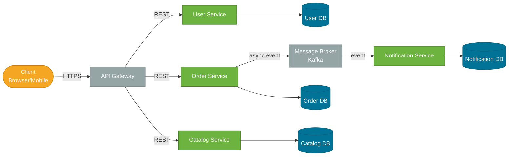
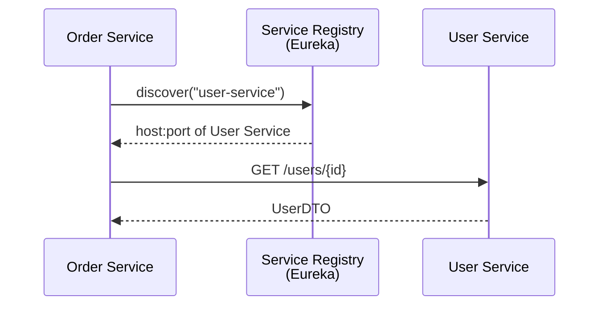

# Microservices

> An architectural style that structures an application as a suite of small, independently deployable services — each with a single business responsibility, its own data store, and communicating over lightweight APIs or messaging.

## What Problem Does It Solve?

As applications grow, the monolith becomes a liability. A single-WAR deployment means a bug in the reporting module can bring down the payment module. A team working on the user profile service must coordinate every release with the team working on product search. Scaling the checkout page requires scaling the entire application — including unrelated services.

Microservices decompose the monolith along business boundaries. Each service deploys, scales, and fails independently. A team owns a service end to end — from the database schema to the API contract. The goal is to maximize team autonomy and minimize blast radius when things go wrong.

## What Is It?

A **microservice** is a small, autonomous service that:
- Does **one thing** and does it well (bounded context, per Domain-Driven Design)
- Owns its own data store — no shared databases between services
- Communicates with other services via APIs (REST, gRPC) or messaging (Kafka, RabbitMQ)
- Deploys independently — a change to one service doesn't require redeploying others
- Fails independently — a failing service degrades gracefully rather than crashing everything

### Analogy

Think of a restaurant. A monolith is like a single chef who cooks all courses, takes orders, manages the wine list, and handles billing. If the chef calls in sick, the restaurant closes. Microservices are like individual specialists — a head chef, a sommelier, a cashier — each doing one job. If the sommelier is unavailable, diners still eat; they just don't get wine recommendations.

## How It Works

### Service Decomposition

Services are identified along **bounded contexts** from Domain-Driven Design (DDD). The boundary for a `UserService` includes everything about user identity and authentication. The `OrderService` owns order lifecycle. They communicate but don't share tables.



*Caption: Typical microservices topology — an API Gateway routes external requests; each service owns its own database; async events (Kafka) decouple services that don't need a synchronous response.*

### Communication Patterns

| Pattern | When to use | Technology |
|---------|-------------|-----------|
| **Synchronous REST** | Query needs immediate response (user login, price lookup) | Spring MVC, Spring WebFlux, Feign |
| **Synchronous gRPC** | High-throughput internal calls, strict schema contracts | gRPC + Protocol Buffers |
| **Async messaging** | Commands that don't need an immediate answer (send email, update inventory) | Kafka, RabbitMQ |
| **Event-driven** | Notifying other services about state changes (order placed, user registered) | Kafka topics / Spring Events |

### Service Discovery

Services don't hard-code each other's addresses. A **service registry** (Eureka, Consul) lets each service register itself on startup and discover others by name.



*Caption: Service discovery — Order Service asks the registry for User Service's address at runtime instead of hard-coding it, enabling zero-downtime deployments and horizontal scaling.*

### Data Management: Database per Service

Each service has its own schema or database. This is not optional — shared databases create hidden coupling that undermines independent deployment.

**Challenges this creates:**
- Joins across service boundaries don't exist — you compose data in the API layer or via events
- Transactions that span multiple services require the [Saga pattern](./distributed-systems.md)
- Eventual consistency becomes the default, not the exception

### Eventual Consistency

When Order Service places an order and Inventory Service must decrement stock, both services can't participate in a single ACID transaction. Instead:

1. Order Service emits an `OrderPlaced` event to Kafka
2. Inventory Service consumes the event and decrements stock
3. A short window exists where the order is placed but inventory isn't yet decremented — this is **eventual consistency**

The system is always moving toward a consistent state, but that state isn't always instantaneous.

## Code Examples

### Minimal Spring Boot Microservice

```java
@SpringBootApplication
public class OrderServiceApplication {
    public static void main(String[] args) {
        SpringApplication.run(OrderServiceApplication.class, args);
    }
}

@RestController
@RequestMapping("/orders")
class OrderController {
    private final OrderService orderService;

    OrderController(OrderService orderService) {
        this.orderService = orderService;
    }

    @PostMapping
    @ResponseStatus(HttpStatus.CREATED)
    public OrderResponse placeOrder(@RequestBody @Valid PlaceOrderRequest req) {
        return orderService.placeOrder(req);
    }
}
```

### Calling Another Service with RestClient (Spring Boot 3.2+)

```java
@Service
class UserServiceClient {
    private final RestClient restClient;

    UserServiceClient(RestClient.Builder builder) {
        this.restClient = builder
            .baseUrl("http://user-service") // ← resolved by service discovery
            .build();
    }

    public UserDto getUser(Long userId) {
        return restClient.get()
            .uri("/users/{id}", userId)
            .retrieve()
            .body(UserDto.class); // ← throws RestClientException on 4xx/5xx
    }
}
```

### Publishing a Domain Event (Kafka)

```java
@Service
@RequiredArgsConstructor
class OrderService {
    private final OrderRepository orderRepository;
    private final KafkaTemplate<String, OrderPlacedEvent> kafkaTemplate;

    public OrderResponse placeOrder(PlaceOrderRequest req) {
        Order order = orderRepository.save(Order.from(req)); // ← persist first

        kafkaTemplate.send("orders.placed",         // ← topic name
            order.getId().toString(),               // ← partition key
            new OrderPlacedEvent(order.getId(), order.getUserId(), order.getTotal())
        );  // ← fire-and-forget; Inventory Service consumes asynchronously

        return OrderResponse.from(order);
    }
}
```

### application.yml

```yaml
spring:
  application:
    name: order-service          # ← registers under this name in Eureka
  datasource:
    url: jdbc:postgresql://localhost:5432/orders  # ← owned DB schema
  kafka:
    bootstrap-servers: localhost:9092
    producer:
      key-serializer: org.apache.kafka.common.serialization.StringSerializer
      value-serializer: org.springframework.kafka.support.serializer.JsonSerializer

eureka:
  client:
    service-url:
      defaultZone: http://localhost:8761/eureka/
```

## Trade-offs & When To Use / Avoid

| | Pros | Cons |
|--|------|------|
| **Deployment** | Deploy each service independently; zero downtime updates | Multiple services to build, test, and deploy; DevOps overhead |
| **Scalability** | Scale only the bottleneck service (e.g., scale search without scaling checkout) | Need container orchestration (Kubernetes) to manage effectively |
| **Team autonomy** | Each team owns a service end-to-end; no coordination for releases | Cross-service features require multiple team coordination |
| **Fault isolation** | A failed Notification Service doesn't take down Order Service | Distributed failures are harder to debug; need distributed tracing |
| **Technology choice** | Each service can use the best-fit language or database | Polyglot complexity; harder to enforce standards |
| **Data** | Services are decoupled at the data layer | No cross-service joins; eventual consistency adds complexity |

**Use microservices when:**
- You have multiple teams that need to deploy independently
- Different parts of the system have dramatically different scaling needs
- You have a proven monolith you're decomposing (strangler fig pattern)

**Avoid microservices when:**
- You're building a new product with a small team (start with a modular monolith)
- Your team lacks container and distributed systems expertise
- The domain boundaries aren't clear yet — premature decomposition makes things worse

## Best Practices

- **Design for failure**: every service-to-service call can fail. Wrap synchronous calls with a [circuit breaker](./reliability-patterns.md) (Resilience4j).
- **API versioning from day one**: services evolve independently; `GET /v1/orders` ensures backwards compatibility.
- **Avoid synchronous chains**: `A → B → C → D` in a single request multiplies latency and failure probability. Break chains with async messaging.
- **Centralize cross-cutting concerns**: authentication, rate limiting, and request logging belong in the API Gateway, not in every service.
- **Use correlation IDs**: attach a `X-Correlation-Id` header to every request so distributed traces can be assembled.
- **Contract testing**: use tools (Pact) to verify the API contract between a consumer and a provider before deployment, not just at integration test time.

## Common Pitfalls

**Distributed monolith**: services that are deployed separately but share a database or are so tightly coupled that they must deploy together. You get all the complexity of microservices with none of the independence benefits.

**Too many services too early**: decomposing before the domain is understood results in services with the wrong boundaries. Wrong service boundaries are expensive to fix later.

**Chatty synchronous calls**: over-relying on synchronous REST for coordination creates a dependency chain. A single user request can fan out to 10+ service calls, each adding latency and failure risk.

**Ignoring operational complexity**: microservices require centralized logging (ELK/Loki), distributed tracing (Zipkin/Jaeger), and health monitoring (Prometheus/Grafana). Skipping observability makes production debugging nearly impossible.

**Not owning the database**: two services sharing a database is the most common microservices anti-pattern. It prevents independent deployments and creates hidden coupling through schema changes.

## Interview Questions

### Beginner

**Q:** What is a microservice?
**A:** A small, independently deployable service that focuses on a single business capability, owns its own database, and communicates with other services via APIs or messaging.

**Q:** What is the difference between a monolith and microservices?
**A:** A monolith is a single deployable unit containing all functionality. Microservices split that functionality into separate services, each deployed independently. Monoliths are simpler to develop initially but become harder to scale and maintain as they grow. Microservices add operational complexity but allow independent scaling and deployment.

### Intermediate

**Q:** What is database-per-service and why does it matter?
**A:** Each microservice owns its own schema or database, and no other service directly accesses it. This prevents hidden coupling through shared tables — a schema change in one service won't break another. The trade-off is that distributed queries must be composed at the API layer or via async events, and cross-service transactions require the Saga pattern instead of ACID.

**Q:** How do microservices handle inter-service communication failures?
**A:** With resilience patterns: circuit breakers (Resilience4j) stop sending requests to a failing service and return a fallback; retries with exponential backoff handle transient failures; timeouts prevent request threads from blocking indefinitely. For async communication (Kafka), the message broker buffers messages, so the producing service isn't blocked by a slow consumer.

**Q:** What is eventual consistency and when is it acceptable?
**A:** Eventual consistency means that after all messages are processed, all services will reflect the same state — but there's a window where they're temporarily out of sync. It's acceptable for non-critical paths (sending a welcome email after registration) but not for financial transactions requiring strong consistency. The choice between eventual and strong consistency is a business decision, not a technical one.

### Advanced

**Q:** How would you decompose a monolith into microservices without a big-bang rewrite?
**A:** Use the **Strangler Fig pattern**: build new features as separate microservices, and progressively replace existing monolith modules. An API Gateway routes requests — new endpoints go to microservices, legacy endpoints go to the monolith. Over time the monolith shrinks as functionality migrates. This avoids a risky big-bang cutover and lets you validate each extracted service before moving on.

**Q:** How do you handle a distributed transaction across two services (e.g., Order and Inventory) without a shared database?
**A:** Use the **Saga pattern**. In the choreography variant, each service listens for an event, performs its local transaction, and emits the next event. If a step fails, compensating transactions roll back prior steps. In the orchestration variant, a central Saga orchestrator tells each service what to do and handles compensation on failure. The Saga pattern accepts eventual consistency — the system eventually reaches a consistent state, but there's a window during the saga where it's partially applied.

## Further Reading

- [Spring Boot Microservices Guide — Baeldung](https://www.baeldung.com/spring-microservices-guide) — practical Spring Boot setup for service discovery, Feign clients, and config server
- [Spring Boot Reference — Production-Ready Features](https://docs.spring.io/spring-boot/docs/current/reference/html/actuator.html) — health checks, metrics, and tracing with Spring Boot Actuator

## Related Notes

- [Reliability Patterns](./reliability-patterns.md) — every synchronous service-to-service call in a microservices topology needs a circuit breaker and retry strategy.
- [Distributed Systems](./distributed-systems.md) — CAP theorem, consistency models, and the Saga pattern are the theoretical grounding for microservices data decisions.
- [Caching Strategies](./caching-strategies.md) — caching reduces inter-service call volume and is a key microservices performance technique.
- [SOLID Principles](./solid-principles.md) — microservice decomposition is SRP applied at the service level: one bounded context per service.
