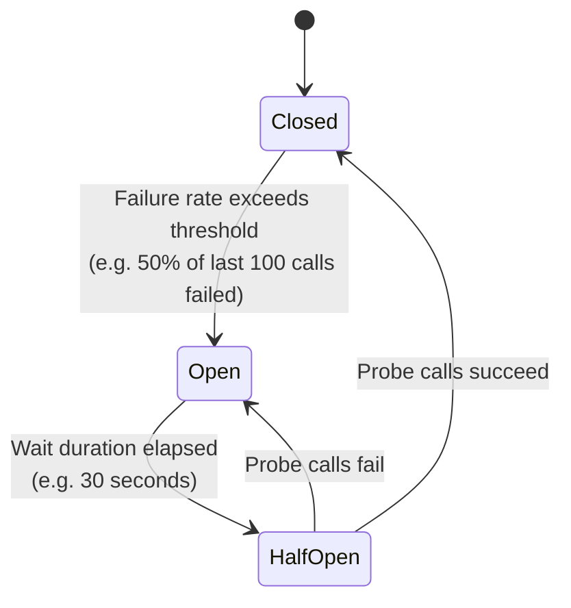
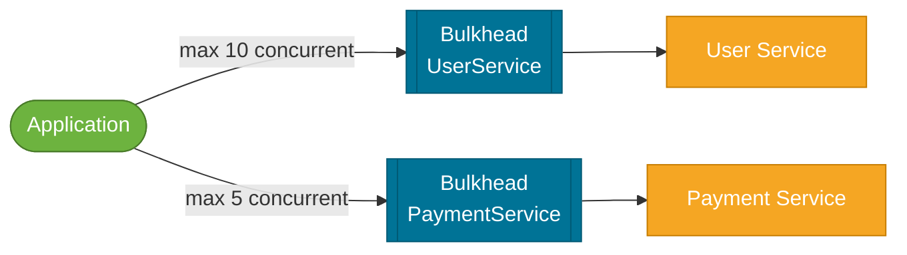
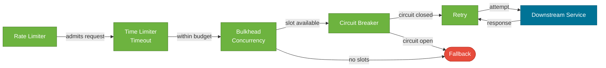

# Reliability Patterns

> A set of defensive patterns — Circuit Breaker, Retry, Bulkhead, Timeout, and Rate Limiter — that prevent a single service failure from cascading through a distributed system, implemented in Java/Spring Boot with Resilience4j.

## What Problem Does It Solve?

In a distributed system, remote calls fail. Network timeouts, dependency service restarts, database connection exhaustion — any call across a network boundary can fail or hang. Without protection, a slow downstream service causes threads to pile up waiting for responses, exhausting the thread pool, which then causes the calling service to time out for *its* callers, and so on up the dependency chain. This **cascading failure** can bring down an entire system because of one slow microservice.

Reliability patterns are circuit breakers, retries, and bulkheads built into the calling code itself — the service doesn't need to trust that its dependencies are always available. They make individual services resilient in the face of unreliable dependencies.

## The Five Patterns

### Circuit Breaker

A circuit breaker monitors calls to a dependency. When the failure rate crosses a threshold, the breaker **opens** — subsequent calls are rejected immediately (fast-fail) without even attempting the downstream call. After a wait window, the breaker moves to **half-open**: a few probe requests are let through. If they succeed, the breaker **closes** again.



*Caption: Circuit breaker state machine — the breaker protects downstream dependencies by fast-failing in the Open state, then cautiously re-testing in Half-Open.*

**Key benefit**: prevents threads from blocking on a known-failing dependency. The fast-fail response is returned in microseconds instead of waiting for a network timeout.

### Retry

Retries handle **transient failures** — network blips, brief service restarts, database connection pool exhaustion that resolves in milliseconds. A retry policy specifies how many times to retry, with what delay, and for which exception types.

:::warning
Retry without a **Circuit Breaker** can amplify a failing service's load. If 100 requests fail and each retries 3 times, the failing service receives 400 requests. Always combine Retry + Circuit Breaker.
:::

### Bulkhead

A bulkhead limits the number of **concurrent** calls to a dependency. Named after ship bulkheads that partition the hull into watertight compartments — if one compartment floods, others stay dry.

Two implementations:
- **Semaphore Bulkhead** (thread pool shared): limits concurrent calls via a semaphore count
- **Thread Pool Bulkhead**: dedicated thread pool per downstream service; the calling thread is freed immediately



*Caption: Bulkhead isolation — a slow Payment Service consuming all 5 of its bulkhead slots doesn't starve User Service calls, which have their own independent slot pool.*

### Timeout

Set a maximum duration for a call. If the downstream service doesn't respond in time, cancel the call and return a fallback. Timeouts are foundational — without them, a hung dependency occupies a thread indefinitely.

:::tip
Set timeouts at every point in the call chain. If Service A calls B calls C, and C has a 30s timeout, B has a 20s timeout, and A has a 10s timeout — the outer timeouts are always tighter than the inner ones.
:::

### Rate Limiter

Controls the **rate** at which your service calls a downstream dependency (or the rate at which clients call your service). Protects the downstream from being overwhelmed by your service during retries or traffic spikes.

## Resilience4j in Spring Boot

Resilience4j is the recommended resilience library for Spring Boot (replacing Hystrix, which is no longer maintained).

### Setup (Spring Boot 3)

```xml
<dependency>
    <groupId>io.github.resilience4j</groupId>
    <artifactId>resilience4j-spring-boot3</artifactId>
    <version>2.2.0</version>
</dependency>
<dependency>
    <groupId>org.springframework.boot</groupId>
    <artifactId>spring-boot-starter-aop</artifactId>  <!-- ← required for annotations -->
</dependency>
<dependency>
    <groupId>org.springframework.boot</groupId>
    <artifactId>spring-boot-starter-actuator</artifactId>  <!-- for health/metrics -->
</dependency>
```

### Configuration (application.yml)

```yaml
resilience4j:
  circuitbreaker:
    instances:
      userService:
        sliding-window-type: COUNT_BASED          # ← COUNT_BASED or TIME_BASED
        sliding-window-size: 10                   # ← observe last 10 calls
        failure-rate-threshold: 50                # ← open if 50%+ of calls fail
        wait-duration-in-open-state: 30s          # ← stay open for 30 seconds
        permitted-number-of-calls-in-half-open-state: 3  # ← probe 3 calls in HALF-OPEN
        automatic-transition-from-open-to-half-open-enabled: true

  retry:
    instances:
      userService:
        max-attempts: 3                           # ← try 3 times total
        wait-duration: 500ms                      # ← 500ms between retries
        exponential-backoff-multiplier: 2         # ← double wait on each retry
        retry-exceptions:
          - java.io.IOException
          - java.util.concurrent.TimeoutException
        ignore-exceptions:
          - com.example.exceptions.UserNotFoundException  # ← don't retry on 404

  bulkhead:
    instances:
      userService:
        max-concurrent-calls: 10                  # ← max 10 parallel calls
        max-wait-duration: 0ms                    # ← don't queue; fail fast

  timelimiter:
    instances:
      userService:
        timeout-duration: 2s                      # ← cancel if no response in 2s

  ratelimiter:
    instances:
      userService:
        limit-for-period: 100                     # ← 100 calls per refresh period
        limit-refresh-period: 1s                  # ← refresh every second
        timeout-duration: 0ms                     # ← don't queue; reject immediately
```

### Annotation-Driven Usage

```java
@Service
public class UserServiceClient {

    private final RestClient restClient;

    // ✅ Annotation decorators are applied in order: TimeLimiter → CircuitBreaker → Retry → Bulkhead
    @CircuitBreaker(name = "userService", fallbackMethod = "getUserFallback")
    @Retry(name = "userService")
    @Bulkhead(name = "userService")
    public UserDto getUser(Long userId) {
        return restClient.get()
            .uri("/users/{id}", userId)
            .retrieve()
            .body(UserDto.class);
    }

    // ✅ Fallback: same return type, extra Throwable parameter
    public UserDto getUserFallback(Long userId, Exception ex) {
        log.warn("Circuit open for user {}, returning stub. Cause: {}", userId, ex.getMessage());
        return UserDto.stub(userId);  // ← return a safe default, not null
    }
}
```

### Programmatic Usage (when annotations aren't flexible enough)

```java
@Service
public class InventoryServiceClient {

    private final CircuitBreaker circuitBreaker;
    private final Retry retry;

    public InventoryServiceClient(CircuitBreakerRegistry cbRegistry,
                                   RetryRegistry retryRegistry) {
        this.circuitBreaker = cbRegistry.circuitBreaker("inventoryService");
        this.retry          = retryRegistry.retry("inventoryService");
    }

    public int getStock(Long productId) {
        Supplier<Integer> decorated = Decorators
            .ofSupplier(() -> callInventoryApi(productId)) // ← the actual call
            .withCircuitBreaker(circuitBreaker)
            .withRetry(retry)
            .withFallback(List.of(CallNotPermittedException.class,
                                  IOException.class),
                          ex -> 0) // ← fallback: return 0 stock on failure
            .decorate();

        return decorated.get();
    }
}
```

### Monitoring with Actuator

Add to `application.yml`:

```yaml
management:
  endpoints:
    web:
      exposure:
        include: health,metrics,circuitbreakers
  health:
    circuitbreakers:
      enabled: true
```

`GET /actuator/health` will include circuit breaker state:

```json
{
  "components": {
    "circuitBreakers": {
      "status": "UP",
      "details": {
        "userService": {
          "status": "CIRCUIT_CLOSED",
          "details": {
            "failureRate": "10.0%",
            "bufferedCalls": 10,
            "state": "CLOSED"
          }
        }
      }
    }
  }
}
```

## Pattern Interaction

The patterns compose and reinforce each other:



*Caption: Resilience4j layered pattern stack — requests pass through Rate Limiter → Timeout → Bulkhead → Circuit Breaker → Retry before reaching the downstream service. Any layer can deflect to the fallback.*

## Trade-offs & When To Use / Avoid

| Pattern | Use when | Avoid when |
|---------|----------|-----------|
| **Circuit Breaker** | Calling external/downstream services in microservices | Calling your own in-memory components |
| **Retry** | Transient failures (network blips, brief restarts) | Non-idempotent operations without idempotency keys; permanent errors (404, 400) |
| **Bulkhead** | You have multiple downstream dependencies sharing a thread pool | Single-dependency services where isolation isn't needed |
| **Timeout** | Always — every remote call should have a timeout | No exceptions |
| **Rate Limiter** | Calling third-party APIs with quotas; protecting your service | Latency-sensitive internal calls between well-known services |

## Common Pitfalls

**Retrying non-idempotent operations**: retrying a `POST /payments` three times creates three payment charges. Guard with idempotency keys or restrict retries to `GET` and `PUT` operations only.

**Fallback hiding real errors**: silently returning a zero-stock fallback when the inventory service is down means customers can order out-of-stock items. Log and alert on fallback activations; don't treat them as normal flow.

**Open circuit staying open too long**: `wait-duration-in-open-state: 300s` means a 5-minute blackout even after a recovered service. Use shorter wait durations with automatic transition to half-open.

**Too few observations**: `sliding-window-size: 2` means two failed calls open the circuit, even if they're normal transient failures. Use at least 10–20 observations.

**Not testing fallbacks**: fallback paths are rarely exercised in integration tests. Use Resilience4j's test support to programmatically open the circuit and verify fallback behavior.

## Interview Questions

### Beginner

**Q:** What is a Circuit Breaker pattern?
**A:** A circuit breaker monitors calls to a dependency. When failures exceed a threshold, it *opens* and subsequent calls fail immediately without hitting the dependency. After a wait period, it moves to *half-open* and allows a few probe requests. If they succeed, it *closes* again. This prevents cascading failures when a downstream service is degraded.

**Q:** Why is Timeout the most fundamental reliability pattern?
**A:** Without a timeout, a thread waiting on a hung downstream service is blocked indefinitely. If enough requests pile up, the thread pool is exhausted and the calling service becomes unresponsive too. Every remote call must have a max wait duration, making Timeout the foundational safety net that all other patterns build on.

### Intermediate

**Q:** What is the difference between a Bulkhead and a Circuit Breaker?
**A:** A Circuit Breaker monitors *failure rate* and opens when the service is degraded — it prevents calls to a *failing* dependency. A Bulkhead limits *concurrent calls* — it prevents a *slow* dependency from consuming all available threads even if it's technically responding (just slowly). They solve different failure modes and are typically used together.

**Q:** When should you NOT retry a request?
**A:** Don't retry: non-idempotent operations without idempotency keys (creates duplicates); client errors (`4xx` — a bad request won't succeed on retry); when the Circuit Breaker is open (retrying an open circuit adds load with no benefit). Only retry on transient errors (`5xx`, network timeouts, `IOException`) for idempotent or idempotency-keyed operations.

**Q:** How does Resilience4j differ from Hystrix?
**A:** Hystrix used a thread-pool-per-dependency model, which improved isolation but added thread overhead. Resilience4j uses a semaphore model by default (no extra threads), is lighter weight, functional/decorator-based, more configurable, and actively maintained. Hystrix entered maintenance mode in 2018. Resilience4j is the current recommendation for Spring Boot.

### Advanced

**Q:** How would you design a circuit breaker strategy for a payment service that must never double-charge?
**A:** First, make the payment call idempotent using an `Idempotency-Key` header — the payment provider deduplicates on their side. Then configure the retry to only retry on network-level errors (`IOException`, `TimeoutException`), not on application-level errors. Set a conservative circuit breaker threshold (e.g., 30% failure rate over the last 20 calls) and a short open duration (15s) to auto-recover. The fallback should enqueue the payment for manual review, not silently discard it. Monitor fallback activations with an alert — a consistently open circuit means a systemic problem, not transient noise.

**Q:** How do you test circuit breaker behavior in a Spring Boot integration test?
**A:** Use Resilience4j's `CircuitBreakerRegistry` programmatically in the test to transition the circuit breaker to the `OPEN` state before making the call, then verify the fallback method was invoked. For component tests, `MockServer` or WireMock can simulate a downstream service returning 500 errors — run enough calls to trip the circuit breaker threshold, then assert that subsequent calls fast-fail and the fallback is returned.

## Further Reading

- [Resilience4j Official Documentation](https://resilience4j.readme.io/docs) — comprehensive configuration reference for all five patterns
- [Baeldung — Guide to Resilience4j](https://www.baeldung.com/resilience4j) — practical Spring Boot examples for circuit breaker, retry, and bulkhead

## Related Notes

- [Microservices](./microservices.md) — reliability patterns are the safety net for service-to-service calls in a microservices architecture.
- [Caching Strategies](./caching-strategies.md) — caching reduces call volume to downstream services, making circuit breakers trip less often.
- [Distributed Systems](./distributed-systems.md) — reliability patterns are the practical implementation of the CAP theorem trade-offs: you accept partial availability rather than full failure.
