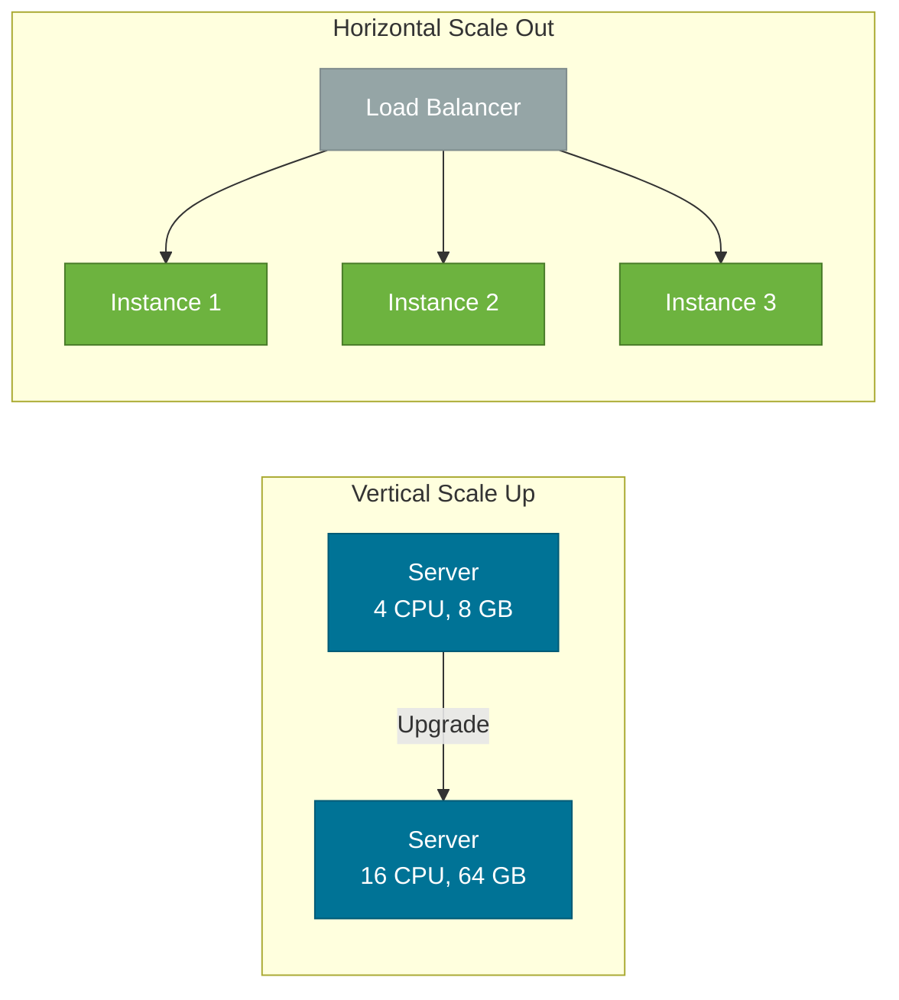
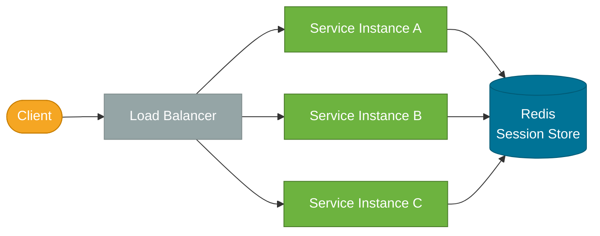
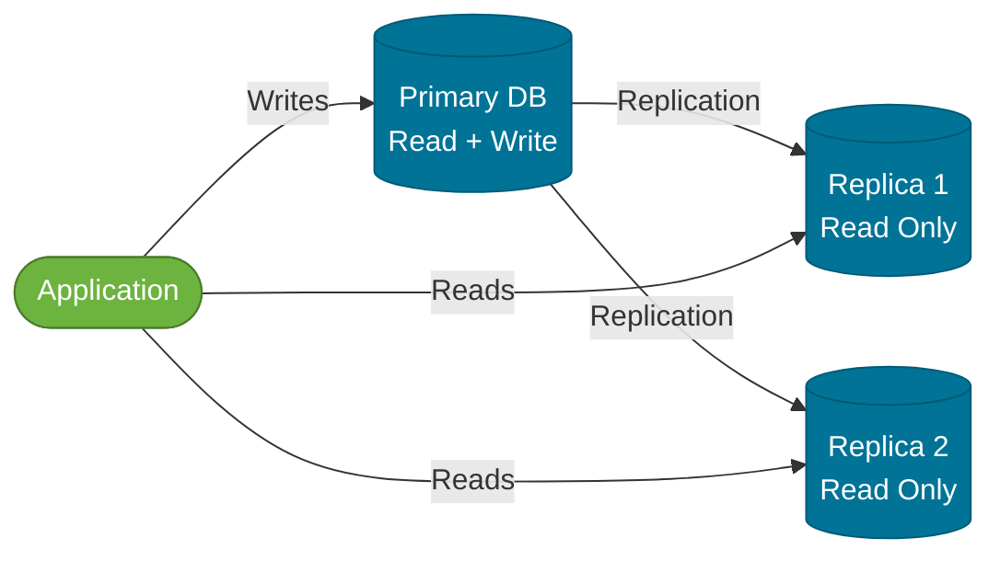
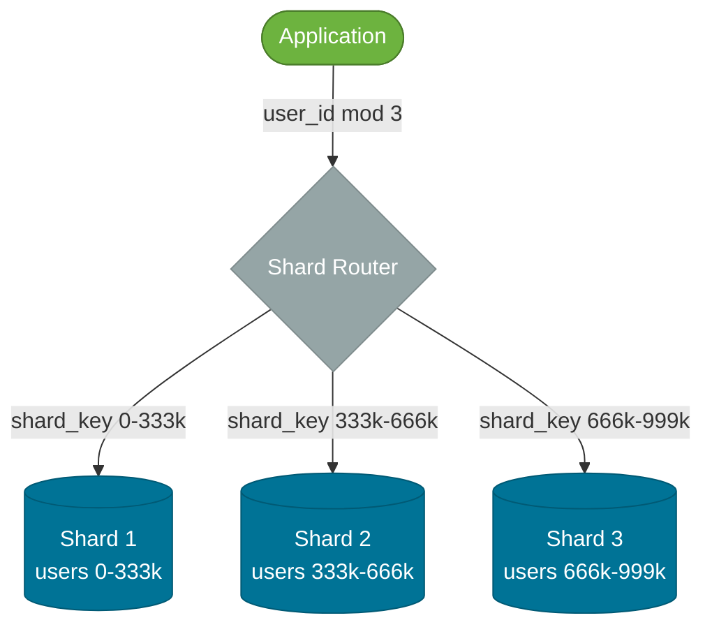
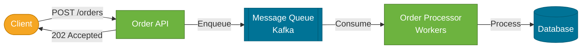

# Scalability Patterns

> The architectural strategies — stateless services, horizontal scaling, caching, read replicas, and sharding — that allow a system to serve more traffic by adding resources rather than rewriting code.

## What Problem Does It Solve?

A system that works at 100 users-per-minute may crumble at 10,000. The database becomes CPU-bound. Writes pile up in queues. The single application server runs out of memory. You can't just "make the server bigger" indefinitely — at some point you hit physical and economic limits.

Scalability is the ability to handle increased load by adding resources without fundamental redesign. The patterns here are the tools engineers use to achieve this: spreading load across many servers (horizontal scaling), ensuring those servers don't share state, offloading reads to replicas, and partitioning data across nodes when a single database node isn't enough.

## Horizontal vs Vertical Scaling

| | Vertical Scaling (Scale Up) | Horizontal Scaling (Scale Out) |
|-|-----------------------------|-------------------------------|
| **What** | Bigger machine (more CPU, RAM) | More machines (more instances) |
| **Limit** | Hardware ceiling; single point of failure | Virtually unlimited with proper architecture |
| **Cost** | Exponential as you reach high-end hardware | Linear with instance count |
| **Complexity** | Simple — just resize | Requires stateless services, load balancing |
| **Downtime** | May require restart | Rolling deploy — zero downtime |
| **Best for** | Databases with scaling headroom; legacy apps | Stateless web/API services; microservices |



*Caption: Vertical scaling has hard limits and a single point of failure; horizontal scaling behind a load balancer can grow indefinitely but requires stateless services.*

## Stateless Services

Horizontal scaling only works if every instance can handle any request. If an instance stores user session data in its own memory, a user whose request is routed to a different instance will lose their session.

A **stateless service** stores no per-user data in JVM memory. All shared state lives externally — databases, Redis, shared file stores.



*Caption: Stateless services — all instances share a Redis session store, so any instance can process any request regardless of which instance previously served that user.*

### Spring Session with Redis

```xml
<dependency>
    <groupId>org.springframework.session</groupId>
    <artifactId>spring-session-data-redis</artifactId>
</dependency>
```

```java
@SpringBootApplication
@EnableRedisHttpSession  // ← session stored in Redis, not JVM memory
public class Application { ... }
```

```yaml
spring:
  data:
    redis:
      host: redis-cluster.internal
      port: 6379
  session:
    store-type: redis
    timeout: 30m       # ← session TTL
```

With this setup, you can add or remove instances freely without losing user sessions.

## Load Balancing

A **load balancer** distributes incoming requests across multiple service instances. Types:

| Type | How it works | Use case |
|------|-------------|---------|
| **Round Robin** | Requests cycle through instances sequentially | Homogeneous instances with similar request cost |
| **Least Connections** | Route to the instance with fewest active connections | Variable-duration requests |
| **IP Hash** | Route by client IP to the same instance | When sticky sessions are required (legacy apps without Redis session) |
| **Weighted** | Instances get proportional traffic by weight | Canary deploys, gradual rollouts |

In Kubernetes, the `Service` resource provides load balancing automatically. For Spring Boot services calling each other (client-side load balancing), Spring Cloud LoadBalancer integrates with service discovery.

```java
// Spring Cloud LoadBalancer: inject a load-balanced RestClient
@Configuration
@LoadBalancerClient(name = "order-service")  // ← discovers instances from Eureka/K8s
public class LoadBalancerConfig { }

@Bean
@LoadBalanced  // ← RestClient will resolve "order-service" to a real instance
RestClient.Builder restClientBuilder() {
    return RestClient.builder();
}
```

## Read Replicas

Most production databases have far more reads than writes. A **read replica** is a copy of the primary database that serves read queries, reducing load on the primary.



*Caption: Read replicas offload read traffic from the primary — the primary serves only writes and replication, while read replicas scale read capacity.*

### Replication Lag

Replication is asynchronous. A write to the primary may take milliseconds to appear on replicas. This is **replication lag** — read-after-write consistency is not guaranteed unless you route to the primary.

**Routing strategy:**
- User-facing reads after a user's own write → route to primary (or use read-your-writes sticky routing)
- Reporting, analytics, bulk reads → route to replica
- General product catalog reads → replica is fine (data changes rarely)

### Spring Boot with Multiple DataSources

```java
@Configuration
public class DataSourceConfig {

    @Bean
    @Primary
    @ConfigurationProperties("spring.datasource.primary")
    public DataSource primaryDataSource() {
        return DataSourceBuilder.create().build();  // ← write DataSource
    }

    @Bean
    @ConfigurationProperties("spring.datasource.replica")
    public DataSource replicaDataSource() {
        return DataSourceBuilder.create().build();  // ← read DataSource
    }
}
```

```java
// Custom routing DataSource: route reads to replica, writes to primary
public class RoutingDataSource extends AbstractRoutingDataSource {
    @Override
    protected Object determineCurrentLookupKey() {
        return TransactionSynchronizationManager.isCurrentTransactionReadOnly()
            ? "replica"    // ← @Transactional(readOnly = true) routes here
            : "primary";
    }
}
```

```java
// ✅ Use readOnly = true for reads — routes to replica in RoutingDataSource
@Transactional(readOnly = true)
public List<Product> findAll() {
    return productRepository.findAll();  // ← routed to read replica
}
```

## Database Sharding

Sharding **horizontally partitions** data across multiple database nodes ("shards"). Each shard holds a subset of the data — e.g., users A–M on shard 1, users N–Z on shard 2.



*Caption: Range-based sharding — the shard router directs each query to the shard that owns that key range; each shard is a fully independent database.*

### Sharding Strategies

| Strategy | How | Pros | Cons |
|----------|-----|------|------|
| **Range-based** | Shard by key range (IDs 0–1M on shard 1) | Simple routing; range queries efficient | Hotspot risk if traffic concentrates on one range |
| **Hash-based** | `hash(key) % numShards` | Even distribution | Range queries touch all shards; rebalancing is hard |
| **Directory-based** | Lookup table maps key to shard | Flexible; supports migration | Lookup table is a single point of failure if not replicated |

### Sharding Complexity

Sharding solves write scalability but introduces operations complexity:
- **Cross-shard queries**: `JOIN` across shards is difficult or impossible — denormalize or use application-level joins
- **Rebalancing**: adding a new shard requires moving data, which is complex under live traffic
- **Transactions**: ACID transactions across shards require [distributed transaction protocols](./distributed-systems.md)

:::tip
Before sharding, exhaust all simpler options: read replicas, caching, query optimization, connection pooling, and vertical scaling. Sharding is a last resort for databases that have outgrown all other approaches.
:::

## CDN and Static Asset Scaling

For web-facing applications, static assets (JS, CSS, images) can be offloaded to a **Content Delivery Network (CDN)**. CDNs cache assets at edge nodes globally, serving them from the nearest geographic location. This reduces origin server load and improves latency for global users without any application code changes.

## Async Processing and Message Queues

Processing that doesn't need an immediate response should be moved out of the request thread and into an async queue. This is one of the most effective scalability levers for Java services.



*Caption: Async offloading — the API returns 202 Accepted immediately after enqueuing, while workers process at their own rate; scale workers independently when the queue backs up.*

Benefits:
- API response time is decoupled from processing time
- Workers can scale independently from API servers
- Queue buffers traffic spikes — workers process at a steady rate

## Best Practices

- **Design stateless first**: every service should be stateless by default; move state to Redis or the database before thinking about scaling.
- **Scale the bottleneck, not everything**: profile to find whether CPU, memory, I/O, or the database is the constraint. Scaling API servers doesn't help if the database is saturated.
- **Use connection pooling**: horizontal scaling adds more application instances, each with their own database connection pool. Without a connection pooler (HikariCP — the Spring Boot default — or PgBouncer at the DB level), you can exhaust database connections.
- **Read replica before sharding**: add a read replica and route read traffic there before considering sharding. Read replicas are operationally simple; sharding is not.
- **Monitor before you optimize**: use Prometheus/Grafana or Spring Boot Actuator metrics to identify actual bottlenecks. Premature scaling adds cost and complexity with no benefit.

## Common Pitfalls

**Sticky sessions without shared session store**: using IP hash or cookie-based affinity to route a user to "their" instance defeats the purpose of horizontal scaling. You can't remove an instance without users losing their sessions. Use Redis session stores instead.

**N+1 reads on replicas becoming expensive**: routing list queries to replicas helps, but N+1 query patterns (one query per item in a list) amplify database load. Fix N+1 first (using JOINs or `IN` clauses), then scale reads.

**Hot partitions in sharding**: choosing `userId % 3` as the shard key distributes data evenly, but if 80% of traffic comes from a few power users, those shards are hot while others are idle. Use a well-distributed shard key (a UUID or a high-cardinality field).

**Forgetting connection pool sizing**: with 10 API instances each with HikariCP `maximumPoolSize=10`, you generate 100 database connections. PostgreSQL's default `max_connections` is 100. Multiply by prod, staging, and test environments and you'll exhaust the limit fast. Tune pool sizes or use PgBouncer.

**Adding Kafka for everything**: async queues add operational complexity, delay, and eventual consistency. Only move operations off the request thread if the latency tradeoff is acceptable and the workload will actually benefit from decoupling.

## Interview Questions

### Beginner

**Q:** What is the difference between horizontal and vertical scaling?
**A:** Vertical scaling (scale up) adds more resources (CPU, RAM) to a single machine. Horizontal scaling (scale out) adds more instances of the application behind a load balancer. Vertical scaling has a physical upper limit and is a single point of failure. Horizontal scaling has virtually no ceiling but requires stateless services and a load balancer.

**Q:** What makes a service "stateless"?
**A:** A stateless service holds no per-user or per-request state in JVM memory between requests. All shared state — sessions, user data, caches — lives in an external store like Redis or a database. Any instance can handle any request, enabling horizontal scaling. Spring Session with Redis is the common pattern for managing sessions in stateless Spring Boot services.

### Intermediate

**Q:** What is a read replica and what are its limitations?
**A:** A read replica is an asynchronous copy of the primary database that serves read queries. This offloads read traffic from the primary, allowing the primary to handle more writes. Its main limitation is **replication lag** — writes take a few milliseconds to propagate, so read-after-write consistency isn't guaranteed on replicas. Route user-facing post-write reads to the primary; route analytics and catalog reads to replicas.

**Q:** When should you consider database sharding?
**A:** After exhausting all other options: caching, read replicas, query optimization, and connection pooling. Sharding is a last resort for tables that are too large for a single database node to handle under write load. Premature sharding introduces cross-shard query complexity, transaction challenges, and rebalancing headaches for problems that a well-tuned single database could handle.

**Q:** How does async processing improve scalability?
**A:** By removing long-running work from the request/response thread, the API can accept requests faster (return 202 Accepted) and workers can process at their own rate. Workers scale independently from API servers — if the queue builds up, you add more worker instances without touching the API tier. This decouples the producer (API) from the consumer (worker) and buffers traffic spikes.

### Advanced

**Q:** How would you design a scalability strategy for an order management system expected to handle 100x current traffic?
**A:** Start by profiling the current bottleneck. Typically: (1) **API tier** — ensure the service is stateless, move sessions to Redis, add instances behind a load balancer. (2) **Database reads** — add read replicas and route `@Transactional(readOnly = true)` operations to replicas. (3) **High-write throughput** — move non-critical order events to Kafka; workers process asynchronously. (4) **Caching** — cache product catalog and pricing data in Redis to reduce database hits. (5) **Connection pooling** — size HikariCP appropriately; add PgBouncer if connection count becomes a limit. (6) **Sharding** — only if write throughput has saturated the primary database after all optimizations. Instrument every layer with Prometheus/Grafana to validate each change before adding the next.

**Q:** How would you handle session management across 50 horizontally scaled Spring Boot instances without sticky sessions?
**A:** Use Spring Session with Redis. Add `spring-session-data-redis` and `@EnableRedisHttpSession`. The session is stored in Redis with the session ID in a cookie. All 50 instances connect to the same Redis cluster — any instance can read any session by ID. For Redis availability, use a Redis Cluster or Sentinel for HA. For security, ensure the session cookie is `HttpOnly`, `Secure`, and `SameSite=Lax`, and that the Redis cluster is not publicly accessible.

## Further Reading

- [Spring Session Documentation](https://docs.spring.io/spring-session/reference/) — official guide for Redis-backed session management in Spring Boot
- [Baeldung — Spring Boot Clustering](https://www.baeldung.com/spring-boot-clustering) — practical patterns for stateless Spring Boot service clusters
- [HikariCP GitHub](https://github.com/brettwooldridge/HikariCP) — HikariCP configuration and pool sizing guidance

## Related Notes

- [Microservices](./microservices.md) — microservices architecture makes horizontal scaling possible by splitting the monolith into independently scalable services.
- [Caching Strategies](./caching-strategies.md) — caching is the highest-impact scalability lever before reaching infrastructure scaling solutions.
- [Distributed Systems](./distributed-systems.md) — sharding and eventual consistency are core distributed systems concepts directly applied in scalability patterns.
- [Reliability Patterns](./reliability-patterns.md) — a scaled-out system with multiple instances is more exposed to partial failures; reliability patterns complement the scaling patterns.
