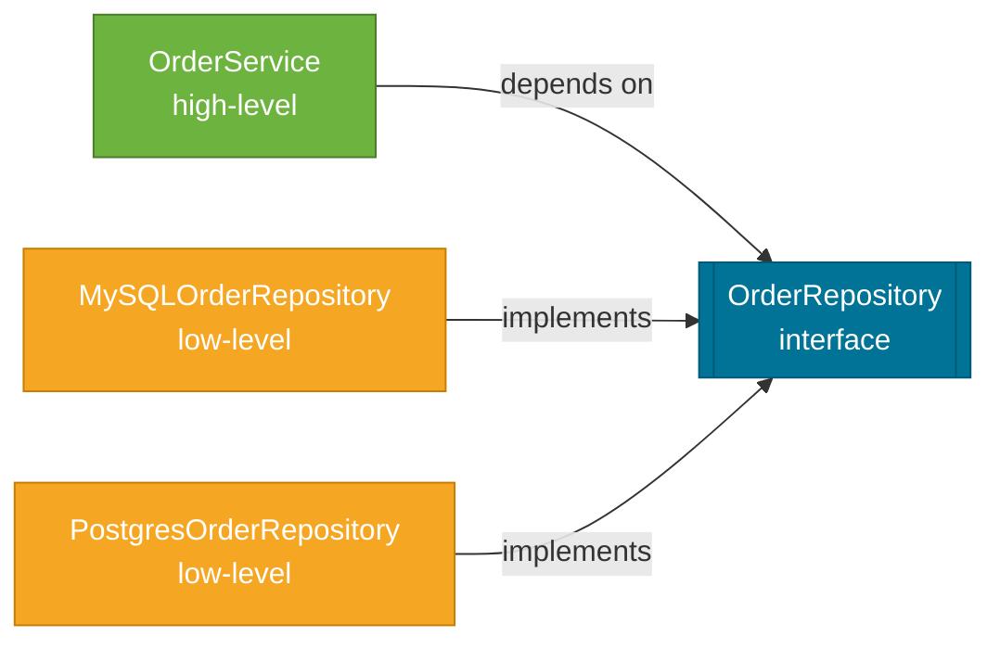

# SOLID Principles

> Five object-oriented design principles — Single Responsibility, Open/Closed, Liskov Substitution, Interface Segregation, and Dependency Inversion — that reduce coupling, improve testability, and make code easier to extend without breaking existing behavior.

## What Problem Does It Solve?

Without disciplined design, object-oriented codebases accumulate a specific kind of rot: classes that do too many things, methods that are impossible to test in isolation, and seemingly simple changes that ripple through dozens of files. You change one thing, three tests break in unrelated modules.

SOLID is a set of five principles, named by Robert C. Martin ("Uncle Bob"), that directly target these pain points. They are not a framework or a library — they are *design heuristics* that guide how you split responsibilities and structure dependencies. Each principle solves a different failure mode that emerges as codebases grow.

## What Are The SOLID Principles?

SOLID is an acronym:

| Letter | Principle | One-line summary |
|--------|-----------|-----------------|
| **S** | Single Responsibility | A class should have only one reason to change |
| **O** | Open/Closed | Open for extension, closed for modification |
| **L** | Liskov Substitution | Subtypes must be fully substitutable for their base types |
| **I** | Interface Segregation | Prefer many small interfaces over one large one |
| **D** | Dependency Inversion | Depend on abstractions, not on concrete implementations |


*Caption: The five SOLID principles build on each other — SRP and OCP establish class boundaries, LSP and ISP refine abstraction design, and DIP wires them all together via dependency injection.*

## How It Works

Each principle addresses a distinct design problem:

### S — Single Responsibility Principle (SRP)

**A class should have one, and only one, reason to change.**

"Reason to change" means a stakeholder or actor whose requirements could force you to modify the class. If a class handles both data access *and* email notification, a change to the email provider and a change to the database schema both require touching the same class — two reasons to change.

```java
// ❌ Violation: UserService handles business logic AND email sending
class UserService {
    public void register(User user) {
        userRepository.save(user);           // ← persistence concern
        emailService.sendWelcomeEmail(user); // ← notification concern
    }
}

// ✅ SRP: Separate the notification responsibility
class UserService {
    private final UserRepository userRepository;
    private final UserNotificationService notificationService;

    public void register(User user) {
        userRepository.save(user);
        notificationService.onUserRegistered(user); // ← delegate to specialist
    }
}
```

### O — Open/Closed Principle (OCP)

**Software entities (classes, modules, functions) should be open for extension but closed for modification.**

Adding new behavior should not require editing existing, tested code. Use abstraction (interfaces, abstract classes) so new implementations can be added without changing consumers.

```java
// ❌ Violation: adding a new payment method requires modifying PaymentProcessor
class PaymentProcessor {
    public void process(Order order, String type) {
        if (type.equals("CARD"))   { /* ... */ }
        else if (type.equals("PAYPAL")) { /* ... */ } // ← must add else-if forever
    }
}

// ✅ OCP: new payment methods added by creating new classes, not modifying existing ones
interface PaymentHandler {
    void handle(Order order);
}

class CardPaymentHandler  implements PaymentHandler { ... }
class PayPalPaymentHandler implements PaymentHandler { ... } // ← extend without modifying

class PaymentProcessor {
    public void process(Order order, PaymentHandler handler) {
        handler.handle(order); // ← closed to modification
    }
}
```

### L — Liskov Substitution Principle (LSP)

**Objects of a subtype must be substitutable for objects of the supertype without altering the correctness of the program.**

A subclass that throws where the parent didn't, or ignores a method that the parent implemented, breaks LSP. The infamous `Square extends Rectangle` violation is the canonical example:

```java
// ❌ LSP violation: Square overrides both setWidth and setHeight, breaking
//    callers who set them independently (as a Rectangle contract implies)
class Rectangle {
    protected int width, height;
    public void setWidth(int w)  { this.width  = w; }
    public void setHeight(int h) { this.height = h; }
    public int area() { return width * height; }
}

class Square extends Rectangle {
    @Override
    public void setWidth(int w)  { this.width = this.height = w; } // ← violates contract
    @Override
    public void setHeight(int h) { this.width = this.height = h; }
}

// ✅ Fix: use a common interface with no shared mutation contract
interface Shape { int area(); }
class Rectangle implements Shape { ... }
class Square    implements Shape { ... } // ← independent implementations
```

### I — Interface Segregation Principle (ISP)

**Clients should not be forced to depend on methods they do not use.**

One fat interface forces all implementors to provide methods that some of them have no meaningful implementation for. Split it into role-specific interfaces.

```java
// ❌ ISP violation: read-only repository forced to implement write methods
interface Repository<T> {
    T findById(Long id);
    void save(T entity);
    void delete(T entity);
}

// ✅ ISP: segregated by capability
interface ReadRepository<T>  { T findById(Long id); }
interface WriteRepository<T> { void save(T entity); void delete(T entity); }

// Read-only client? Depend only on ReadRepository.
// Full CRUD client? Depend on both — or a combined CrudRepository that extends both.
```

Spring Data already applies ISP: `CrudRepository`, `JpaRepository`, and `PagingAndSortingRepository` are layered interfaces with increasing capability.

### D — Dependency Inversion Principle (DIP)

**High-level modules should not depend on low-level modules. Both should depend on abstractions. Abstractions should not depend on details.**

This is the theoretical foundation for dependency injection. A `UserService` (high-level) should depend on a `UserRepository` interface (abstraction), not on `MySQLUserRepository` (low-level detail).

```java
// ❌ DIP violation: high-level service directly constructs a low-level dependency
class OrderService {
    private MySQLOrderRepository repo = new MySQLOrderRepository(); // ← hard-coded
}

// ✅ DIP: depend on an abstraction, inject the implementation
class OrderService {
    private final OrderRepository repo; // ← abstraction

    public OrderService(OrderRepository repo) { // ← Spring injects the concrete impl
        this.repo = repo;
    }
}
```



*Caption: DIP — both the consumer (OrderService) and the implementations point at the abstraction (interface), so you can swap implementations without changing the consumer.*

## SOLID in Spring Boot

Spring Boot's design is built on SOLID. Here's how the framework maps:

| SOLID Principle | Spring Boot realization |
|----------------|------------------------|
| SRP | `@Service`, `@Repository`, `@Controller` separate concerns into dedicated beans |
| OCP | `@Conditional`, `AutoConfiguration` — extend behavior by adding beans, not editing existing ones |
| LSP | Spring proxies depend on correct contract adherence; `@Transactional` relies on LSP-safe overriding |
| ISP | Spring Data's layered repository interfaces (`CrudRepository` → `JpaRepository`) |
| DIP | `@Autowired` / constructor injection — the entire IoC container is DIP in action |

## Best Practices

- **Prefer constructor injection** (not field injection with `@Autowired`) — it makes dependencies explicit, enables immutability, and is LSP-safe in Spring without proxying magic.
- **Name interfaces after roles**, not implementations: `UserRepository`, not `UserRepositoryInterface`. The concrete class gets the descriptive name (`JpaUserRepository`).
- **Write tests first** — if a class is hard to test without mocking five dependencies, it's violating SRP. The pain is the signal.
- **Don't gold-plate** — applying OCP to things that never change creates needless abstraction. Apply it where extension points are genuinely anticipated.
- **ISP and microservices**: In REST API design, ISP translates to "don't return giant response objects with optional fields." Use DTOs scoped to the specific use case.
- **Prefer `final` fields** — immutable dependencies reinforce SRP (no hidden state mutation) and DIP (you can't accidentally reassign to a different impl).

## Common Pitfalls

**Mistaking SRP for "one method per class"** — SRP is about *reasons to change*, not method count. A `BankAccount` class with `deposit()`, `withdraw()`, and `getBalance()` has one reason to change: financial rules. That's fine.

**Violating LSP with `Optional`** — overriding a method to return `Optional.empty()` when the parent always returns a value silently breaks LSP. Callers trust the supertype contract.

**OCP over-engineering** — wrapping every `if/else` in a strategy pattern before you know whether it'll change is premature abstraction. Apply OCP reactively when a second or third variation appears.

**ISP and Java 8 default methods** — default methods in interfaces feel like a free pass to add behavior without asking implementors. Overuse still leads to fat interfaces.

**DIP doesn't mean "always use an interface"** — for leaf-level utilities with no expected variability (e.g., a stateless formatting helper), a direct class dependency is fine. DIP is about *instability* in the dependency direction, not about mandating interfaces everywhere.

## Interview Questions

### Beginner

**Q:** What does SOLID stand for?
**A:** Single Responsibility, Open/Closed, Liskov Substitution, Interface Segregation, and Dependency Inversion — five design principles for writing maintainable, extensible object-oriented code.

**Q:** What is the Single Responsibility Principle?
**A:** A class should have only one reason to change, meaning it should serve one actor or concern. If a class changes for two different business reasons, split it.

**Q:** How does Spring Boot's dependency injection relate to SOLID?
**A:** Spring's IoC container is a direct implementation of the Dependency Inversion Principle — high-level beans depend on interfaces, and Spring injects the concrete implementations at runtime.

### Intermediate

**Q:** What's the difference between SRP and Separation of Concerns?
**A:** They're related but distinct. Separation of Concerns (SoC) is the broader architectural idea of isolating different aspects (UI, logic, data). SRP is the class-level design rule derived from SoC — specifically, a class should answer to exactly one stakeholder.

**Q:** What is the Liskov Substitution Principle violation in the Square/Rectangle example?
**A:** A `Square` that inherits from `Rectangle` breaks LSP because it invalidates the rectangle's contract — callers who set width and height independently get surprising behavior. `Square.setWidth(5)` silently changes the height too, which no client of `Rectangle` would expect. Fix by having both implement a common `Shape` interface without shared mutation contract.

**Q:** How does the Open/Closed Principle work in practice with Spring Boot auto-configuration?
**A:** Spring Boot auto-configuration follows OCP. You extend behavior (e.g., override a default `DataSource` bean) by adding your own bean definition — Spring's `@ConditionalOnMissingBean` means the default configuration backs off. You never edit Spring Boot's internal auto-config classes.

### Advanced

**Q:** Can you over-apply SOLID? Give an example.
**A:** Yes. Applying OCP to a class that never changes creates unnecessary abstraction layers. If an `EmailSender` has only one implementation and there's no real reason to swap it, wrapping it in an interface just adds indirection. The same applies to ISP — splitting a 3-method interface into three 1-method interfaces can make the codebase harder to navigate. SOLID is a guide, not a law; apply each principle where its specific failure mode is a real risk.

**Q:** How does DIP interact with circular dependency problems in Spring?
**A:** If both `ServiceA` depends on `ServiceB` and `ServiceB` depends on `ServiceA`, you have a circular dependency — Spring will fail to create these beans at startup (for constructor injection). The fix is to introduce a third abstraction both depend on (applying DIP more carefully), or to refactor so one service emits an event that the other listens to (decoupling via Spring's `ApplicationEventPublisher`). Field injection can mask circular dependencies by deferring injection order, which is one more reason to prefer constructor injection.

## Further Reading

- [Baeldung — SOLID Principles](https://www.baeldung.com/solid-principles) — practical Java code examples for each principle
- [Oracle Java Documentation](https://docs.oracle.com/en/java/) — Java language specification for interfaces and inheritance

## Related Notes

- [Microservices](./microservices.md) — SOLID principles scale up to service decomposition: SRP at the class level becomes bounded context at the service level.
- [Reliability Patterns](./reliability-patterns.md) — OCP and DIP are the structural foundation for plugging in circuit breakers, retries, and rate limiters without modifying business logic.
- [Spring Framework — Dependency Injection](../spring-framework/index.md) — the IoC container is the runtime realization of the Dependency Inversion Principle.
