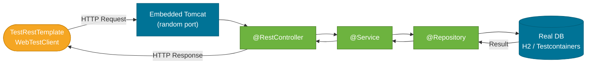

# Integration Tests

> Integration tests verify that your application's layers work correctly together — real HTTP, real service logic, and a real (or realistic) database, all in one test run.

## What Problem Does It Solve?

Unit tests verify individual classes in isolation; test slices verify individual layers. Neither tells you whether they compose correctly:

- Does the HTTP request deserialization feed the right data into the service?
- Does the service's transaction boundary wrap the repository call correctly?
- Does the database schema match your JPA entities?

Integration tests answer all of these. They start the full Spring Boot context — including the embedded server — and exercise the complete stack from HTTP request to database row.

## What Is `@SpringBootTest`?

`@SpringBootTest` is Spring Boot's full-context test annotation. It:

1. Loads **all** application beans (same as production startup)
2. Can start an embedded server (Tomcat by default) on a random port
3. Provides `TestRestTemplate` or `WebTestClient` to make real HTTP calls
4. Integrates with JUnit 5's lifecycle


*`@SpringBootTest` with `RANDOM_PORT` starts a real embedded server. The test client makes actual HTTP requests through the full stack.*

## How It Works

### Server Mode Options

`@SpringBootTest(webEnvironment = ...)` controls whether an HTTP server is started:

| Mode | When to use |
|------|-------------|
| `RANDOM_PORT` | Full integration test with a real HTTP server; preferred |
| `DEFINED_PORT` | Uses `server.port` (risk of port conflicts; avoid) |
| `MOCK` | No real server; uses `MockMvc`; default |
| `NONE` | No web layer at all; for testing service/repository logic only |

Use `RANDOM_PORT` for integration tests. Spring injects the port with `@LocalServerPort`.

## Code Examples

### Basic `@SpringBootTest` with `TestRestTemplate`

```java
import org.springframework.boot.test.context.SpringBootTest;
import org.springframework.boot.test.context.SpringBootTest.WebEnvironment;
import org.springframework.boot.test.web.client.TestRestTemplate;
import org.springframework.boot.test.web.server.LocalServerPort;

@SpringBootTest(webEnvironment = WebEnvironment.RANDOM_PORT) // ← starts embedded server
class OrderIntegrationTest {

    @LocalServerPort
    private int port;                  // ← injected with the random port chosen at startup

    @Autowired
    TestRestTemplate restTemplate;     // ← pre-configured HTTP client for tests

    @Test
    void placeOrder_andRetrieveIt() {
        // POST a new order
        OrderRequest req = new OrderRequest("laptop", 999.0);
        ResponseEntity<Order> created = restTemplate.postForEntity(
            "/orders", req, Order.class);

        assertEquals(HttpStatus.CREATED, created.getStatusCode());
        Long id = created.getBody().getId();
        assertNotNull(id);

        // GET the created order
        ResponseEntity<Order> fetched = restTemplate.getForEntity(
            "/orders/" + id, Order.class);

        assertEquals(HttpStatus.OK, fetched.getStatusCode());
        assertEquals("laptop", fetched.getBody().getItemName());
    }
}
```

### Using `@MockBean` in Integration Tests

Sometimes you want the full context but still fake one external dependency (e.g., an email service, a payment gateway):

```java
@SpringBootTest(webEnvironment = WebEnvironment.RANDOM_PORT)
class OrderIntegrationTest {

    @Autowired
    TestRestTemplate restTemplate;

    @MockBean
    PaymentGateway paymentGateway;     // ← real context, but this one bean is mocked

    @BeforeEach
    void setUp() {
        // Stub the external dependency
        when(paymentGateway.charge(any(), anyDouble()))
            .thenReturn(new PaymentResult("TXN-123", true));
    }

    @Test
    void placeOrder_chargesPaymentGateway() {
        restTemplate.postForEntity("/orders",
            new OrderRequest("phone", 499.0), Order.class);

        verify(paymentGateway).charge(any(), eq(499.0)); // ← verify interaction
    }
}
```

### Setting Up and Cleaning Test Data

Without Testcontainers, integration tests share the same H2 database. Use `@BeforeEach` / `@AfterEach` to keep tests independent:

```java
@SpringBootTest(webEnvironment = WebEnvironment.RANDOM_PORT)
@Transactional                             // ← rolls back after each test automatically
class OrderRepositoryIntegrationTest {

    @Autowired
    OrderRepository orderRepository;

    @Autowired
    TestRestTemplate restTemplate;

    @Test
    void getOrders_returnsAllOrders() {
        orderRepository.saveAll(List.of(
            new Order(null, "A", 10.0),
            new Order(null, "B", 20.0)
        ));

        ResponseEntity<Order[]> response =
            restTemplate.getForEntity("/orders", Order[].class);

        assertEquals(HttpStatus.OK, response.getStatusCode());
        assertEquals(2, response.getBody().length);
    }
}
```

:::warning `@Transactional` on `@SpringBootTest` with `RANDOM_PORT`
When the server runs in a separate thread (RANDOM_PORT), `@Transactional` on the test class does NOT roll back HTTP-triggered writes. The transaction for an HTTP request lives in the server thread, not the test thread. For real HTTP tests, clean up the database explicitly or use Testcontainers with a fresh container per test class.
:::

### Testing with Real PostgreSQL via Testcontainers

```java
@SpringBootTest(webEnvironment = WebEnvironment.RANDOM_PORT)
@Testcontainers
class OrderPostgresIntegrationTest {

    @Container
    static PostgreSQLContainer<?> postgres =
        new PostgreSQLContainer<>("postgres:16")
            .withDatabaseName("orders_test");

    @DynamicPropertySource                 // ← injects container config into Spring properties
    static void configureProperties(DynamicPropertyRegistry registry) {
        registry.add("spring.datasource.url", postgres::getJdbcUrl);
        registry.add("spring.datasource.username", postgres::getUsername);
        registry.add("spring.datasource.password", postgres::getPassword);
    }

    @Autowired
    TestRestTemplate restTemplate;

    @Test
    void placeOrder_persistsToPostgres() {
        ResponseEntity<Order> response = restTemplate.postForEntity(
            "/orders", new OrderRequest("book", 15.0), Order.class);

        assertEquals(HttpStatus.CREATED, response.getStatusCode());
        assertNotNull(response.getBody().getId());
    }
}
```

### Securing Integration Tests

When Spring Security is active, add credentials to `TestRestTemplate` or use `withBasicAuth`:

```java
@SpringBootTest(webEnvironment = WebEnvironment.RANDOM_PORT)
class SecuredEndpointTest {

    @Autowired
    TestRestTemplate restTemplate;

    @Test
    void adminEndpoint_requires_authentication() {
        ResponseEntity<String> unauth =
            restTemplate.getForEntity("/admin/health", String.class);
        assertEquals(HttpStatus.UNAUTHORIZED, unauth.getStatusCode());
    }

    @Test
    void adminEndpoint_succeeds_withAdminCredentials() {
        ResponseEntity<String> response =
            restTemplate.withBasicAuth("admin", "secret")   // ← adds Basic auth header
                .getForEntity("/admin/health", String.class);
        assertEquals(HttpStatus.OK, response.getStatusCode());
    }
}
```

## Trade-offs & When To Use / Avoid

| | Pros | Cons |
|--|------|------|
| **Integration tests** | Catches full-stack wiring bugs; closest to production | Slow (5–30s startup); harder to isolate failures |
| **Slice tests** | Fast (1–3s); focused on one layer | May miss cross-layer bugs |
| **Unit tests** | Fastest; perfectly isolated | Can't detect integration issues |

**Use integration tests for:**
- Happy-path flows through the full stack
- Security/authorization checks
- Database constraint and migration validation
- End-to-end API contracts (used as acceptance criteria)

**Avoid integration tests for:**
- Every edge case and error path — cover those with slices/unit tests
- Tests being the majority of the suite — keep the testing pyramid in mind (many unit, some slice, few integration)

## Best Practices

- **Prefer `RANDOM_PORT`** to avoid port conflicts in CI environments.
- **Use Testcontainers over H2** for production-like integration tests — SQL dialect and constraint differences matter.
- **Share the Spring context** across tests with `@SpringBootTest` on a shared base class — Spring caches the context and reusing it avoids repeated startup cost.
- **Don't overuse `@MockBean`** — each `@MockBean` creates a new context because it changes the context configuration. Group tests that use the same mocks into one class.
- **Use `@Sql` to seed test data** declaratively instead of calling repositories in `@BeforeEach`.

```java
@Sql("/test-data/orders.sql")    // ← executes before the test
@Test
void listOrders_returnsSeededData() { ... }
```

## Common Pitfalls

**Context caching broken by `@MockBean`**
Every unique set of `@MockBean` declarations creates a separate cached context. If 10 test classes each mock a different bean, Spring creates 10 contexts. Consolidate `@MockBean` declarations into a shared base class or test configuration.

**`@Transactional` doesn't roll back HTTP-triggered writes with `RANDOM_PORT`**
See the warning above. HTTP requests run in a different thread with their own transaction. The test thread's rollback has no effect on the server thread's committed writes. Use Testcontainers with `@DirtiesContext` or explicit cleanup instead.

**H2 schema/query differences hiding bugs**
If your production DB is PostgreSQL and your integration tests run against H2, you may not catch PostgreSQL-specific SQL issues until staging. Use `@AutoConfigureTestDatabase(replace = NONE)` + Testcontainers to match production.

**`LocalServerPort` injection**
`@LocalServerPort` is a shorthand for `@Value("${local.server.port}")`. It only works in `@SpringBootTest(webEnvironment = RANDOM_PORT/DEFINED_PORT)`, not with `MOCK` or `NONE`.

## Interview Questions

### Beginner

**Q: What does `@SpringBootTest` do?**
**A:** It loads the full Spring application context (every bean, all auto-configurations) in a test. With `webEnvironment = RANDOM_PORT` it also starts an embedded Tomcat on a random port, enabling real HTTP testing.

**Q: What is `TestRestTemplate` and how is it different from `RestTemplate`?**
**A:** `TestRestTemplate` is a test-friendly wrapper around `RestTemplate` that does not throw exceptions for 4xx/5xx responses (it returns `ResponseEntity` instead), follows redirects, and supports basic auth helpers. It's automatically configured when `@SpringBootTest(webEnvironment = RANDOM_PORT)` is used.

### Intermediate

**Q: When would you use `@MockBean` in an integration test instead of the real bean?**
**A:** When a dependency has side effects that are unacceptable in tests — sending real emails, charging real payment gateways, calling external HTTP APIs. You want the full Spring context but replace that one external boundary with a mock to keep tests deterministic and side-effect-free.

**Q: Why does `@Transactional` on a `@SpringBootTest(webEnvironment = RANDOM_PORT)` test not roll back database changes?**
**A:** HTTP requests run in the embedded server's thread, which starts its own transaction. The test's `@Transactional` annotation only wraps the test method's thread. Since the server writes commit independently, the test thread's rollback can't undo them. Clean up with explicit deletes, a truncation script, or Testcontainers.

**Q: How do you avoid slow test startup caused by multiple `@SpringBootTest` classes?**
**A:** Spring caches the application context keyed by its configuration. If all tests share the same context configuration (same beans, same `@MockBean` set), they reuse one cached startup. Create a shared base class annotated with `@SpringBootTest` and common `@MockBean` declarations. Avoid `@DirtiesContext` unless you actually need to reset state.

### Advanced

**Q: How does `@DynamicPropertySource` work?**
**A:** It's a method-level annotation on a `static` method that receives a `DynamicPropertyRegistry`. Spring calls this method during test context preparation (before beans are created), allowing dynamic values — like a Testcontainers JDBC URL — to be registered as Spring properties. This happens after the `Environment` is created but before `ApplicationContext` is refreshed.

**Q: What is the startup cost breakdown for `@SpringBootTest` and how can you minimize it?**
**A:** The cost comes from: (1) Spring context bootstrap — component scan, bean definition loading; (2) datasource startup — connection pool initialization; (3) optional server startup. Minimize by: sharing the context across test classes (no `@DirtiesContext`), reducing component scan scope in tests, using `@DataJpaTest` or `@WebMvcTest` slices where possible, and starting Testcontainers as `static` containers reused by multiple tests via `@Container` on a `static` field.

## Further Reading

- [Spring Boot Testing Reference](https://docs.spring.io/spring-boot/reference/testing/spring-boot-applications.html) — official guide covering `@SpringBootTest`, `TestRestTemplate`, and slice annotations
- [Baeldung: Testing in Spring Boot](https://www.baeldung.com/spring-boot-testing) — comprehensive examples for all testing strategies

## Related Notes

- [Spring Boot Test Slices](./spring-boot-test-slices.md) — the faster alternative for layer-specific tests; understand slices before reaching for `@SpringBootTest`
- [Testcontainers](./testcontainers.md) — provides the real database containers that make integration tests production-like
- [MockMvc & WebTestClient](./mockmvc-webtestclient.md) — the HTTP-layer testing tools used inside `@SpringBootTest(webEnvironment = MOCK)`
