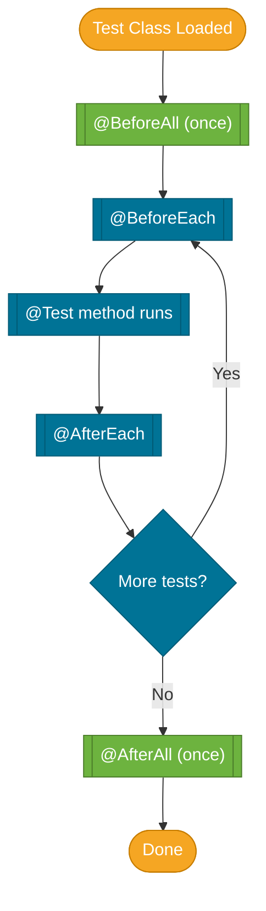

# JUnit 5

> JUnit 5 is the standard Java testing framework — it provides the annotations, assertions, and test runner that every other testing tool builds on top of.

## What Problem Does It Solve?

Without a structured test framework, developers write ad-hoc `main()` methods to verify behavior, then delete them. There is no:
- Consistent way to run all tests automatically
- Clear pass/fail reporting
- Support for test isolation (setup/teardown before/after each test)
- Mechanism to run the same test with many input values

JUnit 5 solves all of these, and its clean architecture (JUnit Platform + JUnit Jupiter + JUnit Vintage) means other frameworks like Mockito and Spring Boot Test plug in as first-class citizens.

## What Is JUnit 5?

JUnit 5 is not a single library — it's a platform made of three parts:

| Module | Role |
|--------|------|
| **JUnit Platform** | Launches test frameworks from build tools (Maven, Gradle) and IDEs |
| **JUnit Jupiter** | The new programming model: `@Test`, `@BeforeEach`, assertions, extensions |
| **JUnit Vintage** | Backward compatibility: runs JUnit 3 and JUnit 4 tests |

In practice, you write against **JUnit Jupiter** and the platform takes care of discovery and execution.

:::info Spring Boot includes JUnit 5
`spring-boot-starter-test` pulls in `junit-jupiter` automatically. You don't need to add anything extra.
:::

## How It Works

Every JUnit test method follows the **Arrange → Act → Assert (AAA)** pattern:

1. **Arrange** — set up the object under test and any inputs
2. **Act** — call the method being tested
3. **Assert** — verify the output matches expectation


*JUnit 5 test lifecycle — `@BeforeAll` and `@AfterAll` run once per class; `@BeforeEach` and `@AfterEach` bracket every individual test.*

### Lifecycle Annotations

| Annotation | When it runs | Typical use |
|------------|-------------|-------------|
| `@BeforeAll` | Once before all tests in the class | Start a server, open a DB connection |
| `@BeforeEach` | Before each test method | Reset state, create fresh object under test |
| `@AfterEach` | After each test method | Clean up files, verify no extra interactions |
| `@AfterAll` | Once after all tests in the class | Shut down server, close connection |

`@BeforeAll` and `@AfterAll` methods must be `static` (unless `@TestInstance(PER_CLASS)` is used — see Pitfalls).

## Code Examples

### Basic Test Class

```java
import org.junit.jupiter.api.*;
import static org.junit.jupiter.api.Assertions.*;

class CalculatorTest {

    private Calculator calculator; // object under test

    @BeforeEach
    void setUp() {
        calculator = new Calculator(); // fresh instance before every test
    }

    @Test
    void add_returnsSum() {
        int result = calculator.add(3, 7);
        assertEquals(10, result);              // ← expected first, actual second
    }

    @Test
    void divide_byZero_throwsException() {
        assertThrows(ArithmeticException.class,
            () -> calculator.divide(10, 0));    // ← lambda wraps the call that should throw
    }

    @Test
    void values_areInRange() {
        int result = calculator.add(5, 5);
        assertAll(                             // ← groups assertions; all run even if one fails
            () -> assertTrue(result > 0),
            () -> assertTrue(result < 100),
            () -> assertEquals(10, result)
        );
    }
}
```

### Parameterized Tests

Run the same test logic with different input values — no copy-paste:

```java
import org.junit.jupiter.params.ParameterizedTest;
import org.junit.jupiter.params.provider.*;

class StringUtilsTest {

    @ParameterizedTest
    @ValueSource(strings = {"", "   ", "\t"})   // ← three separate test runs
    void isBlank_returnsTrue_forBlankStrings(String input) {
        assertTrue(StringUtils.isBlank(input));
    }

    @ParameterizedTest
    @CsvSource({
        "hello, HELLO",
        "world, WORLD",
        "junit, JUNIT"
    })
    void toUpperCase_convertsCorrectly(String input, String expected) {
        assertEquals(expected, input.toUpperCase());
    }

    @ParameterizedTest
    @MethodSource("provideNullAndEmpty") // ← refers to a static factory method
    void isBlank_handlesEdgeCases(String input) {
        assertTrue(StringUtils.isBlank(input));
    }

    static Stream<String> provideNullAndEmpty() {
        return Stream.of(null, "", "  ");
    }
}
```

### Assertions Reference

```java
// Equality
assertEquals(expected, actual);
assertNotEquals(unexpected, actual);

// Boolean
assertTrue(condition);
assertFalse(condition);

// Null
assertNull(object);
assertNotNull(object);

// Same object reference
assertSame(expected, actual);

// Exception
assertThrows(SomeException.class, () -> methodThatShouldThrow());

// Multiple assertions — all run, failures collected together
assertAll(
    () -> assertEquals(1, value),
    () -> assertTrue(flag)
);

// Timeout
assertTimeout(Duration.ofMillis(100), () -> slowMethod());
```

### Disabling and Tagging Tests

```java
@Test
@Disabled("Bug #1234 — fix pending")     // ← test is skipped but still reported
void flakeyTest() { ... }

@Test
@Tag("integration")                      // ← run via: mvn test -Dgroups=integration
void externalApiTest() { ... }

@Test
@DisplayName("User can't register with a duplicate email")  // ← human-readable name in reports
void register_duplicateEmail_throws() { ... }
```

### Nested Tests

Group related tests to mirror the method/scenario structure:

```java
@DisplayName("OrderService")
class OrderServiceTest {

    @Nested
    @DisplayName("when placing an order")
    class PlaceOrder {
        @Test
        void succeeds_forValidItem() { ... }

        @Test
        void fails_forOutOfStockItem() { ... }
    }

    @Nested
    @DisplayName("when cancelling an order")
    class CancelOrder {
        @Test
        void succeeds_beforeShipping() { ... }
    }
}
```

## Best Practices

- **One assertion focus per test** — a test named `add_returnsSum` should only assert the sum. Use `assertAll` when you need to check multiple facets of a single result.
- **Name tests descriptively** — follow `methodUnderTest_scenario_expectedResult`: `divide_byZero_throwsException`.
- **Use `@BeforeEach` for setup**, not `@BeforeAll` — static state shared across tests creates hidden coupling.
- **Never put business logic in tests** — if you find yourself writing `if` in a test, refactor the parameter source.
- **AAA layout** — visually separate Arrange / Act / Assert with blank lines or comments for readability.
- **Isolate tests from the file system, network, and time** — inject `Clock`, mock external services. Tests must be repeatable.
- **Use `@DisplayName` for complex scenarios** — makes the test report readable to non-developers.

## Common Pitfalls

**`@BeforeAll` method not static**
`@BeforeAll` requires a `static` method by default. Forgetting `static` causes a runtime error. Fix: either add `static` or annotate the class with `@TestInstance(Lifecycle.PER_CLASS)`.

**`assertEquals` argument order**
Arguments are `(expected, actual)`. Swapping them doesn't break the test, but failure messages will say the wrong value is "expected". Always put the known, hard-coded value first.

**Catching exceptions manually instead of `assertThrows`**
```java
// BAD — if no exception is thrown, the test silently passes
try {
    service.doThing(null);
} catch (NullPointerException e) {
    // ok
}

// GOOD
assertThrows(NullPointerException.class, () -> service.doThing(null));
```

**Shared mutable state between tests**
Using instance fields set in `@BeforeAll` (static) or set in one test and used in another creates order-dependent tests. Each test must be fully independent — set up in `@BeforeEach`.

**`@ParameterizedTest` without a display name**
Parameterized tests default to index-based names like `[1]`, `[2]`. Add `name = "{0} → {1}"` to the annotation for readable reports.

## Interview Questions

### Beginner

**Q: What is the difference between `@BeforeAll` and `@BeforeEach`?**
**A:** `@BeforeAll` runs once before the entire test class executes (must be static). `@BeforeEach` runs before every individual test method. Use `@BeforeEach` for resetting state between tests; `@BeforeAll` for expensive one-time setup like starting a server.

**Q: What does `assertThrows` do?**
**A:** It executes the given lambda and asserts that it throws an exception of the specified type. It returns the exception so you can assert on its message: `assertThrows(IllegalArgumentException.class, () -> method()).getMessage()`.

**Q: How do you skip a test in JUnit 5?**
**A:** Annotate it with `@Disabled("reason")`. The test is still discovered and reported as skipped, so it won't silently be forgotten.

### Intermediate

**Q: What is a `@ParameterizedTest` and why use it?**
**A:** A parameterized test runs the same test method multiple times with different argument sets from a source (`@ValueSource`, `@CsvSource`, `@MethodSource`, etc.). This eliminates copy-pasted test methods that only differ in input values.

**Q: What is `@TestInstance(PER_CLASS)` and when would you use it?**
**A:** By default JUnit creates a new test class instance for every test method (PER_METHOD). `@TestInstance(PER_CLASS)` reuses one instance for the whole class, which allows `@BeforeAll` and `@AfterAll` to be non-static and enables shared state. Use it when test setup is expensive and tests don't mutate shared state.

**Q: How do JUnit 5 extensions differ from JUnit 4 rules?**
**A:** JUnit 4 used `@Rule` and `@ClassRule` which were limited. JUnit 5 extensions implement fine-grained interfaces (`BeforeEachCallback`, `AfterEachCallback`, `ParameterResolver`, etc.) and are activated with `@ExtendWith`. Mockito uses `@ExtendWith(MockitoExtension.class)` this way.

### Advanced

**Q: How does the JUnit 5 architecture enable third-party frameworks to integrate?**
**A:** JUnit 5 separates the **platform** (discovery and execution) from the **programming model** (Jupiter). Third parties implement `TestEngine` on the platform side and register via Java's `ServiceLoader` mechanism. This allows Mockito, Spring Boot Test, and Cucumber to plug in without forking the codebase.

**Q: How do you conditionally enable/disable a test?**
**A:** Use assumption-based annotations: `@EnabledOnOs`, `@EnabledIfSystemProperty`, `@EnabledIfEnvironmentVariable`, or programmatic `assumeTrue(condition)` inside the test body. If the assumption fails, JUnit aborts the test (reports as "aborted") rather than failing it.

## Further Reading

- [JUnit 5 User Guide](https://junit.org/junit5/docs/current/user-guide/) — the official, comprehensive reference
- [Baeldung: A Guide to JUnit 5](https://www.baeldung.com/junit-5) — practical examples covering all major features

## Related Notes

- [Mockito](./mockito.md) — complements JUnit 5 by providing mock objects; always used alongside `@ExtendWith(MockitoExtension.class)`
- [Spring Boot Test Slices](./spring-boot-test-slices.md) — Spring's `@WebMvcTest` and `@DataJpaTest` are JUnit 5 extensions that load partial application contexts
- [Integration Tests](./integration-tests.md) — `@SpringBootTest` builds on JUnit 5 lifecycle to spin up the full Spring context
