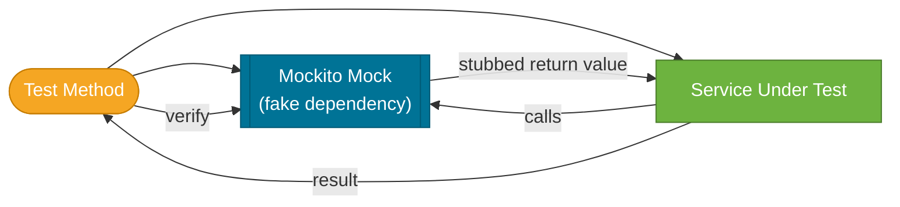

# Mockito

> Mockito is the most popular Java mocking framework — it lets you replace real dependencies with fake ones so you can test a class in isolation, controlling exactly what its collaborators return.

## What Problem Does It Solve?

A typical Spring service depends on a repository, an email client, a payment gateway, and more. When testing `OrderService`, you don't want:

- A running database
- Actual emails sent
- A real payment charge for every test run

Mockito lets you create **mock objects** that pretend to be those dependencies, return canned values, and track every method call — all in memory, with zero I/O.

## What Is Mockito?

Mockito is a mocking framework that provides three capabilities:

| Capability | What it does |
|------------|-------------|
| **Mock creation** | Creates a fake implementation of any interface or class |
| **Stubbing** | Tells the mock what to return when a specific method is called |
| **Verification** | Confirms that a method was (or was not) called with expected arguments |

:::info Spring Boot includes Mockito
`spring-boot-starter-test` includes `mockito-core` and `mockito-junit-jupiter`. Nothing extra to add.
:::

## How It Works


*A test creates a mock, injects it into the service under test (SUT), stubs its behavior, and verifies interactions after the SUT runs.*

Mockito integrates with JUnit 5 via `@ExtendWith(MockitoExtension.class)`. This extension:
1. Scans fields annotated with `@Mock` and creates mock instances
2. Injects mocks into fields annotated with `@InjectMocks`
3. Resets all mocks between tests automatically

## Code Examples

### Basic Setup

```java
import org.junit.jupiter.api.Test;
import org.junit.jupiter.api.extension.ExtendWith;
import org.mockito.InjectMocks;
import org.mockito.Mock;
import org.mockito.junit.jupiter.MockitoExtension;

import static org.mockito.Mockito.*;
import static org.junit.jupiter.api.Assertions.*;

@ExtendWith(MockitoExtension.class)   // ← activates Mockito annotation processing
class OrderServiceTest {

    @Mock
    OrderRepository orderRepository;   // ← creates a fake OrderRepository

    @Mock
    EmailService emailService;         // ← creates a fake EmailService

    @InjectMocks
    OrderService orderService;         // ← creates OrderService and injects the mocks above
```

### Stubbing with `when(...).thenReturn(...)`

```java
    @Test
    void findOrder_returnsOrder_whenFound() {
        // Arrange — stub the mock to return a specific value
        Order order = new Order(1L, "item", 99.99);
        when(orderRepository.findById(1L)).thenReturn(Optional.of(order)); // ← define behavior

        // Act
        Order result = orderService.findOrder(1L);

        // Assert
        assertEquals("item", result.getItemName());
    }

    @Test
    void findOrder_throwsException_whenNotFound() {
        when(orderRepository.findById(99L))
            .thenThrow(new OrderNotFoundException("not found")); // ← stub to throw

        assertThrows(OrderNotFoundException.class,
            () -> orderService.findOrder(99L));
    }
```

### Verifying Interactions

```java
    @Test
    void placeOrder_sendsConfirmationEmail() {
        Order order = new Order(1L, "item", 50.0);
        when(orderRepository.save(any(Order.class))).thenReturn(order); // ← any() matches any argument

        orderService.placeOrder(order);

        // Verify emailService.sendConfirmation was called exactly once with the saved order
        verify(emailService, times(1)).sendConfirmation(order); // ← interaction check
    }

    @Test
    void placeOrder_doesNotEmailForFreeItems() {
        Order freeOrder = new Order(2L, "promo", 0.0);
        when(orderRepository.save(any())).thenReturn(freeOrder);

        orderService.placeOrder(freeOrder);

        verify(emailService, never()).sendConfirmation(any()); // ← assert it was NOT called
    }
```

### `ArgumentCaptor` — Capturing What Was Passed

When you need to assert on the exact object that was passed to a mock:

```java
import org.mockito.ArgumentCaptor;
import org.mockito.Captor;

@ExtendWith(MockitoExtension.class)
class NotificationServiceTest {

    @Mock
    EmailClient emailClient;

    @InjectMocks
    NotificationService notificationService;

    @Captor
    ArgumentCaptor<EmailMessage> emailCaptor;   // ← captures the argument for inspection

    @Test
    void sendWelcome_buildsCorrectEmail() {
        notificationService.sendWelcome(new User("alice", "alice@example.com"));

        verify(emailClient).send(emailCaptor.capture()); // ← capture the argument
        EmailMessage sent = emailCaptor.getValue();

        assertEquals("alice@example.com", sent.getTo());
        assertTrue(sent.getSubject().contains("Welcome"));
    }
}
```

### Spies — Partial Mocking

A `@Spy` wraps a real object and allows you to override only specific methods:

```java
@Spy
List<String> spyList = new ArrayList<>();

@Test
void spy_callsRealMethodsUnlessStubbed() {
    spyList.add("hello");               // ← real method called
    assertEquals(1, spyList.size());    // ← real size

    doReturn(100).when(spyList).size(); // ← only size() is stubbed; add() still real
    assertEquals(100, spyList.size());
}
```

:::warning Use `doReturn` with spies, not `when`
`when(spy.method())` actually *calls* the real method during setup. For spies, use `doReturn(...).when(spy).method()` to avoid side effects.
:::

### Argument Matchers

```java
// Match any argument of a type
when(repo.findByName(anyString())).thenReturn(user);

// Match a specific value
when(repo.findById(eq(5L))).thenReturn(Optional.of(user));

// Match with a custom condition
when(repo.save(argThat(u -> u.getAge() > 18))).thenReturn(savedUser);
```

:::danger Mixing matchers and raw values
If you use any matcher in a stubbing call, ALL arguments must use matchers. `when(repo.findByAgeAndName(18, anyString()))` is illegal — use `when(repo.findByAgeAndName(eq(18), anyString()))`.
:::

## Trade-offs & When To Use / Avoid

| | Pros | Cons |
|--|------|------|
| **Mocks** (`@Mock`) | Complete isolation, full control over behavior, no real I/O | Diverges from real implementation; doesn't catch integration bugs |
| **Spies** (`@Spy`) | Real behavior + selective override | Calls real methods unexpectedly; brittle when implementation changes |
| **No mock (`@InjectMocks` + real deps)** | Tests actual behavior end-to-end | Needs DB/network; not a unit test anymore — use `@SpringBootTest` |

**Avoid over-mocking.** If you mock every collaborator, you test only the wiring, not the logic. Mock at the boundary (repository, HTTP client, email sender), not deep internal helpers.

## Common Pitfalls

**`UnnecessaryStubbingException`**
Mockito's strict mode (enabled by `MockitoExtension`) fails tests that stub methods which are never called. This catches dead stubs. Fix: remove the unused stubbing, or use `lenient()` if the stub is deliberately conditional.

**`@InjectMocks` doesn't throw when injection fails**
If Mockito cannot find a suitable field to inject (e.g., wrong type, multiple candidates), it silently leaves the field `null`. If you see `NullPointerException` in the service under test, check that a `@Mock` of the correct type exists.

**Not resetting mocks between tests**
With `MockitoExtension`, mocks ARE reset automatically. If you use `Mockito.mock(...)` manually in `@BeforeEach` without extension, you need `Mockito.reset(mock)` in `@AfterEach`.

**Verifying too much**
Verifying every method call makes tests brittle — an unrelated internal refactor breaks the test. Verify only the behaviors that are part of the public contract of the method under test.

**Stubbing void methods**
`when(...).thenReturn(...)` doesn't work on `void` methods. Use:
```java
doNothing().when(emailService).send(any());
doThrow(new RuntimeException()).when(emailService).send(any());
```

## Interview Questions

### Beginner

**Q: What is the difference between `@Mock` and `@Spy`?**
**A:** `@Mock` creates a completely fake object where all methods return default values unless stubbed. `@Spy` wraps a real object — real methods are called unless explicitly stubbed. Use `@Mock` for dependencies you don't own (repositories, clients); use `@Spy` when you want real behavior but need to override one or two methods.

**Q: What does `@InjectMocks` do?**
**A:** It creates an instance of the class under test and injects all `@Mock`/`@Spy` fields into it (by constructor, setter, or field injection in that order). It removes the need to manually call `new ServiceUnderTest(mockA, mockB)`.

**Q: How do you verify a method was never called?**
**A:** `verify(mock, never()).methodName(any())`. Other useful modes: `times(n)`, `atLeast(n)`, `atMost(n)`.

### Intermediate

**Q: What is `ArgumentCaptor` and when would you use it?**
**A:** `ArgumentCaptor` captures the argument passed to a mock so you can assert on its contents. Use it when the argument is built inside the method under test and you can't create the exact same instance in advance — for example, verifying the email body or that a saved entity has the right fields set.

**Q: Why does Mockito's strict mode (default in MockitoExtension) throw `UnnecessaryStubbingException`?**
**A:** Unused stubs are a smell — either the production code path you expected was never reached (a logic bug) or you added defensive stubs that aren't needed (maintenance burden). Strict mode surfaces these issues immediately rather than letting them accumulate.

**Q: What is `doReturn` vs `thenReturn` and when does it matter?**
**A:** For regular mocks they're interchangeable. For **spies**, `when(spy.method())` executes the real method during stubbing setup, which can throw or have side effects. `doReturn(value).when(spy).method()` bypasses the real call entirely during setup.

### Advanced

**Q: How does `@ExtendWith(MockitoExtension.class)` work internally?**
**A:** `MockitoExtension` implements JUnit 5's `BeforeEachCallback`, `AfterEachCallback`, and `ParameterResolver` interfaces. Before each test it calls `MockitoAnnotations.openMocks(testInstance)`, which scans the fields for `@Mock`, `@Spy`, and `@Captor` and initializes them. After each test it validates stubbing strictness and resets state.

**Q: How do you mock a static method with Mockito?**
**A:** Mockito 3.4+ supports static mocking with `mockito-inline` dependency:
```java
try (MockedStatic<UUID> uuidMock = Mockito.mockStatic(UUID.class)) {
    uuidMock.when(UUID::randomUUID).thenReturn(fixedUuid);
    // test code
}
```
The `try-with-resources` ensures the static mock is released after the block.

## Further Reading

- [Mockito Javadoc](https://javadoc.io/doc/org.mockito/mockito-core/latest/org/mockito/Mockito.html) — most complete API reference with examples for every feature
- [Baeldung: Mockito Annotations](https://www.baeldung.com/mockito-annotations) — covers `@Mock`, `@Spy`, `@Captor`, `@InjectMocks` with runnable examples

## Related Notes

- [JUnit 5](./junit5.md) — Mockito is always used alongside JUnit 5; `@ExtendWith(MockitoExtension.class)` is the bridge
- [Spring Boot Test Slices](./spring-boot-test-slices.md) — `@WebMvcTest` uses `@MockBean` (a Spring-aware wrapper around Mockito) to mock service layer beans
- [Integration Tests](./integration-tests.md) — integration tests use `@MockBean` sparingly; most dependencies are real
