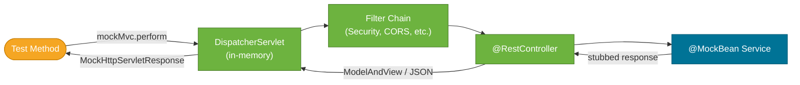

# MockMvc & WebTestClient

> MockMvc tests Spring MVC controllers at the HTTP level (request mapping, validation, serialization, security) without starting a real server; WebTestClient does the same for both reactive and servlet-based apps with a fluent API.

## What Problem Does It Solve?

Unit-testing a controller with plain JUnit means calling methods directly — you miss the HTTP layer entirely:

- Is the URL mapping correct? (`@GetMapping("/orders/{id}")`)
- Is request/response JSON deserialization configured correctly?
- Does Spring Security allow or block the request?
- Does a validation error (`@Valid`) return a proper 400 response?

`TestRestTemplate` (full integration test) catches all of these but requires a running server and is slow. **MockMvc** provides a middle ground: it exercises the full Spring MVC pipeline (DispatcherServlet → filter chain → controller → response) **in memory**, without a TCP socket, in roughly unit-test time.

**WebTestClient** is the modern alternative with a fluent, chainable API that works with both Spring MVC (via MockMvc adapter) and Spring WebFlux reactive controllers.

## MockMvc vs WebTestClient

| | MockMvc | WebTestClient |
|--|---------|---------------|
| Framework support | Spring MVC only | Spring MVC + Spring WebFlux |
| API style | `perform(...).andExpect(...)` | Fluent `.get().uri(...).exchange().expectStatus()` |
| Introduced | Spring 3.2 | Spring 5 / Spring Boot 2.2 |
| Real server required? | No | No (via MockMvc adapter) or Yes (via `RANDOM_PORT`) |
| Use when | Existing MVC apps | New apps, or you prefer the fluent API |

## How MockMvc Works


*MockMvc bypasses the TCP layer but runs every component of Spring MVC: filters, interceptors, argument resolution, JSON conversion, exception handling.*

## Code Examples

### MockMvc with `@WebMvcTest`

```java
import org.springframework.boot.test.autoconfigure.web.servlet.WebMvcTest;
import org.springframework.test.web.servlet.MockMvc;

import static org.springframework.test.web.servlet.request.MockMvcRequestBuilders.*;
import static org.springframework.test.web.servlet.result.MockMvcResultMatchers.*;
import static org.springframework.test.web.servlet.result.MockMvcResultHandlers.*;

@WebMvcTest(OrderController.class)     // ← web slice: loads controller + MockMvc
class OrderControllerTest {

    @Autowired
    MockMvc mockMvc;                   // ← auto-configured by the slice

    @MockBean
    OrderService orderService;

    @Test
    void getOrder_returns200_withJson() throws Exception {
        when(orderService.findOrder(1L))
            .thenReturn(new Order(1L, "laptop", 999.0));

        mockMvc.perform(get("/orders/1")            // ← issue a GET request
                .accept(MediaType.APPLICATION_JSON))
            .andDo(print())                         // ← log full request/response to console
            .andExpect(status().isOk())             // ← assert HTTP 200
            .andExpect(content().contentType(MediaType.APPLICATION_JSON))
            .andExpect(jsonPath("$.id").value(1))
            .andExpect(jsonPath("$.itemName").value("laptop"));
    }

    @Test
    void placeOrder_returns201_andLocationHeader() throws Exception {
        Order saved = new Order(2L, "phone", 499.0);
        when(orderService.placeOrder(any())).thenReturn(saved);

        mockMvc.perform(post("/orders")
                .contentType(MediaType.APPLICATION_JSON)
                .content("""
                    {"itemName": "phone", "price": 499.0}
                    """))
            .andExpect(status().isCreated())
            .andExpect(header().string("Location", "/orders/2")); // ← assert response header
    }
}
```

### Testing Validation (`@Valid`)

```java
    @Test
    void placeOrder_returns400_withBlankItemName() throws Exception {
        mockMvc.perform(post("/orders")
                .contentType(MediaType.APPLICATION_JSON)
                .content("""
                    {"itemName": "", "price": 10.0}
                    """))         // ← itemName is blank — should fail @NotBlank
            .andExpect(status().isBadRequest())
            .andExpect(jsonPath("$.errors[0].field").value("itemName"));
    }
```

### Testing Security with `@WithMockUser`

```java
import org.springframework.security.test.context.support.WithMockUser;

    @Test
    @WithMockUser(roles = "ADMIN")             // ← injects a fake Authentication into SecurityContext
    void adminEndpoint_allowsAdmin() throws Exception {
        mockMvc.perform(get("/admin/orders"))
            .andExpect(status().isOk());
    }

    @Test
    void adminEndpoint_rejects_unauthenticated() throws Exception {
        mockMvc.perform(get("/admin/orders"))
            .andExpect(status().isUnauthorized()); // ← no @WithMockUser → 401
    }
```

### Testing `@ControllerAdvice` Exception Handling

```java
    @Test
    void getOrder_returns404_whenNotFound() throws Exception {
        when(orderService.findOrder(99L))
            .thenThrow(new OrderNotFoundException("Order 99 not found"));

        mockMvc.perform(get("/orders/99"))
            .andExpect(status().isNotFound())
            .andExpect(jsonPath("$.message").value("Order 99 not found"));
    }
```

### WebTestClient with `@WebMvcTest`

```java
import org.springframework.test.web.reactive.server.WebTestClient;

@WebMvcTest(OrderController.class)
class OrderControllerWebTestClientTest {

    @Autowired
    WebTestClient webTestClient;               // ← Spring Boot auto-configures this too

    @MockBean
    OrderService orderService;

    @Test
    void getOrder_returns200() {
        when(orderService.findOrder(1L))
            .thenReturn(new Order(1L, "laptop", 999.0));

        webTestClient.get()
            .uri("/orders/1")
            .accept(MediaType.APPLICATION_JSON)
            .exchange()                        // ← sends the request
            .expectStatus().isOk()
            .expectBody()
            .jsonPath("$.itemName").isEqualTo("laptop");
    }

    @Test
    void placeOrder_returns201() {
        when(orderService.placeOrder(any()))
            .thenReturn(new Order(2L, "phone", 499.0));

        webTestClient.post()
            .uri("/orders")
            .contentType(MediaType.APPLICATION_JSON)
            .bodyValue("""
                {"itemName": "phone", "price": 499.0}
                """)
            .exchange()
            .expectStatus().isCreated()
            .expectHeader().valueMatches("Location", ".*/orders/2");
    }
}
```

### WebTestClient Against a Running Server (`RANDOM_PORT`)

```java
@SpringBootTest(webEnvironment = WebEnvironment.RANDOM_PORT)
class OrderFullIntegrationTest {

    @Autowired
    WebTestClient webTestClient;         // ← auto-configured with base URL pointing to random port

    @Test
    void fullStack_placeAndGetOrder() {
        // POST
        Order created = webTestClient.post()
            .uri("/orders")
            .contentType(MediaType.APPLICATION_JSON)
            .bodyValue(new OrderRequest("book", 15.0))
            .exchange()
            .expectStatus().isCreated()
            .expectBody(Order.class)
            .returnResult().getResponseBody(); // ← extract the response body

        assertNotNull(created.getId());

        // GET
        webTestClient.get()
            .uri("/orders/{id}", created.getId())
            .exchange()
            .expectStatus().isOk()
            .expectBody()
            .jsonPath("$.itemName").isEqualTo("book");
    }
}
```

### Standalone MockMvc Setup (No Spring Context)

When you want to test a single controller without loading ANY Spring context:

```java
import org.springframework.test.web.servlet.setup.MockMvcBuilders;

class OrderControllerStandaloneTest {

    MockMvc mockMvc;

    @BeforeEach
    void setUp() {
        OrderService service = mock(OrderService.class);
        when(service.findOrder(1L)).thenReturn(new Order(1L, "book", 15.0));

        mockMvc = MockMvcBuilders
            .standaloneSetup(new OrderController(service))  // ← no Spring context
            .build();
    }

    @Test
    void getOrder_returns200() throws Exception {
        mockMvc.perform(get("/orders/1"))
            .andExpect(status().isOk());
    }
}
```

:::tip Standalone vs `@WebMvcTest`
Standalone is faster (no Spring startup) but misses filters, security, `@ControllerAdvice`, and global config. Use it only for simple mapping/serialization checks. For anything involving the full MVC pipeline, use `@WebMvcTest`.
:::

## Trade-offs & When To Use / Avoid

| Approach | Startup time | What it catches | Use when |
|----------|-------------|----------------|----------|
| Standalone `MockMvcBuilders.standaloneSetup` | ~0ms | URL mapping, JSON serialization | Trivial controller logic, no security |
| `@WebMvcTest` + `MockMvc` | ~1–3s | Full MVC pipeline, security, validation, exception handling | Standard controller testing |
| `@WebMvcTest` + `WebTestClient` | ~1–3s | Same as MockMvc, fluent API | Preference, WebFlux migration path |
| `@SpringBootTest(RANDOM_PORT)` + `WebTestClient` | 5–30s | Full stack end-to-end | Acceptance tests, full integration |

## Best Practices

- **Use `@WebMvcTest` over `@SpringBootTest` for controller tests** — 5–10× faster with the same HTTP-layer coverage.
- **Prefer `WebTestClient` for new code** — its fluent API is more readable and works with both MVC and WebFlux.
- **Use `jsonPath`** from Spring's test support (`import org.springframework.test.web.servlet.result.MockMvcResultMatchers.jsonPath`) to assert on specific fields rather than comparing full JSON strings (brittle).
- **Add `.andDo(print())` when debugging** — logs the complete request and response to the console.
- **Test `@ControllerAdvice` via `@WebMvcTest`** — ensure your exception-to-status mapping is correct without integration tests.
- **Use `@WithMockUser` or `@WithSecurityContext`** for security tests — don't disable security in `@WebMvcTest`.

## Common Pitfalls

**`perform()` doesn't throw checked exceptions visibly**
`mockMvc.perform(...)` declares `throws Exception`. If you forget the `throws Exception` on the test method, it won't compile. This is expected — just add it to the signature.

**`jsonPath` evaluating against wrong root**
`jsonPath("$.itemName")` expects a JSON object at root. If your response is a JSON array, use `jsonPath("$[0].itemName")`.

**Forgetting `contentType` on POST/PUT requests**
If you `post("/orders").content(json)` without `.contentType(MediaType.APPLICATION_JSON)`, Spring can't deserialize the body and returns 415 Unsupported Media Type. Always include the content type.

**Security config not auto-loaded in `@WebMvcTest`**
`@WebMvcTest` loads `SecurityAutoConfiguration` by default. If your `SecurityFilterChain` bean is in a `@Configuration` class outside the standard scan path, it might not be picked up, leaving endpoints unprotected during tests. Explicitly import the security config: `@Import(SecurityConfig.class)`.

**`WebTestClient` in MVC test returning `null` response**
If you call `.returnResult().getResponseBody()` on a `WebTestClient` configured against a MockMvc (not a real server), streaming semantics differ. Use `.expectBody(Type.class).returnResult().getResponseBody()` with a concrete type, not a reactive type.

## Interview Questions

### Beginner

**Q: What is MockMvc and why would you use it instead of calling controller methods directly?**
**A:** MockMvc dispatches HTTP requests through the full Spring MVC pipeline (DispatcherServlet, filters, argument resolvers, message converters, exception handlers) without a real TCP server. Calling a controller method directly skips all of that — you won't test URL mapping, JSON serialization, validation, or security. MockMvc catches all of these.

**Q: What is the difference between `MockMvc` and `TestRestTemplate`?**
**A:** `MockMvc` runs in-memory — no real server, no port, almost instant startup. `TestRestTemplate` makes real HTTP requests to a real embedded server (requires `RANDOM_PORT`). MockMvc is for focused controller tests; `TestRestTemplate` is for full integration tests.

### Intermediate

**Q: How do you test that a secured endpoint returns 401 for unauthenticated requests?**
**A:** Use `@WebMvcTest` (which loads security by default) and call `mockMvc.perform(get("/protected")).andExpect(status().isUnauthorized())` without any authentication setup. To test authenticated access, add `@WithMockUser` to the test method.

**Q: What is `@WithMockUser` and how does it work?**
**A:** `@WithMockUser` is from `spring-security-test`. It creates a `UsernamePasswordAuthenticationToken` and places it in the `SecurityContext` before the test runs, simulating an authenticated user. You can set username, roles, and authorities. It works at both method and class level.

**Q: What is the difference between `@WebMvcTest` + `MockMvc` and Standalone MockMvc setup?**
**A:** `@WebMvcTest` starts a partial Spring context including security, filters, `@ControllerAdvice`, and all MVC auto-configuration — accurate but slightly slower. Standalone (`MockMvcBuilders.standaloneSetup(controller)`) creates a minimal mock dispatcher with no Spring context — extremely fast but misses filters, security, and global exception handling.

### Advanced

**Q: How does `WebTestClient` work against a Spring MVC (non-reactive) application?**
**A:** Spring Boot auto-configures `WebTestClient` with a `MockMvcHttpConnector` adapter when `@WebMvcTest` is used. Instead of making real HTTP connections, the adapter dispatches requests through `MockMvc` internally. The same fluent `WebTestClient` API works whether the backend is servlet-based (via MockMvc) or truly reactive (via WebFlux).

**Q: How do you assert on a response body that contains a list?**
**A:** With MockMvc: `jsonPath("$", hasSize(2))` and `jsonPath("$[0].name").value("Alice")`. With `WebTestClient`: `.expectBodyList(Order.class).hasSize(2)` or `.expectBody().jsonPath("$[0].itemName").isEqualTo("laptop")`.

## Further Reading

- [Spring MVC Test Framework](https://docs.spring.io/spring-framework/reference/testing/spring-mvc-test-framework.html) — official reference for MockMvc builders, request builders, and result matchers
- [WebTestClient Reference](https://docs.spring.io/spring-framework/reference/testing/webtestclient.html) — fluent API guide with reactive and MVC adapter configuration

## Related Notes

- [Spring Boot Test Slices](./spring-boot-test-slices.md) — `@WebMvcTest` is the slice that provides MockMvc; understanding slices is required before using MockMvc effectively
- [Integration Tests](./integration-tests.md) — `WebTestClient` also works with `@SpringBootTest(RANDOM_PORT)` for full-stack tests
- [JUnit 5](./junit5.md) — all MockMvc tests are JUnit 5 tests; lifecycle annotations and parameterized tests all apply
