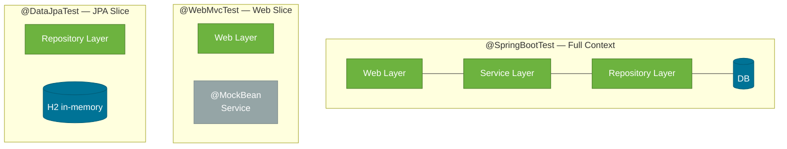

# Spring Boot Test Slices

> Spring Boot test slices are purpose-built annotations that start only the part of your application context needed for one layer — making tests fast without sacrificing Spring integration.

## What Problem Does It Solve?

`@SpringBootTest` loads the entire application context — every bean, every datasource, every component. For a moderate-sized app this takes 10–30 seconds. When your test only needs to check a single controller's HTTP mapping or a single repository's query, loading the whole world is wasteful and slow.

Test slices solve this by loading **only the beans relevant to a specific layer**. A `@WebMvcTest` loads web MVC infrastructure; a `@DataJpaTest` loads JPA repositories and a test datasource — nothing else.

## What Are Test Slices?

A test slice is a composed Spring Boot annotation that:
1. Restricts which `@Component` scan groups are activated
2. Applies auto-configuration relevant only to that layer
3. Leaves everything else out

Spring Boot ships with 30+ slices. The three you'll use daily:

| Annotation | Layer tested | What it loads |
|------------|-------------|---------------|
| `@WebMvcTest` | Spring MVC controllers | DispatcherServlet, filters, `@Controller`, `@ControllerAdvice`, MockMvc |
| `@DataJpaTest` | JPA repositories | JPA infrastructure, in-memory H2, `@Repository` beans |
| `@JsonTest` | JSON serialization | Jackson `ObjectMapper`, `@JsonComponent` |

## How It Works


*Full context loads everything; slices load only what the targeted layer needs. The service layer in `@WebMvcTest` is replaced with a `@MockBean`.*

### `@WebMvcTest` — How It Wires Up

1. Starts a Spring MVC context (no embedded server, no real HTTP)
2. Registers only the specified `@Controller` (and its `@ControllerAdvice`, `@Filter` dependencies)
3. Provides a `MockMvc` bean you can auto-wire
4. Does NOT create `@Service` or `@Repository` beans — you must declare `@MockBean` for them

### `@DataJpaTest` — How It Wires Up

1. Scans only `@Repository` beans
2. Replaces the real `DataSource` with an embedded H2 database
3. Wraps each test in a transaction and rolls it back after — no persistent state between tests
4. Does NOT load `@Service` or `@Controller` beans

## Code Examples

### `@WebMvcTest` — Testing a Controller

```java
import org.springframework.boot.test.autoconfigure.web.servlet.WebMvcTest;
import org.springframework.boot.test.mock.mockito.MockBean;
import org.springframework.test.web.servlet.MockMvc;

@WebMvcTest(OrderController.class)          // ← load only OrderController's context
class OrderControllerTest {

    @Autowired
    MockMvc mockMvc;                        // ← provided automatically by the slice

    @MockBean
    OrderService orderService;              // ← Spring-aware Mockito mock; replaces real bean

    @Test
    void getOrder_returns200_withOrderJson() throws Exception {
        Order order = new Order(1L, "laptop", 999.0);
        when(orderService.findOrder(1L)).thenReturn(order); // ← stub the mock

        mockMvc.perform(get("/orders/1"))
            .andExpect(status().isOk())
            .andExpect(jsonPath("$.itemName").value("laptop"))
            .andExpect(jsonPath("$.price").value(999.0));
    }

    @Test
    void getOrder_returns404_whenNotFound() throws Exception {
        when(orderService.findOrder(99L))
            .thenThrow(new OrderNotFoundException("not found"));

        mockMvc.perform(get("/orders/99"))
            .andExpect(status().isNotFound());
    }

    @Test
    void placeOrder_returns201_withValidBody() throws Exception {
        String requestBody = """
            {"itemName": "phone", "price": 499.0}
            """;
        when(orderService.placeOrder(any())).thenReturn(new Order(2L, "phone", 499.0));

        mockMvc.perform(post("/orders")
                .contentType(MediaType.APPLICATION_JSON)
                .content(requestBody))
            .andExpect(status().isCreated())
            .andExpect(header().string("Location", containsString("/orders/2")));
    }
}
```

### `@DataJpaTest` — Testing a Repository

```java
import org.springframework.boot.test.autoconfigure.orm.jpa.DataJpaTest;
import org.springframework.boot.test.autoconfigure.orm.jpa.TestEntityManager;

@DataJpaTest                                  // ← JPA slice with H2 in-memory DB
class OrderRepositoryTest {

    @Autowired
    TestEntityManager entityManager;          // ← JPA-aware helper for test setup

    @Autowired
    OrderRepository orderRepository;

    @Test
    void findByStatus_returnsMatchingOrders() {
        // Arrange — persist test data directly via EntityManager
        entityManager.persistAndFlush(new Order(null, "item-A", 10.0, OrderStatus.PENDING));
        entityManager.persistAndFlush(new Order(null, "item-B", 20.0, OrderStatus.SHIPPED));

        // Act
        List<Order> pending = orderRepository.findByStatus(OrderStatus.PENDING);

        // Assert
        assertEquals(1, pending.size());
        assertEquals("item-A", pending.get(0).getItemName());
    }

    @Test
    void save_assignsId() {
        Order saved = orderRepository.save(new Order(null, "item", 5.0, OrderStatus.PENDING));
        assertNotNull(saved.getId());        // ← auto-generated ID was set
    }
}
```

### Using a Real DataSource Instead of H2

To test against PostgreSQL (via Testcontainers) instead of H2:

```java
@DataJpaTest
@AutoConfigureTestDatabase(replace = AutoConfigureTestDatabase.Replace.NONE) // ← don't swap with H2
@Testcontainers
class OrderRepositoryRealDbTest {

    @Container
    static PostgreSQLContainer<?> postgres =
        new PostgreSQLContainer<>("postgres:16");

    @DynamicPropertySource
    static void configureProperties(DynamicPropertyRegistry registry) {
        registry.add("spring.datasource.url", postgres::getJdbcUrl);
        registry.add("spring.datasource.username", postgres::getUsername);
        registry.add("spring.datasource.password", postgres::getPassword);
    }

    // ... tests as usual
}
```

### `@JsonTest` — Testing JSON Serialization

```java
import org.springframework.boot.test.autoconfigure.json.JsonTest;
import org.springframework.boot.test.json.JacksonTester;

@JsonTest                                   // ← loads Jackson ObjectMapper only
class OrderJsonTest {

    @Autowired
    JacksonTester<Order> json;              // ← typed wrapper around ObjectMapper

    @Test
    void serialize_producesExpectedJson() throws Exception {
        Order order = new Order(1L, "laptop", 999.0);

        assertThat(json.write(order))
            .hasJsonPath("$.itemName")
            .extractingJsonPathStringValue("$.itemName")
            .isEqualTo("laptop");
    }

    @Test
    void deserialize_parsesJsonCorrectly() throws Exception {
        String content = """
            {"id": 1, "itemName": "laptop", "price": 999.0}
            """;

        Order order = json.parse(content).getObject();
        assertEquals("laptop", order.getItemName());
    }
}
```

### `@MockBean` vs `@Mock`

| | `@Mock` (Mockito) | `@MockBean` (Spring) |
|--|---|---|
| Used with | `@ExtendWith(MockitoExtension.class)` | `@WebMvcTest`, `@DataJpaTest`, `@SpringBootTest` |
| Registered in Spring context? | No | Yes — replaces the real bean |
| Use when | Pure unit test, no Spring context | Spring slice test that needs a fake collaborator |

## Best Practices

- **Default to slices over `@SpringBootTest`** for controller and repository tests — they run 5–10× faster.
- **One controller per `@WebMvcTest`**: `@WebMvcTest(MyController.class)` loads just that controller's dependencies, keeping context size minimal.
- **Use `TestEntityManager` in `@DataJpaTest`** to set up data rather than calling the repository under test — keeps arrangement and act clearly separated.
- **Don't mix `@Mock` and `@MockBean`**: in a Spring slice test, always use `@MockBean`; in a pure unit test with no Spring context, always use `@Mock`.
- **Expect `@DataJpaTest` to roll back automatically** — don't add `@Transactional` to tests unless you explicitly need commit behavior.

## Common Pitfalls

**`@WebMvcTest` loads too many controllers**
Without specifying the class (`@WebMvcTest(MyController.class)`), Spring Boot scans all controllers and wires all their `@MockBean` requirements. Always scope to a single controller.

**Forgetting `@MockBean` for service dependencies in `@WebMvcTest`**
The service layer is not created by the web slice. If `OrderController` injects `OrderService` and you don't declare `@MockBean OrderService`, Spring will fail to start the context with `NoSuchBeanDefinitionException`.

**`@DataJpaTest` and custom `@Repository` query not found**
`@DataJpaTest` only scans `@Repository` interfaces in the same package tree. If your query is in a different module, configure `@DataJpaTest(includeFilters = ...)` explicitly.

**Assuming H2 behavior matches PostgreSQL**
H2's SQL dialect differs from PostgreSQL (e.g., case sensitivity, JSON support). For queries that use database-specific syntax, use `@AutoConfigureTestDatabase(replace = NONE)` with Testcontainers.

**Security configuration blocking requests in `@WebMvcTest`**  
If your app has a `SecurityFilterChain`, `@WebMvcTest` loads it by default and your requests will return 401. Either configure test security with `@WithMockUser` or exclude the security config: `@WebMvcTest(excludeAutoConfiguration = SecurityAutoConfiguration.class)`.

## Interview Questions

### Beginner

**Q: What is a Spring Boot test slice?**
**A:** An annotation that starts a partial Spring application context, loading only the beans relevant to one layer (web, JPA, JSON serialization, etc.). It makes tests faster than `@SpringBootTest` which loads everything.

**Q: What does `@WebMvcTest` load?**
**A:** Spring MVC infrastructure — `DispatcherServlet`, filters, `@Controller`, `@ControllerAdvice` — and auto-configured `MockMvc`. It does NOT load `@Service` or `@Repository` beans; those must be mocked with `@MockBean`.

**Q: Why does `@DataJpaTest` roll back after each test?**
**A:** It wraps each test in a transaction and rolls it back so tests don't pollute each other's state. You get a clean database view for every test without needing to delete data manually.

### Intermediate

**Q: When would you use `@MockBean` over `@Mock`?**
**A:** Use `@MockBean` inside Spring context tests (`@WebMvcTest`, `@DataJpaTest`, `@SpringBootTest`) — it registers the mock as a Spring bean, replacing any real bean of that type in the context. Use `@Mock` in pure unit tests with `@ExtendWith(MockitoExtension.class)` where there is no Spring context.

**Q: How do you test a Spring controller's authentication/authorization logic?**
**A:** Use `@WithMockUser` (or `@WithUserDetails`) from `spring-security-test` to inject a fake `Authentication` into the security context. Combine with `@WebMvcTest` to test that secured endpoints return 403 for unauthorized users and 200 for authorized ones.

**Q: How would you use `@DataJpaTest` with PostgreSQL instead of H2?**
**A:** Add `@AutoConfigureTestDatabase(replace = Replace.NONE)` to stop the slice from swapping in H2, then use Testcontainers to start a real PostgreSQL container and register its JDBC URL, username, and password with `@DynamicPropertySource`.

### Advanced

**Q: How does Spring Boot determine which auto-configurations to apply in a slice?**
**A:** Each slice annotation is a composed annotation that includes `@ImportAutoConfiguration` listing exactly which auto-configuration classes to activate. For `@WebMvcTest` this is defined in `spring-boot-test-autoconfigure`'s `META-INF/spring/org.springframework.boot.test.autoconfigure.web.servlet.AutoConfigureWebMvc.imports`. You can inspect this to understand exactly what's in scope.

**Q: Can you create a custom test slice?**
**A:** Yes. Create a composed annotation with `@ImportAutoConfiguration(...)` listing the auto-configurations you need, and `@BootstrapWith` pointing to `SpringBootTestContextBootstrapper`. Register it in a `META-INF/spring/...imports` file. This is advanced but useful for custom layers (e.g., a Kafka consumer slice).

## Further Reading

- [Spring Boot Test Auto-configuration Reference](https://docs.spring.io/spring-boot/docs/current/reference/html/test-auto-configuration.html) — complete list of all 30+ test slices
- [Baeldung: Testing in Spring Boot](https://www.baeldung.com/spring-boot-testing) — comprehensive practical guide with slice examples

## Related Notes

- [JUnit 5](./junit5.md) — all slices are JUnit 5 extensions; lifecycle annotations apply within slice tests
- [Mockito](./mockito.md) — `@MockBean` is Spring's wrapper around Mockito mocks; understanding `@Mock` first makes `@MockBean` obvious
- [MockMvc & WebTestClient](./mockmvc-webtestclient.md) — `MockMvc` is the HTTP layer used inside `@WebMvcTest`
- [Testcontainers](./testcontainers.md) — pairs with `@DataJpaTest` to test repositories against real databases
