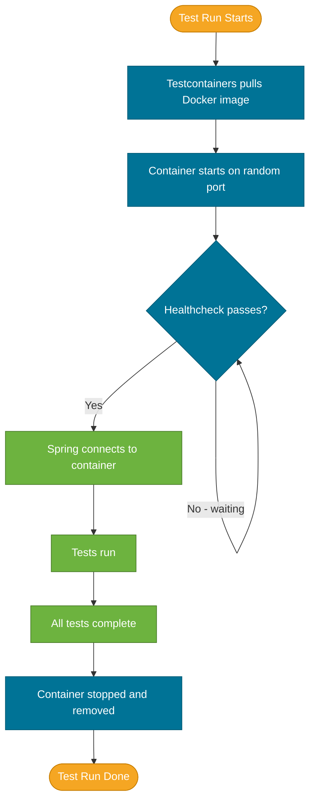

# Testcontainers

> Testcontainers is a Java library that spins up real Docker containers — PostgreSQL, MySQL, Kafka, Redis — during your test run and tears them down automatically when tests finish.

## What Problem Does It Solve?

In-memory substitutes like H2 are convenient but they lie to you:
- H2's SQL dialect is not PostgreSQL — constraints, JSON operations, and custom functions behave differently
- In-memory Redis is not real Redis — eviction, clustering, pub/sub semantics differ
- H2 knows nothing about database-specific indexes, triggers, or stored procedures

The alternative — a shared dev database — creates test pollution: one test's leftover data breaks another developer's run.

Testcontainers gives you **real databases, on demand, for every test run**, with complete isolation via Docker. If it works in your test, it works in production.

## What Is Testcontainers?

Testcontainers is an open-source library (`org.testcontainers:testcontainers`) that:
1. Pulls a Docker image (first run) or uses cached image (subsequent runs)
2. Starts a container and waits for it to become healthy
3. Exposes a dynamic port for your application to connect to
4. Stops and removes the container when the JVM (or test class) exits

Spring Boot 3.1+ ships dedicated Testcontainers integration — `@ServiceConnection`, `TestcontainersPropertySourceAutoConfiguration` — that eliminates the boilerplate `@DynamicPropertySource` setup.

## How It Works


*Testcontainers manages the full container lifecycle: pull → start → healthcheck → tests → teardown. All automatic.*

### Static vs Instance Containers

| Type | Lifetime | Recommended for |
|------|----------|-----------------|
| `static` field `@Container` | Shared across all tests in the class | Most scenarios — one container per test class |
| Instance field `@Container` | New container per test method | When tests must be completely isolated (rare, slow) |
| `@Container` in a shared base class | Shared across all test classes | Large test suites with many integration tests |

**Static containers are the default choice** — starting a new PostgreSQL container for each test method adds 2–5 seconds per test.

## Code Examples

### Dependencies (Maven)

```xml
<!-- spring-boot-starter-test already includes testcontainers via spring-boot 3.1+ -->
<dependency>
    <groupId>org.springframework.boot</groupId>
    <artifactId>spring-boot-testcontainers</artifactId>
    <scope>test</scope>
</dependency>
<dependency>
    <groupId>org.testcontainers</groupId>
    <artifactId>postgresql</artifactId>      <!-- module for PostgreSQLContainer -->
    <scope>test</scope>
</dependency>
<dependency>
    <groupId>org.testcontainers</groupId>
    <artifactId>kafka</artifactId>           <!-- module for KafkaContainer -->
    <scope>test</scope>
</dependency>
```

### PostgreSQL with `@DynamicPropertySource` (Pre–Spring Boot 3.1)

```java
import org.testcontainers.containers.PostgreSQLContainer;
import org.testcontainers.junit.jupiter.Container;
import org.testcontainers.junit.jupiter.Testcontainers;

@SpringBootTest(webEnvironment = WebEnvironment.RANDOM_PORT)
@Testcontainers                                    // ← activates Testcontainers JUnit 5 extension
class OrderIntegrationTest {

    @Container
    static PostgreSQLContainer<?> postgres =       // ← static = shared across all tests in class
        new PostgreSQLContainer<>("postgres:16")
            .withDatabaseName("orders")
            .withUsername("test")
            .withPassword("test");

    @DynamicPropertySource                         // ← bridge container ports → Spring properties
    static void configureProperties(DynamicPropertyRegistry registry) {
        registry.add("spring.datasource.url",      postgres::getJdbcUrl);
        registry.add("spring.datasource.username", postgres::getUsername);
        registry.add("spring.datasource.password", postgres::getPassword);
    }

    @Autowired
    TestRestTemplate restTemplate;

    @Test
    void createOrder_persistsToPostgres() {
        ResponseEntity<Order> response = restTemplate.postForEntity(
            "/orders", new OrderRequest("book", 25.0), Order.class);
        assertEquals(HttpStatus.CREATED, response.getStatusCode());
    }
}
```

### PostgreSQL with `@ServiceConnection` (Spring Boot 3.1+)

Spring Boot 3.1 introduced `@ServiceConnection` — it reads the container metadata and automatically registers all required datasource properties. No `@DynamicPropertySource` needed:

```java
import org.springframework.boot.testcontainers.service.connection.ServiceConnection;

@SpringBootTest(webEnvironment = WebEnvironment.RANDOM_PORT)
@Testcontainers
class OrderIntegrationTest {

    @Container
    @ServiceConnection                             // ← no @DynamicPropertySource needed!
    static PostgreSQLContainer<?> postgres =
        new PostgreSQLContainer<>("postgres:16");

    @Autowired
    TestRestTemplate restTemplate;

    @Test
    void createOrder_persistsToPostgres() { ... }
}
```

### Redis Container

```java
import org.testcontainers.containers.GenericContainer;
import org.testcontainers.utility.DockerImageName;

@SpringBootTest
@Testcontainers
class CacheIntegrationTest {

    @Container
    @ServiceConnection                             // ← works for Redis too with 3.1+
    static GenericContainer<?> redis =
        new GenericContainer<>(DockerImageName.parse("redis:7"))
            .withExposedPorts(6379);

    // Tests that exercise Spring Cache backed by Redis
}
```

### Kafka Container

```java
import org.testcontainers.containers.KafkaContainer;
import org.testcontainers.utility.DockerImageName;

@SpringBootTest
@Testcontainers
class OrderEventPublisherTest {

    @Container
    @ServiceConnection
    static KafkaContainer kafka =
        new KafkaContainer(DockerImageName.parse("confluentinc/cp-kafka:7.6.1"));

    @Autowired
    OrderEventPublisher publisher;

    @Autowired
    KafkaListenerEndpointRegistry listenerRegistry;

    @Test
    void publishOrderCreated_messageConsumedByListener() throws Exception {
        CountDownLatch latch = new CountDownLatch(1);
        // ... set up a test listener and assert the message arrives
    }
}
```

### Shared Base Class Pattern (Recommended for Large Test Suites)

Define containers once; all integration test classes extend the base:

```java
// AbstractIntegrationTest.java
@SpringBootTest(webEnvironment = WebEnvironment.RANDOM_PORT)
@Testcontainers
public abstract class AbstractIntegrationTest {

    @Container
    @ServiceConnection
    static PostgreSQLContainer<?> postgres =
        new PostgreSQLContainer<>("postgres:16");

    @Container
    @ServiceConnection
    static GenericContainer<?> redis =
        new GenericContainer<>("redis:7").withExposedPorts(6379);
}

// OrderIntegrationTest.java
class OrderIntegrationTest extends AbstractIntegrationTest {

    @Autowired
    TestRestTemplate restTemplate;

    @Test
    void placesOrder() { ... }
}
```

Spring Boot reuses the same application context (and thus the same containers) across all subclasses, so containers start only once for the entire suite.

### Using `@DataJpaTest` with Testcontainers

Combine the JPA slice (fast setup) with a real database (no H2 compromise):

```java
@DataJpaTest
@AutoConfigureTestDatabase(replace = AutoConfigureTestDatabase.Replace.NONE) // ← keep real datasource
@Testcontainers
class OrderRepositoryTest {

    @Container
    @ServiceConnection
    static PostgreSQLContainer<?> postgres =
        new PostgreSQLContainer<>("postgres:16");

    @Autowired
    OrderRepository orderRepository;

    @Test
    void findByStatus_usesPostgresQuery() {
        // Native PostgreSQL queries, constraints, and indexes all work correctly
    }
}
```

## Best Practices

- **Use `static` containers** whenever possible — per-method containers multiply startup costs.
- **Use `@ServiceConnection`** (Spring Boot 3.1+) instead of `@DynamicPropertySource` to eliminate boilerplate.
- **Use a shared abstract base class** for multi-class test suites — one container startup for all integration tests.
- **Pin Docker image versions** (`postgres:16` not `postgres:latest`) — `latest` can silently change and break tests.
- **Use `@DataJpaTest` + `@AutoConfigureTestDatabase(replace = NONE)` + Testcontainers** when you want fast repository tests against a real database.
- **Never rely on Testcontainers in production builds** — keep all testcontainers dependencies in `<scope>test</scope>`.

## Common Pitfalls

**Docker not running**
Testcontainers requires Docker to be running. If Docker is not available (CI agent, developer machine without Docker Desktop), tests fail with `Could not find a valid Docker environment`. Ensure Docker is available in CI or use a Docker-in-Docker (DinD) setup.

**Container startup timeout**
Default timeout is 60 seconds. Slow images or slow CI machines may exceed this. Increase with `.withStartupTimeout(Duration.ofMinutes(2))` on the container.

**Spring context cache invalidated by `@DynamicPropertySource`**
Each unique set of dynamic properties creates a new context. If one test class uses `@DynamicPropertySource` with container A and another uses container B with different URLs, Spring creates two separate contexts. Use a shared base class or `@ServiceConnection` to ensure URLs are deterministically set.

**Not waiting for application readiness**
Sometimes the container is "up" (port open) but the DB is still initializing. Testcontainers uses wait strategies. `PostgreSQLContainer` uses `Wait.forLogMessage` by default. For custom containers, add `.waitingFor(Wait.forHttp("/health"))` or equivalent.

**`@Transactional` and real-port tests**
As with `@SpringBootTest(RANDOM_PORT)` in general — `@Transactional` on the test class does not roll back writes made by HTTP requests in the server thread. Use explicit cleanup or `@BeforeEach`/`@AfterEach` with delete statements.

## Interview Questions

### Beginner

**Q: What is Testcontainers and why is it better than H2 for integration tests?**
**A:** Testcontainers is a library that starts real Docker containers (PostgreSQL, Redis, Kafka, etc.) during a test run. Unlike H2, it uses the same database engine as production, so SQL dialect differences, constraints, and database-specific queries all behave identically to prod. Tests that pass against a real PostgreSQL container will behave the same in production.

**Q: How do you stop a Testcontainer from starting a new container for every test method?**
**A:** Declare the container as a `static` field. JUnit's `@Container` on a static field means the container is started once before the first test in the class and stopped after the last test in the class, rather than per-method.

### Intermediate

**Q: What is `@ServiceConnection` and how does it simplify Testcontainers setup?**
**A:** Introduced in Spring Boot 3.1, `@ServiceConnection` reads the container's connection metadata (JDBC URL, port, credentials) and automatically registers them as Spring properties. It replaces the manual `@DynamicPropertySource` method, reducing boilerplate to a single annotation on the container field.

**Q: How do you share a Testcontainers setup across many test classes?**
**A:** Create an `abstract` base class annotated with `@SpringBootTest` and `@Testcontainers`, declare all containers as `static @Container` fields. Spring Boot's context caching reuses the same context (and containers) for all test classes that extend this base with the same configuration.

**Q: How do you use Testcontainers with `@DataJpaTest`?**
**A:** Add `@AutoConfigureTestDatabase(replace = Replace.NONE)` to prevent the slice from swapping in H2, then declare a `@Container @ServiceConnection` field for the real database. This gives you the fast JPA slice startup while still testing against a real database.

### Advanced

**Q: How does `@DynamicPropertySource` work, and what is its main limitation?**
**A:** It's a static method registered as a `BeanFactoryPostProcessor`. Spring calls it after creating the `Environment` but before refreshing the `ApplicationContext`, allowing dynamic values to be inserted as property sources. Its limitation: each unique set of dynamic values creates a separate cached context, which can lead to multiple Spring context startups if test classes don't share the same property values.

**Q: What wait strategies does Testcontainers support, and when would you use each?**
**A:** Testcontainers provides: `Wait.forLogMessage(regex, times)` — wait until a log line appears; `Wait.forHttp(path)` — wait until an HTTP endpoint returns 2xx; `Wait.forListeningPort()` — wait until the exposed port accepts connections; `Wait.forHealthcheck()` — use the Docker image's built-in healthcheck. For databases, `forLogMessage` (waiting for "ready to accept connections") or `forListeningPort` are standard. For HTTP services, `forHttp` is more reliable.

## Further Reading

- [Testcontainers for Java](https://java.testcontainers.org/) — official docs with module-specific guides for PostgreSQL, Kafka, Redis, and more
- [Spring Boot Testcontainers Integration](https://docs.spring.io/spring-boot/reference/testing/testcontainers.html) — `@ServiceConnection` and Spring Boot 3.1+ features

## Related Notes

- [Integration Tests](./integration-tests.md) — `@SpringBootTest` is the primary consumer of Testcontainers; see the shared base class pattern
- [Spring Boot Test Slices](./spring-boot-test-slices.md) — `@DataJpaTest` pairs with Testcontainers via `@AutoConfigureTestDatabase(replace = NONE)`
- [Docker](../docker/index.md) — Testcontainers uses Docker under the hood; understanding images and containers helps when debugging startup issues
