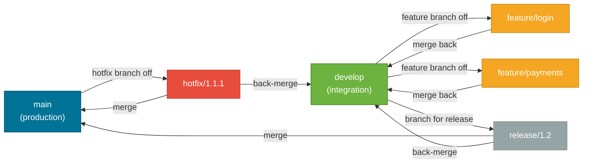
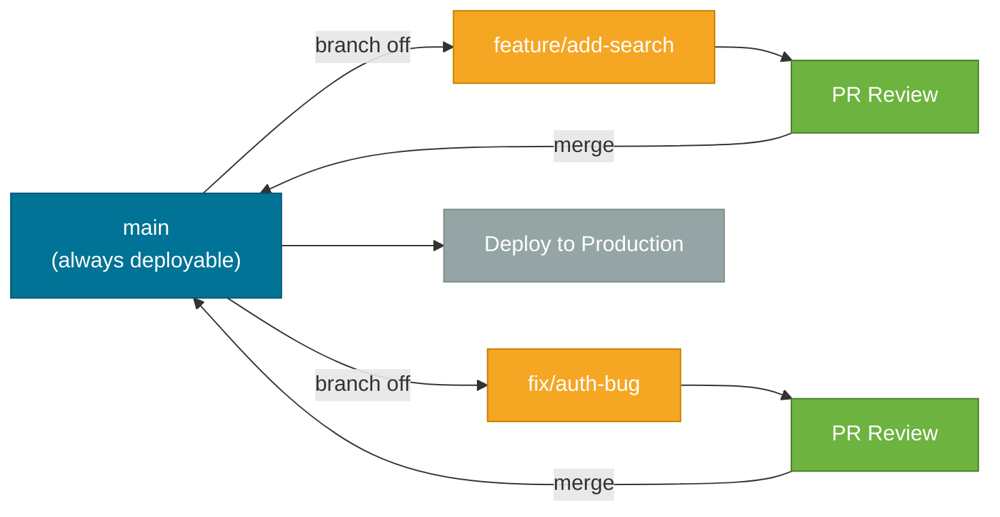
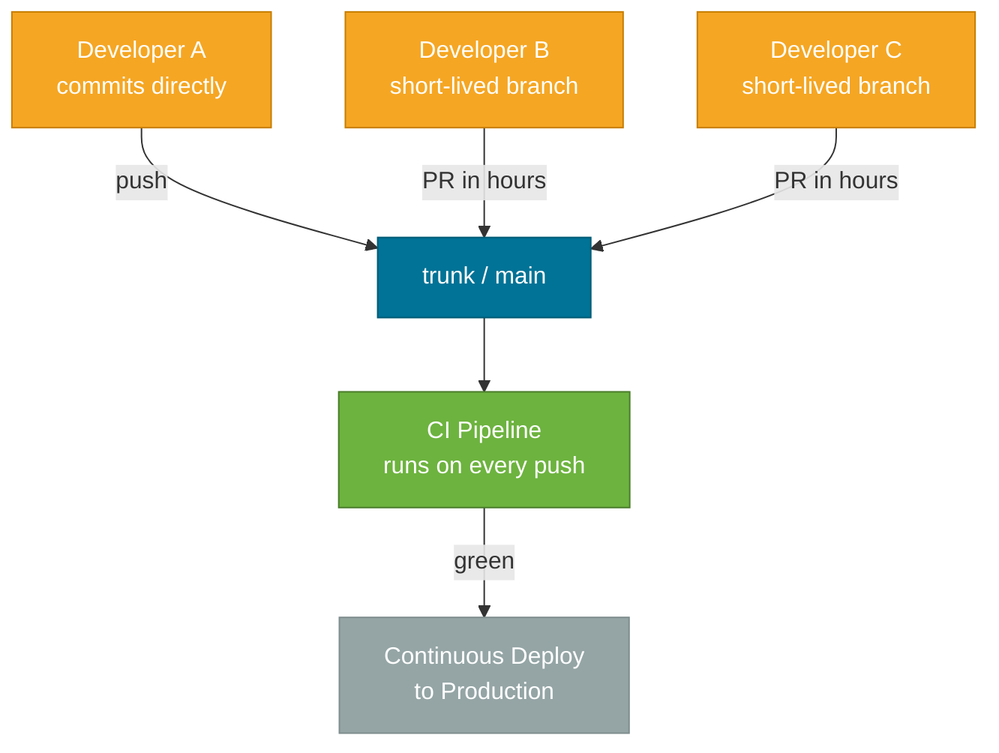

# Branching Strategies

> A branching strategy is a team agreement on how code moves from a developer's laptop to production — it determines release cadence, merge complexity, and CI/CD design.

## What Problem Does It Solve?

A team without a branching convention quickly ends up with dozens of stale branches, merge conflicts that take days to resolve, or a broken main branch that blocks everyone. The reverse is also painful: an overly rigid branching model adds ceremony to every small change and slows releases.

A good branching strategy answers three questions:
1. Where does new code get developed?
2. How does it get reviewed and integrated?
3. How does it get deployed to production?

The answer to those questions differs dramatically by team size, release frequency, and product type.

## The Three Main Strategies

### Git Flow

Introduced by Vincent Driessen in 2010, Git Flow defines a strict set of long-lived branches:

| Branch | Purpose |
|--------|---------|
| `main` (or `master`) | Production-ready code. Tagged at every release. |
| `develop` | Integration branch — all features merge here first. |
| `feature/*` | One branch per feature, branched from `develop`. |
| `release/*` | Stabilization branch for an upcoming release. |
| `hotfix/*` | Emergency fixes branched directly from `main`. |



*Git Flow's branch topology — blue=main, green=develop, orange=features, gray=release, red=hotfix.*

**When it fits:**  
- Versioned, scheduled releases (libraries, packaged software shipped quarterly)
- Multiple versions in production simultaneously (e.g., v1.x still gets security patches)
- Teams that can't do continuous deployment

**When it doesn't fit:**  
- Web apps that deploy multiple times per day
- Small teams where the ceremony exceeds the benefit

---

### GitHub Flow

A much simpler model designed for continuous delivery:

1. `main` is always deployable.
2. Create a short-lived feature branch off `main`.
3. Open a pull request, review, and discuss.
4. Merge to `main` once approved.
5. Deploy immediately after merge (or trigger CI/CD automatically).



*GitHub Flow keeps `main` permanently deployable — branches are short-lived and PRs are the integration checkpoint.*

**When it fits:**  
- Web apps deployed on every merge
- Small to medium teams (2–20 engineers)
- When feature flags handle incomplete features in production

**When it doesn't fit:**  
- Products needing coordinated releases across multiple repos
- Features that take weeks and can't be hidden behind flags

---

### Trunk-Based Development (TBD)

The most extreme simplification: everyone integrates into a single shared branch (`main` or `trunk`) multiple times per day. Feature branches exist but are very short-lived (< 1 day ideally, < 2–3 days max).

Key techniques that make TBD safe:
- **Feature flags** — merge incomplete code hidden behind a runtime toggle.
- **Branch by abstraction** — introduce an abstraction layer to swap implementations gradually.
- **Expand/contract pattern** — add the new code alongside the old, gradually migrate callers, then remove the old.



*TBD keeps all developers integrating to trunk multiple times per day — feature flags protect production from incomplete features.*

**When it fits:**  
- High-velocity SaaS teams deploying dozens of times per day
- When you have comprehensive automated test coverage
- Teams practicing CI/CD as a first-class concern

**When it doesn't fit:**  
- Teams without automated tests — TBD without tests is chaos
- Immature CI/CD pipelines that take 30+ minutes to run

## Comparison Table

| Dimension | Git Flow | GitHub Flow | Trunk-Based Dev |
|-----------|----------|-------------|-----------------|
| Long-lived branches | 2 (`main`, `develop`) | 1 (`main`) | 1 (`trunk`) |
| Release mechanism | `release/*` branch | Tag on `main` | Continuous / feature flags |
| Deploy frequency | Per scheduled release | Per PR merge | Multiple times / day |
| Hotfix support | `hotfix/*` branch | Direct PR to `main` | Direct push or PR to trunk |
| CI/CD complexity | High | Medium | Low pipelines, high test coverage |
| Best for | Versioned releases | Continuous delivery | High-velocity SaaS |

## Code Examples

### Creating Branches per Git Flow

```bash
# Start a new feature (from develop)
git checkout develop
git checkout -b feature/user-authentication  # ← feature branches prefix with feature/

# Work on the feature, then merge back
git checkout develop
git merge --no-ff feature/user-authentication  # ← --no-ff preserves the merge commit
git branch -d feature/user-authentication

# Create a release branch
git checkout -b release/1.2.0 develop  # ← branch release from develop
# bump version numbers, test, fix bugs
git checkout main
git merge --no-ff release/1.2.0
git tag -a v1.2.0 -m "Release 1.2.0"  # ← annotated tag marks the release
git checkout develop
git merge --no-ff release/1.2.0        # ← back-merge to keep develop updated
```

### GitHub Flow Daily Workflow

```bash
# 1. Start fresh off main
git checkout main
git pull origin main
git checkout -b feature/search-autocomplete

# 2. Develop, commit frequently
git add .
git commit -m "feat: add search autocomplete endpoint"

# 3. Push and open a PR
git push origin feature/search-autocomplete
# → open PR on GitHub

# 4. After approval, merge and deploy
# Done via GitHub UI; CI/CD pipeline triggers on merge to main
```

### Trunk-Based: Feature Flags in Spring Boot

```java
// Feature flag via configuration property
@RestController
public class SearchController {

    @Value("${feature.search-autocomplete.enabled:false}")   // ← defaults to false if not set
    private boolean autocompleteEnabled;

    @GetMapping("/search")
    public ResponseEntity<SearchResponse> search(@RequestParam String q) {
        if (autocompleteEnabled) {
            return ResponseEntity.ok(searchService.searchWithAutocomplete(q));  // ← new path
        }
        return ResponseEntity.ok(searchService.search(q));  // ← existing path
    }
}
```

```yaml
# application.yml — production (flag off until ready)
feature:
  search-autocomplete:
    enabled: false
```

```yaml
# application-staging.yml — staging (flag on for testing)
feature:
  search-autocomplete:
    enabled: true
```

## Trade-offs & When To Use / Avoid

| | Pros | Cons |
|--|------|------|
| **Git Flow** | Clear release lifecycle; supports multiple live versions; well-understood by teams | High merge overhead; long-lived branches cause integration debt; slow release cycles |
| **GitHub Flow** | Simple; works well with CI/CD; low ceremony | Requires discipline to keep main green; harder to support multiple versions |
| **Trunk-Based** | Fastest integration; eliminates merge conflicts; forces small PRs | Requires mature test coverage and CI/CD; incomplete features need feature flags |

## Best Practices

- **Choose based on deploy frequency, not team preference.** If you ship daily, Git Flow will slow you down. If you ship quarterly, TBD without rigorous testing will create chaos.
- **Keep feature branches short-lived regardless of the model.** Branches longer than 2–3 days accumulate large diffs that are hard to review and merge.
- **Protect `main` with branch protection rules.** Require at least one approval and a passing CI pipeline before merging. This applies to all three models.
- **Use meaningful branch names.** `feature/JIRA-123-user-auth` beats `johns-stuff`. Include the ticket number for traceability.
- **Delete merged branches immediately.** Stale branches are noise. Configure GitHub/GitLab to auto-delete branches after merge.
- **Back-merge in Git Flow diligently.** Forgetting to merge `release/*` back into `develop` causes divergence and painful future merges.

## Common Pitfalls

**Long-lived feature branches** — the longer a branch lives, the harder it merges. A two-week-old feature branch may require days to merge. Use feature flags to merge code early even if the feature isn't visible.

**Merging `main` into a feature branch with `git merge`** — this brings a merge commit into your feature branch and muddies its history. Use `git rebase main` instead to keep a linear history that's easier to review on PR.

**Using Git Flow for a web app that deploys daily** — the `release/*` branch model adds ceremony that blocks the continuous delivery pipeline. Switch to GitHub Flow or TBD.

**No branch protection on `main`** — without required reviews and CI checks, developers accidentally push broken code directly. This is the most common cause of "the build is broken, who pushed to main?"

## Interview Questions

### Beginner

**Q:** What is a branching strategy and why does it matter?
**A:** A branching strategy is a team convention for how branches are created, named, and merged. It matters because without one, teams get long-lived stale branches, difficult merges, and unpredictable release processes. The right strategy depends on how often the team deploys.

**Q:** What is the main difference between Git Flow and GitHub Flow?
**A:** Git Flow has two permanent branches (`main` and `develop`) and separate `feature`, `release`, and `hotfix` branches — it's designed for scheduled versioned releases. GitHub Flow has one permanent branch (`main`) and short-lived feature branches merged directly via pull requests — it's designed for continuous delivery.

### Intermediate

**Q:** What is trunk-based development and what does it require to work safely?
**A:** Trunk-based development means all developers integrate into one shared `trunk`/`main` branch multiple times per day, keeping feature branches very short-lived (under a day or two). For it to work safely, teams need: comprehensive automated test coverage, fast CI pipelines, feature flags to hide incomplete work, and a culture of small incremental commits.

**Q:** When would you choose Git Flow over trunk-based development?
**A:** Git Flow is better when you maintain multiple released versions simultaneously (e.g., v1.x still gets security patches while v2.x is in development), or when releases are scheduled events (e.g., quarterly) rather than continuous. Libraries, SDKs, and enterprise software with formal release processes are common Git Flow use cases.

### Advanced

**Q:** How do feature flags interact with a trunk-based branching model at scale?
**A:** Feature flags let unfinished code live in `main` (hidden from users) while developers continue integrating. At scale this means a feature flag management system (e.g., LaunchDarkly, Spring's `@ConditionalOnProperty`) becomes a critical piece of infrastructure. Flags need lifecycle management — old flags must be cleaned up or they accumulate as technical debt. Teams should treat removing a shipped flag as mandatory cleanup, tracked in the same sprint.

**Follow-up:** What is the "expand/contract" pattern?
**A:** Expand/contract (also called parallel change) is a technique for making breaking changes safely on trunk. First "expand" by adding the new behavior alongside the old. Migrate all callers gradually. Then "contract" by removing the old behavior. This lets any intermediate state be deployed to production without breaking consumers.

## Further Reading

- [A successful Git branching model (Vincent Driessen)](https://nvie.com/posts/a-successful-git-branching-model/) — the original Git Flow article; also contains the author's 2020 note acknowledging its limitations for web apps
- [Trunk-Based Development](https://trunkbaseddevelopment.com/) — comprehensive reference site for TBD, with techniques, team sizes, and CI/CD integration
- [GitHub Flow](https://docs.github.com/en/get-started/using-github/github-flow) — GitHub's official description of its recommended workflow

## Related Notes

- [Git Object Model](./git-object-model.md) — branches are just SHA-1 pointer files; understanding this makes "merging a branch" concrete rather than magical
- [Rebase vs. Merge](./rebase-vs-merge.md) — each branching strategy has a preferred integration style; Git Flow typically uses merge commits while TBD prefers squash or rebase
- [Git Hooks & Workflows](./git-hooks-workflows.md) — branch protection and pre-commit hooks enforce the conventions defined by the chosen branching strategy
