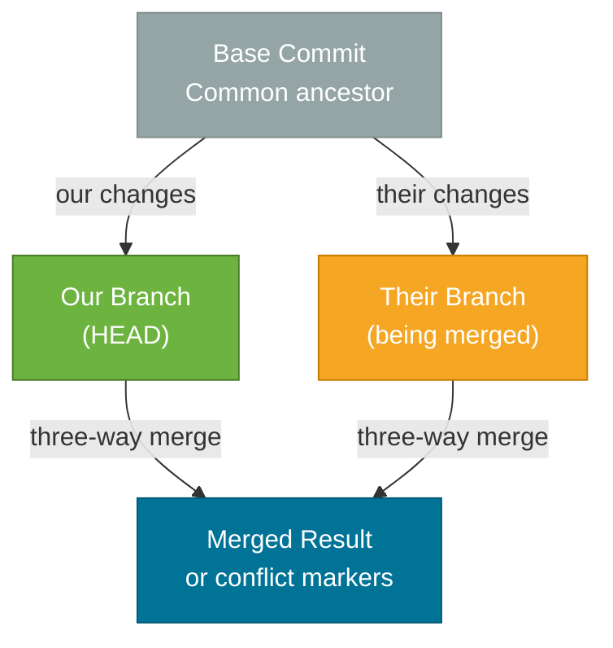
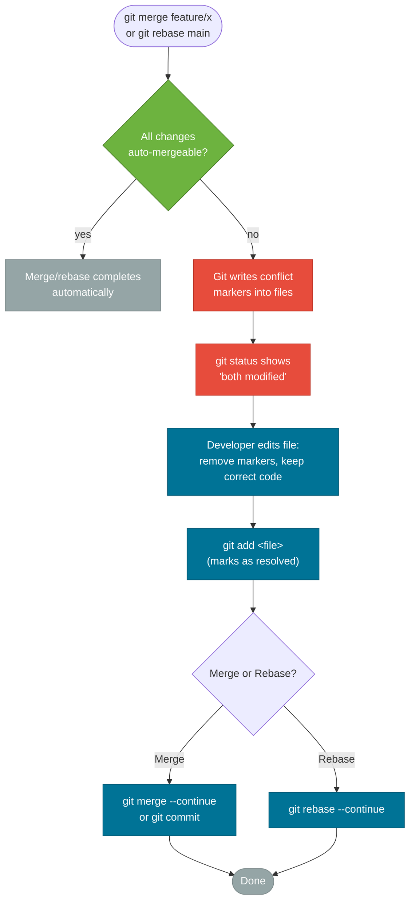

# Conflict Resolution

> A merge conflict is Git saying "I found two different answers to the same question — you need to decide which is right."

## What Problem Does It Solve?

Merge conflicts are inevitable in any team that works on shared code. But most developers dread them more than necessary — they either avoid merges (leading to dangerously long-lived branches) or resolve conflicts mechanically without understanding what they're choosing between.

Understanding *why* conflicts occur, what the conflict markers mean, and how three-way merge works lets you resolve conflicts confidently and correctly. Tools like `git rerere` reduce the pain when the same conflict reappears across multiple branches.

## What Is a Conflict?

A conflict occurs when Git cannot automatically determine which version of a change to keep. This happens when:

1. **Two branches modified the same lines** in the same file differently.
2. **One branch deleted a file** that another branch modified.
3. **Both branches added the same file** with different content.

Git does not conflict on changes to *different* lines of the same file — it merges those automatically.

## How Three-Way Merge Works

Git uses a **three-way merge algorithm** when integrating branches that have diverged. It needs three commits:

1. **Base** — the common ancestor commit (where both branches last agreed)
2. **Ours** — the tip of the current branch (HEAD)
3. **Theirs** — the tip of the branch being merged



*Three-way merge needs the common ancestor (base), our version, and their version to determine what changed and whether the changes are compatible.*

**Auto-resolution rules:**
- If only "ours" changed a line → keep our version
- If only "theirs" changed a line → keep their version  
- If both changed a line identically → keep the common result
- If both changed a line **differently** → **conflict**

## Understanding Conflict Markers

When a conflict occurs, Git writes markers directly into the file:

```
<<<<<<< HEAD
public String getStatus() {
    return "active";
}
=======
public String getStatus() {
    return "ACTIVE";  // uppercase for consistency
}
>>>>>>> feature/normalize-casing
```

| Marker | Meaning |
|--------|---------|
| `<<<<<<< HEAD` | Start of your version (current branch) |
| `=======` | Separator between the two versions |
| `>>>>>>> feature/normalize-casing` | End of incoming version (branch being merged) |

Everything between `<<<<<<<` and `=======` is **what your branch has**. Everything between `=======` and `>>>>>>>` is **what the other branch has**.

There is also a **diff3 style** that shows the base version too:

```bash
git config --global merge.conflictstyle diff3
```

```
<<<<<<< HEAD
return "active";
||||||| base
return "pending";
======= 
return "ACTIVE";
>>>>>>> feature/normalize-casing
```

With `diff3`, the middle section shows the original (base) value — this is often the most useful context for understanding which change is "right".

## How It Works: Step by Step



*Conflict resolution flow — Git marks conflicts, you edit and stage, then continue the operation.*

## Code Examples

### Triggering and Resolving a Conflict Manually

```bash
# Check which files have conflicts
git status
# both modified: src/main/java/com/example/UserService.java

# See the full diff including conflict markers
git diff

# Option 1: Edit the file manually
#   - Remove the <<<<<<<, =======, and >>>>>>> markers
#   - Keep whichever version is correct (or combine both)
nano src/main/java/com/example/UserService.java

# Stage the resolved file
git add src/main/java/com/example/UserService.java

# If this was a merge:
git merge --continue     # ← or just: git commit (opens editor for merge commit message)

# If this was a rebase:
git rebase --continue    # ← proceed to the next replayed commit
```

### Using a Merge Tool

```bash
# Use the configured merge tool (shows three-panel diff: ours, base, theirs)
git mergetool

# Specify a tool directly
git mergetool --tool=vimdiff
git mergetool --tool=vscode   # ← VS Code is a great merge tool

# Configure VS Code as the default merge tool
git config --global merge.tool vscode
git config --global mergetool.vscode.cmd 'code --wait $MERGED'
```

### Aborting a Merge or Rebase

```bash
# Abandon a merge mid-conflict and return to pre-merge state
git merge --abort

# Abandon a rebase mid-conflict and return to pre-rebase state
git rebase --abort
```

### Finding the Common Ancestor (Merge Base)

```bash
# Find the common ancestor commit of two branches
git merge-base main feature/login
# prints: 7b3c44...  (the base commit SHA-1)

# See what changed since the common ancestor
git diff 7b3c44..HEAD          # ← our changes since base
git diff 7b3c44..feature/login # ← their changes since base
```

### Using `git rerere` (Reuse Recorded Resolution)

`git rerere` ("reuse recorded resolution") records how you resolved a conflict and automatically reapplies that resolution if the same conflict appears again. This is invaluable when rebasing a long-lived branch multiple times.

```bash
# Enable rerere
git config --global rerere.enabled true

# Now, next time you resolve a conflict, rerere records it
# If the same conflict reappears (e.g., same rebase next week), Git auto-resolves it

# See what resolutions rerere has recorded
git rerere status

# See the recorded resolution diff
git rerere diff

# Forget a recorded resolution (if it was wrong)
git rerere forget path/to/file.java
```

## Best Practices

- **Enable `merge.conflictstyle diff3`** globally. Seeing the base version alongside both sides of a conflict makes the right resolution much more obvious.
- **Enable `rerere` globally** (`git config --global rerere.enabled true`). There is almost no downside — it records your resolutions silently and replays them when the same conflict recurs.
- **Integrate frequently to minimize conflicts.** The longer a branch lives without integrating, the larger and more complex the conflicts become. Daily `git rebase main` on feature branches keeps conflicts small and contextual.
- **Use `git mergetool` for complex conflicts.** A visual three-pane diff (ours / base / theirs) far outperforms reading raw conflict markers in a text editor.
- **Never leave `<<<<<<` markers in committed code.** Add a CI linter or pre-commit hook that fails the build if conflict markers are present in source files.

## Common Pitfalls

**Accepting "ours" or "theirs" blindly** — `git checkout --ours <file>` or `git checkout --theirs <file>` takes one side wholesale. This is only safe when you know with certainty one side is entirely correct. In most cases you need to manually review and combine the changes.

**Staging without resolving** — Running `git add <file>` marks a file as resolved whether or not you removed the conflict markers. Git will commit the raw markers if you're not careful. Always visually verify the file before staging.

**Confusing merge `--continue` with `git commit`** — Both work after a merge conflict, but `git merge --continue` is safer because it validates all conflicts are resolved before creating the commit.

**Forgetting `git rebase --continue` after resolving conflicts mid-rebase** — Each conflicting commit in a rebase must be resolved and continued separately. After `git add` for a conflict, always run `git rebase --continue`, not `git commit`.

**Long-lived branches as a strategy to "avoid" conflicts** — Delays don't reduce conflicts; they concentrate them. The larger the diff, the harder the conflict.

## Interview Questions

### Beginner

**Q:** What is a merge conflict and when does one occur?
**A:** A merge conflict occurs when Git cannot automatically decide which version of a change to keep — specifically when two branches modified the same lines in the same file differently. Git pauses the merge, writes conflict markers into the affected files, and waits for the developer to resolve and re-stage them.

**Q:** What do the `<<<<<<<`, `=======`, and `>>>>>>>` markers mean?
**A:** They delimit the conflicting change. Everything between `<<<<<<<` and `=======` is your version (HEAD). Everything between `=======` and `>>>>>>>` is the incoming version (the branch being merged). To resolve you delete the markers and keep the correct final content.

### Intermediate

**Q:** What is a three-way merge?
**A:** A three-way merge uses three commits: the common ancestor (base), the current branch (ours), and the incoming branch (theirs). By comparing each change against the base, Git can auto-resolve changes that only one side made. Only when both sides changed the same line differently is a conflict produced, which is more accurate than a two-way diff.

**Q:** What does `git rerere` do and when is it useful?
**A:** `rerere` stands for "reuse recorded resolution." When you resolve a conflict, Git records the before/after state. If the same conflict reappears — common when rebasing a long-lived branch repeatedly against an evolving `main` — Git automatically applies the previously recorded resolution. It's especially useful in teams managing long-running release branches.

### Advanced

**Q:** How would you resolve a conflict where one branch deleted a file and another modified it?
**A:** Git marks the file as "deleted by us" or "modified by them" in `git status`. You must explicitly decide: if the deletion should win, run `git rm <file>` to accept the deletion; if the modification should win, run `git add <file>` to keep the modified version. There is no middle-ground automatic resolution.

**Q:** How do you prevent conflict markers from accidentally reaching production?
**A:** Add a pre-commit hook (or CI check) that scans staged files for `<<<<<<<` strings and exits with a non-zero code if found. In Maven/Gradle builds, this can be a checkstyle rule or a simple `grep` in a CI script. Tools like `pre-commit` make this easy to configure across the team.

## Further Reading

- [Git Branching — Basic Branching and Merging](https://git-scm.com/book/en/v2/Git-Branching-Basic-Branching-and-Merging) — the canonical Pro Git chapter on merging and conflict basics
- [Git Tools — Advanced Merging](https://git-scm.com/book/en/v2/Git-Tools-Advanced-Merging) — covers `rerere`, merge strategies, and conflict resolution options in depth
- [git-rerere documentation](https://git-scm.com/docs/git-rerere) — official manpage with flags and configuration

## Related Notes

- [Rebase vs. Merge](./rebase-vs-merge.md) — rebase raises conflicts one commit at a time rather than all at once; understanding both gives you flexibility in resolution
- [Branching Strategies](./branching-strategies.md) — short-lived branches (TBD, GitHub Flow) minimize conflict severity; Git Flow's long branches maximize it
- [Git Hooks & Workflows](./git-hooks-workflows.md) — pre-commit hooks can automatically detect and reject files containing leftover conflict markers
