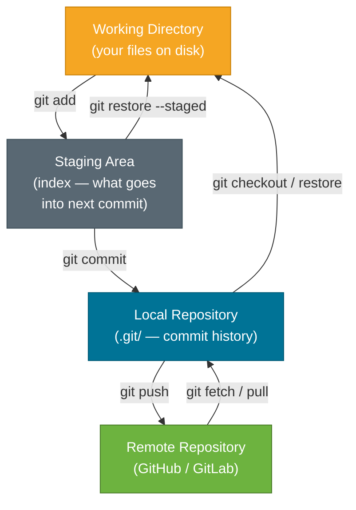
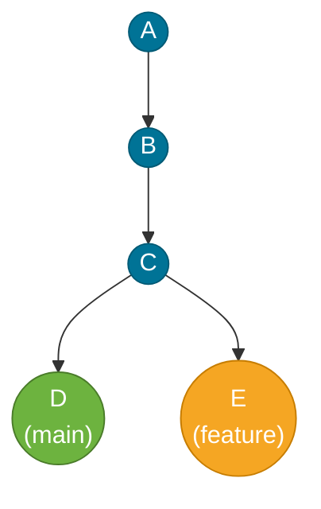
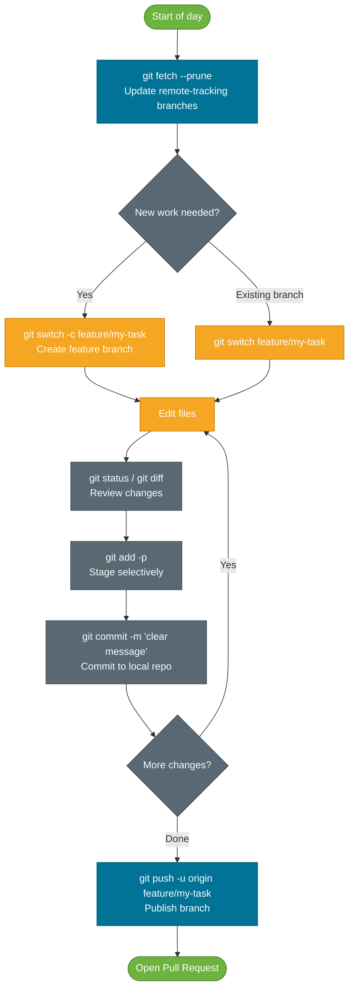

# Git Basics

> Git tracks snapshots of your project over time, letting you collaborate, experiment safely, and recover from mistakes — the three areas (working directory, staging area, repository) are the mental model that makes everything else intuitive.

## What Problem Does It Solve?

Before version control, teams shared code by emailing zip files, appending numbers to filenames (`Service_v2_FINAL_jan.java`), or overwriting each other's changes on a shared drive. Even solo developers would lose work when a "fix" broke something that had been working.

Git solves three distinct problems:

1. **History** — every version of every file is saved forever; any snapshot can be restored at any time.
2. **Collaboration** — multiple people work on the same codebase simultaneously without constantly stepping on each other's changes.
3. **Experimentation** — branches let you try ideas without touching stable code; if the experiment fails, just delete the branch.

Understanding Git's three-area model from the start prevents the confusion most developers face when commands "don't do what I expected."

## What Is Git?

Git is a **distributed version control system (DVCS)**. Each team member holds a complete, independent copy of the repository — including the full history — on their own machine. There is no single authoritative server that developers must always be connected to; the server (GitHub, GitLab, Bitbucket) is just one more copy that the team has agreed to treat as the coordination point.

Three properties make Git different from older systems like SVN:

- **Snapshot-based, not diff-based**: Git records the state of all tracked files at every commit, not a list of line-by-line changes. (Unmodified files are stored as references to the previous snapshot, so storage stays efficient.)
- **Nearly every operation is local**: `git log`, `git diff`, `git branch` — all run entirely from the `.git/` folder on your disk, with no network call.
- **Content-addressable storage**: every object (file, directory snapshot, commit) is identified by the SHA-1 hash of its content, making history cryptographically tamper-evident.

## Analogy: The Photo Album

Think of your project as a photo shoot in progress. At any point you can:

- **Stage a shot** (select which photos to include in the album page)
- **Commit the page** (glue those selected photos onto the page permanently — you can never un-glue them, but you can add new pages)
- **Keep outtakes** in a folder on your desk (the working directory) — these are not yet in the album

The album = your local repository. The photo lab = the remote. Developing a roll of film = a `git push`.

## The Three-Area Model

This is the single most important mental model in Git. Every file in your project lives in one of three areas at any given moment:



*The four Git areas and the commands that move changes between them. `git add` promotes changes to staging; `git commit` makes them permanent in the local repo; `git push` shares them with the remote.*

| Area | Where it lives | What it contains |
|------|---------------|-----------------|
| **Working directory** | Your filesystem | Files you're actively editing — tracked, untracked, or ignored |
| **Staging area** (index) | `.git/index` | The exact snapshot that will become the next commit |
| **Local repository** | `.git/objects/` | All commits, trees, blobs — the full history |
| **Remote repository** | GitHub / GitLab / etc. | The shared coordination copy |

The staging area surprises most beginners. It is intentional: it lets you craft a commit with only *some* of your current changes, even from within a single modified file (using `git add -p` for patch-mode staging).

## Core Commands

### Starting a Repository

```bash
# Create a brand-new repo in the current directory
git init

# Clone an existing remote repo into a new directory
git clone https://github.com/example/my-app.git

# Clone into a specific directory name
git clone https://github.com/example/my-app.git local-name
```

### Inspecting State

```bash
# Show status of working directory and staging area
git status

# Show what git status means in short format
git status -s

# Show unstaged changes (working directory vs. index)
git diff

# Show staged changes (index vs. last commit — what will be committed)
git diff --staged

# Show commit history (one line per commit)
git log --oneline

# Show commit history with a visual branch graph
git log --oneline --graph --all
```

### Staging and Committing

```bash
# Stage a specific file
git add src/Main.java

# Stage all changes in current directory (and below)
git add .

# Stage only parts of a file interactively (hunk-by-hunk)
git add -p src/Service.java        # ← lets you build precise commits

# Commit with an inline message
git commit -m "feat: add user authentication endpoint"

# Stage all tracked files and commit in one step
git commit -am "fix: correct null check in UserService"   # ← skips staging for new (untracked) files

# Amend the most recent commit (change message or add forgotten file)
git commit --amend                  # ← never do this after pushing
```

### Undoing Changes

```bash
# Discard changes in working directory (restore to last commit)
git restore src/Main.java

# Unstage a file (move it back from index to working directory)
git restore --staged src/Main.java

# Revert a specific commit by creating a new undo commit (safe for shared branches)
git revert <commit-sha>

# Reset locally to a previous commit (rewrites history — dangerous on shared branches)
git reset --hard HEAD~1             # ← discards last commit AND staged/working changes
git reset --soft HEAD~1             # ← undoes last commit but keeps changes staged
git reset --mixed HEAD~1            # ← (default) undoes commit and unstages, keeps working dir
```

### Saving Work-in-Progress

```bash
# Save uncommitted work onto a stack and clean working directory
git stash

# Include untracked files with a description
git stash push -u -m "WIP: payment flow refactor"

# List saved stashes
git stash list

# Re-apply most recent stash and remove it from the stack
git stash pop

# Re-apply a specific stash without removing it
git stash apply stash@{2}
```

### Viewing History

```bash
# Show full details of a specific commit
git show <commit-sha>

# Who last modified each line of a file and in which commit
git blame src/UserService.java

# Search commit messages for a keyword
git log --oneline --grep="authentication"

# Find which commit introduced a string (useful for regression bugs)
git log -S "paymentGateway.charge("     # ← "pickaxe" search
```

## Branching Basics

A branch is nothing more than a lightweight pointer — a 41-byte file containing a SHA-1 — that advances automatically with each new commit. Creating or deleting branches in Git is nearly free (O(1)).



*Commits A→B→C are shared history. `main` and `feature` are just pointers to different commits after the branch point C.*

```bash
# List all local branches (asterisk = current branch)
git branch

# List remote-tracking branches too
git branch -a

# Create a new branch (does NOT switch to it)
git branch feature/user-auth

# Switch to an existing branch (modern syntax)
git switch feature/user-auth

# Create a new branch AND switch to it
git switch -c feature/user-auth

# Older syntax (still works and widely used)
git checkout -b feature/user-auth

# Rename the current branch
git branch -m new-name

# Delete a branch (only if already merged)
git branch -d feature/user-auth

# Delete a branch forcefully (even if not merged)
git branch -D feature/user-auth

# Merge a branch into the current branch
git merge feature/user-auth
```

### HEAD

`HEAD` is Git's "you are here" marker. Normally it points to a branch name (e.g., `refs/heads/main`), which in turn points to the latest commit on that branch. When you check out a raw commit SHA-1 instead of a branch, Git enters **detached HEAD** state — any commits you make won't be tracked by a branch and will be garbage-collected if you switch away without saving them.

```bash
# Enter detached HEAD (avoid unless inspecting a specific commit)
git checkout abc1234

# Escape detached HEAD by creating a branch
git switch -c hotfix/temp-fix
```

## .gitignore

`.gitignore` tells Git which files and directories to never track. Place it at the repository root (it can also appear in subdirectories for path-local rules):

```gitignore
# Build output
target/
build/
*.class

# IDE files (keep out of shared repo)
.idea/
*.iml
.vscode/

# Environment secrets — never commit these
.env
.env.local
application-local.properties

# OS noise
.DS_Store
Thumbs.db

# Logs
*.log
logs/
```

:::warning Important
`.gitignore` only ignores **untracked** files. If you already committed a file and then add it to `.gitignore`, Git continues tracking it. Fix it with:

```bash
git rm --cached path/to/already-tracked-file
git commit -m "chore: stop tracking secrets file"
```
:::

Use [gitignore.io](https://www.toptal.com/developers/gitignore) to generate language- and IDE-specific `.gitignore` templates instantly.

## The Daily Git Workflow



*A typical daily workflow: fetch first to see what's changed, work on a feature branch, commit frequently with clear messages, push and open a PR.*

## Best Practices

- **Commit early, commit often** — small, focused commits are easier to review, revert, and bisect. A commit should do one logical thing.
- **Write meaningful commit messages** — use the imperative mood and explain *what* and *why*, not *how*: `feat: add rate limiting to login endpoint`, not `changed stuff`.
- **Follow Conventional Commits** — the format `<type>(<scope>): <subject>` (`feat`, `fix`, `chore`, `refactor`, `docs`, `test`) gives tools like semantic-release something to parse.
- **Stage with precision** — use `git add -p` (patch mode) to stage only the lines relevant to the current task; avoid `git add .` as a default habit.
- **Never commit secrets** — API keys, passwords, and `.env` files should be in `.gitignore` before any code is written. Once pushed, assume the secret is compromised (even after deletion from history).
- **Keep branches short-lived** — the longer a branch lives apart from `main`, the larger the merge conflict risk. Aim for branches merged within 1–2 days.
- **Pull before pushing** — run `git fetch` (or `git pull --rebase`) before pushing to avoid rejected pushes and unnecessary merge commits.
- **Don't amend or rebase pushed commits** — rewriting a commit that colleagues have already fetched causes their local history to diverge and forces them to do painful repairs.

## Common Pitfalls

**Treating `git add .` as the only way to stage.** Using `git add .` mindlessly includes debug code, commented-out experiments, and unrelated fixes in a commit. Use `git add -p` or stage specific files to keep commits focused.

**Forgetting the difference between `git restore` and `git restore --staged`.** `git restore <file>` discards working directory changes (potentially losing unsaved work). `git restore --staged <file>` moves the file from the index back to the working directory — the change is NOT lost. Confusing the two is one of the most common ways to accidentally lose work.

**Committing sensitive data.** Once a file containing a secret is pushed, the secret is compromised regardless of whether you delete it in a follow-up commit — the secret is still visible in the history. Use tools like `git-secrets` or `truffleHog` to scan before pushing, and rotate credentials immediately if a secret is exposed.

**Ending up in detached HEAD without realizing it.** Running `git checkout <sha>` or `git checkout <tag>` silently enters detached HEAD state. Any commits made are orphaned when you switch branches. Always check `git status` — it will tell you "HEAD detached at abc1234."

**Using `git reset --hard` carelessly.** `git reset --hard` discards all staged and unstaged changes with no undo. If you accidentally reset, run `git reflog` immediately — Git keeps a log of every HEAD movement for ~90 days, so the "lost" commit can almost always be recovered via `git checkout <sha>`.

**Committing large binary files.** `git clone` downloads all history, so large binaries bloat clone times permanently. Use Git LFS (Large File Storage) for binaries, assets, and ML models.

## Interview Questions

### Beginner

**Q: What are the three areas in Git and what moves data between them?**
**A:** Working directory (files on disk), staging area (index, in `.git/index`), and local repository (commit history in `.git/objects/`). `git add` moves changes from working directory to staging. `git commit` moves staged changes into a permanent commit in the repository. `git restore` moves from repository/staging back to working directory. A fourth area — the remote — is connected via `git push` and `git fetch`.

**Q: What is the difference between `git diff` and `git diff --staged`?**
**A:** `git diff` (without flags) shows unstaged changes — the difference between the working directory and the staging area (index). `git diff --staged` (also written `--cached`) shows staged changes — the difference between the staging area and the last commit. This is what will go into the next `git commit`.

**Q: What is the purpose of the staging area? Why doesn't Git just commit all changes directly?**
**A:** The staging area lets you craft a commit with precisely the changes you intend, even if you have half-finished work in other files at the same time. You can use `git add -p` to stage individual hunks within a file, letting one file contribute to multiple logically separate commits. This results in cleaner, more reviewable history than "commit everything at once."

**Q: What does `git status` tell you?**
**A:** `git status` shows three categories: (1) staged changes ready to be committed, (2) tracked files with unstaged changes, and (3) untracked files Git has never seen. It also tells you which branch you're on, whether your branch is ahead of or behind its remote-tracking branch, and whether HEAD is detached.

**Q: How do you undo a `git add` before committing?**
**A:** Use `git restore --staged <file>` to move the file from the staging area back to the working directory. The file's changes are preserved on disk; they're just no longer staged. (Older equivalent: `git reset HEAD <file>`.)

### Intermediate

**Q: What is the difference between `git reset --soft`, `--mixed`, and `--hard`?**
**A:** All three reset the current branch pointer to the specified commit. The difference is what happens to staged and working directory changes:
- `--soft`: moves HEAD only; staged changes and working directory are left intact — everything looks "just staged."
- `--mixed` (default): moves HEAD and clears the index (unstages); working directory changes are preserved.
- `--hard`: moves HEAD, clears the index, AND discards working directory changes — the most destructive; all uncommitted work is gone.

**Q: How do you recover a commit after `git reset --hard`?**
**A:** Run `git reflog` to see the history of HEAD movements. Every commit, even a "reset" one, is listed with its SHA-1. Use `git checkout <sha>` to inspect it in detached HEAD, then `git switch -c recovery-branch` to save it as a branch, or use `git reset --hard <sha>` to restore it directly. Git retains unreachable objects for ~90 days before garbage collection.

**Q: What is the difference between `git revert` and `git reset`?**
**A:** `git revert <sha>` creates a **new commit** that undoes the changes of a specific commit, leaving history intact. It is safe to use on shared or pushed branches. `git reset` moves the branch pointer backward, effectively removing commits from history. It is only safe on local-only branches because it rewrites SHA-1s that teammates may already have fetched.

### Advanced

**Q: What happens internally when you run `git commit`?**
**A:** Git (1) takes a snapshot of the staging area (index) and writes each file as a blob object in `.git/objects/`. (2) Creates tree objects representing the directory structure. (3) Creates a commit object storing: the root tree SHA-1, the parent commit SHA-1(s), author, committer, timestamp, and message — all hashed together into the new commit's SHA-1. (4) Updates the current branch ref file (e.g., `.git/refs/heads/main`) to point to the new commit SHA-1. (5) Updates `.git/ORIG_HEAD` for safety during resets. The process is entirely local and takes milliseconds.

**Q: What is `git add -p` and why should you use it habitually?**
**A:** `git add -p` (patch mode) presents each modified hunk interactively, letting you choose to stage (`y`), skip (`n`), split into smaller hunks (`s`), or edit manually (`e`). Using it habitually means every commit contains only the changes it claims to contain — no accidentally staged debug logs or unrelated refactors. It also forces you to review your own changes before committing, catching obvious bugs before code review.

## Further Reading

- [Pro Git — Git Basics (Chapter 2)](https://git-scm.com/book/en/v2/Git-Basics-Getting-a-Git-Repository) — the canonical, free reference; Chapter 2 covers every core command with examples.
- [Pro Git — Git Branching (Chapter 3)](https://git-scm.com/book/en/v2/Git-Branching-Branches-in-a-Nutshell) — branches, merging, and remote branches explained with diagrams.
- [git-scm.com/docs](https://git-scm.com/docs) — complete command reference with all flags.
- [Conventional Commits specification](https://www.conventionalcommits.org/) — structured commit message format adopted widely in open source and enterprise Java projects.

## Related Notes

- [Git Object Model](./git-object-model.md) — goes deeper into what `git commit` actually stores: blobs, trees, and commit objects as content-addressable SHA-1 hashes. Understanding the object model makes `reset`, `reflog`, and `cherry-pick` intuitive rather than magical.
- [Working with Remotes](./working-with-remotes.md) — covers `fetch` vs. `pull`, remote-tracking branches, and upstream conventions that build directly on the local basics covered here.
- [Rebase vs. Merge](./rebase-vs-merge.md) — the next step after mastering basic branching and merging: when to prefer linear history with rebase, and the Golden Rule that prevents team disasters.
