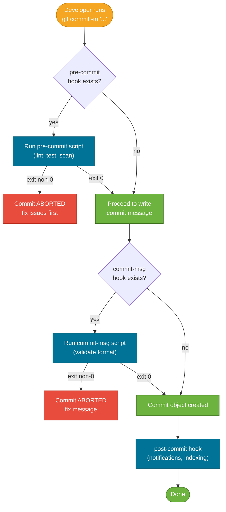

# Git Hooks and Workflows

> A Git hook is a shell script that Git runs automatically at a specific point in your workflow — before a commit, after a push, when a message is written, and more.

## What Problem Does It Solve?

Code review and CI pipelines catch problems *after* code is already committed and pushed. If a developer commits a file with a conflict marker, pushes to the wrong branch, or writes a poorly formatted commit message, the feedback loop is slow — the CI run takes minutes, a reviewer has to leave a comment, or the linter finds the issue after the fact.

Git hooks close that loop by running checks **locally**, at the exact moment the problematic action is about to happen — before the commit is created, before the push is sent, or as the commit message is being written. The earlier a problem is caught, the cheaper it is to fix.

## What Are Git Hooks?

Git hooks are executable scripts in `.git/hooks/`. Git ships with sample scripts for every hook point. To activate a hook, create an executable file with the hook's exact name (no extension) in `.git/hooks/`:

```
.git/hooks/
  pre-commit          ← runs before a commit is created (exit 1 = abort commit)
  commit-msg          ← runs after the commit message is written (exit 1 = abort)
  prepare-commit-msg  ← runs before the commit message editor opens
  post-commit         ← runs after a commit is created (cannot abort)
  pre-push            ← runs before git push sends data to remote
  pre-rebase          ← runs before rebasing starts (exit 1 = abort)
  post-merge          ← runs after a successful merge
  post-checkout       ← runs after git checkout or git switch
```

Exit codes matter:
- **Exit 0** → hook passed; Git continues the operation.  
- **Exit non-zero** → hook failed; Git aborts the operation (for client-side hooks).

:::warning
`.git/hooks/` is not committed to the repository. Scripts placed there exist only on the developer's machine. Team-wide hooks require a sharing mechanism (see [Sharing Hooks Across a Team](#sharing-hooks-across-a-team)).
:::

## How It Works

### Hook Execution Flow



*Git hook execution flow for `git commit` — each hook can abort or pass the operation.*

### Client-Side vs. Server-Side Hooks

| Scope | Hooks | Who runs it |
|-------|-------|-------------|
| **Client-side** | `pre-commit`, `commit-msg`, `pre-push`, `post-merge`, `post-checkout` | Developer's local machine |
| **Server-side** | `pre-receive`, `update`, `post-receive` | Git server (GitHub Actions, GitLab CI, self-hosted) |

Client-side hooks are enforced locally — developers can bypass them with `--no-verify`. Server-side hooks cannot be bypassed.

## Code Examples

### Pre-Commit Hook: Reject Conflict Markers

```bash
#!/bin/sh
# .git/hooks/pre-commit
# Abort commit if any staged file contains unresolved conflict markers

if git diff --cached --name-only | xargs grep -l "^<<<<<<< " 2>/dev/null; then
  echo "ERROR: Conflict markers found in staged files. Resolve conflicts before committing."
  exit 1   # ← non-zero aborts the commit
fi
exit 0
```

Make it executable:
```bash
chmod +x .git/hooks/pre-commit
```

### Pre-Commit Hook: Run Checkstyle on Java Files

```bash
#!/bin/sh
# .git/hooks/pre-commit
# Run Checkstyle on staged Java files only (fast feedback, no full rebuild)

STAGED_JAVA=$(git diff --cached --name-only --diff-filter=ACM | grep '\.java$')

if [ -z "$STAGED_JAVA" ]; then
  exit 0        # ← no Java files staged, nothing to check
fi

echo "Running Checkstyle on staged files..."
./mvnw checkstyle:check -Dcheckstyle.includes="$STAGED_JAVA" --quiet  # ← Maven wrapper

if [ $? -ne 0 ]; then
  echo "Checkstyle violations found. Fix them before committing."
  exit 1
fi
exit 0
```

### Commit-Msg Hook: Enforce Conventional Commits

```bash
#!/bin/sh
# .git/hooks/commit-msg
# Enforce Conventional Commits format:
# <type>(scope): <description>
# e.g., feat(auth): add JWT token refresh endpoint

COMMIT_MSG_FILE=$1
COMMIT_MSG=$(cat "$COMMIT_MSG_FILE")
PATTERN='^(feat|fix|docs|style|refactor|test|chore|perf|ci|build|revert)(\([a-z0-9-]+\))?: .{1,100}$'

if ! echo "$COMMIT_MSG" | grep -qE "$PATTERN"; then
  echo "ERROR: Commit message does not follow Conventional Commits format."
  echo "Expected: <type>(scope): <description>"
  echo "Example:  feat(auth): add JWT token refresh endpoint"
  echo "Types: feat|fix|docs|style|refactor|test|chore|perf|ci|build|revert"
  exit 1
fi
exit 0
```

### Pre-Push Hook: Block Direct Pushes to Main

```bash
#!/bin/sh
# .git/hooks/pre-push
# Prevent direct pushes to main or master (use PRs instead)

PROTECTED_BRANCHES="main master"
CURRENT_BRANCH=$(git symbolic-ref HEAD --short 2>/dev/null)

for branch in $PROTECTED_BRANCHES; do
  if [ "$CURRENT_BRANCH" = "$branch" ]; then
    echo "ERROR: Direct push to '$branch' is not allowed. Use a pull request."
    exit 1
  fi
done
exit 0
```

### Pre-Push Hook: Run Unit Tests Before Pushing

```bash
#!/bin/sh
# .git/hooks/pre-push
# Run unit tests before pushing to remote — catch failures before they reach CI

echo "Running unit tests before push..."
./mvnw test --quiet   # ← Maven wrapper; use ./gradlew test for Gradle

if [ $? -ne 0 ]; then
  echo "Tests failed. Push aborted."
  exit 1
fi
exit 0
```

## Sharing Hooks Across a Team

### Approach 1: `core.hooksPath` (Git 2.9+, Recommended)

```bash
# Create a shared hooks directory in the repo
mkdir -p .githooks

# Add hooks there (these ARE committed to the repo)
cp .git/hooks/pre-commit .githooks/pre-commit
git add .githooks/

# Each developer configures Git to use the shared directory
git config core.hooksPath .githooks

# Or set it automatically via package tooling (Maven/Gradle setup task)
```

Everyone on the team runs `git config core.hooksPath .githooks` once (or it's done by a setup script). Now the hooks are version-controlled and shared.

### Approach 2: The `pre-commit` Framework

The [`pre-commit`](https://pre-commit.com/) Python tool manages hooks as versioned configuration:

```yaml
# .pre-commit-config.yaml (committed to repo root)
repos:
  - repo: https://github.com/pre-commit/pre-commit-hooks
    rev: v4.5.0
    hooks:
      - id: check-merge-conflict       # ← detects conflict markers
      - id: trailing-whitespace
      - id: end-of-file-fixer

  - repo: https://github.com/alessandromagnusson/checkstyle-pre-commit
    rev: v1.0.0
    hooks:
      - id: checkstyle
        args: [--config=checkstyle.xml]
```

Install and activate:
```bash
pip install pre-commit
pre-commit install        # ← installs hooks into .git/hooks/pre-commit automatically
pre-commit run --all-files  # ← run manually on all files any time
```

### Approach 3: Maven/Gradle Plugin

For Java projects, the `git-hooks-maven-plugin` or `gradle-git-hooks` can install hooks automatically during the build:

```xml
<!-- Maven: pom.xml -->
<plugin>
  <groupId>com.rudikershaw.gitbuildhook</groupId>
  <artifactId>git-build-hook-maven-plugin</artifactId>
  <version>3.3.0</version>
  <configuration>
    <installHooks>
      <pre-commit>.githooks/pre-commit</pre-commit>   <!--  ← point to committed script -->
      <commit-msg>.githooks/commit-msg</commit-msg>
    </installHooks>
  </configuration>
  <executions>
    <execution>
      <goals>
        <goal>install</goal>   <!-- ← runs during mvn install, sets up hooks -->
      </goals>
    </execution>
  </executions>
</plugin>
```

## Best Practices

- **Commit hooks to the repo** using `core.hooksPath` or the `pre-commit` framework. Hooks that only live in `.git/hooks/` on one machine are forgotten when the repo is cloned.
- **Keep pre-commit hooks fast (< 5 seconds).** Slow hooks train developers to bypass them with `--no-verify`. Only lint/scan staged files, not the entire project.
- **Use `--no-verify` only in genuine emergencies**, and follow up immediately with the fixes the hook would have caught. Document the exception in the commit message.
- **Combine hooks with CI/CD, not replace them.** Hooks catch problems locally for fast feedback. CI pipelines catch problems on clean machines with full test suites. Both are needed.
- **Enforce protected branches on the server side** (GitHub branch protection, GitLab protected branches) — server-side enforcement cannot be bypassed with `--no-verify`.

## Common Pitfalls

**Hooks disappear after cloning** — `.git/` is never cloned. Solution: use `core.hooksPath` pointed at a committed directory, or use the `pre-commit` framework.

**Slow hooks cause `--no-verify` abuse** — A pre-commit hook that runs the full Maven build takes 2 minutes and developers skip it immediately. Scope hooks to staged files only and offload full builds to CI.

**Non-executable hook scripts** — A hook file must have the executable bit set (`chmod +x`). A hook file without execute permissions is silently ignored — Git won't warn you that it didn't run.

**Server-side hooks not configured** — Client-side hooks are advisory; developers can always bypass them. For true enforcement (e.g., commit message format, branch protection), use server-side rules on GitHub/GitLab, where `--no-verify` has no effect.

**Windows line endings in hook scripts** — Shell scripts with CRLF line endings fail on Unix systems. If the team includes Windows developers, ensure hooks are stored with LF line endings (`.gitattributes` rule: `* text=auto`).

## Interview Questions

### Beginner

**Q:** What is a Git hook?
**A:** A Git hook is an executable script in `.git/hooks/` that Git automatically runs at a specific point in the Git workflow — for example, before a commit is created (`pre-commit`) or after a push is sent (`post-push`). Client-side hooks return a non-zero exit code to abort the operation, or zero to allow it.

**Q:** What is the difference between `pre-commit` and `commit-msg` hooks?
**A:** `pre-commit` runs before the commit message editor opens — it's used to lint code, run tests, or detect conflict markers in staged files. `commit-msg` runs after the developer writes the commit message — it receives the message file path as an argument and can validate message format (e.g., enforce Conventional Commits).

### Intermediate

**Q:** Why is `.git/hooks/` not committed to the repository, and how do teams share hooks?
**A:** Git never versions the `.git/` directory. To share hooks across a team, the most robust approach is to store them in a committed directory (e.g., `.githooks/`) and configure `git config core.hooksPath .githooks`. Alternatively, tools like the `pre-commit` framework manage hook installation via a committed `.pre-commit-config.yaml`.

**Q:** When would you use a server-side hook instead of a client-side hook?
**A:** Client-side hooks can be bypassed with `git push --no-verify` or `git commit --no-verify`. Server-side hooks (`pre-receive`, `update`) run on the Git server and cannot be bypassed. Use server-side hooks for non-negotiable enforcement: branch protection, commit message standards at the repo level, or access control rules.

### Advanced

**Q:** How would you design a pre-commit setup for a large Java microservices monorepo where hooks must be fast?
**A:** Run hooks only on staged files matching a pattern, not on the whole project. Use `git diff --cached --name-only --diff-filter=ACM | grep '\.java$'` to get staged Java files and pass them directly to Checkstyle or SpotBugs. Parallelize checks where possible. Offload integration tests and slow scans to CI. Use the `pre-commit` framework with caching (it hashes tool versions and only re-installs when configs change). Target under 5 seconds for the pre-commit hook to ensure developers keep it enabled.

**Follow-up:** How do you handle the case where a developer uses `--no-verify` to bypass a required check?
**A:** Add a CI step that runs the same checks as the pre-commit hook. The pre-commit hook is a fast local feedback mechanism, not the final gate. The CI pipeline is the authoritative gate. Additionally, log or alert on `--no-verify` usage by parsing commit metadata, and use protected branch rules to require CI to pass before any merge.

## Further Reading

- [Customizing Git — Git Hooks](https://git-scm.com/book/en/v2/Customizing-Git-Git-Hooks) — the canonical Pro Git chapter covering all hook types, client-side and server-side
- [githooks reference](https://git-scm.com/docs/githooks) — official Git documentation listing every hook, its inputs, and its effect on exit code
- [pre-commit framework](https://pre-commit.com/) — the most widely used tool for managing multi-language hooks in an easy YAML config

## Related Notes

- [Branching Strategies](./branching-strategies.md) — hooks enforce the conventions defined by your branching strategy (e.g., blocked direct pushes to main, required PR format)
- [Conflict Resolution](./conflict-resolution.md) — the `pre-commit` hook that detects conflict markers is a simple but highly effective example of hooks solving a real problem
- [Git Object Model](./git-object-model.md) — hooks fire at specific points in the object-creation process (before the commit object is written, after the tree is assembled); understanding the object model clarifies *when* each hook runs
