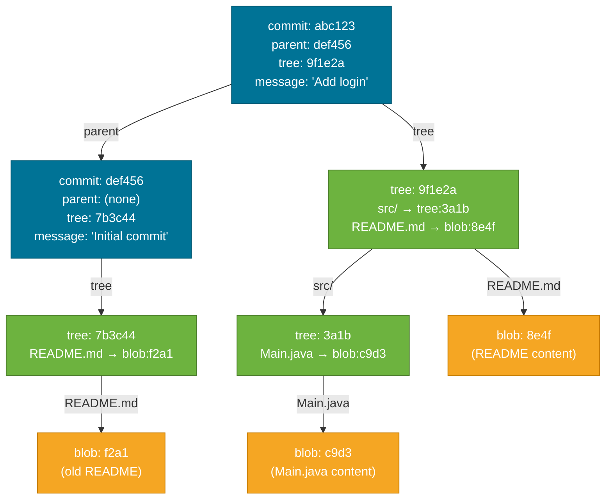
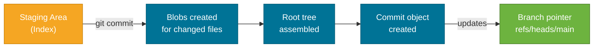

# Git Object Model

> Git is not a "track changes" system — it is a **content-addressable filesystem** that stores snapshots, not diffs.

## What Problem Does It Solve?

Most developers use Git daily but treat it as a black box. When something goes wrong — a detached HEAD, a "lost" commit after a reset, or a confusing rebase conflict — the instinct is to Google a magic command. This is fragile.

Understanding Git's object model explains *why* commands like `git reset`, `git reflog`, and `git cherry-pick` work the way they do. It turns Git from a collection of memorized incantations into a coherent mental model you can reason about.

## What Is It?

Git's storage backend is a simple **key-value store** inside the `.git/objects/` directory. Every piece of data Git tracks — file contents, directory structures, commits, and annotated tags — is stored as a **Git object**. Each object is:

1. Compressed with zlib
2. Identified by a **40-character SHA-1 hash** of its content

Because the key *is* the hash of the content, two identical files always produce the same key. This is the "content-addressable" property — the address is derived from the content itself.

There are exactly **four object types**:

| Type | What it stores |
|------|----------------|
| `blob` | Raw file contents (no filename, no metadata) |
| `tree` | A directory listing: maps filenames to blobs or subtrees |
| `commit` | A snapshot pointer: points to a tree + parent commit(s) + metadata |
| `tag` | An annotated tag: points to a commit + tagger info + message |

## How It Works

### The Four Object Types in Detail

**Blob** — stores raw file bytes. Nothing else. Two files with identical contents share one blob.

**Tree** — stores a directory. Each entry inside a tree contains:
- a permission mode (`100644` for regular file, `040000` for directory)
- an object type (`blob` or `tree`)
- the SHA-1 of the target object
- the filename

**Commit** — ties everything together. A commit object contains:
- a pointer to the root `tree` (the full snapshot of your project)
- zero or more `parent` SHA-1s (zero for the first commit; two for a merge commit)
- `author`, `committer`, timestamp
- the commit message

**Tag** — an annotated tag points to a commit (or any object) and adds a tagger name, date, and annotation message.

### Object Graph



*Commits (blue) point to trees (green), which point to blobs (orange). Unchanged blobs are reused across commits — Git stores snapshots efficiently.*

### How a Commit Is Created

When you run `git commit`:

1. Git hashes the content of every staged file → creates (or reuses) **blob** objects.
2. Git builds **tree** objects that represent each directory in your working tree.
3. Git creates a **commit** object pointing to the root tree, referencing the previous commit as its parent, and storing your name and timestamp.
4. The current branch pointer (`refs/heads/<branch>`) is updated to point to the new commit SHA-1.



*How `git commit` transforms staged changes into a chain of immutable objects.*

### References: The Human-Readable Layer

SHA-1 hashes like `a3f9c2d` are not memorable. Git adds a **references** layer on top:

| Ref type | Location | What it points to |
|----------|----------|--------------------|
| Branch | `.git/refs/heads/<name>` | The latest commit on that branch |
| Remote tracking | `.git/refs/remotes/<remote>/<name>` | Last known commit on a remote branch |
| Tag | `.git/refs/tags/<name>` | A commit (lightweight) or a tag object (annotated) |
| HEAD | `.git/HEAD` | Currently checked-out branch or commit |

`HEAD` is a symbolic ref — it usually contains `ref: refs/heads/main` (i.e., it points to a branch, not directly to a commit). When you check out a specific commit hash, HEAD becomes a **detached HEAD** (it points directly to a commit SHA-1, not a branch).

## Code Examples

### Exploring Git Objects Directly

```bash
# Create a file and stage it
echo "Hello, Git!" > hello.txt
git add hello.txt

# Find the blob hash for the staged file
git ls-files --stage
# Output: 100644 8ab686... 0	hello.txt
#                 ^^^^ this is the blob SHA-1

# Inspect the blob content
git cat-file -p 8ab686e          # ← -p means "pretty-print"
# Output: Hello, Git!

# After committing, inspect the commit object
git commit -m "Add hello"
git log --oneline                # shows the commit SHA-1
# e.g.: a3f9c2d Add hello

git cat-file -p a3f9c2d          # ← inspect the commit object
# tree 4b825dc...
# author Jane Doe <jane@example.com> 1709900000 +0000
# committer Jane Doe <jane@example.com> 1709900000 +0000
# Add hello

# Inspect the root tree
git cat-file -p 4b825dc
# 100644 blob 8ab686e...	hello.txt   ← blob SHA + filename

# Show object type
git cat-file -t a3f9c2d          # ← output: "commit"
git cat-file -t 4b825dc          # ← output: "tree"
git cat-file -t 8ab686e          # ← output: "blob"
```

### Viewing the Object Graph

```bash
# Pretty-print commit graph with decoration
git log --oneline --graph --decorate --all

# Show SHA-1 of what HEAD points to
cat .git/HEAD
# ref: refs/heads/main

cat .git/refs/heads/main
# a3f9c2d...   (the latest commit SHA-1)

# Show all objects in the repo
git cat-file --batch-all-objects --batch-check
```

### Annotated Tag vs. Lightweight Tag

```bash
# Lightweight tag — a plain ref pointing directly to a commit
git tag v1.0

# Annotated tag — creates a tag OBJECT in the object store
git tag -a v1.0 -m "Release 1.0"   # ← creates a real tag object

git cat-file -p v1.0
# object  a3f9c2d...    ← the commit this tag points to
# type    commit
# tag     v1.0
# tagger  Jane Doe <jane@...> ...
# Release 1.0
```

## Best Practices

- **Use annotated tags (`git tag -a`) for releases** — they store who tagged, when, and why; lightweight tags are for personal bookmarks.
- **Understand that commits are immutable** — `git commit --amend` or `git rebase` create new commit objects; the old ones still exist until garbage collected.
- **Use `git reflog`** when you think you "lost" a commit — because objects are immutable, the lost commit's SHA-1 is still in the reflog for ~90 days.
- **Don't fear detached HEAD** — it just means HEAD points to a commit directly instead of a branch. Commits made in this state are safe until GC, but create a branch to keep them permanently.

## Common Pitfalls

**"I lost my commit after `git reset --hard`"** — You didn't. The commit still exists as an object. Run `git reflog` to find the SHA-1 and `git checkout -b recovery-branch <sha1>` to restore it.

**Confusing branches with commits** — A branch is just a 41-byte file containing a SHA-1. Moving a branch pointer (`git reset`) doesn't delete the commit — it just changes where the pointer aims.

**Assuming identical filenames create different blobs** — Blobs are keyed by *content*, not filename. Two files with the same bytes share one blob regardless of their names or locations.

**Forgetting that `git clone` downloads all objects** — When you clone a repo, you get the full object store. This is why Git is fast offline and why shallow clones (`--depth=1`) are smaller but lose history.

## Interview Questions

### Beginner

**Q:** What is a Git commit?
**A:** A commit is an immutable object in Git's object store. It contains a pointer to a root tree (the full snapshot of the project), zero or more parent commit SHA-1s, author/committer metadata, and a message. It does *not* store diffs — it stores a complete snapshot.

**Q:** What is a detached HEAD?
**A:** HEAD normally points to a branch name, which in turn points to the latest commit. A detached HEAD means HEAD points directly to a commit SHA-1, not to any branch. Changes made in this state are not tracked by any branch and can be lost if you switch away without creating a new branch.

### Intermediate

**Q:** How does Git know a commit is tamper-proof?
**A:** Each object's SHA-1 is computed from its full content. A commit object includes its parent's SHA-1, so changing any historical commit changes its hash, which cascades to change every subsequent commit's hash. This makes history tamper-evident — any mutation is detectable.

**Q:** Why does Git not store diffs between commits?
**A:** Git stores full snapshots (trees of blobs). This makes branching, merging, and restoring any version O(1) — Git just reads the tree at that commit. Diffs are computed on-the-fly from two snapshots when you run `git diff`. The efficiency comes from blob deduplication — unchanged files share the same blob.

**Q:** What is the difference between a lightweight and an annotated tag?
**A:** A lightweight tag is a plain ref file pointing directly to a commit SHA-1 — it stores no extra information. An annotated tag is a full Git object with a tagger name, date, and message, and it can be signed with GPG. Annotated tags are preferred for release markers because they carry authorship history.

### Advanced

**Q:** How does Git handle merge commits at the object level?
**A:** A merge commit is simply a commit object with *two or more parent SHA-1s* listed. The first parent is the branch you merged into; the second is the branch you merged from. The commit points to a single merged tree. `git log --first-parent` follows only the first-parent chain, giving a linear view of the main branch history.

**Q:** What happens to unreferenced objects?
**A:** Unreferenced objects (not reachable from any branch, tag, or reflog entry) are garbage-collected by `git gc`. By default, reflog entries expire after 90 days (unreachable objects) or 30 days (pruned). Until then, `git reflog` lets you recover "lost" commits. `git gc --prune=now` permanently deletes unreachable objects immediately.

## Further Reading

- [Git Internals — Git Objects](https://git-scm.com/book/en/v2/Git-Internals-Git-Objects) — the authoritative chapter from Pro Git (free online) that covers blobs, trees, commits, and tags with hands-on examples
- [Git Internals — Git References](https://git-scm.com/book/en/v2/Git-Internals-Git-References) — covers HEAD, branch refs, remote-tracking refs, and tags

## Related Notes

- [Rebase vs. Merge](./rebase-vs-merge.md) — understanding that commits are immutable objects makes the "rebase rewrites history" behavior intuitive
- [Working with Remotes](./working-with-remotes.md) — remote-tracking refs are just entries in `.git/refs/remotes/`, resolved by the same object store
- [Git Hooks & Workflows](./git-hooks-workflows.md) — hooks fire at specific points in the commit-creation process documented here
