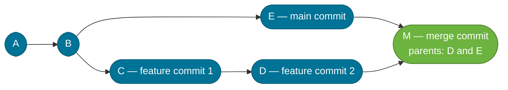
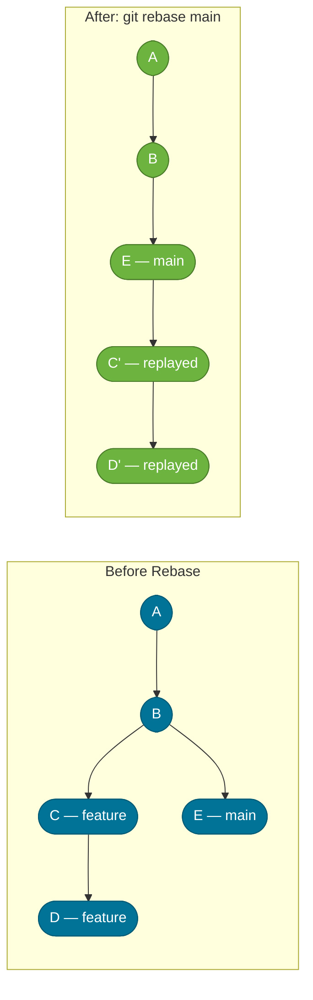

# Rebase vs. Merge

> Merge preserves history as it happened; rebase rewrites history so it looks like it happened linearly. Both integrate changes — they differ in how the story is told.

## What Problem Does It Solve?

Every team that uses Git feature branches eventually hits the same question: "How should we bring this branch back into `main`?" The choice between `git merge` and `git rebase` affects:

- How readable the commit graph is
- Whether a reviewer can clearly follow the sequence of changes in a PR
- Whether `git bisect` can efficiently find the commit that introduced a bug
- Team norms around commit hygiene

Getting this wrong leads to either a cluttered history full of "Merge branch 'feature/x' into develop" commits, or — worse — accidentally rewriting shared history and forcing team members to do painful fixes.

## How Merge Works

`git merge` creates a new **merge commit** that has two parents: the tip of your current branch and the tip of the branch being merged. The original branch histories are preserved intact.

### Fast-Forward Merge

If the current branch has not diverged from the target (i.e., all commits on `main` are already ancestors of the feature branch), Git simply moves the branch pointer forward — no merge commit is created.

```bash
git checkout main
git merge feature/login   # fast-forward if main has no new commits
```

### True Merge (Merge Commit)

When both branches have diverged, Git creates a merge commit with two parents.



*`git merge` — commit M has two parents (D and E). The full branch topology is preserved in history.*

```bash
git checkout main
git merge --no-ff feature/login  # ← --no-ff forces a merge commit even if fast-forward is possible
```

`--no-ff` (no fast-forward) is recommended in Git Flow to make feature boundaries visible in history.

## How Rebase Works

`git rebase` takes commits from one branch and **replays** them on top of another. Each original commit is re-applied as a new commit with a new SHA-1. The branch history is linearized.



*`git rebase main` — commits C and D are replayed as C' and D' on top of E. The feature branch now has a linear history.*

```bash
git checkout feature/login
git rebase main               # ← replay feature commits on top of latest main
# resolve any conflicts, then:
git rebase --continue
```

After rebasing, a fast-forward merge into `main` is always possible:

```bash
git checkout main
git merge feature/login       # ← clean fast-forward; no merge commit needed
```

## The Golden Rule of Rebasing

:::danger
**Never rebase a branch that other developers are working on.**

Rebase rewrites commit SHA-1s. If you rebase a branch that a teammate has already checked out or based work on, their commits will diverge from the new reordered history. They cannot simply `git pull` — they'll have to do a painful `git pull --rebase` or reset their branch. This is the source of "Git horror stories" shared on team channels.
:::

**Safe to rebase:** Your own private feature branch that no one else has pushed to.  
**Unsafe to rebase:** `main`, `develop`, or any shared branch; a feature branch where a PR reviewer has already committed review fixes.

## Interactive Rebase: Cleaning Up Commits

`git rebase -i` (interactive rebase) lets you edit, squash, reorder, or drop commits before merging a PR. This is how professionals deliver clean, readable commit histories.

```bash
git rebase -i HEAD~4   # ← interactively edit the last 4 commits
```

This opens an editor with:

```
pick a1b2c3 WIP: add login form
pick d4e5f6 fix typo in login form
pick g7h8i9 add JWT token generation
pick j0k1l2 address PR review: rename variable
```

You can change `pick` to:

| Command | Effect |
|---------|--------|
| `pick` | Keep the commit as-is |
| `reword` | Keep the commit, edit its message |
| `squash` / `s` | Meld into previous commit, combine messages |
| `fixup` / `f` | Meld into previous commit, discard this commit's message |
| `drop` / `d` | Delete the commit entirely |
| `edit` / `e` | Pause rebase here so you can amend the commit |

Example: squash the WIP and typo-fix commits into one clean commit:

```
pick  a1b2c3 WIP: add login form
squash d4e5f6 fix typo in login form   ← squash into a1b2c3
pick  g7h8i9 add JWT token generation
fixup j0k1l2 address PR review: rename variable  ← fold into g7h8i9
```

Result: two clean commits that tell a meaningful story, not four noisy WIP commits.

## Code Examples

### Integrating a Feature Branch (Merge vs. Rebase Workflow)

**Merge approach (Git Flow style):**
```bash
# On the feature branch
git checkout feature/payment-service
# ... develop ...
git checkout develop
git merge --no-ff feature/payment-service   # ← preserves feature boundary in graph
git branch -d feature/payment-service
```

**Rebase approach (GitHub Flow / TBD style):**
```bash
# Keep feature branch up to date with main
git checkout feature/payment-service
git fetch origin
git rebase origin/main             # ← replay our commits on top of latest main

# Resolve any conflicts, then merge
git checkout main
git merge feature/payment-service  # ← always a fast-forward; clean linear history
git branch -d feature/payment-service
```

### Updating a Feature Branch Without Merge Commits

```bash
# Instead of:
git merge main              # ← creates a "Merge branch 'main' into feature/x" commit

# Do:
git rebase main             # ← replays feature commits on top of latest main
                             #   keeps feature branch history clean
```

### Interactive Rebase Before Opening a PR

```bash
# Squash all your WIP commits into logical units before PR
git log --oneline origin/main..HEAD   # ← see what commits will go into the PR

git rebase -i origin/main             # ← interactive rebase against merge base
# In editor: squash/fixup WIP commits, reword messages to be descriptive

# Force-push to update the PR branch (safe because only you have this branch)
git push --force-with-lease           # ← safer than --force; fails if remote has new commits
```

### Recovering from a Botched Rebase

```bash
# Before starting, note your current HEAD
git log --oneline -1   # e.g., abc123

# If rebase goes wrong, abort and return to original state
git rebase --abort     # ← returns you to pre-rebase state, no damage done

# If you already completed a bad rebase, use reflog
git reflog             # find the SHA-1 BEFORE the rebase
git reset --hard HEAD@{3}   # ← reset to that point (adjust index as needed)
```

## Trade-offs & When To Use / Avoid

| | Merge | Rebase |
|--|-------|--------|
| **History** | Preserves the true branch topology | Rewrites to linear history |
| **Traceability** | Every feature boundary visible in graph | Feature context lost unless squashing is careful |
| **Merge conflicts** | Resolve once, at merge time | May resolve conflict once per replayed commit |
| **Debugging (`git bisect`)** | Can be noisy with merge commits | Linear history = faster bisect |
| **Golden rule** | Safe on any branch | Never on shared/public branches |
| **Best for** | Git Flow, preserving release history | GitHub Flow, cleaner PR history, TBD |

## Best Practices

- **Use `git rebase origin/main` (not `git merge main`) to keep a feature branch up to date.** This avoids polluting the feature branch with "Merge branch 'main'" commits.
- **Always use `--force-with-lease` when force-pushing after a rebase**, never `--force`. `--force-with-lease` fails if the remote has received new pushes since your last fetch, preventing you from overwriting a teammate's changes.
- **Squash or fixup WIP commits before opening a PR.** Leave only commits that tell a logically coherent story. Each commit should be independently deployable and buildable.
- **Use `--no-ff` when merging feature branches into `develop` in Git Flow.** This keeps the feature boundary visible in history even after the branch is deleted.
- **Do not rebase after pushing to a shared PR branch unless the team agrees.** If reviewers have already left inline comments on specific commits, rebasing changes commit SHAs and invalidates those comments in some tools.

## Common Pitfalls

**Rebasing a branch after someone else has pushed to it** — the classic Git disaster. Always check `git log origin/<branch>` before rebasing to confirm no one else has pushed new commits.

**Squashing too aggressively** — squashing an entire feature into one giant commit makes it impossible to `git bisect` individual changes. Aim for logical units: one commit per cohesive change, not one per PR.

**Forgetting `git rebase --continue` after resolving conflicts** — after editing conflicted files and staging them with `git add`, you must run `git rebase --continue`, not `git commit`. Running `git commit` mid-rebase creates an out-of-order commit.

**Using merge to update a feature branch** — `git merge main` into a feature branch creates a backwards merge commit that confuses code reviewers reading the PR diff. Use `git rebase main` instead.

**`git pull` creates merge commits by default** — `git pull` is `git fetch + git merge`. In teams using rebase-style workflows, configure `git pull --rebase` as the default: `git config --global pull.rebase true`.

## Interview Questions

### Beginner

**Q:** What is the difference between `git merge` and `git rebase`?
**A:** Both integrate changes from one branch into another. `git merge` creates a new merge commit preserving the original branch topology. `git rebase` replays commits from one branch onto another, producing a linear history without merge commits. The end result (code content) is the same; only the history structure differs.

**Q:** What does "fast-forward merge" mean?
**A:** A fast-forward merge happens when the current branch has no new commits that aren't in the target branch — the branch pointer can simply "move forward" to the target's latest commit without creating a merge commit. It's only possible when there is no divergence.

### Intermediate

**Q:** When should you use merge vs. rebase?
**A:** Use rebase to keep a feature branch up to date with `main` (avoids noise commits) and to clean up local WIP commits before a PR. Use merge (with `--no-ff`) when merging a completed feature into a long-lived integration branch like `develop` in Git Flow — the merge commit records when and where the feature was integrated.

**Q:** What is the Golden Rule of rebasing?
**A:** Never rebase a branch that other developers have already pushed to or based work on. Rebase rewrites commit SHA-1s, so other developers' local copies diverge and they cannot simply pull the updated history.

**Q:** What problem does `--force-with-lease` solve compared to `--force`?
**A:** `git push --force` overwrites the remote branch unconditionally, which can destroy a teammate's commits if they pushed while you were rebasing locally. `--force-with-lease` checks that the remote branch tip matches what you last fetched — it fails if someone else has pushed in the meantime, preventing accidental overwrites.

### Advanced

**Q:** How does interactive rebase help maintain a clean commit history in a team?
**A:** Before opening a PR, a developer runs `git rebase -i origin/main` which presents all commits not yet on `main`. They can `squash` WIP commits, `reword` unclear messages, and `fixup` trivial changes. This means the PR history reads as a logical narrative, making code review faster and `git log`/`git bisect` more useful long-term.

**Q:** How do merge conflicts behave differently in rebase vs. merge?
**A:** With `git merge`, all conflicts from both branches are surfaced and resolved in a single step during the merge. With `git rebase`, conflicts are resolved one replay step at a time — if commit C' conflicts with E, you fix it, run `git rebase --continue`, and move to the next replay. This means rebase can surface the same conflict multiple times if multiple commits touch the same area, whereas merge surfaces it once. The trade-off: rebase conflicts are more granular and easier to understand in context; merge conflicts can be larger but are done in one pass.

## Further Reading

- [Git Branching — Rebasing](https://git-scm.com/book/en/v2/Git-Branching-Rebasing) — the definitive Pro Git chapter on rebase with visual diagrams and the do-not-rebase warning
- [Merging vs. Rebasing (Atlassian)](https://www.atlassian.com/git/tutorials/merging-vs-rebasing) — practical comparison with workflow recommendations

## Related Notes

- [Git Object Model](./git-object-model.md) — rebase "rewrites commits" means it creates new commit objects with new SHA-1s; understanding this makes the Golden Rule tangible
- [Branching Strategies](./branching-strategies.md) — Git Flow prefers merge commits for feature integration; GitHub Flow and TBD prefer rebase; this note explains why
- [Conflict Resolution](./conflict-resolution.md) — rebase raises conflicts one commit at a time; this note covers the tools and techniques for resolving them efficiently
