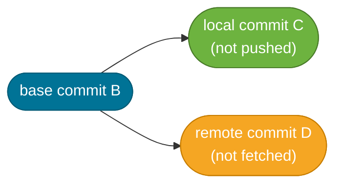

# Working with Remotes

> A remote is just a named URL. Remote-tracking branches are local read-only snapshots of where those remote branches were the last time you fetched.

## What Problem Does It Solve?

Git is a distributed version control system — every developer has a complete copy of the repository. "Working with remotes" is how those local copies stay in sync. Without a clear mental model of what `fetch`, `pull`, and `push` actually do, developers routinely hit confusing situations:

- "My push was rejected — why?"
- "I accidentally created a merge commit just by pulling"
- "My feature branch is behind origin, but I'm not sure what changed"
- "I don't know if I should set `--set-upstream` or not"

Understanding remotes — what they store, where they store it, and how `fetch` works — dissolves all of these confusions.

## What Is a Remote?

A remote is a named alias for a URL. That's all. When you clone a repository from GitHub, Git:

1. Downloads all objects into your local `.git/objects/`
2. Creates a remote named `origin` pointing to the source URL
3. Creates **remote-tracking branches** like `origin/main` as read-only local snapshots

```bash
cat .git/config
# [remote "origin"]
#     url = https://github.com/example/myapp.git
#     fetch = +refs/heads/*:refs/remotes/origin/*   ← maps remote refs to local remote-tracking refs
#
# [branch "main"]
#     remote = origin
#     merge = refs/heads/main                       ← defines "upstream" for git pull
```

You can have multiple remotes — common patterns:
- `origin` — your own fork or the team's primary repo
- `upstream` — the original repo when you're working from a fork

## How Fetch vs. Pull Works

### `git fetch`

Downloads new objects and updates remote-tracking branches (`origin/main`, `origin/feature-x`). **Does not touch your working tree or local branches.** Safe to run at any time.

```bash
git fetch origin        # download all remote changes
git fetch origin main   # download only the main branch
```

After fetch, `origin/main` reflects the remote's current state. Your local `main` is unchanged.

### `git pull`

`git pull` = `git fetch` + `git merge` (by default). It fetches and then merges `origin/main` into your current local branch.

```bash
git pull origin main   # fetch main, then merge origin/main into current branch
```

:::warning
`git pull` by default creates a merge commit when your branch and `origin/main` have diverged. This litters history with "Merge branch 'main' into feature/x" commits. Use `git pull --rebase` to replay your local commits on top of the fetched changes instead:
```bash
git pull --rebase origin main
```
Or set it as the default globally:
```bash
git config --global pull.rebase true
```
:::

### `git push`

Sends your local commits to the remote. Fails (non-fast-forward) if the remote has commits you don't have locally — you must fetch and integrate first.

```bash
git push origin main             # push local main to remote main
git push origin feature/login    # push a feature branch
```

## How It Works

### Remote-Tracking Branches

Remote-tracking branches live in `.git/refs/remotes/<remote>/`. They are **read-only** — you cannot commit to `origin/main` directly. They update only when you run `git fetch` (or `git pull`).


*`git fetch` updates remote-tracking branches; integration into local branches is a separate manual step.*

### The Upstream Tracking Relationship

Every local branch can track a remote branch as its "upstream". When this is configured, `git status` and `git push`/`git pull` know which remote branch to use without you specifying it every time.

```bash
# Set upstream when pushing a new branch for the first time
git push --set-upstream origin feature/login
# or the shorthand:
git push -u origin feature/login             # ← -u is alias for --set-upstream

# Now you can just use:
git push             # ← pushes to origin/feature/login automatically
git pull             # ← pulls from origin/feature/login automatically
git status           # ← shows "Your branch is ahead of 'origin/feature/login' by 2 commits"
```

### Diverged Branches

When your local `main` and `origin/main` have both advanced (you committed locally, someone else pushed to remote), the branches have **diverged**.



*Diverged state — local has C, remote has D; they share base B. A push will be rejected.*

Resolution options:
1. `git pull --rebase` — replays C on top of D (linear history)
2. `git pull` — creates a merge commit (topology preserved)
3. `git fetch && git rebase origin/main` — explicit two-step equivalent of option 1

## Code Examples

### Common Remote Operations Reference

```bash
# Show all configured remotes
git remote -v
# origin  https://github.com/team/app.git (fetch)
# origin  https://github.com/team/app.git (push)

# Add a second remote (e.g., your fork's upstream)
git remote add upstream https://github.com/original/app.git

# Fetch all remotes
git fetch --all

# See what changed on origin/main since your last fetch
git log origin/main..main --oneline   # ← commits on local main not yet on origin
git log main..origin/main --oneline   # ← commits on origin/main not yet local
```

### Syncing a Fork with the Upstream Repository

```bash
# Add the original repo as a second remote
git remote add upstream https://github.com/spring-projects/spring-boot.git

# Fetch from upstream (no changes to your local branches yet)
git fetch upstream

# Merge upstream changes into your local main
git checkout main
git merge upstream/main       # or: git rebase upstream/main

# Push the synced main to your fork
git push origin main
```

### Checking Ahead / Behind Status

```bash
# Show how many commits you are ahead/behind the upstream
git status
# On branch main
# Your branch is ahead of 'origin/main' by 2 commits.

# Or more detail:
git log --oneline --left-right main...origin/main
# < abc123 your local commit
# > def456 remote commit not yet fetched
```

### Deleting Remote Branches

```bash
# Delete a remote branch (after a PR is merged)
git push origin --delete feature/login    # ← deletes from the remote

# Clean up stale remote-tracking refs (remote branches that no longer exist)
git fetch --prune                          # ← removes local remote-tracking refs for deleted remote branches
# or set it as default:
git config --global fetch.prune true
```

### Cloning and Shallow Clones

```bash
# Full clone (complete history)
git clone https://github.com/example/app.git

# Shallow clone (only the latest snapshot — useful for CI pipelines)
git clone --depth=1 https://github.com/example/app.git   # ← 1 layer of history only

# Deepen a shallow clone later
git fetch --unshallow
```

## Best Practices

- **Prefer `git fetch` + `git rebase` over `git pull`** when working on a feature branch. The explicit two-step gives you control over how you integrate remote changes.
- **Set `pull.rebase=true` globally** (`git config --global pull.rebase true`) so `git pull` rebases by default instead of merging.
- **Always set upstream (`-u`) when pushing a branch for the first time.** It saves you from typing the full `git push origin <branch>` every time and enables `git status` to show ahead/behind info.
- **Run `git fetch --prune` regularly** to clean up stale remote-tracking refs for branches that have been deleted on the remote after PR merges.
- **Use `git remote add upstream` in fork-based workflows.** Naming the original repo `upstream` is the universal convention; teammates and CI scripts all expect it.

## Common Pitfalls

**`git pull` creating unwanted merge commits** — This happens when both local and remote have new commits. Use `git pull --rebase` or configure `pull.rebase=true` globally.

**Push rejected: "non-fast-forward"** — The remote has commits you don't have. Git refuses to push because it would lose those remote commits. Solution: `git fetch origin`, then `git rebase origin/main` (or `git merge origin/main`), then push.

**Forgetting remote-tracking branches don't auto-update** — `origin/main` only reflects what you last fetched. If a colleague pushes to main, your local `origin/main` is stale until you run `git fetch`. Always fetch before rebasing to avoid basing work on outdated state.

**Confusing `origin` (the remote) with `origin/main` (the remote-tracking branch)** — `origin` is the remote alias (a URL). `origin/main` is the local snapshot of the remote's `main` branch. Both are different things.

**`git push --force` on a shared branch** — Overwrites the remote branch with your local version, potentially destroying colleagues' commits. Use `--force-with-lease` if you must force-push (e.g., after an interactive rebase), and only on branches you own.

## Interview Questions

### Beginner

**Q:** What is the difference between `git fetch` and `git pull`?
**A:** `git fetch` downloads new objects and updates remote-tracking branches (like `origin/main`) without changing your working tree or local branches. `git pull` is `git fetch` followed by `git merge` (or `git rebase` if configured) — it fetches and immediately integrates the changes into your current branch.

**Q:** What is a remote-tracking branch?
**A:** A remote-tracking branch (e.g., `origin/main`) is a local read-only snapshot of where a remote branch was the last time you ran `git fetch`. It lives in `.git/refs/remotes/`. You cannot commit to it directly — it only updates when you fetch.

### Intermediate

**Q:** Why does `git push` sometimes fail with "non-fast-forward"?
**A:** When the remote branch has commits that your local branch doesn't have, pushing would require overwriting those commits. Git refuses this to protect data. The fix is to first `git fetch` and then `git rebase origin/main` (or `git merge origin/main`) to incorporate the remote commits, then push again.

**Q:** What does `git push -u origin feature/login` do that `git push origin feature/login` doesn't?
**A:** The `-u` flag sets the upstream tracking relationship between the local branch and `origin/feature/login`. After this, you can use plain `git push`, `git pull`, and `git status` (which shows ahead/behind counts) without specifying the remote and branch name every time.

### Advanced

**Q:** In a fork-based workflow, how do you keep your fork's `main` in sync with the upstream?
**A:** Add the original repo as a second remote named `upstream`: `git remote add upstream <url>`. Periodically run `git fetch upstream` and then `git rebase upstream/main` (or `git merge upstream/main`) on your local `main`. Push the result to `origin main`. This keeps your fork current without submitting a PR.

**Q:** What is the difference between `git fetch --prune` and `git remote prune origin`?
**A:** Both remove stale remote-tracking refs for branches that have been deleted on the remote. `git fetch --prune` does it as part of a fetch operation (preferred). `git remote prune origin` only prunes without fetching new changes. Set `fetch.prune=true` globally to prune automatically on every fetch.

## Further Reading

- [Git Basics — Working with Remotes](https://git-scm.com/book/en/v2/Git-Basics-Working-with-Remotes) — covers `remote add`, `fetch`, `pull`, `push` from the Pro Git book
- [Git Branching — Remote Branches](https://git-scm.com/book/en/v2/Git-Branching-Remote-Branches) — deep-dive on remote-tracking branches, upstream tracking, and push behavior

## Related Notes

- [Git Object Model](./git-object-model.md) — remote-tracking branches like `origin/main` are just pointer files in `.git/refs/remotes/` pointing to commit objects
- [Rebase vs. Merge](./rebase-vs-merge.md) — `git pull --rebase` (recommended) vs. `git pull` (default merge) is the key decision when integrating remote changes
- [Branching Strategies](./branching-strategies.md) — working-with-remotes patterns differ by strategy: fork+PR for open source, direct push for trunk-based in small teams
