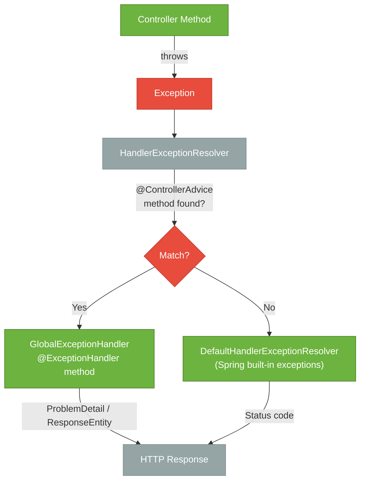

# Exception Handling in Spring MVC

> Centralised exception handling lets you map Java exceptions to meaningful HTTP responses from one place — without scattering try-catch blocks across every controller.

## What Problem Does It Solve?

Without a global handler, every controller method must deal with errors like this:

```java
@GetMapping("/{id}")
public ResponseEntity<UserResponse> get(@PathVariable Long id) {
    try {
        return ResponseEntity.ok(userService.findById(id));
    } catch (UserNotFoundException e) {
        return ResponseEntity.notFound().build();
    } catch (AccessDeniedException e) {
        return ResponseEntity.status(HttpStatus.FORBIDDEN).build();
    } catch (Exception e) {
        return ResponseEntity.internalServerError().build();
    }
}
```

This pattern:
- Duplicates error-handling logic across dozens of controllers
- Mixes plumbing with business logic
- Makes it easy to accidentally return inconsistent error shapes

Spring MVC solves this with `@ExceptionHandler` and `@ControllerAdvice` — a centralized exception-to-response mapping layer. Since Spring Boot 3 / Spring Framework 6, the standard error body format is `ProblemDetail` (RFC 9457).

## Core Concepts

### @ExceptionHandler

`@ExceptionHandler` marks a method that handles a specific exception type. When the annotated exception is thrown anywhere in the handler chain, Spring routes it to this method.

```java
// Local — only handles exceptions from THIS controller
@RestController
public class OrderController {

    @ExceptionHandler(OrderNotFoundException.class)   // ← handles only in this controller
    @ResponseStatus(HttpStatus.NOT_FOUND)
    public ProblemDetail handleNotFound(OrderNotFoundException ex) {
        return ProblemDetail.forStatusAndDetail(HttpStatus.NOT_FOUND, ex.getMessage());
    }
}
```

### @ControllerAdvice / @RestControllerAdvice

`@ControllerAdvice` is a component that applies `@ExceptionHandler` methods **globally** across all controllers. `@RestControllerAdvice` adds `@ResponseBody` so return values are written directly to the response.

```java
@RestControllerAdvice                                 // ← global handler, writes JSON
public class GlobalExceptionHandler {

    @ExceptionHandler(ResourceNotFoundException.class)
    @ResponseStatus(HttpStatus.NOT_FOUND)
    public ProblemDetail handleNotFound(ResourceNotFoundException ex) {
        return ProblemDetail.forStatusAndDetail(HttpStatus.NOT_FOUND, ex.getMessage());
    }
}
```

## ProblemDetail — RFC 9457

RFC 9457 (formerly RFC 7807) defines a standard JSON structure for HTTP error responses:

```json
{
  "type":     "https://api.example.com/errors/not-found",
  "title":    "Not Found",
  "status":   404,
  "detail":   "User with id 42 was not found.",
  "instance": "/api/v1/users/42"
}
```

Spring Framework 6 / Spring Boot 3 added built-in `ProblemDetail` support:

```java
ProblemDetail pd = ProblemDetail.forStatusAndDetail(HttpStatus.NOT_FOUND, message);
pd.setType(URI.create("https://api.example.com/errors/not-found"));
pd.setTitle("Resource Not Found");
pd.setProperty("resourceId", id);              // ← custom extension field
```

Spring also auto-uses `ProblemDetail` for built-in exceptions when you set:

```yaml
spring:
  mvc:
    problemdetails:
      enabled: true
```

## Full Exception Handler Flow



*An unhandled exception from a controller bubbles to `HandlerExceptionResolver`. If a matching `@ExceptionHandler` exists in a `@ControllerAdvice`, it handles it; otherwise Spring's built-in resolver handles known Spring exceptions.*

## Mapping Common Exceptions to HTTP Status Codes

| Exception | HTTP Status | Notes |
|-----------|-------------|-------|
| `ResourceNotFoundException` (custom) | 404 Not Found | Throw from service when entity doesn't exist |
| `MethodArgumentNotValidException` | 400 Bad Request | `@Valid` body validation failure |
| `ConstraintViolationException` | 400 Bad Request | `@Validated` on service/method |
| `HttpMessageNotReadableException` | 400 Bad Request | Malformed JSON body |
| `AccessDeniedException` | 403 Forbidden | Spring Security |
| `AuthenticationException` | 401 Unauthorized | Spring Security |
| `DataIntegrityViolationException` | 409 Conflict | Unique constraint violation |
| `OptimisticLockingFailureException` | 409 Conflict | JPA optimistic locking |
| `HttpRequestMethodNotSupportedException` | 405 Method Not Allowed | Wrong HTTP method |
| `MissingServletRequestParameterException` | 400 Bad Request | Missing required `@RequestParam` |
| `Exception` (fallback) | 500 Internal Server Error | Catch-all for unexpected errors |

## Code Examples

### Production-ready GlobalExceptionHandler

```java
@RestControllerAdvice
@Slf4j
public class GlobalExceptionHandler {

    // ─── Domain / Application Exceptions ─────────────────────────────────

    @ExceptionHandler(ResourceNotFoundException.class)
    public ResponseEntity<ProblemDetail> handleNotFound(
            ResourceNotFoundException ex, HttpServletRequest request) {

        ProblemDetail pd = ProblemDetail.forStatusAndDetail(HttpStatus.NOT_FOUND, ex.getMessage());
        pd.setTitle("Resource Not Found");
        pd.setInstance(URI.create(request.getRequestURI()));
        return ResponseEntity.status(HttpStatus.NOT_FOUND).body(pd);
    }

    @ExceptionHandler(ConflictException.class)
    public ResponseEntity<ProblemDetail> handleConflict(
            ConflictException ex, HttpServletRequest request) {

        ProblemDetail pd = ProblemDetail.forStatusAndDetail(HttpStatus.CONFLICT, ex.getMessage());
        pd.setInstance(URI.create(request.getRequestURI()));
        return ResponseEntity.status(HttpStatus.CONFLICT).body(pd);
    }

    // ─── Validation Exceptions ────────────────────────────────────────────

    @ExceptionHandler(MethodArgumentNotValidException.class)
    public ResponseEntity<ProblemDetail> handleValidation(
            MethodArgumentNotValidException ex) {

        ProblemDetail pd = ProblemDetail.forStatus(HttpStatus.BAD_REQUEST);
        pd.setTitle("Validation Failed");
        Map<String, String> errors = ex.getBindingResult()
                .getFieldErrors()
                .stream()
                .collect(Collectors.toMap(
                        FieldError::getField,
                        fe -> fe.getDefaultMessage() != null ? fe.getDefaultMessage() : "invalid"
                ));
        pd.setProperty("errors", errors);      // ← field-by-field error map
        return ResponseEntity.badRequest().body(pd);
    }

        // Note on dependency: For `@Valid`-driven validation to work, include `spring-boot-starter-validation` (Hibernate Validator) in your project's dependencies. Without it, Spring will not perform Bean Validation on `@RequestBody` parameters.


    // ─── Infrastructure Exceptions ────────────────────────────────────────

    @ExceptionHandler(DataIntegrityViolationException.class)
    public ResponseEntity<ProblemDetail> handleDataIntegrity(
            DataIntegrityViolationException ex) {

        ProblemDetail pd = ProblemDetail.forStatusAndDetail(
                HttpStatus.CONFLICT, "A record with this data already exists.");
        return ResponseEntity.status(HttpStatus.CONFLICT).body(pd);
    }

    // ─── Catch-all ────────────────────────────────────────────────────────

    @ExceptionHandler(Exception.class)
    public ResponseEntity<ProblemDetail> handleAll(
            Exception ex, HttpServletRequest request) {

        log.error("Unhandled exception on {} {}", request.getMethod(),
                  request.getRequestURI(), ex);                 // ← always log unexpected errors
        ProblemDetail pd = ProblemDetail.forStatusAndDetail(
                HttpStatus.INTERNAL_SERVER_ERROR,
                "An unexpected error occurred. Please try again later.");  // ← hide internals
        pd.setInstance(URI.create(request.getRequestURI()));
        return ResponseEntity.internalServerError().body(pd);
    }
}
```

### Custom domain exception hierarchy

```java
// Base exception — extends RuntimeException so Spring Data/Security handle it
public class AppException extends RuntimeException {
    private final HttpStatus status;

    protected AppException(String message, HttpStatus status) {
        super(message);
        this.status = status;
    }

    public HttpStatus getStatus() { return status; }
}

public class ResourceNotFoundException extends AppException {
    public ResourceNotFoundException(String resource, Object id) {
        super(resource + " with id " + id + " was not found.", HttpStatus.NOT_FOUND);
    }
}

public class ConflictException extends AppException {
    public ConflictException(String message) {
        super(message, HttpStatus.CONFLICT);
    }
}
```

Because all domain exceptions extend `AppException` and carry a status, you can simplify the handler with a single method:

```java
@ExceptionHandler(AppException.class)
public ResponseEntity<ProblemDetail> handleAppException(
        AppException ex, HttpServletRequest request) {

    ProblemDetail pd = ProblemDetail.forStatusAndDetail(ex.getStatus(), ex.getMessage());
    pd.setInstance(URI.create(request.getRequestURI()));
    return ResponseEntity.status(ex.getStatus()).body(pd);
}
```

### Validation error response shape

A `400 Bad Request` with field-level detail:

```json
{
  "type":   "about:blank",
  "title":  "Validation Failed",
  "status": 400,
  "errors": {
    "name":  "must not be blank",
    "price": "must be greater than 0"
  }
}
```

## Best Practices

- **Use `@RestControllerAdvice` over `@ControllerAdvice`** for REST APIs — it automatically adds `@ResponseBody`
- **Always include a catch-all `@ExceptionHandler(Exception.class)`** — log unexpected errors and return a safe, generic 500 message that does not leak stack traces
- **Use `ProblemDetail`** since Spring Boot 3 — it's the RFC standard and clients/monitoring tools understand it
- **Never expose internal exception messages to clients** — a `DataAccessException` message may contain SQL; log it server-side and return a generic message
- **Throw domain exceptions from the service layer** — not from controllers; the service knows the domain, the controller does not
- **Set `spring.mvc.problemdetails.enabled=true`** — enables automatic ProblemDetail for Spring's built-in exceptions (404, 405, etc.)
- **Use `HttpServletRequest` in handler methods** — gives you the request URI for the `instance` field and for logging

## Common Pitfalls

- **Catching too broadly in `@ExceptionHandler`** — a handler for `Exception.class` that runs before domain-specific handlers catches everything; ensure specificity-ordered handlers or use separate handler methods in priority order
- **`@ExceptionHandler` in a `@Controller` vs `@ControllerAdvice`** — local `@ExceptionHandler` (in the controller) takes priority over the global advice; this can cause surprising behavior if both exist
- **Returning the raw exception message** — `ex.getMessage()` can contain sensitive internal data like SQL queries or file paths; sanitise or use a fixed message
- **Forgetting to log near the catch-all** — `Exception.class` handlers should always log the full stack trace; domain exceptions at `WARN`, unexpected at `ERROR`
- **Not handling `ConstraintViolationException` separately** — this fires from `@Validated` on service methods, not from `@RequestBody`; it has a different type than `MethodArgumentNotValidException`

## Interview Questions

### Beginner

**Q:** What is `@ControllerAdvice` and when do you use it?

**A:** `@ControllerAdvice` is a Spring component that applies `@ExceptionHandler`, `@InitBinder`, and `@ModelAttribute` methods globally across all controllers. You use it to centralise error handling — instead of duplicating try-catch in every controller, you write one global exception handler class that maps each exception type to an HTTP response.

---

**Q:** What HTTP status code should a validation error return?

**A:** `400 Bad Request`. The client sent invalid or missing data, which is the client's fault. `422 Unprocessable Entity` is also acceptable when the request is syntactically valid JSON but semantically wrong (e.g., the end date is before the start date). Return field-level detail in the body so the client can fix each error.

### Intermediate

**Q:** What is `ProblemDetail` and why should you use it in Spring Boot 3?

**A:** `ProblemDetail` is Spring Framework 6's built-in implementation of RFC 9457 (Problem Details for HTTP APIs). It provides a standard JSON structure with `type`, `title`, `status`, `detail`, and `instance` fields. Using it means your error responses are consistent, machine-readable, and follow an open standard, so API gateways, monitoring tools, and client SDKs can interpret them without custom logic. Enable automatic use for Spring's own exceptions with `spring.mvc.problemdetails.enabled=true`.

---

**Q:** How does Spring pick which `@ExceptionHandler` method handles a given exception when multiple exist?

**A:** Spring selects the most specific handler. If `@ExceptionHandler(UserNotFoundException.class)` and `@ExceptionHandler(Exception.class)` both match a `UserNotFoundException`, the former wins because `UserNotFoundException` is more specific. If a local `@ExceptionHandler` exists in the `@Controller` and a global one exists in `@ControllerAdvice`, the local one takes priority. Among global handlers of the same specificity, the order is determined by `@Order` on the advice classes.

### Advanced

**Q:** How do you return different error formats from the same API — e.g., JSON for REST clients and HTML for browser requests?

**A:** Inspect the `Accept` header in the `@ExceptionHandler` method (via `HttpServletRequest.getHeader("Accept")`). For `text/html` requests, return a `ModelAndView` (or redirect to an error page); for `application/json`, return a `ProblemDetail`. Alternatively, configure the Servlet exception handling path (`server.error.path`) for browser requests and let `@ControllerAdvice` handle API clients. Spring Boot's `BasicErrorController` handles non-matched paths by default and can be extended for this use case.

## Further Reading

- [Spring MVC Error Handling Reference](https://docs.spring.io/spring-framework/reference/web/webmvc/mvc-ann-rest-exceptions.html) — official documentation on `@ExceptionHandler` and `ProblemDetail`
- [RFC 9457 — Problem Details for HTTP APIs](https://www.rfc-editor.org/rfc/rfc9457) — the standard that `ProblemDetail` implements

## Related Notes

- [Spring MVC](./spring-mvc.md) — the request lifecycle that leads to exception resolution
- [REST Design](./rest-design.md) — choosing the right HTTP status codes for error cases
- [HTTP Fundamentals](./http-fundamentals.md) — the status code semantics that exception handlers must honour
