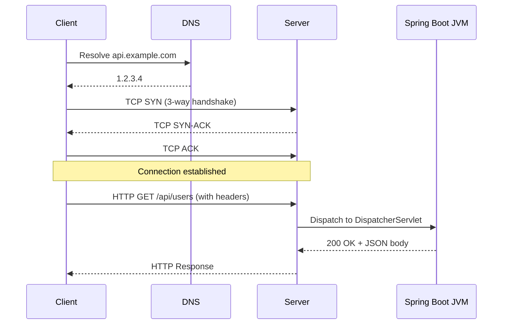

# HTTP Fundamentals

> HTTP is the application-layer protocol that every Java web API speaks — understanding it deeply makes you a better API designer, debugger, and interviewer.

## What Problem Does It Solve?

Before HTTP, networked applications invented their own communication protocols: custom binary formats, ad hoc framing, proprietary error codes. Every integration required custom client code.

HTTP solved this by standardizing:

- **How a client asks for something** — a text-based request with a method, URL, and headers
- **How a server replies** — a status code, headers, and an optional body
- **How endpoints describe their capabilities** — via standard headers like `Content-Type` and `Accept`

As a Java developer, almost every Spring Boot service you write either exposes an HTTP API or consumes one. Knowing HTTP at this level means you pick the right status codes, debug curl traces confidently, and design APIs that behave correctly under caches, proxies, and retry logic.

## What Is HTTP?

HTTP (HyperText Transfer Protocol) is a **stateless, request-response protocol** that runs over TCP (HTTP/1.x, HTTP/2) or UDP (HTTP/3 / QUIC). The client sends a request; the server sends exactly one response per request.

**Stateless** means the server keeps no memory between requests — every request must carry all the information the server needs. Session state is typically pushed to cookies, tokens (JWT), or a shared cache like Redis.

### Analogy

Think of HTTP like ordering at a fast-food counter. Each time you approach the counter (request) you must re-identify yourself and state what you want. The server (cashier) responds and immediately moves on — they don't remember your previous order unless you hand them a loyalty card (cookie/token).

### HTTP/1.1 vs HTTP/2

| Feature | HTTP/1.1 | HTTP/2 |
|---------|----------|--------|
| Framing | Text | Binary frames |
| Multiplexing | No (head-of-line blocking) | Yes — multiple streams over one connection |
| Header compression | No | HPACK compression |
| Server push | No | Yes (rarely used) |
| TLS required? | No | In practice yes (browsers enforce) |

Spring Boot's embedded Tomcat/Netty supports HTTP/2 with a single config flag:

```yaml
# application.yml
server:
  http2:
    enabled: true
```

## HTTP Request Structure

Every HTTP request has four parts:

```
POST /api/users HTTP/1.1          ← Request line: method + path + version
Host: api.example.com             ← Mandatory header (HTTP/1.1+)
Content-Type: application/json    ← Body format
Authorization: Bearer eyJ...      ← Auth token
Accept: application/json          ← Desired response format

{                                  ← Body (only for POST/PUT/PATCH)
  "name": "Alice",
  "email": "alice@example.com"
}
```

## HTTP Methods

HTTP defines several **methods** (also called verbs). The critical properties are **safety** and **idempotency**.

| Method | Safe? | Idempotent? | Body? | Typical Use |
|--------|-------|-------------|-------|-------------|
| GET | ✅ | ✅ | No | Read a resource |
| HEAD | ✅ | ✅ | No | Read headers only |
| POST | ❌ | ❌ | Yes | Create a resource, or non-idempotent action |
| PUT | ❌ | ✅ | Yes | Full replace of a resource |
| PATCH | ❌ | ❌* | Yes | Partial update |
| DELETE | ❌ | ✅ | Optional | Delete a resource |
| OPTIONS | ✅ | ✅ | No | Discover allowed methods (used by CORS preflight) |

\* PATCH *can* be made idempotent with conditional requests (`If-Match`), but it is not required to be.

**Safe** = the request does not change server state. Clients can retry safe requests freely.

**Idempotent** = calling the same request N times leaves the server in the same state as calling it once. Crucial for retry logic.

:::info Why idempotency matters
In distributed systems, network failures are common. Retrying a non-idempotent POST could create duplicate records. REST APIs often use a **client-generated idempotency key** header (`Idempotency-Key: <UUID>`) so the server can detect duplicates.
:::

## Status Codes

Status codes fall into five classes. Memorize the most common ones — they appear in every backend interview.

### 2xx — Success

| Code | Name | When to use |
|------|------|-------------|
| `200 OK` | OK | Generic success with a body |
| `201 Created` | Created | Resource was created (include `Location` header) |
| `204 No Content` | No Content | Success with no response body (e.g., DELETE) |
| `206 Partial Content` | Partial Content | Range request response |

### 3xx — Redirection

| Code | Name | When to use |
|------|------|-------------|
| `301 Moved Permanently` | Moved | URL changed forever (GET only, cached) |
| `302 Found` | Found | Temporary redirect |
| `304 Not Modified` | Not Modified | Conditional GET — client cache is still valid |

### 4xx — Client Error

| Code | Name | When to use |
|------|------|-------------|
| `400 Bad Request` | Bad Request | Invalid input, malformed JSON, validation failure |
| `401 Unauthorized` | Unauthorized | Missing or invalid authentication credentials |
| `403 Forbidden` | Forbidden | Authenticated but lacks permission |
| `404 Not Found` | Not Found | Resource doesn't exist |
| `405 Method Not Allowed` | Method Not Allowed | Wrong HTTP method for this endpoint |
| `409 Conflict` | Conflict | State conflict (duplicate resource, optimistic lock failure) |
| `415 Unsupported Media Type` | Unsupported Media | `Content-Type` not accepted by the server |
| `422 Unprocessable Entity` | Unprocessable | Syntactically valid but semantically wrong body |
| `429 Too Many Requests` | Rate Limited | Rate limit exceeded |

### 5xx — Server Error

| Code | Name | When to use |
|------|------|-------------|
| `500 Internal Server Error` | Server Error | Unhandled exception — programmer bug |
| `502 Bad Gateway` | Bad Gateway | Upstream service returned an invalid response |
| `503 Service Unavailable` | Unavailable | Server is down or overloaded |
| `504 Gateway Timeout` | Timeout | Upstream service didn't respond in time |

:::warning 401 vs 403
**401** means "I don't know who you are" (missing/invalid token).
**403** means "I know who you are, but you're not allowed" (insufficient permissions).
Getting these swapped is a common mistake and a frequent interview question.
:::

## HTTP Headers

Headers are key-value metadata attached to requests and responses.

### Most Important Headers

| Header | Direction | Purpose |
|--------|-----------|---------|
| `Content-Type` | Both | MIME type of the body (`application/json`, `text/html`) |
| `Accept` | Request | MIME types the client accepts (content negotiation) |
| `Authorization` | Request | Auth credentials (`Bearer <token>`, `Basic <base64>`) |
| `Location` | Response | URL of newly created resource (used with `201`) |
| `Cache-Control` | Both | Caching directives (`no-cache`, `max-age=3600`) |
| `ETag` | Response | Entity tag for conditional requests / optimistic locking |
| `If-None-Match` | Request | Conditional GET using ETag |
| `If-Match` | Request | Conditional PUT/PATCH using ETag (prevents lost updates) |
| `X-Request-Id` | Both | Distributed tracing correlation ID (custom header) |
| `CORS headers` | Response | `Access-Control-Allow-Origin` etc. |

### Content Negotiation

Content negotiation lets a single endpoint serve multiple formats. The client sends what it accepts; the server picks the best match.

```http
GET /api/report HTTP/1.1
Accept: application/json, application/xml;q=0.8, */*;q=0.5
```

Spring MVC handles this automatically via `ContentNegotiationManager`. When you add `produces = "application/json"` to `@RequestMapping`, you're participating in content negotiation.

```java
@GetMapping(value = "/report", produces = {
    MediaType.APPLICATION_JSON_VALUE,
    MediaType.APPLICATION_XML_VALUE
})
public Report getReport() { ... }
```

## How HTTP Works — Full Request Lifecycle



*The full lifecycle of a single HTTP request: DNS resolution, TCP handshake, HTTP exchange, and Spring dispatch — all before your `@RestController` method runs.*

## Code Examples

### Inspecting requests in Spring MVC

```java
@RestController
@RequestMapping("/api/demo")
public class HttpDemoController {

    @GetMapping
    public ResponseEntity<String> demo(
            @RequestHeader("Accept") String accept,         // ← read Accept header
            @RequestHeader(value = "X-Request-Id",
                           required = false) String reqId   // ← optional custom header
    ) {
        return ResponseEntity.ok()
                .header("X-Request-Id", reqId != null ? reqId : UUID.randomUUID().toString())
                .body("Accepted: " + accept);
    }
}
```

### Correct status codes with ResponseEntity

```java
@PostMapping("/users")
public ResponseEntity<UserResponse> create(@RequestBody @Valid CreateUserRequest req) {
    UserResponse user = userService.create(req);
    URI location = URI.create("/api/users/" + user.id());   // ← Location header for 201
    return ResponseEntity.created(location).body(user);     // ← 201 Created
}

@DeleteMapping("/users/{id}")
public ResponseEntity<Void> delete(@PathVariable Long id) {
    userService.delete(id);
    return ResponseEntity.noContent().build();              // ← 204 No Content
}
```

### Conditional GET with ETag

```java
@GetMapping("/documents/{id}")
public ResponseEntity<Document> getDocument(
        @PathVariable Long id,
        @RequestHeader(value = "If-None-Match", required = false) String ifNoneMatch) {

    Document doc = docService.findById(id);
    String etag = "\"" + doc.version() + "\"";             // ← ETag from entity version

    if (etag.equals(ifNoneMatch)) {
        return ResponseEntity.status(HttpStatus.NOT_MODIFIED).build(); // ← 304
    }

    return ResponseEntity.ok()
            .eTag(etag)                                     // ← ETag in response
            .body(doc);
}
```

## Best Practices

- **Always return the correct status code** — `200` for everything is lazy and breaks retry logic
- **Set `Content-Type` explicitly** — don't rely on framework defaults in all cases
- **Use `Location` header with `201 Created`** — it tells the client where the new resource lives
- **Prefer `204 No Content` over `200` for DELETE** — there's nothing to return
- **Use ETags for read-heavy resources** — reduces bandwidth; clients cache and revalidate
- **Never return `500` for client errors** — that's a `4xx`; reserve `5xx` for unexpected server failures
- **Send `X-Request-Id` or `Trace-Id`** — enables log correlation across microservices
- **Understand idempotency before designing endpoints** — decide whether clients can safely retry

## Common Pitfalls

- **Returning `200` with an error body** — `{ "error": "Not found" }` with status `200` breaks all HTTP-aware tooling (caches, API gateways, monitoring)
- **Confusing `401` and `403`** — see the warning box above
- **Using `GET` with a body** — technically allowed in HTTP/1.1 but many clients/proxies strip it; use query parameters instead
- **Not setting `Cache-Control` on sensitive responses** — browsers and proxies may cache `Authorization` responses without explicit `Cache-Control: no-store`
- **Ignoring idempotency in POST** — leads to duplicate data when mobile clients retry
- **Using `DELETE` to mean "soft delete"** — if the resource still exists at the same URL after the call, return `200` with the updated state, not `204`

## Interview Questions

### Beginner

**Q:** What is the difference between HTTP `GET` and `POST`?

**A:** `GET` retrieves a resource without modifying server state — it is safe and idempotent. `POST` submits data that typically creates/modifies a resource — it is neither safe nor idempotent. Because `GET` is idempotent, clients and intermediaries can safely cache and retry it; `POST` cannot be retried blindly.

---

**Q:** What does a `404` status code mean?

**A:** The requested resource was not found on the server. The URL path is valid but the specific resource (e.g., the record with that ID) does not exist.

---

**Q:** What is the difference between `401` and `403`?

**A:** `401 Unauthorized` means the request lacks valid authentication credentials — the client must log in first. `403 Forbidden` means the client is authenticated but does not have permission to access this specific resource.

### Intermediate

**Q:** What does "idempotent" mean and which HTTP methods are idempotent?

**A:** An operation is idempotent when performing it multiple times produces the same outcome as performing it once. `GET`, `HEAD`, `PUT`, `DELETE`, and `OPTIONS` are idempotent. `POST` is not. Idempotency is critical for retry logic: you can safely retry a `DELETE` if the network fails because the result (resource gone) is the same whether you called it once or three times.

---

**Q:** What is content negotiation in HTTP?

**A:** Content negotiation is the mechanism by which the client and server agree on the format of the response body. The client sends an `Accept` header listing the MIME types it can handle (`application/json`, `application/xml`). The server selects the best match and sets the `Content-Type` response header accordingly. Spring MVC supports this via `ContentNegotiationManager` and the `produces` attribute of `@RequestMapping`.

---

**Q:** What does `ETag` do and why is it useful?

**A:** An ETag (entity tag) is a version identifier for a resource. The server sends `ETag: "v5"` in the response. The client includes `If-None-Match: "v5"` in subsequent `GET` requests. If the resource has not changed, the server returns `304 Not Modified` with no body, saving bandwidth. ETags are also used with `If-Match` for optimistic concurrency control on `PUT`/`PATCH`.

### Advanced

**Q:** How does HTTP/2 improve on HTTP/1.1 for high-throughput APIs?

**A:** HTTP/2 uses binary framing and **multiplexing** — multiple request/response exchanges share a single TCP connection concurrently. HTTP/1.1 has head-of-line blocking where a slow response delays subsequent requests on the same connection. HTTP/2 also compresses headers (HPACK), eliminating the overhead of sending the same headers with every request. For Spring Boot, enabling HTTP/2 requires `server.http2.enabled=true` and typically TLS.

---

**Q:** Why should you never return a `500` for a validation error?

**A:** A `500 Internal Server Error` signals to clients, API gateways, and monitoring systems that the server has a bug — it triggers alerts and prevents safe caching and retrying. A validation error is the client's fault, so it deserves a `400 Bad Request` (or `422 Unprocessable Entity`). Returning `500` for client errors also makes debugging harder because it becomes impossible to distinguish bugs from bad inputs in your error rate dashboards.

## Further Reading

- [RFC 9110 — HTTP Semantics](https://www.rfc-editor.org/rfc/rfc9110) — the authoritative spec for HTTP methods, status codes, and headers
- [MDN HTTP Overview](https://developer.mozilla.org/en-US/docs/Web/HTTP/Overview) — a well-structured introduction to HTTP concepts
- [HTTP/2 Specification](https://http2.github.io/) — official HTTP/2 spec site
- [Spring MVC — HTTP Handlers](https://docs.spring.io/spring-framework/reference/web/webmvc/mvc-controller/ann-methods.html) — how Spring exposes HTTP primitives

## Related Notes

- [REST Design](./rest-design.md) — builds directly on HTTP methods and status codes to define resource-oriented API style
- [Spring MVC](./spring-mvc.md) — shows how Spring exposes HTTP method routing via `@RestController` and `@RequestMapping`
- [Exception Handling](./exception-handling.md) — covers how Spring maps Java exceptions to the correct HTTP status codes
