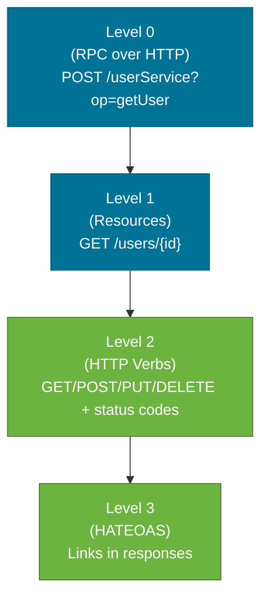
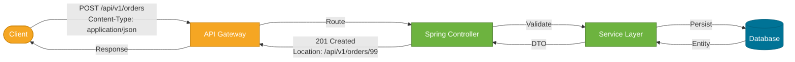

# REST Design

> REST is an architectural style — a set of constraints on how resources are addressed and transferred over HTTP — that produces APIs that are predictable, cacheable, and interoperable.

## What Problem Does It Solve?

Early web services (SOAP, XML-RPC) exposed behavior as remote procedure calls: `getUserById`, `createOrder`, `cancelOrder`. Every integration needed service-specific documentation, tooling, and client code. Caches could not work because every endpoint looked like a different black-box operation.

REST addresses this by making **resources** (not actions) the centre of the API:

- Every piece of data has a stable URL (its *resource identifier*)
- The HTTP method expresses the intent (`GET` = read, `POST` = create, `PUT`/`PATCH` = modify, `DELETE` = remove)
- Standard HTTP semantics like caching, conditional requests, and redirects work automatically
- Any HTTP-capable client can consume the API without custom tooling

## What Is REST?

REST stands for **Representational State Transfer**, coined by Roy Fielding in his 2000 PhD dissertation. It defines six architectural constraints:

| Constraint | What it means |
|-----------|---------------|
| **Client–Server** | UI and data storage are separated |
| **Stateless** | Every request contains all context needed; server holds no session |
| **Cacheable** | Responses must declare whether they are cacheable |
| **Uniform Interface** | Resources, representations, self-descriptive messages, HATEOAS |
| **Layered System** | Clients cannot tell whether they talk to the real server or a proxy |
| **Code on Demand** (optional) | Servers can send executable code (e.g., JavaScript) |

In practice, most "REST APIs" implement the first four constraints. Full HATEOAS is rare in industry.

### Analogy

A REST API is like a library catalogue. Each book has a permanent call number (URL). You use standard library operations — *borrow* (GET), *return* (PUT), *request a new book* (POST), *cancel a hold* (DELETE). You don't need to ask the librarian how to do each step differently for every book.

## Resource Naming

Resources are **nouns** in the URL path. Actions are expressed through the HTTP method. This is the single biggest REST design decision.

### Rules

| Rule | Good ✅ | Bad ❌ |
|------|---------|--------|
| Use plural nouns | `/api/users` | `/api/user`, `/api/getUser` |
| Nest sub-resources | `/api/orders/{id}/items` | `/api/getOrderItems?orderId=1` |
| Lowercase with hyphens | `/api/order-items` | `/api/orderItems`, `/api/OrderItems` |
| No verbs in path | `DELETE /api/users/{id}` | `/api/deleteUser/{id}` |
| Actions as sub-resources | `POST /api/payments/{id}/refund` | `/api/refundPayment` |

```
# Good URL hierarchy
GET    /api/users              → list all users
POST   /api/users              → create a user
GET    /api/users/{id}         → get user by ID
PUT    /api/users/{id}         → full update user
PATCH  /api/users/{id}         → partial update user
DELETE /api/users/{id}         → delete user

# Sub-resources
GET    /api/users/{id}/orders  → list orders for a user
GET    /api/orders/{id}/items  → list items in an order
```

## Versioning Strategies

APIs evolve. When you make breaking changes you need a versioning strategy that doesn't break existing clients.

### Option 1 — URI Path Versioning (most common)

```
GET /api/v1/users
GET /api/v2/users
```

**Pros:** Simple, visible, easily routable.
**Cons:** Pollutes the URL; resources have multiple addresses.

### Option 2 — Request Header Versioning

```http
GET /api/users HTTP/1.1
API-Version: 2
```

**Pros:** Clean URLs; resource has one canonical address.
**Cons:** Not visible in browser; harder to test (need a REST client).

### Option 3 — Accept Header (Media Type) Versioning

```http
GET /api/users HTTP/1.1
Accept: application/vnd.myapp.v2+json
```

**Pros:** Semantically correct (you're requesting a different *representation*).
**Cons:** Verbose; rarely adopted due to tooling complexity.

:::tip Industry default
**URI versioning (`/v1/`)** is the pragmatic default used by most public APIs (GitHub, Stripe, Twilio). Choose it for new Spring Boot services unless your team has a specific reason to prefer headers.
:::

### Implementing URI Versioning in Spring MVC

```java
@RestController
@RequestMapping("/api/v1/users")
public class UserV1Controller {
    @GetMapping("/{id}")
    public UserV1Response getUser(@PathVariable Long id) { ... }
}

@RestController
@RequestMapping("/api/v2/users")
public class UserV2Controller {
    @GetMapping("/{id}")
    public UserV2Response getUser(@PathVariable Long id) { ... }  // ← new fields added in v2
}
```

## Idempotency in REST

Every endpoint's idempotency follows from its HTTP method (see [HTTP Fundamentals](./http-fundamentals.md)), but real-world design sometimes needs explicit handling.

### Idempotency Key Pattern for POST

When a client creates a resource and the network fails before it receives the response, it cannot know whether the creation succeeded. The idempotency key pattern lets the server detect and de-duplicate retries:

```
POST /api/payments HTTP/1.1
Idempotency-Key: 550e8400-e29b-41d4-a716-446655440000

{ "amount": 100, "currency": "USD" }
```

The server stores the key and the result. On the second identical request, it returns the cached result without re-processing.

```java
@PostMapping("/payments")
public ResponseEntity<PaymentResponse> pay(
        @RequestHeader("Idempotency-Key") UUID idempotencyKey,
        @RequestBody @Valid PaymentRequest req) {

    return idempotencyService.getOrExecute(            // ← checks cache first
        idempotencyKey,
        () -> paymentService.processPayment(req)
    );
}
```

## Representations & Content Negotiation

A resource (e.g., a `User`) can have multiple representations: JSON, XML, plain text. Content negotiation (via `Accept` / `Content-Type` headers) decides which is sent.

Spring Boot auto-configures JSON via Jackson. XML support is added with a dependency:

```xml
<!-- pom.xml -->
<dependency>
    <groupId>com.fasterxml.jackson.dataformat</groupId>
    <artifactId>jackson-dataformat-xml</artifactId>
</dependency>
```

```java
@GetMapping(value = "/users/{id}",
            produces = {MediaType.APPLICATION_JSON_VALUE,
                        MediaType.APPLICATION_XML_VALUE})   // ← content negotiation
public UserResponse getUser(@PathVariable Long id) {
    return userService.findById(id);
}
```

## HATEOAS

HATEOAS stands for **Hypermedia As The Engine Of Application State** — the most advanced (and controversial) REST constraint. A HATEOAS response includes hyperlinks to related actions, so the client discovers available next steps from the response rather than hard-coding URLs.

```json
{
  "id": 42,
  "name": "Alice",
  "_links": {
    "self":   { "href": "/api/users/42" },
    "orders": { "href": "/api/users/42/orders" },
    "delete": { "href": "/api/users/42", "method": "DELETE" }
  }
}
```

Spring provides `spring-boot-starter-hateoas` for this. In practice, few APIs adopt full HATEOAS; most stop at Level 2 of Richardson Maturity Model (using HTTP verbs and resource URLs correctly).



*The Richardson Maturity Model — most production REST APIs target Level 2. Level 3 (HATEOAS) is the theoretical ideal but rarely required.*

## Full Request Flow in REST



*A typed POST flow across an API gateway, Spring controller, service, and database, with the correct `201 Created` + `Location` header response.*

## Code Examples

### Complete CRUD controller

```java
@RestController
@RequestMapping("/api/v1/users")
@RequiredArgsConstructor
public class UserController {

    private final UserService userService;

    @GetMapping
    public List<UserResponse> list() {
        return userService.findAll();
    }

    @GetMapping("/{id}")
    public UserResponse get(@PathVariable Long id) {
        return userService.findById(id);    // ← service throws 404 if not found
    }

    @PostMapping
    public ResponseEntity<UserResponse> create(@RequestBody @Valid CreateUserRequest req) {
        UserResponse user = userService.create(req);
        URI location = URI.create("/api/v1/users/" + user.id());
        return ResponseEntity.created(location).body(user);     // ← 201 + Location header
    }

    @PutMapping("/{id}")
    public UserResponse replace(@PathVariable Long id,
                                @RequestBody @Valid ReplaceUserRequest req) {
        return userService.replace(id, req);    // ← full replace = idempotent PUT
    }

    @PatchMapping("/{id}")
    public UserResponse patch(@PathVariable Long id,
                              @RequestBody @Valid PatchUserRequest req) {
        return userService.patch(id, req);      // ← partial update
    }

    @DeleteMapping("/{id}")
    @ResponseStatus(HttpStatus.NO_CONTENT)      // ← 204 No Content
    public void delete(@PathVariable Long id) {
        userService.delete(id);
    }
}
```

### Filtering, sorting, and pagination (query parameters)

```java
@GetMapping
public Page<UserResponse> list(
        @RequestParam(required = false) String name,        // ← filter
        @RequestParam(defaultValue = "createdAt") String sort,  // ← sort field
        @RequestParam(defaultValue = "0") int page,
        @RequestParam(defaultValue = "20") int size) {

    Pageable pageable = PageRequest.of(page, size, Sort.by(sort));
    return userService.findAll(name, pageable);
}
```

## Trade-offs & When To Use / Avoid

| | Pros | Cons |
|--|------|------|
| **REST** | Simple, uses HTTP natively, cacheable, tooling everywhere | No built-in contract (need OpenAPI separately), chattiness for complex graphs |
| **GraphQL** | Client specifies exact fields, fewer round trips | Complex caching, no standard error codes, learning curve |
| **gRPC** | Binary efficiency, contract-first (protobuf), streaming | Not browser-friendly without a proxy, harder to debug |
| **HATEOAS** | Self-documenting, decoupled client | Verbose responses, rarely needed for internal APIs |

## Common Pitfalls

- **Verbs in URLs** — `/api/createUser` is RPC disguised as REST; use `POST /api/users`
- **Wrong status codes** — returning `200` for a creation or `200` for "not found" breaks clients and caches
- **Versioning too late** — not versioning from day one forces a messy migration when you need to make the first breaking change
- **Using `PUT` when you mean `PATCH`** — sending a partial body to a `PUT` endpoint silently drops unset fields
- **Exposing database IDs as the only identifier** — a sequential integer ID leaks record counts; prefer UUIDs for public APIs
- **No pagination** — returning unbounded lists (`GET /api/users` with 10,000 rows) causes OOM and slow responses

## Interview Questions

### Beginner

**Q:** What is REST?

**A:** REST (Representational State Transfer) is an architectural style for distributed systems that uses HTTP features (methods, status codes, headers, URLs) to perform operations on resources. Resources are addressed by URLs, and the HTTP method expresses the intent: `GET` to read, `POST` to create, `PUT`/`PATCH` to update, `DELETE` to remove.

---

**Q:** What is the difference between `PUT` and `PATCH`?

**A:** `PUT` replaces the entire resource — you send the complete new state. `PATCH` applies a partial update — you send only the fields to change. `PUT` is idempotent; `PATCH` is not guaranteed to be. If you `PUT` a user without an email field, the email may be cleared.

### Intermediate

**Q:** What are the different REST versioning strategies and which do you prefer?

**A:** The three main strategies are: ① URI path versioning (`/v1/`, `/v2/`) — simple and visible, used by most public APIs; ② request header versioning (`API-Version: 2`) — clean URLs but harder to test; ③ `Accept` header versioning (`application/vnd.app.v2+json`) — semantically correct but verbose. I prefer URI versioning for new services because it's immediately obvious, easily routable, and requires no special client configuration.

---

**Q:** What is Richardson Maturity Model?

**A:** The Richardson Maturity Model grades REST APIs into four levels: Level 0 uses HTTP as a tunnel for RPC (e.g., one `POST /api` endpoint for everything). Level 1 introduces resources with distinct URLs. Level 2 adds proper HTTP methods and status codes. Level 3 adds HATEOAS — hypermedia links in responses. Most production APIs operate at Level 2.

### Advanced

**Q:** How do you handle idempotency for POST operations in a distributed system?

**A:** The client generates a UUID and sends it in an `Idempotency-Key` header. The server stores the mapping of key → result in a distributed cache (Redis). On first receipt, it processes the request and caches the result. On duplicate requests (retries after network failure), it returns the cached result immediately without re-processing. This prevents duplicate resource creation while allowing safe client retries. The key typically expires after a window (24–48 hours).

## Further Reading

- [Fielding's REST dissertation (Chapter 5)](https://www.ics.uci.edu/~fielding/pubs/dissertation/rest_arch_style.htm) — the original REST definition
- [Richardson Maturity Model — Martin Fowler](https://martinfowler.com/articles/richardsonMaturityModel.html) — the four levels explained clearly
- [Spring HATEOAS Reference](https://docs.spring.io/spring-hateoas/docs/current/reference/html/) — Spring's HATEOAS implementation

## Related Notes

- [HTTP Fundamentals](./http-fundamentals.md) — REST builds on HTTP methods, status codes, and headers defined here
- [Spring MVC](./spring-mvc.md) — the Spring framework implementing REST controllers
- [Exception Handling](./exception-handling.md) — mapping REST errors to the correct HTTP status codes
- [OpenAPI & Springdoc](./openapi-springdoc.md) — documenting REST APIs with OpenAPI 3
