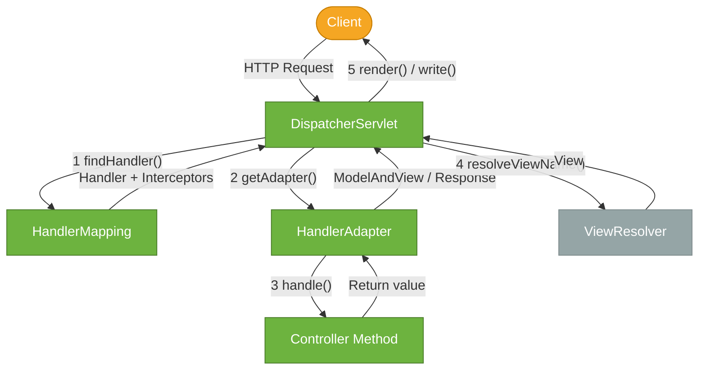

# Spring MVC

> Spring MVC is Spring's synchronous, Servlet-based web framework — the layer that turns incoming HTTP requests into Java method calls and Java return values back into HTTP responses.

## What Problem Does It Solve?

Writing HTTP servers by hand means parsing raw bytes from a socket, managing thread pools, parsing URL paths, deserializing JSON, validating inputs, and serializing responses — all before your business logic runs.

Spring MVC abstracts all of that:

- **Route matching**: `@GetMapping("/users/{id}")` maps an HTTP method + URL pattern to a Java method
- **Parameter binding**: `@PathVariable`, `@RequestParam`, `@RequestBody` extract data from the request
- **Message conversion**: Jackson converts POJOs to/from JSON automatically
- **Validation**: `@Valid` triggers Bean Validation before your method is called
- **Exception handling**: `@ControllerAdvice` centralizes error mapping without try-catch in every controller

The result is that your controller methods contain only business logic — the plumbing is handled by the framework.

## How Spring MVC Works — DispatcherServlet

Spring MVC is built around a single **front controller**: the `DispatcherServlet`. Every HTTP request enters through this servlet and is dispatched to the appropriate handler.



*Five steps in the DispatcherServlet lifecycle: from incoming request through handler discovery, argument resolution, controller execution, and response writing.*

### Key Components

| Component | Role |
|-----------|------|
| `DispatcherServlet` | Front controller — receives every request |
| `HandlerMapping` | Maps URL patterns to handler methods |
| `HandlerAdapter` | Invokes the handler using the correct strategy |
| `HttpMessageConverter` | Converts body to/from Java objects (e.g., MappingJackson2HttpMessageConverter) |
| `HandlerExceptionResolver` | Maps exceptions to error responses |
| `ViewResolver` | Resolves view names to templates (only for server-side rendering) |

For REST APIs, steps 4–5 (ViewResolver) are bypassed — the controller writes directly to the HTTP response body via an `HttpMessageConverter`.

## @RestController

`@RestController` is a composed annotation that combines `@Controller` (registers the class as a Spring MVC handler) and `@ResponseBody` (writes return values directly to the HTTP response body using message converters).

```java
@RestController                             // ← @Controller + @ResponseBody
@RequestMapping("/api/v1/products")         // ← base path for all methods in this class
public class ProductController {
    // methods here
}
```

## Request Mapping

`@RequestMapping` and its method-specific shortcuts map HTTP requests to Java methods.

```java
@GetMapping("/{id}")                        // ← GET /api/v1/products/{id}
@PostMapping                                // ← POST /api/v1/products
@PutMapping("/{id}")                        // ← PUT /api/v1/products/{id}
@PatchMapping("/{id}")                      // ← PATCH /api/v1/products/{id}
@DeleteMapping("/{id}")                     // ← DELETE /api/v1/products/{id}
```

Additional attributes narrow the match:

```java
@GetMapping(
    value = "/{id}",
    produces = MediaType.APPLICATION_JSON_VALUE,   // ← only if Accept includes JSON
    consumes = MediaType.APPLICATION_JSON_VALUE    // ← only if Content-Type is JSON
)
```

## Parameter Binding

Spring MVC extracts request data via annotations on method parameters.

### @PathVariable

```java
@GetMapping("/{id}")
public ProductResponse getById(@PathVariable Long id) { ... }
// GET /api/v1/products/42 → id = 42
```

### @RequestParam

```java
@GetMapping
public List<ProductResponse> list(
        @RequestParam(required = false) String category,
        @RequestParam(defaultValue = "0") int page,
        @RequestParam(defaultValue = "20") int size) { ... }
// GET /api/v1/products?category=electronics&page=1
```

### @RequestBody

```java
@PostMapping
public ResponseEntity<ProductResponse> create(
        @RequestBody @Valid CreateProductRequest req) { ... }
// Body: { "name": "Laptop", "price": 999.99 }
```

### @RequestHeader

```java
@GetMapping("/{id}")
public ProductResponse get(
        @PathVariable Long id,
        @RequestHeader("X-Correlation-Id") String correlationId) { ... }
```

### @ModelAttribute (form data)

```java
@PostMapping("/form")
public String submitForm(@ModelAttribute ProductForm form) { ... }
// Used with form submissions (Content-Type: application/x-www-form-urlencoded)
```

## ResponseEntity

`ResponseEntity` gives you full control over the HTTP response: status code, headers, and body.

```java
@PostMapping
public ResponseEntity<ProductResponse> create(@RequestBody @Valid CreateProductRequest req) {
    ProductResponse product = productService.create(req);
    URI location = URI.create("/api/v1/products/" + product.id());
    return ResponseEntity
            .created(location)                          // ← 201 Created
            .header("X-Custom-Header", "value")         // ← add any header
            .body(product);                             // ← JSON body
}

@DeleteMapping("/{id}")
public ResponseEntity<Void> delete(@PathVariable Long id) {
    productService.delete(id);
    return ResponseEntity.noContent().build();          // ← 204 No Content, no body
}

@GetMapping("/{id}")
public ResponseEntity<ProductResponse> get(@PathVariable Long id) {
    return productService.findById(id)
            .map(ResponseEntity::ok)                    // ← 200 if found
            .orElse(ResponseEntity.notFound().build()); // ← 404 if not found
}
```

## Validation with @Valid

Add Bean Validation annotations to your DTOs and `@Valid` in the controller to trigger validation before your method runs:

```java
public record CreateProductRequest(
    @NotBlank String name,
    @NotNull @Positive BigDecimal price,
    @NotNull Long categoryId
) {}

@PostMapping
public ResponseEntity<ProductResponse> create(
        @RequestBody @Valid CreateProductRequest req) {  // ← triggers validation
    // if validation fails, MethodArgumentNotValidException is thrown before this line
    ProductResponse product = productService.create(req);
    return ResponseEntity.created(URI.create("/api/v1/products/" + product.id())).body(product);
}
```

The `MethodArgumentNotValidException` is caught by `@ControllerAdvice` and mapped to a `400 Bad Request` response (see [Exception Handling](./exception-handling.md)).

Note on dependency: Bean Validation support in Spring Boot requires the `spring-boot-starter-validation` dependency (which brings Hibernate Validator). Add it to your `pom.xml` or `build.gradle` when using `@Valid` on `@RequestBody` or method parameters.

```xml
<!-- pom.xml -->
<dependency>
    <groupId>org.springframework.boot</groupId>
    <artifactId>spring-boot-starter-validation</artifactId>
</dependency>
```

## Content Negotiation

Spring MVC automatically selects `HttpMessageConverter` implementations based on `Accept` and `Content-Type` headers. The default setup (from `spring-boot-starter-web`) includes:

- `MappingJackson2HttpMessageConverter` — JSON
- `StringHttpMessageConverter` — plain text
- `ByteArrayHttpMessageConverter` — binary

Add XML support:

```xml
<dependency>
    <groupId>com.fasterxml.jackson.dataformat</groupId>
    <artifactId>jackson-dataformat-xml</artifactId>
</dependency>
```

```java
@GetMapping(value = "/{id}",
    produces = { MediaType.APPLICATION_JSON_VALUE, MediaType.APPLICATION_XML_VALUE })
public ProductResponse get(@PathVariable Long id) {
    return productService.findById(id).orElseThrow();
}
```

## Interceptors

`HandlerInterceptor` sits in the request pipeline, similar to a Servlet filter but Spring-aware (it has access to the resolved handler):

```java
@Component
public class LoggingInterceptor implements HandlerInterceptor {

    @Override
    public boolean preHandle(HttpServletRequest req,
                             HttpServletResponse res, Object handler) {
        log.info("→ {} {}", req.getMethod(), req.getRequestURI());
        return true;    // ← return false to abort request processing
    }

    @Override
    public void afterCompletion(HttpServletRequest req, HttpServletResponse res,
                                Object handler, Exception ex) {
        log.info("← {} {}", res.getStatus(), req.getRequestURI());
    }
}

@Configuration
public class WebConfig implements WebMvcConfigurer {
    @Override
    public void addInterceptors(InterceptorRegistry registry) {
        registry.addInterceptor(new LoggingInterceptor())
                .addPathPatterns("/api/**");         // ← apply to API routes only
    }
}
```

## Code Examples

### Complete CRUD endpoint

```java
@RestController
@RequestMapping("/api/v1/products")
@RequiredArgsConstructor
public class ProductController {

    private final ProductService productService;

    @GetMapping
    public Page<ProductResponse> list(
            @RequestParam(required = false) String category,
            @PageableDefault(size = 20, sort = "name") Pageable pageable) {
        return productService.findAll(category, pageable);
    }

    @GetMapping("/{id}")
    public ProductResponse get(@PathVariable Long id) {
        return productService.findById(id)
                .orElseThrow(() -> new ResourceNotFoundException("Product", id)); // ← 404
    }

    @PostMapping
    public ResponseEntity<ProductResponse> create(@RequestBody @Valid CreateProductRequest req) {
        ProductResponse p = productService.create(req);
        return ResponseEntity.created(URI.create("/api/v1/products/" + p.id())).body(p);
    }

    @PutMapping("/{id}")
    public ProductResponse replace(@PathVariable Long id,
                                   @RequestBody @Valid ReplaceProductRequest req) {
        return productService.replace(id, req);
    }

    @PatchMapping("/{id}")
    public ProductResponse patch(@PathVariable Long id,
                                 @RequestBody PatchProductRequest req) {
        return productService.patch(id, req);
    }

    @DeleteMapping("/{id}")
    @ResponseStatus(HttpStatus.NO_CONTENT)
    public void delete(@PathVariable Long id) {
        productService.delete(id);
    }
}
```

## Best Practices

- **Keep controllers thin** — controllers validate input and delegate to services; no business logic in the controller
- **Use `@Valid` on every `@RequestBody`** — never trust client input
- **Return `ResponseEntity` when the status code varies** — use `@ResponseStatus` only for fixed-status methods (like `@ResponseStatus(NO_CONTENT)` on DELETE)
- **Use records for DTOs** — Java records are concise, immutable DTO containers; Jackson handles them well
- **Separate request and response DTOs** — don't reuse the same class for both; API shape often differs from entity shape
- **Set a base `@RequestMapping` on the class** — avoids repeating the path prefix on every method
- **Prefer `@PageableDefault` over manual page/size params** — integrates with Spring Data pagination

## Common Pitfalls

- **Returning the JPA entity directly** — exposes internal structure, causes `LazyInitializationException`, and leaks DB column names; always map to a DTO
- **Forgetting `@Valid`** — your validators won't run; bad input silently reaches the service layer
- **Using `@RequestParam` for complex objects** — `@RequestParam` only binds simple types; use `@ModelAttribute` for form objects or `@RequestBody` for JSON
- **`@CrossOrigin` on every controller** — configure CORS globally in `WebMvcConfigurer` instead; per-controller annotations are inconsistent and easy to miss
- **Overusing `ResponseEntity<?>`** — the wildcard type loses compile-time safety; use `ResponseEntity<Void>` for no-body responses and `ResponseEntity<SpecificType>` for typed bodies
- **Not handling `BindException` separately from `MethodArgumentNotValidException`** — `@RequestParam` validation throws `BindException`; `@RequestBody` validation throws `MethodArgumentNotValidException`

## Interview Questions

### Beginner

**Q:** What is `DispatcherServlet`?

**A:** `DispatcherServlet` is the front controller of Spring MVC. All HTTP requests enter through this single servlet, which delegates to `HandlerMapping` to find the right controller method, uses a `HandlerAdapter` to invoke it, and then uses `HttpMessageConverter` to write the response. In Spring Boot, it is auto-configured by `DispatcherServletAutoConfiguration`.

---

**Q:** What is the difference between `@Controller` and `@RestController`?

**A:** `@Controller` marks a class as a Spring MVC handler but requires `@ResponseBody` on each method to write directly to the HTTP response. `@RestController` is a composed annotation that combines `@Controller` + `@ResponseBody`, making every method write its return value directly to the response body via a message converter. Use `@RestController` for REST APIs; use `@Controller` for server-side rendered views (Thymeleaf, FreeMarker).

### Intermediate

**Q:** How does Spring MVC map a request to a controller method?

**A:** `DispatcherServlet` calls `HandlerMapping` implementations (notably `RequestMappingHandlerMapping`) to find the best matching handler for the request. Matching considers URL path, HTTP method, `consumes`/`produces` media types, and request headers/parameters. The matched handler is wrapped in a `HandlerExecutionChain` with any applicable interceptors and handed to a `HandlerAdapter` for invocation.

---

**Q:** How does `@RequestBody` work under the hood?

**A:** When a method parameter is annotated with `@RequestBody`, Spring selects an `HttpMessageConverter` that supports the request's `Content-Type`. For `application/json`, `MappingJackson2HttpMessageConverter` reads the request body stream and deserializes it into the Java type. If `@Valid` is present, Bean Validation is triggered after deserialization. A deserialization failure throws `HttpMessageNotReadableException` (mapped to 400); a validation failure throws `MethodArgumentNotValidException` (also 400).

---

**Q:** What is the role of `HttpMessageConverter`?

**A:** `HttpMessageConverter` converts Java objects to HTTP request/response bodies and vice versa. Spring MVC has several built-in converters: `MappingJackson2HttpMessageConverter` for JSON, `Jaxb2RootElementHttpMessageConverter` for XML, `StringHttpMessageConverter` for plain text. The correct converter is selected based on `Content-Type` (for request body) or `Accept` (for response body). You can add custom converters by implementing the interface and registering in `WebMvcConfigurer`.

### Advanced

**Q:** How would you add a global request/response logging interceptor without modifying every controller?

**A:** Implement `HandlerInterceptor` and register it via `WebMvcConfigurer.addInterceptors()`. In `preHandle`, log the method and path; in `afterCompletion`, log the status code. For body logging, you need a `ContentCachingRequestWrapper` / `ContentCachingResponseWrapper` — either via a `Filter` or by wrapping in the interceptor. A `Filter` is preferred for body logging because it wraps at the Servlet level before Spring MVC takes over. Be careful not to log sensitive data (passwords, tokens).

## Further Reading

- [Spring MVC Reference — Web Servlet](https://docs.spring.io/spring-framework/reference/web/webmvc.html) — comprehensive official documentation
- [Spring MVC @Controller methods](https://docs.spring.io/spring-framework/reference/web/webmvc/mvc-controller.html) — all parameter and return types documented
- [Spring Boot Web — Auto-configuration](https://docs.spring.io/spring-boot/docs/current/reference/html/web.html) — how Spring Boot wires MVC automatically

## Related Notes

- [HTTP Fundamentals](./http-fundamentals.md) — the protocol that Spring MVC builds on
- [REST Design](./rest-design.md) — API design principles implemented with Spring MVC
- [Exception Handling](./exception-handling.md) — `@ControllerAdvice` for centralizing error responses
- [OpenAPI & Springdoc](./openapi-springdoc.md) — auto-generating API documentation from Spring MVC annotations
