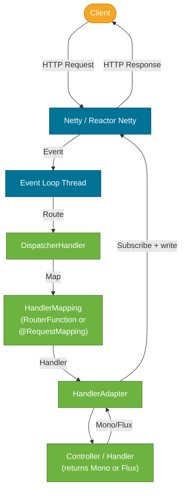
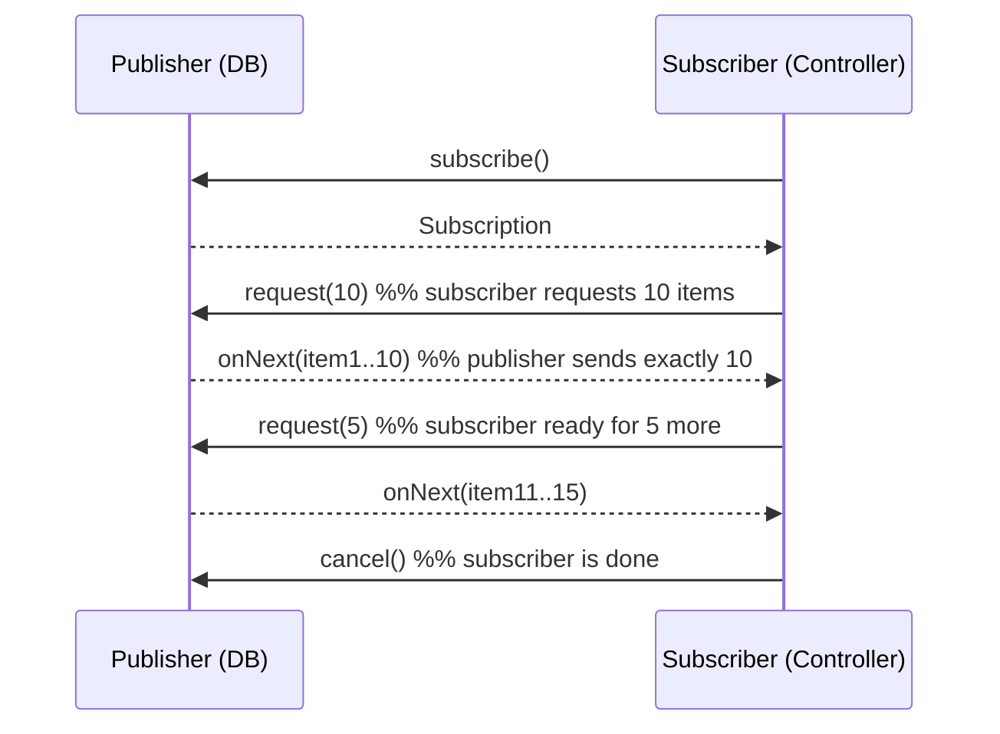

# WebFlux & Reactive Programming

> Spring WebFlux is Spring's reactive web framework — it handles HTTP on a small, fixed thread pool by never blocking a thread while waiting for I/O, enabling high-concurrency with far fewer resources than the blocking Spring MVC model.

## What Problem Does It Solve?

Spring MVC assigns one thread per HTTP request. For `N` concurrent requests, `N` threads are idle while waiting for a database query, HTTP call, or file read to complete. Under high concurrency, the thread pool saturates: requests queue up, latency spikes, and memory climbs because each idle thread holds ~1 MB of stack.

```
Spring MVC threading (10k concurrent requests):
Thread 1  → waiting for DB  [idle ─────────────────]
Thread 2  → waiting for DB  [idle ─────────────────]
...
Thread 200 → thread pool exhausted → requests queued!
```

WebFlux solves this with **event-loop-based, non-blocking I/O**:
- A few threads (typically `2 × CPU cores`) handle I/O events
- When a query is waiting for a result, the thread processes other requests
- The result arrives as an event and continues the processing pipeline

```
WebFlux event loop (10k concurrent requests):
Thread 1  → handles 5,000 requests by switching between them
Thread 2  → handles 5,000 requests
No waiting threads — all threads always doing work
```

## What Is Reactive Programming?

Reactive programming is a **data-flow programming paradigm** around asynchronous data streams. In Java, it is formalized by the **Reactive Streams** specification (then implemented by **Project Reactor**, which Spring WebFlux uses).

Key ideas:

- **Publisher** — produces data events
- **Subscriber** — consumes data events
- **Subscription** — the contract between producer and consumer
- **Backpressure** — the consumer tells the producer how many items it can handle; the producer respects this, preventing overflow

Spring WebFlux uses **Project Reactor** types:

| Type | Meaning | Analogy |
|------|---------|---------|
| `Mono<T>` | 0 or 1 async item | A `CompletableFuture<Optional<T>>` |
| `Flux<T>` | 0 to N async items | A lazy, async `Stream<T>` |

### Analogy

Think of `Mono` as ordering a single pizza — you get notified when it's ready, and pick it up then. `Flux` is like subscribing to a newsletter — you receive each issue as it comes out, and you can cancel at any time. Neither blocks you from doing other things while you wait.

## Mono & Flux Basics

```java
// Mono — exactly one value or empty
Mono<String> greeting = Mono.just("Hello, World");
Mono<User> user = Mono.fromCallable(() -> userRepo.findById(42L)); // ← wraps blocking call

// Flux — stream of values
Flux<Integer> numbers = Flux.just(1, 2, 3, 4, 5);
Flux<User> allUsers = Flux.fromIterable(userRepo.findAll());

// Common operators
Mono<UserResponse> response = userRepo.findById(42L)     // ← Mono<User>
    .map(UserResponse::from)                             // ← transform value
    .switchIfEmpty(Mono.error(                           // ← handle empty case
        new ResourceNotFoundException("User", 42L)));
```

## Spring WebFlux Architecture

WebFlux runs on either **Netty** (default, non-blocking NIO) or Servlet 3.1+ containers (Tomcat, Jetty in async mode).



*WebFlux uses DispatcherHandler (analogous to DispatcherServlet) but routes requests through a reactive pipeline — no thread is blocked waiting for I/O.*

## @RestController Style (Annotated)

WebFlux supports the same `@RestController` / `@RequestMapping` annotations as Spring MVC. The only difference is that methods return `Mono<T>` or `Flux<T>` instead of `T` or `List<T>`.

```java
@RestController
@RequestMapping("/api/users")
public class UserController {

    private final ReactiveUserRepository userRepo;     // ← Spring Data Reactive repository

    @GetMapping("/{id}")
    public Mono<UserResponse> getById(@PathVariable Long id) {
        return userRepo.findById(id)                   // ← returns Mono<User>
                .map(UserResponse::from)               // ← transform
                .switchIfEmpty(Mono.error(
                    new ResourceNotFoundException("User", id)));
    }

    @GetMapping
    public Flux<UserResponse> list() {
        return userRepo.findAll()                      // ← returns Flux<User>
                .map(UserResponse::from);
    }

    @PostMapping
    @ResponseStatus(HttpStatus.CREATED)
    public Mono<UserResponse> create(@RequestBody @Valid CreateUserRequest req) {
        return userRepo.save(User.from(req))
                .map(UserResponse::from);
    }
}
```

## Functional Endpoints (Router Style)

WebFlux also supports a functional programming model using `RouterFunction` and `HandlerFunction`, avoiding annotations entirely. This gives full compile-time visibility of the route table.

```java
// Handler
@Component
public class UserHandler {

    private final ReactiveUserRepository userRepo;

    public Mono<ServerResponse> getById(ServerRequest request) {
        Long id = Long.parseLong(request.pathVariable("id"));   // ← extract path variable
        return userRepo.findById(id)
                .map(UserResponse::from)
                .flatMap(user -> ServerResponse.ok()
                        .contentType(MediaType.APPLICATION_JSON)
                        .bodyValue(user))
                .switchIfEmpty(ServerResponse.notFound().build());
    }

    public Mono<ServerResponse> list(ServerRequest request) {
        return ServerResponse.ok()
                .contentType(MediaType.APPLICATION_JSON)
                .body(userRepo.findAll().map(UserResponse::from), UserResponse.class);
    }
}

// Router
@Configuration
public class UserRouter {

    @Bean
    public RouterFunction<ServerResponse> userRoutes(UserHandler handler) {
        return RouterFunctions
                .route(GET("/api/users/{id}"), handler::getById)  // ← type-safe routes
                .andRoute(GET("/api/users"), handler::list);
    }
}
```

## Backpressure

**Backpressure** is the mechanism by which a subscriber signals to a publisher how many items it can process. This prevents a fast producer from overwhelming a slow consumer.



*Backpressure prevents Producer-Consumer overload: the consumer drives the rate of data flow.*

In practice, HTTP clients cannot receive faster than the network allows, so backpressure manifests most concretely in streaming responses and message-queue consumers.

## Reactive Operators Cheat Sheet

```java
// Transform
.map(item -> transform(item))           // ← sync 1-to-1 transform
.flatMap(item -> asyncCall(item))        // ← async 1-to-Mono/Flux, merge

// Filter
.filter(item -> item.isActive())
.take(10)                                // ← take first 10 items
.skip(5)                                 // ← skip first 5

// Error handling
.onErrorReturn(defaultValue)             // ← return fallback value
.onErrorResume(ex -> fallbackMono)       // ← switch to fallback Mono
.retry(3)                                // ← retry on error up to 3 times

// Combining
Mono.zip(mono1, mono2)                   // ← combine two Monos into a tuple
Flux.merge(flux1, flux2)                 // ← merge two Fluxes concurrently
Flux.concat(flux1, flux2)                // ← subscribe sequentially

// Side effects (no return change)
.doOnNext(item -> log.debug("{}", item))
.doOnError(ex -> log.error("Error", ex))
.doFinally(signal -> cleanup())
```

## WebClient — Non-blocking HTTP Client

WebFlux comes with `WebClient`, the non-blocking replacement for `RestTemplate`:

```java
@Service
public class ExternalApiService {

    private final WebClient webClient;

    public ExternalApiService(WebClient.Builder builder) {
        this.webClient = builder
                .baseUrl("https://api.external.com")
                .defaultHeader(HttpHeaders.CONTENT_TYPE, MediaType.APPLICATION_JSON_VALUE)
                .build();
    }

    public Mono<ExternalResponse> fetchData(String path) {
        return webClient.get()
                .uri(path)
                .retrieve()
                .onStatus(HttpStatusCode::is4xxClientError,
                          res -> Mono.error(new ExternalApiException("Client error")))
                .bodyToMono(ExternalResponse.class)   // ← deserialize body to Mono<T>
                .timeout(Duration.ofSeconds(5));       // ← non-blocking timeout
    }
}
```

## Trade-offs & When To Use / Avoid

| | Pros | Cons |
|--|------|------|
| **WebFlux** | High concurrency on fewer threads, lower memory footprint, streaming support, backpressure | Steep learning curve, debugging is harder, stack traces are fragmented, most JDBC drivers are blocking |
| **Spring MVC** | Simple, familiar, excellent tooling, all JDBC support, easier to debug | Thread-per-request limits concurrency at high load |

### Choose WebFlux when:
- Your service makes many concurrent I/O calls (external APIs, streaming data)
- You need to support thousands of long-lived connections (SSE, WebSocket)
- You are using reactive databases (R2DBC, MongoDB reactive, Redis reactive)

### Choose Spring MVC when:
- The service is primarily database-driven with JPA/JDBC (no reactive driver)
- The team is not yet familiar with reactive programming
- You need maximum debuggability and conventional stack traces
- You use libraries that are blocking-only (many legacy DB drivers, certain SDKs)

:::warning Don't mix blocking code in a reactive pipeline
Calling a blocking method (e.g., `JdbcTemplate`, classic `RestTemplate`) inside a `Mono`/`Flux` pipeline blocks the event loop thread and destroys the concurrency benefit. Wrap blocking calls in `Mono.fromCallable(...).subscribeOn(Schedulers.boundedElastic())`.
:::

## Code Examples

### Parallel I/O with Mono.zip

```java
// Fetch user + their orders concurrently (not sequentially)
public Mono<UserDashboard> getDashboard(Long userId) {
    Mono<UserResponse> userMono   = userService.findById(userId);
    Mono<List<Order>> ordersMono  = orderService.findByUserId(userId)
                                               .collectList();

    return Mono.zip(userMono, ordersMono)                          // ← concurrent fetch
               .map(tuple -> new UserDashboard(tuple.getT1(), tuple.getT2()));
}
```

### Server-Sent Events (SSE)

```java
@GetMapping(value = "/events", produces = MediaType.TEXT_EVENT_STREAM_VALUE)
public Flux<ServerSentEvent<String>> streamEvents() {
    return Flux.interval(Duration.ofSeconds(1))           // ← emit every second
               .map(seq -> ServerSentEvent.<String>builder()
                       .id(String.valueOf(seq))
                       .event("tick")
                       .data("Event #" + seq)
                       .build());
}
```

## Common Pitfalls

- **Blocking in a reactive pipeline** — calling blocking code (JDBC, file I/O) on an event loop thread stalls all requests; always use `subscribeOn(Schedulers.boundedElastic())`
- **Not subscribing** — `Mono`/`Flux` are lazy; if nothing subscribes, nothing executes. In controllers this is handled by the framework, but in tests or background tasks you must subscribe explicitly (or use `StepVerifier`)
- **Misusing `flatMap` vs `map`** — `map` is for synchronous transforms; `flatMap` is for async (returns `Mono`/`Flux`). Using `map` with a function that returns `Mono` gives `Mono<Mono<T>>` (a wrapped publisher that never executes)
- **Ignoring backpressure in Flux** — consuming an unbounded `Flux` without `limitRate()` or `take()` can exhaust memory
- **Stack traces** — reactive stack traces skip the business-code frames; use `Hooks.onOperatorDebug()` in development (expensive in production) or the Reactor context for correlation

## Interview Questions

### Beginner

**Q:** What is the difference between `Mono` and `Flux`?

**A:** `Mono<T>` represents an asynchronous sequence of 0 or 1 value — it completes with one item or empty. `Flux<T>` represents an asynchronous sequence of 0 to N values — it emits multiple items over time. `Mono` is analogous to `CompletableFuture<Optional<T>>`; `Flux` is analogous to a lazy async `Stream<T>`.

---

**Q:** When should you choose WebFlux over Spring MVC?

**A:** Choose WebFlux when the service makes many concurrent I/O calls (calling external APIs, reading streams) and you need to handle high concurrency with a small number of threads. If the service is primarily JPA/JDBC-based and the team isn't familiar with reactive patterns, Spring MVC is the pragmatic choice — it's simpler to debug and has better library compatibility.

### Intermediate

**Q:** What is backpressure and how does Project Reactor handle it?

**A:** Backpressure is the ability of a downstream subscriber to signal to an upstream publisher how many items it can consume. Project Reactor implements the Reactive Streams specification: the `Subscriber` calls `Subscription.request(n)` to request up to `n` items; the `Publisher` sends no more than requested. This prevents a fast data source from overwhelming a slow consumer. In HTTP, backpressure is expressed naturally — the server sends data only as fast as the TCP send buffer can absorb.

---

**Q:** What is the difference between `map` and `flatMap` in Project Reactor?

**A:** `map` applies a synchronous function to each emitted item and wraps the result: `Mono<User>` → `map(UserDTO::from)` → `Mono<UserDTO>`. `flatMap` applies an async function that returns a `Mono`/`Flux`, then subscribes to and flattens the inner publisher: `Mono<Long>` → `flatMap(id -> userRepo.findById(id))` → `Mono<User>`. When you mistakenly use `map` with a function returning `Mono`, you get `Mono<Mono<User>>` — a doubly-wrapped, never-subscribed publisher.

### Advanced

**Q:** How do you safely call blocking code from within a reactive WebFlux pipeline?

**A:** Use `Mono.fromCallable(() -> blockingCall())` to wrap the blocking call, then switch to a scheduler with a thread pool designed for blocking: `.subscribeOn(Schedulers.boundedElastic())`. The `boundedElastic` scheduler has an elastic pool of threads (capped to avoid exhaustion) specifically for I/O blocking. The event loop thread is freed immediately and picks up other work while the blocking call runs on the dedicated pool. Never call blocking code directly on the Netty event loop — it stalls all concurrent requests.

## Further Reading

- [Spring WebFlux Reference](https://docs.spring.io/spring-framework/reference/web/webflux.html) — comprehensive official WebFlux documentation
- [Project Reactor Reference](https://projectreactor.io/docs/core/release/reference/) — Mono, Flux, operators, and schedulers in depth
- [Reactive Streams Specification](https://www.reactive-streams.org/) — the specification Project Reactor implements

## Related Notes

- [Spring MVC](./spring-mvc.md) — the blocking alternative to WebFlux; useful for understanding the contrast
- [HTTP Fundamentals](./http-fundamentals.md) — WebFlux still speaks HTTP; these concepts apply directly
- [Exception Handling](./exception-handling.md) — WebFlux uses `@ControllerAdvice` with `WebExceptionHandler` for error handling
